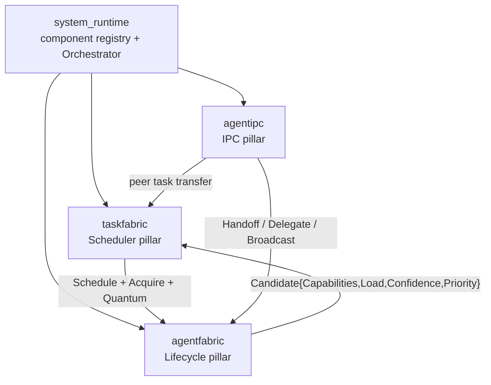

ARES is organized in layers. The `sdk` package is the single entry point; it
owns a `Runtime` that wires together the LLM service, tool registry, memory,
knowledge fabric, and evolution system. Everything below `sdk` is an internal
package with a stable public contract exposed through `api/`.

## Layered model

The runtime is organized in seven layers. Every `internal/*` package is a
single component and is shown below — nothing is omitted. Arrows are the
compile-time or runtime dependency direction (caller → callee).

```mermaid
flowchart TD
    %% L7 — Entry surface
    Entry["Entry surface<br/>cmd/ares (serve / start / status)<br/>sdk.NewRuntime · api/ public contracts"]

    %% L6 — System control plane
    SysCtrl["System control plane<br/>system_runtime — Registry · TopologicalOrder<br/>Orchestrator (Constructed→Bound→Started→Ready)<br/>Snapshot/IsReady status API"]
    Shut["Graceful shutdown<br/>ares_shutdown — phased CallbackRegistry"]
    Boot["Assembly root<br/>ares_bootstrap — single Bootstrap for serve/start/SDK"]

    %% L5 — ARES Kernel (three pillars + recovery)
    KernelSub["ARES Kernel"]
    Scheduler["Scheduler pillar<br/>taskfabric — durable Task<br/>lease-fenced state machine<br/>RunQuantum · Score · Steal"]
    Lifecycle["Lifecycle pillar<br/>agentfabric — disposable Agent<br/>Spawn/Suspend/Retire/Kill/Recover<br/>3-layer context · P5 admission"]
    IPC["IPC pillar<br/>agentipc — peer Bus<br/>Send/Request/Reply/Delegate<br/>Handoff/Subscribe/Broadcast"]
    Recovery["Kernel recovery<br/>aresrecovery — lease expiry→requeue<br/>crash recovery (Agent dies ≠ Task dies)"]

    %% L4 — Execution engine
    ExecSub["Execution engine"]
    AgentLoop["agentloop — ReAct engine<br/>iterate→generate→tool→feed-back"]
    Agents["agents — leader/sub + peer<br/>StrategySource · Handoff"]
    Workflow["workflow — unified DAG Runner<br/>spec IR · edge-activation scheduler<br/>PatchQueue · checkpoint/resume"]
    Arena["ares_arena — chaos engineering<br/>fault injection · regression tester"]
    Flight["ares_flight — experiment recorder<br/>fitness trace · release harness"]

    %% L3 — Evolution & learning
    EvolSub["Evolution & learning"]
    Evol["ares_evolution — GA + genome/diff<br/>coordinator · patch · strategy store"]
    Exp["ares_experience — conflict resolution<br/>store simply, retrieve smartly"]
    Skills["ares_skills — Capability Fabric<br/>SkillCatalog · lazy MCP · experience prior"]
    Eval["eval — verdict + dimension scoring<br/>evidence-based (non-scalar)"]
    Evidence["evidence — universal data primitive<br/>Append/Query/Aggregate"]
    Archive["ares_archive — round summarization<br/>RoundRecord · retention priority P0–P3"]

    %% L2 — Infrastructure services
    InfraSub["Infrastructure services"]
    Events["ares_events — EventStore<br/>compactable · integrity verify · task.* events"]
    Memory["ares_memory — MemoryManager<br/>session/messages · RAG · distillation"]
    Knowledge["knowledge — AKG Fabric<br/>KnowledgeObject · GraphProvider · 3-layer"]
    MCP["ares_mcp — MCPManager<br/>stdio/sse transports · lazy activation"]
    Tools["tools — tool registry + sources<br/>builtin · envcap · toolsource"]
    Callbacks["ares_callbacks — BridgeEventStore<br/>callback↔event unification"]
    Protocol["ares_protocol — wire protocol<br/>(reserved)"]
    Security["ares_security — sanitizer<br/>SSRF allowlist · input hygiene"]
    Ratelimit["ares_ratelimit — limiter<br/>rate/burst/token bucket"]
    Observ["ares_observability — metrics+trace<br/>OTLP exporter · health probes"]
    CtxUtil["ares_ctxutil — detached context<br/>labelled context · bg-task stats"]
    Discovery["discovery — provider plugins<br/>identity merge · health verify"]
    Detector["detector — zero-config probe<br/>local ports · env vars · LLM provider"]
    Dashboard["dashboard — unified API v2<br/>/agents · /mcp · /ws realtime"]
    Integr["ares_integration — e2e harness<br/>event-driven distillation tests"]
    Storage["storage — search result DTO<br/>storage abstractions"]
    Scoreutil["scoreutil — ClampUnit math<br/>shared scoring helpers"]
    Truncate["truncate — WithEllipsis<br/>shared truncation helpers"]
    Logger["logger — slog Module<br/>structured logging foundation"]
    Config["ares_config — Config struct<br/>ares.yaml schema · defaults"]

    %% L1 — Foundation
    FoundSub["Foundation"]
    Core["core — shared DTO + value types<br/>api/core + internal/core/models+errors"]
    Errors["errors — AppError + ErrorCode<br/>structured error taxonomy"]

    %% — wiring edges —
    Entry --> Boot
    Entry --> SysCtrl
    Boot --> SysCtrl
    Boot --> Scheduler
    Boot --> Lifecycle
    Boot --> IPC
    Boot --> Recovery
    Boot --> ExecSub
    Boot --> EvolSub
    Boot --> InfraSub
    Boot --> FoundSub
    SysCtrl --> Shut
    SysCtrl --> Scheduler
    SysCtrl --> Lifecycle
    SysCtrl --> IPC

    Scheduler --> AgentLoop
    Scheduler --> Agents
    Lifecycle --> Agents
    IPC --> Agents
    Recovery --> Scheduler
    Recovery --> Lifecycle

    AgentLoop --> Events
    AgentLoop --> Memory
    AgentLoop --> MCP
    AgentLoop --> Tools
    AgentLoop --> Evol
    Agents --> Workflow
    Agents --> Events
    Agents --> Memory
    Workflow --> Events
    Arena --> Workflow
    Arena --> Evol
    Flight --> Events
    Flight --> Evidence

    Evol --> Evidence
    Evol --> Exp
    Evol --> Skills
    Eval --> Evidence
    Skills --> Knowledge
    Skills --> MCP
    Exp --> Memory
    Archive --> Events

    Events --> Core
    Memory --> Core
    Knowledge --> Core
    MCP --> Core
    Tools --> Core
    Callbacks --> Events
    Discovery --> Events
    Detector --> Discovery
    Dashboard --> Events
    Integr --> Events
    Observ --> Events
    Ratelimit --> Core
    Security --> Core
    Storage --> Core
    Scoreutil --> Core
    Truncate --> Core
    Logger --> Core
    Config --> Core
    CtxUtil --> Core

    Core --> Errors

    %% cluster styling
    KernelSub ~~~ Scheduler
    KernelSub ~~~ Lifecycle
    KernelSub ~~~ IPC
    KernelSub ~~~ Recovery
    ExecSub ~~~ AgentLoop
    ExecSub ~~~ Agents
    ExecSub ~~~ Workflow
    ExecSub ~~~ Arena
    ExecSub ~~~ Flight
    EvolSub ~~~ Evol
    EvolSub ~~~ Exp
    EvolSub ~~~ Skills
    EvolSub ~~~ Eval
    EvolSub ~~~ Evidence
    EvolSub ~~~ Archive
    InfraSub ~~~ Events
    InfraSub ~~~ Memory
    InfraSub ~~~ Knowledge
    InfraSub ~~~ MCP
    InfraSub ~~~ Tools
    InfraSub ~~~ Callbacks
    InfraSub ~~~ Protocol
    InfraSub ~~~ Security
    InfraSub ~~~ Ratelimit
    InfraSub ~~~ Observ
    InfraSub ~~~ CtxUtil
    InfraSub ~~~ Discovery
    InfraSub ~~~ Detector
    InfraSub ~~~ Dashboard
    InfraSub ~~~ Integr
    InfraSub ~~~ Storage
    InfraSub ~~~ Scoreutil
    InfraSub ~~~ Truncate
    InfraSub ~~~ Logger
    InfraSub ~~~ Config
    FoundSub ~~~ Core
    FoundSub ~~~ Errors
```

### Layer legend

| Layer | Packages | Role |
| --- | --- | --- |
| L7 Entry surface | `cmd/ares`, `sdk`, `api/` | CLI commands, `sdk.NewRuntime` factory, public contracts. |
| L6 System control plane | `system_runtime`, `ares_shutdown`, `ares_bootstrap` | Component registry, reverse-topological lifecycle orchestration, phased shutdown, single assembly root. |
| L5 ARES Kernel | `taskfabric`, `agentfabric`, `agentipc`, `aresrecovery` | Three pillars (Scheduler / Lifecycle / IPC) plus the independent Recovery subsystem; **Agent dies ≠ Task dies**. |
| L4 Execution engine | `agentloop`, `agents`, `workflow`, `ares_arena`, `ares_flight` | ReAct loop, leader/sub + peer agents, unified DAG Runner, chaos arena, experiment flight recorder. |
| L3 Evolution & learning | `ares_evolution`, `ares_experience`, `ares_skills`, `eval`, `evidence`, `ares_archive` | GA + genome/diff evolution, experience conflict resolution, Capability Fabric, evidence-based evaluation, round archive. |
| L2 Infrastructure services | `ares_events`, `ares_memory`, `knowledge`, `ares_mcp`, `tools`, `ares_callbacks`, `ares_protocol`, `ares_security`, `ares_ratelimit`, `ares_observability`, `ares_ctxutil`, `discovery`, `detector`, `dashboard`, `ares_integration`, `storage`, `scoreutil`, `truncate`, `logger`, `ares_config` | EventStore, memory/RAG, AKG Fabric, MCP manager, tool registry, callbacks, wire protocol, security, rate limit, observability, context utils, service discovery, zero-config detection, dashboard API, e2e harness, storage/search DTOs, scoring math, truncation, structured logging, configuration. |
| L1 Foundation | `core`, `errors` | Shared DTOs and value types, structured error taxonomy. |

## Request flow

1. `sdk.NewRuntime(opts...)` constructs the `Runtime`, wiring the LLM client,
   tool registry, memory manager, knowledge runtime, evolution coordinator,
   and MCP clients from the provided options.
2. `rt.NewAgent(name, opts...)` creates an `Agent` bound to the runtime.
3. `agent.Run(ctx, input)` enters the agent loop:
   - Load the active strategy (prompt + LLM params) from `StrategySource`.
   - Recall relevant context from memory (RAG) and the knowledge runtime.
   - Build the message list (system + history + user input + context snippets).
   - Call the LLM service. If tools are present, route to the Chat API.
   - If the LLM returns tool calls, execute them via the tool registry and
     feed results back; repeat until the LLM produces a final answer or the
     iteration cap is reached.
4. On completion, a `TaskCompleted` event is published. The event-driven
   distillation subscriber consumes it and distills the conversation into
   long-term experiences and AKG KnowledgeObjects.

## ARES Kernel — the Agent OS Runtime

From 0.3.0 the runtime converges on the **ARES Kernel**: three pillars
(Scheduler, Lifecycle, IPC) plus a control plane that boots and shuts them
down in dependency order. The central invariant is **Agent dies ≠ Task
dies** — `Task` is durable (survives its owner via lease fencing and
preserved checkpoints), `Agent` is disposable. Agents are same-level
cognitive processes (A ≡ B ≡ C); parent/child is provenance only, not a
permission hierarchy.

| Pillar | Package | Role |
| --- | --- | --- |
| Scheduler | `internal/taskfabric` | Durable-intent `Task` substrate: lease-fenced state machine, execution quantum (`RunQuantum`), capability-aware scoring (`Score = capability_overlap × (1−load) × confidence × (1+priority)`), work stealing, `CheckExpiredLeases` crash recovery. |
| Lifecycle | `internal/agentfabric` | Disposable-execution `Agent` substrate: `Spawn`/`Suspend`/`Resume`/`Retire`/`Kill`/`Recover` lifecycle, three-layer context isolation (Task Shared / Agent Private / IPC), P5 resource admission, independently checkpointable `CognitiveState`. |
| IPC | `internal/agentipc` | Peer-to-peer message bus: `Send`/`Request`/`Reply`/`Delegate`/`Handoff`/`Subscribe`/`Broadcast`, high-level collaboration patterns (delegation / pipeline / orchestration), dual-track dispatch policy with shadow-mode equivalence verification. |
| Control plane | `internal/system_runtime` | System-level control plane: component `Registry`, dependency-aware `TopologicalOrder` (Kahn), `Orchestrator` running `Constructed → Bound → Started → Ready` reverse-topologically and shutting down topologically, `Snapshot()` / `IsReady()` status API. |

See the dedicated module pages for [taskfabric](../modules/taskfabric/),
[agentfabric](../modules/agentfabric/), [agentipc](../modules/agentipc/),
and [system_runtime](../modules/system_runtime/).

## Module collaboration

The diagram above shows the primary data paths. Key collaborations:

- **sdk ↔ internal/***: the SDK is the only layer that imports internal
  packages directly; `api/` defines the public contracts.
- **agents ↔ llmservice**: the agent loop calls `Service.Chat` when tools are
  present, `Service.Generate` otherwise.
- **knowledge ↔ ares_memory**: `KnowledgeRetriever` implements the
  `ContextRetriever` interface so AKG facts inject into memory RAG.
- **ares_events ↔ ares_experience**: events trigger the distillation pipeline
  that writes back to both the experience store and the knowledge store.
- **ares_evolution ↔ knowledge**: the evolution coordinator can submit
  patches that affect the running knowledge runtime via `WithPatchRegistry`.
- **ARES Kernel**: `taskfabric` schedules, `agentfabric` manages the
  lifecycle, `agentipc` carries peer messages, and `system_runtime`
  orchestrates all four (plus the broader component graph) in dependency
  order via `ares_bootstrap`.

## Extension points

See the [Extension guide](../guides/extend/) for concrete walkthroughs of
adding LLM providers, custom tools, knowledge stores, and strategy sources.
