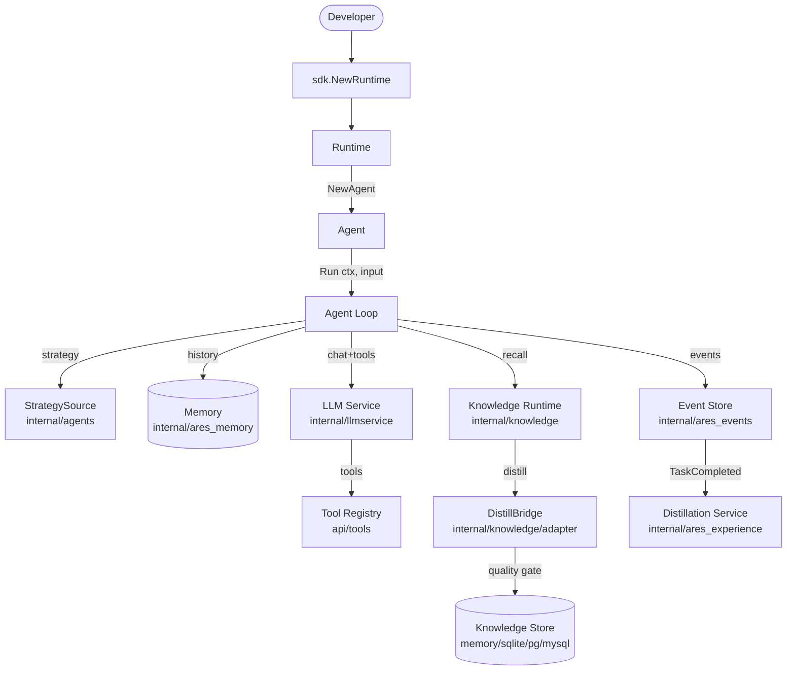

ARES is organized in layers. The `sdk` package is the single entry point; it
owns a `Runtime` that wires together the LLM service, tool registry, memory,
knowledge fabric, and evolution system. Everything below `sdk` is an internal
package with a stable public contract exposed through `api/`.

## Layered model

## Request flow

1. `sdk.NewRuntime(opts...)` constructs the `Runtime`, wiring the LLM client,
   tool registry, memory manager, knowledge runtime, evolution coordinator,
   and MCP clients from the provided options.
2. `rt.NewAgent(name, opts...)` creates an `Agent` bound to the runtime.
3. `agent.Run(ctx, input)` enters the agent loop:
   - Load the active strategy (prompt + LLM params) from `StrategySource`.
   - Recall relevant context from memory (RAG) and the knowledge runtime.
   - Build the message list (system + history + user input + context snippets).
   - Call the LLM service. If tools are present, route to the Chat API.
   - If the LLM returns tool calls, execute them via the tool registry and
     feed results back; repeat until the LLM produces a final answer or the
     iteration cap is reached.
4. On completion, a `TaskCompleted` event is published. The event-driven
   distillation subscriber consumes it and distills the conversation into
   long-term experiences and AKG KnowledgeObjects.

## Module collaboration

The diagram above shows the primary data paths. Key collaborations:

- **sdk ↔ internal/***: the SDK is the only layer that imports internal
  packages directly; `api/` defines the public contracts.
- **agents ↔ llmservice**: the agent loop calls `Service.Chat` when tools are
  present, `Service.Generate` otherwise.
- **knowledge ↔ ares_memory**: `KnowledgeRetriever` implements the
  `ContextRetriever` interface so AKG facts inject into memory RAG.
- **ares_events ↔ ares_experience**: events trigger the distillation pipeline
  that writes back to both the experience store and the knowledge store.
- **ares_evolution ↔ knowledge**: the evolution coordinator can submit
  patches that affect the running knowledge runtime via `WithPatchRegistry`.

## Extension points

See the [Extension guide](../guides/extend/) for concrete walkthroughs of
adding LLM providers, custom tools, knowledge stores, and strategy sources.
