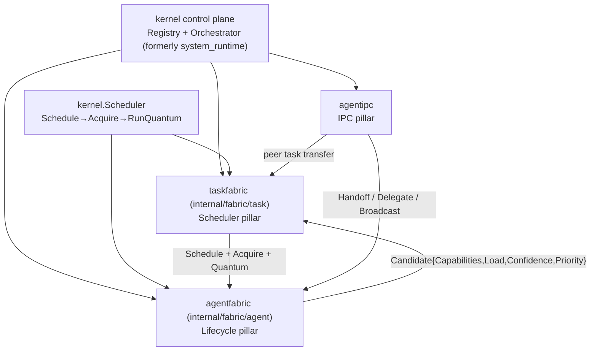

ARES is organized in layers. The `sdk` package is the single entry point; it
owns a `Runtime` that wires together the LLM service, tool registry, memory,
knowledge fabric, and evolution system. Everything below `sdk` is an internal
package with a stable public contract exposed through `api/`.

## Layered model

The runtime is organized in seven layers. Packages below are the major
runtime packages as they exist in the source tree; where a logical module
lives under a nested directory, the real path is shown (for example
`taskfabric` at `internal/fabric/task`). Arrows are the compile-time or
runtime dependency direction (caller → callee).

```mermaid
flowchart TD
    %% L7 — Entry surface
    Entry["Entry surface<br/>cmd/ares (serve / start / status)<br/>sdk.NewRuntime · api/ public contracts"]

    %% L6 — Assembly & system control plane
    Boot["Assembly root<br/>ares_bootstrap — single Bootstrap for serve/start/SDK"]
    SysCtrl["System control plane (in kernel)<br/>kernel.Registry · TopologicalOrder<br/>Orchestrator (Constructed→Bound→Started→Ready)<br/>Snapshot/IsReady — formerly system_runtime"]
    Shut["Graceful shutdown<br/>ares_shutdown — phased CallbackRegistry"]

    %% L5 — ARES Kernel (scheduler + three pillars + recovery)
    KernelSub["ARES Kernel"]
    KSch["kernel.Scheduler — only scheduling site<br/>Schedule→Acquire→RunQuantum<br/>executor registry · load tracker · drain limits"]
    Scheduler["Scheduler pillar — taskfabric (internal/fabric/task)<br/>durable Task · lease-fenced state machine<br/>RunQuantum · Score · Steal"]
    Lifecycle["Lifecycle pillar — agentfabric (internal/fabric/agent)<br/>disposable Agent · Spawn/Suspend/Retire/Kill/Recover<br/>3-layer context · P5 admission"]
    IPC["IPC pillar — agentipc<br/>peer Bus · Send/Request/Reply/Delegate<br/>Handoff/Subscribe/Broadcast"]
    Recovery["Kernel recovery — aresrecovery<br/>lease expiry→requeue<br/>crash recovery (Agent dies ≠ Task dies)"]

    %% L4 — Execution engine
    ExecSub["Execution engine"]
    AgentRT["agentruntime — shared L2 execution<br/>Sessions · Submit · ExecutionConfig<br/>planprojection compile path"]
    Agents["agents — leader/sub + peer<br/>StrategySource · Handoff"]
    Workflow["workflow (internal/fabric/task/workflow)<br/>MutableDAG · edge-activation<br/>PatchQueue · checkpoint/resume"]
    Arena["arena (internal/runtime/arena)<br/>chaos fault injection · regression"]
    Flight["flight (internal/runtime/observability/flight)<br/>fitness trace · release harness"]

    %% L3 — Evolution & learning
    EvolSub["Evolution & learning"]
    Evol["ares_evolution (internal/runtime/ares_evolution)<br/>GA + genome/diff · coordinator · patch"]
    Exp["experience (internal/runtime/memory/experience)<br/>conflict resolution · ranking"]
    Skills["ares_skills (internal/runtime/protocol/skills)<br/>SkillCatalog · lazy MCP · experience prior"]
    Eval["eval (internal/runtime/eval)<br/>verdict + dimension scoring"]
    Evidence["evidence — universal data primitive<br/>Append/Query/Aggregate"]
    Archive["archive (internal/runtime/archive)<br/>RoundRecord · retention priority P0–P3"]

    %% L2 — Infrastructure services
    InfraSub["Infrastructure services"]
    Events["ares_events — EventStore<br/>compactable · integrity verify · task.* events"]
    Memory["memory (internal/runtime/memory)<br/>session/messages · RAG · distillation"]
    Knowledge["knowledge — AKG Fabric<br/>KnowledgeObject · GraphProvider · 3-layer"]
    MCP["ares_mcp (internal/runtime/protocol/mcp)<br/>MCPManager · stdio/sse · lazy activation"]
    Tools["tools — tool registry + sources<br/>builtin · envcap · toolsource"]
    Callbacks["ares_callbacks — BridgeEventStore<br/>callback↔event unification"]
    Protocol["protocol (internal/runtime/protocol)<br/>adapter map: mcp / skills / ahp"]
    Security["ares_security — sanitizer<br/>SSRF allowlist · input hygiene"]
    Ratelimit["ares_ratelimit — limiter<br/>rate/burst/token bucket"]
    Observ["observability (internal/runtime/observability)<br/>metrics+trace · OTLP · cost dashboard"]
    CtxUtil["ctxutil (internal/runtime/ctxutil.go)<br/>labelled context · bg-task stats<br/>package runtime"]
    Discovery["discovery — provider plugins<br/>identity merge · health verify"]
    Dashboard["dashboard API — cmd/ares serve<br/>observability read side · /api · /ws"]
    Storage["storage — search result DTO<br/>storage abstractions"]
    Scoreutil["scoreutil — ClampUnit math<br/>shared scoring helpers"]
    Truncate["truncate — WithEllipsis<br/>shared truncation helpers"]
    Logger["logger — slog Module<br/>structured logging foundation"]
    Config["ares_config — Config struct<br/>ares.yaml schema · defaults"]

    %% L1 — Foundation
    FoundSub["Foundation"]
    Core["core — shared DTO + value types<br/>api/core + internal/core/models+errors"]
    Errors["errors — AppError + ErrorCode<br/>structured error taxonomy"]

    %% — wiring edges —
    Entry --> Boot
    Entry --> SysCtrl
    Boot --> SysCtrl
    Boot --> KSch
    Boot --> Scheduler
    Boot --> Lifecycle
    Boot --> IPC
    Boot --> Recovery
    Boot --> ExecSub
    Boot --> EvolSub
    Boot --> InfraSub
    Boot --> FoundSub
    SysCtrl --> Shut
    SysCtrl --> KSch
    SysCtrl --> Scheduler
    SysCtrl --> Lifecycle
    SysCtrl --> IPC

    KSch --> Scheduler
    KSch --> Lifecycle
    Scheduler --> AgentRT
    Scheduler --> Agents
    Lifecycle --> Agents
    IPC --> Agents
    Recovery --> Scheduler
    Recovery --> Lifecycle

    AgentRT --> Events
    AgentRT --> Workflow
    Agents --> Events
    Agents --> Memory
    Workflow --> Events
    Arena --> Workflow
    Arena --> Evol
    Flight --> Events
    Flight --> Evidence

    Evol --> Evidence
    Evol --> Exp
    Evol --> Skills
    Eval --> Evidence
    Skills --> Knowledge
    Skills --> MCP
    Exp --> Memory
    Archive --> Events

    Events --> Core
    Memory --> Core
    Knowledge --> Core
    MCP --> Core
    Tools --> Core
    Callbacks --> Events
    Discovery --> Events
    Dashboard --> Events
    Dashboard --> Observ
    Observ --> Events
    Ratelimit --> Core
    Security --> Core
    Storage --> Core
    Scoreutil --> Core
    Truncate --> Core
    Logger --> Core
    Config --> Core
    CtxUtil --> Core

    Core --> Errors

    %% cluster styling
    KernelSub ~~~ KSch
    KernelSub ~~~ Scheduler
    KernelSub ~~~ Lifecycle
    KernelSub ~~~ IPC
    KernelSub ~~~ Recovery
    ExecSub ~~~ AgentRT
    ExecSub ~~~ Agents
    ExecSub ~~~ Workflow
    ExecSub ~~~ Arena
    ExecSub ~~~ Flight
    EvolSub ~~~ Evol
    EvolSub ~~~ Exp
    EvolSub ~~~ Skills
    EvolSub ~~~ Eval
    EvolSub ~~~ Evidence
    EvolSub ~~~ Archive
    InfraSub ~~~ Events
    InfraSub ~~~ Memory
    InfraSub ~~~ Knowledge
    InfraSub ~~~ MCP
    InfraSub ~~~ Tools
    InfraSub ~~~ Callbacks
    InfraSub ~~~ Protocol
    InfraSub ~~~ Security
    InfraSub ~~~ Ratelimit
    InfraSub ~~~ Observ
    InfraSub ~~~ CtxUtil
    InfraSub ~~~ Discovery
    InfraSub ~~~ Dashboard
    InfraSub ~~~ Storage
    InfraSub ~~~ Scoreutil
    InfraSub ~~~ Truncate
    InfraSub ~~~ Logger
    InfraSub ~~~ Config
    FoundSub ~~~ Core
    FoundSub ~~~ Errors
```

### Layer legend

| Layer | Packages (real paths) | Role |
| --- | --- | --- |
| L7 Entry surface | `cmd/ares`, `sdk`, `api/` | CLI commands, `sdk.NewRuntime` factory, public contracts. |
| L6 Assembly & system control plane | `ares_bootstrap`, `ares_shutdown`, control plane in `internal/kernel` (`Registry`, `Orchestrator`) | Single assembly root, phased shutdown, component registry, reverse-topological lifecycle orchestration, status snapshot. Former `system_runtime` package was unified into `internal/kernel`. |
| L5 ARES Kernel | `internal/kernel` (Scheduler + control plane), `internal/fabric/task` (pkg `taskfabric`), `internal/fabric/agent` (pkg `agentfabric`), `internal/agentipc`, `internal/aresrecovery` | Sole scheduling site (`Schedule→Acquire→RunQuantum`), durable Task substrate, disposable Agent lifecycle, peer IPC, lease-expiry recovery; **Agent dies ≠ Task dies**. |
| L4 Execution engine | `internal/agentruntime`, `internal/agents`, `internal/fabric/task/workflow`, `internal/runtime/arena`, `internal/runtime/observability/flight` | Shared L2 session execution + planprojection, leader/sub + peer agents, MutableDAG workflow runner, chaos arena, flight recorder. (Historical `internal/agentloop` is retired; see agentloop module page.) |
| L3 Evolution & learning | `internal/runtime/ares_evolution`, `internal/runtime/memory/experience`, `internal/runtime/protocol/skills`, `internal/runtime/eval`, `internal/evidence`, `internal/runtime/archive` | GA + genome/diff evolution, experience conflict resolution, Capability Fabric, evidence-based evaluation, round archive. |
| L2 Infrastructure services | `internal/ares_events`, `internal/runtime/memory`, `internal/knowledge`, `internal/runtime/protocol/mcp`, `internal/tools`, `internal/ares_callbacks`, `internal/runtime/protocol`, `internal/ares_security`, `internal/ares_ratelimit`, `internal/runtime/observability`, `internal/runtime/ctxutil.go` (pkg `runtime`), `internal/discovery`, dashboard API in `cmd/ares` + observability, `internal/storage`, `internal/scoreutil`, `internal/truncate`, `internal/logger`, `internal/ares_config` | EventStore, memory/RAG, AKG Fabric, MCP manager, tool registry, callbacks, protocol adapters, security, rate limit, observability, context helpers, provider discovery, observability dashboard API, storage/search DTOs, scoring math, truncation, structured logging, configuration. |
| L1 Foundation | `internal/core`, `internal/errors` | Shared DTOs and value types, structured error taxonomy. |

Note: support packages such as `llm` / `llmservice`, `mcpclient`, `tenantctx`,
`feedback`, `introspect`, `evoapi`, and `embedding` exist under `internal/`
but are omitted from the diagram to keep the layer view readable; they are
not ghost nodes.

## Request flow

1. `sdk.NewRuntime(opts...)` constructs the `Runtime`, wiring the LLM client,
   tool registry, memory manager, knowledge runtime, evolution coordinator,
   and MCP clients from the provided options.
2. `rt.NewAgent(name, opts...)` creates an `Agent` bound to the runtime.
3. `agent.Run(ctx, input)` enters the agent loop:
   - Load the active strategy (prompt + LLM params) from `StrategySource`.
   - Recall relevant context from memory (RAG) and the knowledge runtime.
   - Build the message list (system + history + user input + context snippets).
   - Call the LLM service. If tools are present, route to the Chat API.
   - If the LLM returns tool calls, execute them via the tool registry and
     feed results back; repeat until the LLM produces a final answer or the
     iteration cap is reached.
4. On completion, a `TaskCompleted` event is published. The event-driven
   distillation subscriber consumes it and distills the conversation into
   long-term experiences and AKG KnowledgeObjects.

## ARES Kernel — the Agent OS Runtime

From 0.3.0 the runtime converges on the **ARES Kernel**: the scheduling
kernel (`internal/kernel`) plus three fabric/IPC pillars (Scheduler
`taskfabric`, Lifecycle `agentfabric`, IPC `agentipc`) and recovery
(`aresrecovery`). The control-plane half that used to live in a separate
`system_runtime` package (component `Registry`, `Orchestrator`,
`TopologicalOrder`, `Snapshot` / `IsReady`) now lives in `internal/kernel`
and is wired by `ares_bootstrap`. The central invariant is **Agent dies ≠
Task dies** — `Task` is durable (survives its owner via lease fencing and
preserved checkpoints), `Agent` is disposable. Agents are same-level
cognitive processes (A ≡ B ≡ C); parent/child is provenance only, not a
permission hierarchy.

| Pillar | Package (real path) | Role |
| --- | --- | --- |
| Scheduling kernel | `internal/kernel` | Only place scheduling decisions are made: quantum drain (`Schedule→Acquire→RunQuantum`), executor registry/scoring, load tracker, lease heartbeat, drain limits, hybrid pool, decision recorder; also hosts the component control plane (`Registry` / `Orchestrator`). |
| Scheduler pillar | `internal/fabric/task` (pkg `taskfabric`) | Durable-intent `Task` substrate: lease-fenced state machine, execution quantum (`RunQuantum`), capability-aware scoring (`Score = capability_overlap × (1−load) × confidence × (1+priority)`), work stealing, `CheckExpiredLeases` crash recovery. |
| Lifecycle pillar | `internal/fabric/agent` (pkg `agentfabric`) | Disposable-execution `Agent` substrate: `Spawn`/`Suspend`/`Resume`/`Retire`/`Kill`/`Recover` lifecycle, three-layer context isolation (Task Shared / Agent Private / IPC), P5 resource admission, independently checkpointable `CognitiveState`. |
| IPC pillar | `internal/agentipc` | Peer-to-peer message bus: `Send`/`Request`/`Reply`/`Delegate`/`Handoff`/`Subscribe`/`Broadcast`, high-level collaboration patterns (delegation / pipeline / orchestration), dual-track dispatch policy with shadow-mode equivalence verification. |
| Recovery | `internal/aresrecovery` | Lease expiry → requeue; crash recovery so **Agent dies ≠ Task dies**; execution attribution and related tracers. |
| Control plane | `internal/kernel` (wired by `internal/ares_bootstrap`) | System-level control plane: component `Registry`, dependency-aware `TopologicalOrder` (Kahn), `Orchestrator` running `Constructed → Bound → Started → Ready` reverse-topologically and shutting down topologically, `Snapshot()` / `IsReady()` status API. Formerly package `system_runtime`. |

See the dedicated module pages for [kernel](../modules/kernel/),
[taskfabric](../modules/taskfabric/),
[agentfabric](../modules/agentfabric/), [agentipc](../modules/agentipc/),
[aresrecovery](../modules/aresrecovery/),
[ares_bootstrap](../modules/ares_bootstrap/), and
[system_runtime](../modules/system_runtime/).

## Module collaboration

The diagram above shows the primary data paths. Key collaborations:

- **sdk ↔ internal/***: the SDK is the only layer that imports internal
  packages directly; `api/` defines the public contracts.
- **agents ↔ llmservice**: the agent loop calls `Service.Chat` when tools are
  present, `Service.Generate` otherwise.
- **knowledge ↔ memory**: `KnowledgeRetriever` implements the
  `ContextRetriever` interface so AKG facts inject into memory RAG.
- **ares_events ↔ experience**: events trigger the distillation pipeline
  that writes back to both the experience store and the knowledge store.
- **ares_evolution ↔ knowledge**: the evolution coordinator can submit
  patches that affect the running knowledge runtime via `WithPatchRegistry`.
- **ARES Kernel**: `internal/kernel` schedules (only scheduling site),
  `taskfabric` owns durable tasks, `agentfabric` manages the lifecycle,
  `agentipc` carries peer messages, and `ares_bootstrap` registers the
  component graph on the kernel `Registry` / `Orchestrator` so entry points
  (`serve`, `start`, SDK) observe one dependency-ordered lifecycle.

## Extension points

See the [Extension guide](../guides/extend/) for concrete walkthroughs of
adding LLM providers, custom tools, knowledge stores, and strategy sources.

Note (verified 2026-09): the live agent DAG (agents.peers topology) is
registered on the runtime manager and visible to evolution structure patches,
but it is NOT compiled into the task fabric — agent topology is not
executable work. Task-fabric compilation covers session/plan graphs only.

Note (verified 2026-09): package paths checked against the source tree —
`taskfabric` lives at `internal/fabric/task`, `agentfabric` at
`internal/fabric/agent`, system control plane (`Registry`/`Orchestrator`)
at `internal/kernel` (former `system_runtime` unified per
`internal/kernel/doc.go`), memory/eval/archive/arena/flight/skills/MCP/
observability under `internal/runtime/...`. Removed from earlier diagrams:
`detector` (removed from the product tree), `ares_integration`,
`ares_experience`, `ares_ctxutil` (helpers are files in
`internal/runtime/ctxutil.go`, package `runtime`), and a standalone
`internal/dashboard` package (dashboard HTTP surface is served from
`cmd/ares` with observability providers).

### Dynamic graphs (MutableDAG, current tree)

The live graph object is `MutableDAG` (`internal/fabric/task/workflow/engine`):
session L2 graphs grow per quantum (plan/tool/answer nodes) under the
planner, bounded by `max_plan_depth` (default 10; the bound forces a
content-less answer node — synthesis or the honest gap body, never guard
text). `planprojection.CompileCoordinator` (`internal/fabric/planprojection`)
incrementally compiles changed graphs into the task fabric
(`PlanStep.Capability ← Step.AgentType`; compile provenance
`generation`/`dag_version`/`compile_id` surfaces on
`/api/evolution/lifecycle`). Evolution structure patches mutate DAG objects
in place; the live agent DAG (agents.peers topology) is not compiled into
the task fabric.
