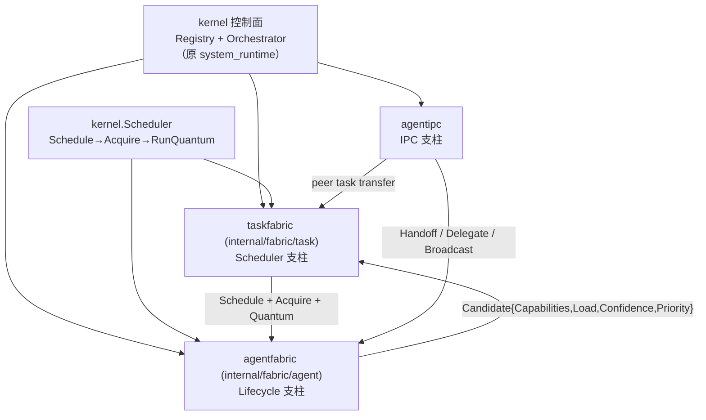

ARES 采用分层组织。`sdk` 包是唯一入口；它拥有的 `Runtime` 将 LLM 服务、
工具注册表、记忆、知识图谱与进化系统串联在一起。`sdk` 以下均为内部包，
通过 `api/` 暴露稳定的公开契约。

## 分层模型

运行时按七层组织。下图为源码树中真实存在的主要运行时包；逻辑模块若位于
嵌套目录，标注真实路径（例如 `taskfabric` 位于 `internal/fabric/task`）。
箭头方向为编译期/运行期依赖方向(调用方 → 被调用方)。

```mermaid
flowchart TD
    %% L7 — 入口面
    Entry["入口面<br/>cmd/ares (serve / start / status)<br/>sdk.NewRuntime · api/ 公开契约"]

    %% L6 — 装配与系统控制面
    Boot["装配根<br/>ares_bootstrap — serve/start/SDK 单一 Bootstrap"]
    SysCtrl["系统控制面 (位于 kernel)<br/>kernel.Registry · TopologicalOrder<br/>Orchestrator (Constructed→Bound→Started→Ready)<br/>Snapshot/IsReady — 原 system_runtime"]
    Shut["优雅停机<br/>ares_shutdown — 分阶段 CallbackRegistry"]

    %% L5 — ARES Kernel (调度内核 + 三支柱 + 恢复)
    KernelSub["ARES Kernel"]
    KSch["kernel.Scheduler — 唯一调度决策点<br/>Schedule→Acquire→RunQuantum<br/>executor 注册表 · 负载跟踪 · drain 上限"]
    Scheduler["Scheduler 支柱 — taskfabric (internal/fabric/task)<br/>durable Task · 租约 fencing 状态机<br/>RunQuantum · Score · Steal"]
    Lifecycle["Lifecycle 支柱 — agentfabric (internal/fabric/agent)<br/>disposable Agent · Spawn/Suspend/Retire/Kill/Recover<br/>3 层上下文 · P5 准入"]
    IPC["IPC 支柱 — agentipc<br/>peer Bus · Send/Request/Reply/Delegate<br/>Handoff/Subscribe/Broadcast"]
    Recovery["Kernel 恢复 — aresrecovery<br/>租约过期→重排队<br/>崩溃恢复 (Agent 死亡 ≠ Task 死亡)"]

    %% L4 — 执行引擎
    ExecSub["执行引擎"]
    AgentRT["agentruntime — 共享 L2 执行核<br/>Sessions · Submit · ExecutionConfig<br/>planprojection 编译路径"]
    Agents["agents — leader/sub + peer<br/>StrategySource · Handoff"]
    Workflow["workflow (internal/fabric/task/workflow)<br/>MutableDAG · edge-activation<br/>PatchQueue · checkpoint/resume"]
    Arena["arena (internal/runtime/arena)<br/>混沌故障注入 · regression"]
    Flight["flight (internal/runtime/observability/flight)<br/>fitness trace · release harness"]

    %% L3 — 进化与学习
    EvolSub["进化与学习"]
    Evol["ares_evolution (internal/runtime/ares_evolution)<br/>GA + genome/diff · coordinator · patch"]
    Exp["experience (internal/runtime/memory/experience)<br/>冲突解决 · ranking"]
    Skills["ares_skills (internal/runtime/protocol/skills)<br/>SkillCatalog · 懒加载 MCP · 经验先验"]
    Eval["eval (internal/runtime/eval)<br/>verdict + dimension 评分"]
    Evidence["evidence — 通用数据原语<br/>Append/Query/Aggregate"]
    Archive["archive (internal/runtime/archive)<br/>RoundRecord · 保留优先级 P0–P3"]

    %% L2 — 基础设施服务
    InfraSub["基础设施服务"]
    Events["ares_events — EventStore<br/>compactable · integrity verify · task.* 事件"]
    Memory["memory (internal/runtime/memory)<br/>session/messages · RAG · distillation"]
    Knowledge["knowledge — AKG Fabric<br/>KnowledgeObject · GraphProvider · 3 层"]
    MCP["ares_mcp (internal/runtime/protocol/mcp)<br/>MCPManager · stdio/sse · 懒激活"]
    Tools["tools — 工具注册表 + 来源<br/>builtin · envcap · toolsource"]
    Callbacks["ares_callbacks — BridgeEventStore<br/>callback↔event 统一"]
    Protocol["protocol (internal/runtime/protocol)<br/>适配器地图: mcp / skills / ahp"]
    Security["ares_security — sanitizer<br/>SSRF allowlist · 输入卫生"]
    Ratelimit["ares_ratelimit — limiter<br/>rate/burst/token bucket"]
    Observ["observability (internal/runtime/observability)<br/>metrics+trace · OTLP · cost dashboard"]
    CtxUtil["ctxutil (internal/runtime/ctxutil.go)<br/>labelled context · bg-task 统计<br/>package runtime"]
    Discovery["discovery — provider 插件<br/>identity merge · health verify"]
    Dashboard["dashboard API — cmd/ares serve<br/>observability 读侧 · /api · /ws"]
    Storage["storage — search result DTO<br/>存储抽象"]
    Scoreutil["scoreutil — ClampUnit 数学<br/>共享评分助手"]
    Truncate["truncate — WithEllipsis<br/>共享截断助手"]
    Logger["logger — slog Module<br/>结构化日志基座"]
    Config["ares_config — Config 结构<br/>ares.yaml schema · defaults"]

    %% L1 — 基础
    FoundSub["基础"]
    Core["core — 共享 DTO + 值类型<br/>api/core + internal/core/models+errors"]
    Errors["errors — AppError + ErrorCode<br/>结构化错误分类"]

    %% — 接线边 —
    Entry --> Boot
    Entry --> SysCtrl
    Boot --> SysCtrl
    Boot --> KSch
    Boot --> Scheduler
    Boot --> Lifecycle
    Boot --> IPC
    Boot --> Recovery
    Boot --> ExecSub
    Boot --> EvolSub
    Boot --> InfraSub
    Boot --> FoundSub
    SysCtrl --> Shut
    SysCtrl --> KSch
    SysCtrl --> Scheduler
    SysCtrl --> Lifecycle
    SysCtrl --> IPC

    KSch --> Scheduler
    KSch --> Lifecycle
    Scheduler --> AgentRT
    Scheduler --> Agents
    Lifecycle --> Agents
    IPC --> Agents
    Recovery --> Scheduler
    Recovery --> Lifecycle

    AgentRT --> Events
    AgentRT --> Workflow
    Agents --> Events
    Agents --> Memory
    Workflow --> Events
    Arena --> Workflow
    Arena --> Evol
    Flight --> Events
    Flight --> Evidence

    Evol --> Evidence
    Evol --> Exp
    Evol --> Skills
    Eval --> Evidence
    Skills --> Knowledge
    Skills --> MCP
    Exp --> Memory
    Archive --> Events

    Events --> Core
    Memory --> Core
    Knowledge --> Core
    MCP --> Core
    Tools --> Core
    Callbacks --> Events
    Discovery --> Events
    Dashboard --> Events
    Dashboard --> Observ
    Observ --> Events
    Ratelimit --> Core
    Security --> Core
    Storage --> Core
    Scoreutil --> Core
    Truncate --> Core
    Logger --> Core
    Config --> Core
    CtxUtil --> Core

    Core --> Errors

    %% cluster 收拢
    KernelSub ~~~ KSch
    KernelSub ~~~ Scheduler
    KernelSub ~~~ Lifecycle
    KernelSub ~~~ IPC
    KernelSub ~~~ Recovery
    ExecSub ~~~ AgentRT
    ExecSub ~~~ Agents
    ExecSub ~~~ Workflow
    ExecSub ~~~ Arena
    ExecSub ~~~ Flight
    EvolSub ~~~ Evol
    EvolSub ~~~ Exp
    EvolSub ~~~ Skills
    EvolSub ~~~ Eval
    EvolSub ~~~ Evidence
    EvolSub ~~~ Archive
    InfraSub ~~~ Events
    InfraSub ~~~ Memory
    InfraSub ~~~ Knowledge
    InfraSub ~~~ MCP
    InfraSub ~~~ Tools
    InfraSub ~~~ Callbacks
    InfraSub ~~~ Protocol
    InfraSub ~~~ Security
    InfraSub ~~~ Ratelimit
    InfraSub ~~~ Observ
    InfraSub ~~~ CtxUtil
    InfraSub ~~~ Discovery
    InfraSub ~~~ Dashboard
    InfraSub ~~~ Storage
    InfraSub ~~~ Scoreutil
    InfraSub ~~~ Truncate
    InfraSub ~~~ Logger
    InfraSub ~~~ Config
    FoundSub ~~~ Core
    FoundSub ~~~ Errors
```

### 层级图例

| 层 | 包（真实路径） | 角色 |
| --- | --- | --- |
| L7 入口面 | `cmd/ares`、`sdk`、`api/` | CLI 命令、`sdk.NewRuntime` 工厂、公开契约。 |
| L6 装配与系统控制面 | `ares_bootstrap`、`ares_shutdown`、控制面位于 `internal/kernel`（`Registry`、`Orchestrator`） | 单一装配根、分阶段停机、组件注册表、逆拓扑生命周期编排、状态快照。原 `system_runtime` 包已统一进 `internal/kernel`。 |
| L5 ARES Kernel | `internal/kernel`（Scheduler + 控制面）、`internal/fabric/task`（包 `taskfabric`）、`internal/fabric/agent`（包 `agentfabric`）、`internal/agentipc`、`internal/aresrecovery` | 唯一调度决策点（`Schedule→Acquire→RunQuantum`）、持久化 Task 基底、可丢弃 Agent 生命周期、对等 IPC、租约过期恢复；**Agent 死亡 ≠ Task 死亡**。 |
| L4 执行引擎 | `internal/agentruntime`、`internal/agents`、`internal/fabric/task/workflow`、`internal/runtime/arena`、`internal/runtime/observability/flight` | 共享 L2 会话执行 + planprojection、leader/sub + peer 智能体、MutableDAG 工作流 Runner、混沌 arena、flight recorder。（历史包 `internal/agentloop` 已退役；见 agentloop 模块页。） |
| L3 进化与学习 | `internal/runtime/ares_evolution`、`internal/runtime/memory/experience`、`internal/runtime/protocol/skills`、`internal/runtime/eval`、`internal/evidence`、`internal/runtime/archive` | GA + genome/diff 进化、经验冲突解决、Capability Fabric、evidence-based 评估、轮次归档。 |
| L2 基础设施服务 | `internal/ares_events`、`internal/runtime/memory`、`internal/knowledge`、`internal/runtime/protocol/mcp`、`internal/tools`、`internal/ares_callbacks`、`internal/runtime/protocol`、`internal/ares_security`、`internal/ares_ratelimit`、`internal/runtime/observability`、`internal/runtime/ctxutil.go`（包 `runtime`）、`internal/discovery`、dashboard API 位于 `cmd/ares` + observability、`internal/storage`、`internal/scoreutil`、`internal/truncate`、`internal/logger`、`internal/ares_config` | EventStore、memory/RAG、AKG Fabric、MCP manager、工具注册表、callbacks、协议适配器、安全、限流、可观测、context 助手、服务发现、observability 仪表盘 API、存储/搜索 DTO、评分数学、截断、结构化日志、配置。 |
| L1 基础 | `internal/core`、`internal/errors` | 共享 DTO 与值类型、结构化错误分类。 |

注：`llm` / `llmservice`、`mcpclient`、`tenantctx`、`feedback`、`introspect`、
`evoapi`、`embedding` 等支撑包也存在于 `internal/` 下，为保持分层图可读而
未画入图中——它们不是幽灵节点。

## 请求流程

1. `sdk.NewRuntime(opts...)` 构造 `Runtime`，根据传入的选项串联 LLM 客户端、
   工具注册表、记忆管理器、知识运行时、进化协调器与 MCP 客户端。
2. `rt.NewAgent(name, opts...)` 创建绑定到运行时的 `Agent`。
3. `agent.Run(ctx, input)` 进入智能体循环：
   - 从 `StrategySource` 加载当前策略（prompt + LLM 参数）。
   - 从记忆（RAG）与知识运行时召回相关上下文。
   - 构建消息列表（system + 历史 + 用户输入 + 上下文片段）。
   - 调用 LLM 服务。若存在工具，路由到 Chat API。
   - 若 LLM 返回工具调用，通过工具注册表执行并将结果回填；重复直到 LLM
     产出最终答案或达到迭代上限。
4. 完成后发布 `TaskCompleted` 事件。事件驱动的蒸馏订阅者消费该事件，
   将对话蒸馏为长期经验与 AKG KnowledgeObject。

## ARES Kernel —— Agent OS Runtime

从 0.3.0 起运行时收敛为 **ARES Kernel**：调度内核（`internal/kernel`）加
三大织物/IPC 支柱（Scheduler `taskfabric`、Lifecycle `agentfabric`、IPC
`agentipc`）与恢复（`aresrecovery`）。原独立 `system_runtime` 包中的控制面
半壁（组件 `Registry`、`Orchestrator`、`TopologicalOrder`、`Snapshot` /
`IsReady`）现位于 `internal/kernel`，由 `ares_bootstrap` 装配。核心不变量是
**Agent 死亡 ≠ Task 死亡**——`Task` 是 durable 的（通过租约 fencing 与保留的
checkpoint 在 owner 死亡后存活），`Agent` 是 disposable 的。智能体是同级认知
进程（A ≡ B ≡ C）；父子关系仅为溯源，不构成权限层级。

| 支柱 | 包（真实路径） | 角色 |
| --- | --- | --- |
| 调度内核 | `internal/kernel` | 唯一做调度决策的地方：quantum 排水（`Schedule→Acquire→RunQuantum`）、executor 注册/评分、负载跟踪、租约心跳、drain 上限、混合池、决策记录；同时承载组件控制面（`Registry` / `Orchestrator`）。 |
| Scheduler 支柱 | `internal/fabric/task`（包 `taskfabric`） | 持久化意图 `Task` 基底：租约 fencing 状态机、执行 quantum（`RunQuantum`）、能力感知评分（`Score = capability_overlap × (1−load) × confidence × (1+priority)`）、工作窃取、`CheckExpiredLeases` 崩溃恢复。 |
| Lifecycle 支柱 | `internal/fabric/agent`（包 `agentfabric`） | 可丢弃执行 `Agent` 基底：`Spawn`/`Suspend`/`Resume`/`Retire`/`Kill`/`Recover` 生命周期、三层上下文隔离（Task Shared / Agent Private / IPC）、P5 资源准入、可独立 checkpoint 的 `CognitiveState`。 |
| IPC 支柱 | `internal/agentipc` | 对等消息总线：`Send`/`Request`/`Reply`/`Delegate`/`Handoff`/`Subscribe`/`Broadcast`、高级协作模式（委托/流水线/编排）、带 shadow-mode 等价验证的双轨调度策略。 |
| 恢复 | `internal/aresrecovery` | 租约过期→重排队；崩溃恢复使 **Agent 死亡 ≠ Task 死亡**；执行归因及相关追踪器。 |
| 控制面 | `internal/kernel`（由 `internal/ares_bootstrap` 装配） | 系统级控制面：组件 `Registry`、依赖感知 `TopologicalOrder`（Kahn）、逆拓扑运行 `Constructed → Bound → Started → Ready` 且拓扑停机的 `Orchestrator`、`Snapshot()` / `IsReady()` 状态 API。原为包 `system_runtime`。 |

专用模块页见 [kernel](../modules/kernel/)、[taskfabric](../modules/taskfabric/)、
[agentfabric](../modules/agentfabric/)、[agentipc](../modules/agentipc/)、
[aresrecovery](../modules/aresrecovery/)、
[ares_bootstrap](../modules/ares_bootstrap/)、
[system_runtime](../modules/system_runtime/)。

## 模块协作

上图展示了主要数据路径。关键协作关系：

- **sdk ↔ internal/***：SDK 是唯一直接导入内部包的层；`api/` 定义公开契约。
- **agents ↔ llmservice**：智能体循环在有工具时调用 `Service.Chat`，否则
  调用 `Service.Generate`。
- **knowledge ↔ memory**：`KnowledgeRetriever` 实现 `ContextRetriever`
  接口，使 AKG 事实注入记忆 RAG。
- **ares_events ↔ experience**：事件触发蒸馏流水线，回写到经验存储与
  知识存储。
- **ares_evolution ↔ knowledge**：进化协调器可通过 `WithPatchRegistry`
  提交影响运行中知识运行时的补丁。
- **ARES Kernel**：`internal/kernel` 调度（唯一调度点）、`taskfabric` 持有
  durable Task、`agentfabric` 管生命周期、`agentipc` 承载对等消息、
  `ares_bootstrap` 将组件图注册到 kernel 的 `Registry` / `Orchestrator`，
  使各入口（`serve`、`start`、SDK）观察到同一条依赖有序的生命周期。

## 扩展方式

具体的新增 LLM 供应商、自定义工具、知识存储与策略源的指引，请参见
[扩展指南](../guides/extend/)。

注（2026-09 核实）：live agent DAG（agents.peers 拓扑）注册在 runtime manager
上、供进化结构补丁作用，但**不**编译进 task fabric——agent 拓扑不是可执行的
工作任务。task fabric 的编译只覆盖 session/plan 图。

注（2026-09 核实）：包路径已对照源码树——`taskfabric` 位于
`internal/fabric/task`，`agentfabric` 位于 `internal/fabric/agent`，系统控制面
（`Registry`/`Orchestrator`）位于 `internal/kernel`（原 `system_runtime` 按
`internal/kernel/doc.go` 统一），memory/eval/archive/arena/flight/skills/MCP/
observability 等位于 `internal/runtime/...`。自旧图中移除的幽灵节点：
`detector`（已从产品树移除）、`ares_integration`、`ares_experience`、
`ares_ctxutil`（助手实为 `internal/runtime/ctxutil.go` 中的文件，包
`runtime`），以及独立的 `internal/dashboard` 包（dashboard HTTP 面由
`cmd/ares` 配合 observability 提供）。

### 动态图（MutableDAG，现行源码树）

live 图对象是 `MutableDAG`（`internal/fabric/task/workflow/engine`）：session
L2 图在 planner 作用下按量子生长（plan/tool/answer 节点），受 `max_plan_depth`
（默认 10；触顶强制生成 content-less answer 节点——合成或诚实缺口体，绝非
守卫文案）约束。`planprojection.CompileCoordinator`
（`internal/fabric/planprojection`）将变更的图增量编译进
task fabric（`PlanStep.Capability ← Step.AgentType`；编译溯源
`generation`/`dag_version`/`compile_id` 在 `/api/evolution/lifecycle` 可见）。
进化结构补丁原地变更 DAG 对象；live agent DAG（agents.peers 拓扑）不编译进
task fabric。
