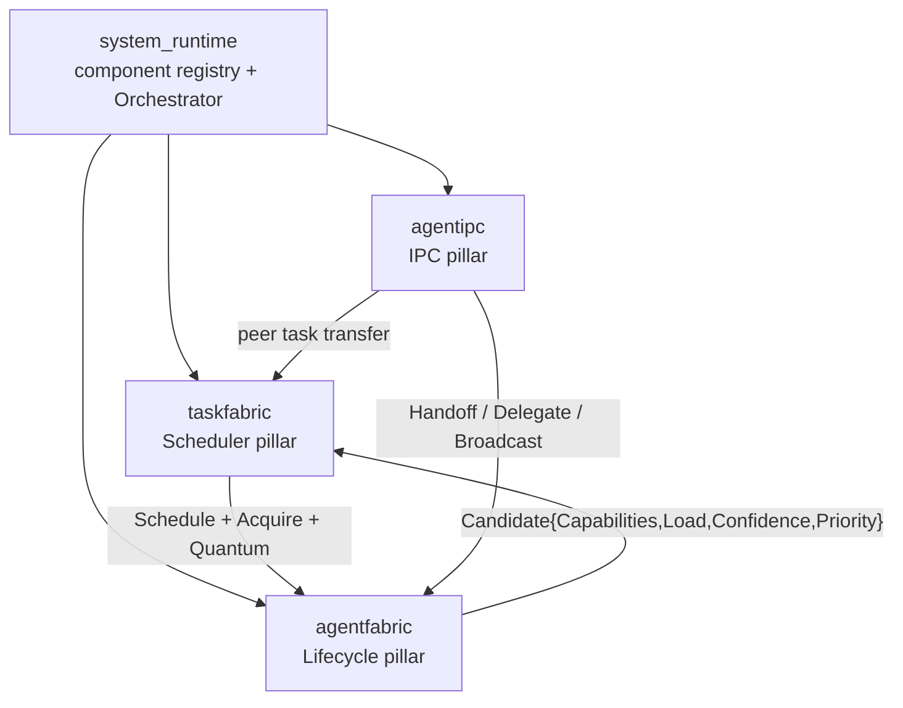

ARES 采用分层组织。`sdk` 包是唯一入口；它拥有的 `Runtime` 将 LLM 服务、
工具注册表、记忆、知识图谱与进化系统串联在一起。`sdk` 以下均为内部包，
通过 `api/` 暴露稳定的公开契约。

## 分层模型

运行时按七层组织。每个 `internal/*` 包都是单一组件,下图一个不落。
箭头方向为编译期/运行期依赖方向(调用方 → 被调用方)。

```mermaid
flowchart TD
    %% L7 — 入口面
    Entry["入口面<br/>cmd/ares (serve / start / status)<br/>sdk.NewRuntime · api/ 公开契约"]

    %% L6 — 系统控制面
    SysCtrl["系统控制面<br/>system_runtime — Registry · TopologicalOrder<br/>Orchestrator (Constructed→Bound→Started→Ready)<br/>Snapshot/IsReady 状态 API"]
    Shut["优雅停机<br/>ares_shutdown — 分阶段 CallbackRegistry"]
    Boot["装配根<br/>ares_bootstrap — serve/start/SDK 单一 Bootstrap"]

    %% L5 — ARES Kernel (三支柱 + 恢复)
    KernelSub["ARES Kernel"]
    Scheduler["Scheduler 支柱<br/>taskfabric — durable Task<br/>租约 fencing 状态机<br/>RunQuantum · Score · Steal"]
    Lifecycle["Lifecycle 支柱<br/>agentfabric — disposable Agent<br/>Spawn/Suspend/Retire/Kill/Recover<br/>3 层上下文 · P5 准入"]
    IPC["IPC 支柱<br/>agentipc — peer Bus<br/>Send/Request/Reply/Delegate<br/>Handoff/Subscribe/Broadcast"]
    Recovery["Kernel 恢复<br/>aresrecovery — 租约过期→重排队<br/>崩溃恢复 (Agent 死亡 ≠ Task 死亡)"]

    %% L4 — 执行引擎
    ExecSub["执行引擎"]
    AgentLoop["agentloop — ReAct 引擎<br/>iterate→generate→tool→feed-back"]
    Agents["agents — leader/sub + peer<br/>StrategySource · Handoff"]
    Workflow["workflow — 统一 DAG Runner<br/>spec IR · edge-activation scheduler<br/>PatchQueue · checkpoint/resume"]
    Arena["ares_arena — 混沌工程<br/>故障注入 · regression tester"]
    Flight["ares_flight — 实验记录<br/>fitness trace · release harness"]

    %% L3 — 进化与学习
    EvolSub["进化与学习"]
    Evol["ares_evolution — GA + genome/diff<br/>coordinator · patch · strategy store"]
    Exp["ares_experience — 冲突解决<br/>store simply, retrieve smartly"]
    Skills["ares_skills — Capability Fabric<br/>SkillCatalog · 懒加载 MCP · 经验先验"]
    Eval["eval — verdict + dimension 评分<br/>evidence-based (非标量)"]
    Evidence["evidence — 通用数据原语<br/>Append/Query/Aggregate"]
    Archive["ares_archive — 轮次摘要<br/>RoundRecord · 保留优先级 P0–P3"]

    %% L2 — 基础设施服务
    InfraSub["基础设施服务"]
    Events["ares_events — EventStore<br/>compactable · integrity verify · task.* 事件"]
    Memory["ares_memory — MemoryManager<br/>session/messages · RAG · distillation"]
    Knowledge["knowledge — AKG Fabric<br/>KnowledgeObject · GraphProvider · 3 层"]
    MCP["ares_mcp — MCPManager<br/>stdio/sse transports · 懒激活"]
    Tools["tools — 工具注册表 + 来源<br/>builtin · envcap · toolsource"]
    Callbacks["ares_callbacks — BridgeEventStore<br/>callback↔event 统一"]
    Protocol["ares_protocol — 线协议<br/>(预留)"]
    Security["ares_security — sanitizer<br/>SSRF allowlist · 输入卫生"]
    Ratelimit["ares_ratelimit — limiter<br/>rate/burst/token bucket"]
    Observ["ares_observability — metrics+trace<br/>OTLP exporter · 健康探针"]
    CtxUtil["ares_ctxutil — detached context<br/>labelled context · bg-task 统计"]
    Discovery["discovery — provider 插件<br/>identity merge · health verify"]
    Detector["detector — 零配置探针<br/>本地端口 · env vars · LLM provider"]
    Dashboard["dashboard — 统一 API v2<br/>/agents · /mcp · /ws realtime"]
    Integr["ares_integration — e2e harness<br/>event-driven distillation 测试"]
    Storage["storage — search result DTO<br/>存储抽象"]
    Scoreutil["scoreutil — ClampUnit 数学<br/>共享评分助手"]
    Truncate["truncate — WithEllipsis<br/>共享截断助手"]
    Logger["logger — slog Module<br/>结构化日志基座"]
    Config["ares_config — Config 结构<br/>ares.yaml schema · defaults"]

    %% L1 — 基础
    FoundSub["基础"]
    Core["core — 共享 DTO + 值类型<br/>api/core + internal/core/models+errors"]
    Errors["errors — AppError + ErrorCode<br/>结构化错误分类"]

    %% — 接线边 —
    Entry --> Boot
    Entry --> SysCtrl
    Boot --> SysCtrl
    Boot --> Scheduler
    Boot --> Lifecycle
    Boot --> IPC
    Boot --> Recovery
    Boot --> ExecSub
    Boot --> EvolSub
    Boot --> InfraSub
    Boot --> FoundSub
    SysCtrl --> Shut
    SysCtrl --> Scheduler
    SysCtrl --> Lifecycle
    SysCtrl --> IPC

    Scheduler --> AgentLoop
    Scheduler --> Agents
    Lifecycle --> Agents
    IPC --> Agents
    Recovery --> Scheduler
    Recovery --> Lifecycle

    AgentLoop --> Events
    AgentLoop --> Memory
    AgentLoop --> MCP
    AgentLoop --> Tools
    AgentLoop --> Evol
    Agents --> Workflow
    Agents --> Events
    Agents --> Memory
    Workflow --> Events
    Arena --> Workflow
    Arena --> Evol
    Flight --> Events
    Flight --> Evidence

    Evol --> Evidence
    Evol --> Exp
    Evol --> Skills
    Eval --> Evidence
    Skills --> Knowledge
    Skills --> MCP
    Exp --> Memory
    Archive --> Events

    Events --> Core
    Memory --> Core
    Knowledge --> Core
    MCP --> Core
    Tools --> Core
    Callbacks --> Events
    Discovery --> Events
    Detector --> Discovery
    Dashboard --> Events
    Integr --> Events
    Observ --> Events
    Ratelimit --> Core
    Security --> Core
    Storage --> Core
    Scoreutil --> Core
    Truncate --> Core
    Logger --> Core
    Config --> Core
    CtxUtil --> Core

    Core --> Errors

    %% cluster 收拢
    KernelSub ~~~ Scheduler
    KernelSub ~~~ Lifecycle
    KernelSub ~~~ IPC
    KernelSub ~~~ Recovery
    ExecSub ~~~ AgentLoop
    ExecSub ~~~ Agents
    ExecSub ~~~ Workflow
    ExecSub ~~~ Arena
    ExecSub ~~~ Flight
    EvolSub ~~~ Evol
    EvolSub ~~~ Exp
    EvolSub ~~~ Skills
    EvolSub ~~~ Eval
    EvolSub ~~~ Evidence
    EvolSub ~~~ Archive
    InfraSub ~~~ Events
    InfraSub ~~~ Memory
    InfraSub ~~~ Knowledge
    InfraSub ~~~ MCP
    InfraSub ~~~ Tools
    InfraSub ~~~ Callbacks
    InfraSub ~~~ Protocol
    InfraSub ~~~ Security
    InfraSub ~~~ Ratelimit
    InfraSub ~~~ Observ
    InfraSub ~~~ CtxUtil
    InfraSub ~~~ Discovery
    InfraSub ~~~ Detector
    InfraSub ~~~ Dashboard
    InfraSub ~~~ Integr
    InfraSub ~~~ Storage
    InfraSub ~~~ Scoreutil
    InfraSub ~~~ Truncate
    InfraSub ~~~ Logger
    InfraSub ~~~ Config
    FoundSub ~~~ Core
    FoundSub ~~~ Errors
```

### 层级图例

| 层 | 包 | 角色 |
| --- | --- | --- |
| L7 入口面 | `cmd/ares`、`sdk`、`api/` | CLI 命令、`sdk.NewRuntime` 工厂、公开契约。 |
| L6 系统控制面 | `system_runtime`、`ares_shutdown`、`ares_bootstrap` | 组件注册表、逆拓扑生命周期编排、分阶段停机、单一装配根。 |
| L5 ARES Kernel | `taskfabric`、`agentfabric`、`agentipc`、`aresrecovery` | 三支柱(Scheduler / Lifecycle / IPC)加独立的 Recovery 子系统;**Agent 死亡 ≠ Task 死亡**。 |
| L4 执行引擎 | `agentloop`、`agents`、`workflow`、`ares_arena`、`ares_flight` | ReAct 循环、leader/sub + peer 智能体、统一 DAG Runner、混沌 arena、实验 flight recorder。 |
| L3 进化与学习 | `ares_evolution`、`ares_experience`、`ares_skills`、`eval`、`evidence`、`ares_archive` | GA + genome/diff 进化、经验冲突解决、Capability Fabric、evidence-based 评估、轮次归档。 |
| L2 基础设施服务 | `ares_events`、`ares_memory`、`knowledge`、`ares_mcp`、`tools`、`ares_callbacks`、`ares_protocol`、`ares_security`、`ares_ratelimit`、`ares_observability`、`ares_ctxutil`、`discovery`、`detector`、`dashboard`、`ares_integration`、`storage`、`scoreutil`、`truncate`、`logger`、`ares_config` | EventStore、memory/RAG、AKG Fabric、MCP manager、工具注册表、callbacks、线协议、安全、限流、可观测、context utils、服务发现、零配置探测、dashboard API、e2e harness、存储/搜索 DTO、评分数学、截断、结构化日志、配置。 |
| L1 基础 | `core`、`errors` | 共享 DTO 与值类型、结构化错误分类。 |

## 请求流程

1. `sdk.NewRuntime(opts...)` 构造 `Runtime`，根据传入的选项串联 LLM 客户端、
   工具注册表、记忆管理器、知识运行时、进化协调器与 MCP 客户端。
2. `rt.NewAgent(name, opts...)` 创建绑定到运行时的 `Agent`。
3. `agent.Run(ctx, input)` 进入智能体循环：
   - 从 `StrategySource` 加载当前策略（prompt + LLM 参数）。
   - 从记忆（RAG）与知识运行时召回相关上下文。
   - 构建消息列表（system + 历史 + 用户输入 + 上下文片段）。
   - 调用 LLM 服务。若存在工具，路由到 Chat API。
   - 若 LLM 返回工具调用，通过工具注册表执行并将结果回填；重复直到 LLM
     产出最终答案或达到迭代上限。
4. 完成后发布 `TaskCompleted` 事件。事件驱动的蒸馏订阅者消费该事件，
   将对话蒸馏为长期经验与 AKG KnowledgeObject。

## ARES Kernel —— Agent OS Runtime

从 0.3.0 起运行时收敛为 **ARES Kernel**：三大支柱（Scheduler、Lifecycle、
IPC）加上按依赖顺序启停的控制面。核心不变量是 **Agent 死亡 ≠ Task
死亡**——`Task` 是 durable 的（通过租约 fencing 与保留的 checkpoint 在
owner 死亡后存活），`Agent` 是 disposable 的。智能体是同级认知进程
（A ≡ B ≡ C）；父子关系仅为溯源，不构成权限层级。

| 支柱 | 包 | 角色 |
| --- | --- | --- |
| Scheduler | `internal/taskfabric` | 持久化意图 `Task` 基底：租约 fencing 状态机、执行 quantum（`RunQuantum`）、能力感知评分（`Score = capability_overlap × (1−load) × confidence × (1+priority)`）、工作窃取、`CheckExpiredLeases` 崩溃恢复。 |
| Lifecycle | `internal/agentfabric` | 可丢弃执行 `Agent` 基底：`Spawn`/`Suspend`/`Resume`/`Retire`/`Kill`/`Recover` 生命周期、三层上下文隔离（Task Shared / Agent Private / IPC）、P5 资源准入、可独立 checkpoint 的 `CognitiveState`。 |
| IPC | `internal/agentipc` | 对等消息总线：`Send`/`Request`/`Reply`/`Delegate`/`Handoff`/`Subscribe`/`Broadcast`、高级协作模式（委托/流水线/编排）、带 shadow-mode 等价验证的双轨调度策略。 |
| 控制面 | `internal/system_runtime` | 系统级控制面：组件 `Registry`、依赖感知 `TopologicalOrder`（Kahn）、逆拓扑运行 `Constructed → Bound → Started → Ready` 且拓扑停机的 `Orchestrator`、`Snapshot()` / `IsReady()` 状态 API。 |

专用模块页见 [taskfabric](../modules/taskfabric/)、
[agentfabric](../modules/agentfabric/)、[agentipc](../modules/agentipc/)、
[system_runtime](../modules/system_runtime/)。

## 模块协作

上图展示了主要数据路径。关键协作关系：

- **sdk ↔ internal/***：SDK 是唯一直接导入内部包的层；`api/` 定义公开契约。
- **agents ↔ llmservice**：智能体循环在有工具时调用 `Service.Chat`，否则
  调用 `Service.Generate`。
- **knowledge ↔ ares_memory**：`KnowledgeRetriever` 实现 `ContextRetriever`
  接口，使 AKG 事实注入记忆 RAG。
- **ares_events ↔ ares_experience**：事件触发蒸馏流水线，回写到经验存储与
  知识存储。
- **ares_evolution ↔ knowledge**：进化协调器可通过 `WithPatchRegistry`
  提交影响运行中知识运行时的补丁。
- **ARES Kernel**：`taskfabric` 调度、`agentfabric` 管生命周期、`agentipc`
  承载对等消息、`system_runtime` 通过 `ares_bootstrap` 按依赖顺序编排上述
  四者及更广的组件图。

## 扩展方式

具体的新增 LLM 供应商、自定义工具、知识存储与策略源的指引，请参见
[扩展指南](../guides/extend/)。
