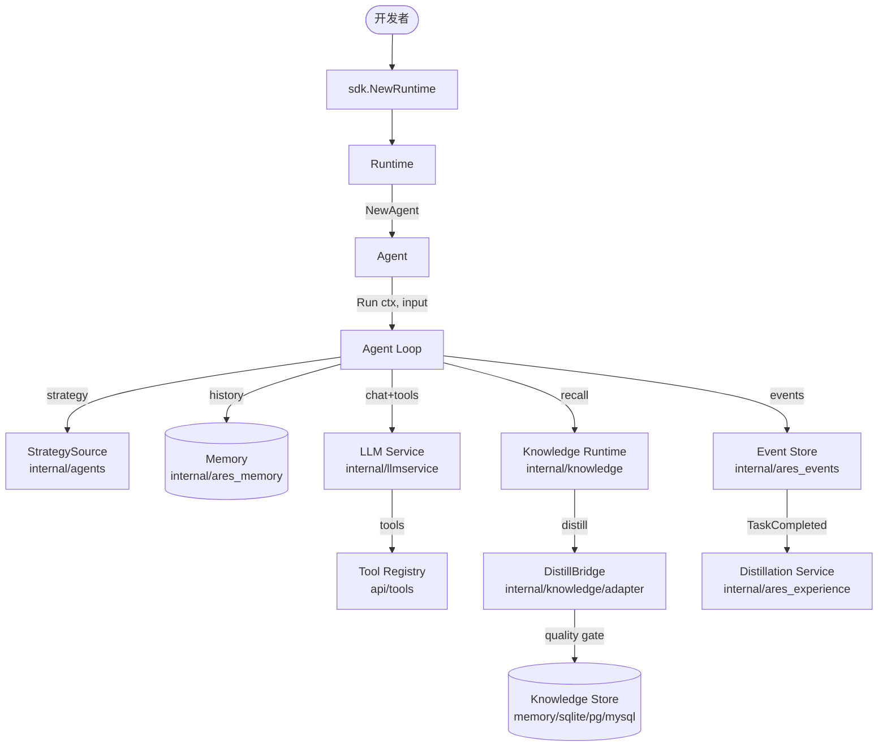

ARES 采用分层组织。`sdk` 包是唯一入口；它拥有的 `Runtime` 将 LLM 服务、
工具注册表、记忆、知识图谱与进化系统串联在一起。`sdk` 以下均为内部包，
通过 `api/` 暴露稳定的公开契约。

## 分层模型

## 请求流程

1. `sdk.NewRuntime(opts...)` 构造 `Runtime`，根据传入的选项串联 LLM 客户端、
   工具注册表、记忆管理器、知识运行时、进化协调器与 MCP 客户端。
2. `rt.NewAgent(name, opts...)` 创建绑定到运行时的 `Agent`。
3. `agent.Run(ctx, input)` 进入智能体循环：
   - 从 `StrategySource` 加载当前策略（prompt + LLM 参数）。
   - 从记忆（RAG）与知识运行时召回相关上下文。
   - 构建消息列表（system + 历史 + 用户输入 + 上下文片段）。
   - 调用 LLM 服务。若存在工具，路由到 Chat API。
   - 若 LLM 返回工具调用，通过工具注册表执行并将结果回填；重复直到 LLM
     产出最终答案或达到迭代上限。
4. 完成后发布 `TaskCompleted` 事件。事件驱动的蒸馏订阅者消费该事件，
   将对话蒸馏为长期经验与 AKG KnowledgeObject。

## 模块协作

上图展示了主要数据路径。关键协作关系：

- **sdk ↔ internal/***：SDK 是唯一直接导入内部包的层；`api/` 定义公开契约。
- **agents ↔ llmservice**：智能体循环在有工具时调用 `Service.Chat`，否则
  调用 `Service.Generate`。
- **knowledge ↔ ares_memory**：`KnowledgeRetriever` 实现 `ContextRetriever`
  接口，使 AKG 事实注入记忆 RAG。
- **ares_events ↔ ares_experience**：事件触发蒸馏流水线，回写到经验存储与
  知识存储。
- **ares_evolution ↔ knowledge**：进化协调器可通过 `WithPatchRegistry`
  提交影响运行中知识运行时的补丁。

## 扩展方式

具体的新增 LLM 供应商、自定义工具、知识存储与策略源的指引，请参见
[扩展指南](../guides/extend/)。
