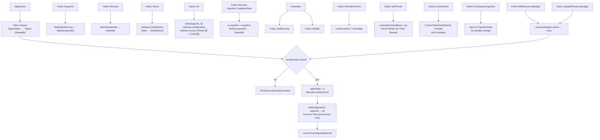

The `internal/agentfabric` package (package `agentfabric`) is the **Agent
Lifecycle** pillar of the ARES Kernel. It owns the agent registry, the Process
Tree (spawn provenance), the lifecycle state machine
(`IDLE → RUNNING → SUSPENDED → {IDLE | RETIRED}`), the three-layer context
isolation (Task Shared / Agent Private / IPC), and the P5 resource-admission
gate.

The central invariants are **A ≡ B ≡ C** (agents are same-level cognitive
processes; parent/child is provenance only, not a permission hierarchy) and
**Agent disposable, Task durable** (a new agent resumes a dead one's
cognitive checkpoint). The Fabric does NOT schedule (that is `taskfabric`'s
job) and does NOT do IPC (that is `agentipc`'s job).

## Responsibility

- Own the agent registry (`Fabric.agents`) and the Process Tree
  (`Fabric.children` — parent → child IDs for provenance only).
- Implement the lifecycle state machine: `Spawn` (creates an agent in
  `StateIdle`), `Suspend` / `Resume` (Lifecycle pause, not Task pause),
  `Retire` (graceful permanent decommission), `Kill` (forceful crash path),
  `Recover` (restore cognitive state from a checkpoint into an IDLE or
  SUSPENDED agent).
- Enforce P5 resource admission: `WithResourceBudget` sets the named quota;
  `Spawn` rejects with `ErrResourceQuotaExceeded` when the requested resources
  exceed the remaining budget; `UpdateResourceBudget` dynamically replaces the
  budget (v0.4.0 M2-2: evolution-driven resource allocation); claims are
  released on `Kill` / `Retire` so the budget reflects live agents only.
- Provide the three-layer context isolation: `SetTaskContext` /
  `TaskContext` (Task Shared State, copied so the agent never mutates the
  caller's map), `SetPrivate` / `Private` (Agent Private State — NEVER leaks
  to Task Shared or to other agents), `ContextView` (read-only snapshot used
  to verify isolation: Private must not appear in TaskShared).
- Provide independently checkpointable cognitive state:
  `CognitiveState{Context, Observation, WorkingMemory, Decision, ToolState,
  Checkpoint}`; `CheckpointCognitive` returns a snapshot for durable storage.
  The Runtime does NOT depend on hidden chain-of-thought — only on this
  checkpointable state (§13 invariant #5).
- Emit lifecycle events (`agent.spawned` … `agent.recovered`) via the optional
  `EventSink` so the Runtime can rebuild agent state from the event log
  (Evidence-Driven). A failed emit never breaks the state machine — the
  in-memory registry is authoritative.

## Architecture



## Agent lifecycle state machine

```mermaid
stateDiagram-v2
    [*] --> Idle: Spawn
    Idle --> Running: SetRunning (Scheduler binds Task)
    Running --> Idle: SetIdle (Task yields/completes)
    Idle --> Suspended: Suspend
    Running --> Suspended: Suspend
    Suspended --> Idle: Resume
    Idle --> Retired: Retire
    Suspended --> Retired: Retire
    Idle --> [*]: Kill
    Running --> [*]: Kill
    Suspended --> [*]: Kill
    note right of Retired
        Retired is terminal;
        resource claim released.
    end note
    note right of Recover
        Recover writes cognitive
        state into an IDLE/SUSPENDED
        agent (§13 #2: new agent
        resumes dead one's cognition).
    end note
```

## External interfaces

```go
package agentfabric

// Fabric owns the Agent registry, Process Tree, and lifecycle primitives.
// It is the Kernel's Lifecycle pillar: spawn / suspend / resume / retire /
// kill / recover. It does NOT schedule (taskfabric) and does NOT do IPC
// (agentipc).
type Fabric struct {
    // mu guards agents, children, idSeq, resourceBudget, allocated
    // agents map, children map, now func, sink EventSink
}
func NewFabric() *Fabric
func (f *Fabric) WithEventSink(sink EventSink) *Fabric
func (f *Fabric) WithClock(now func() time.Time) *Fabric
func (f *Fabric) WithResourceBudget(budget map[string]float64) *Fabric
func (f *Fabric) UpdateResourceBudget(budget map[string]float64)

// --- Registry / Process Tree ---

func (f *Fabric) Get(agentID string) (*Agent, error)
func (f *Fabric) Agents() []string
func (f *Fabric) Children(parentID string) []string

// --- Lifecycle primitives (design §13) ---

func (f *Fabric) Spawn(ctx context.Context, spec SpawnSpec) (*Agent, error)
func (f *Fabric) Suspend(ctx context.Context, agentID string) error
func (f *Fabric) Resume(ctx context.Context, agentID string) error
func (f *Fabric) Retire(ctx context.Context, agentID string) error
func (f *Fabric) Kill(ctx context.Context, agentID string) error
func (f *Fabric) Recover(ctx context.Context, agentID string, cognitive CognitiveState) error

// --- Internal scheduler hooks (not public lifecycle primitives) ---

func (f *Fabric) SetRunning(agentID string) error
func (f *Fabric) SetIdle(agentID string) error

// --- Three-layer context (design §13: do not share one brain) ---

func (f *Fabric) SetTaskContext(agentID string, taskCtx map[string]any) error
func (f *Fabric) TaskContext(agentID string) (map[string]any, error)
func (f *Fabric) SetPrivate(agentID, key string, val any) error
func (f *Fabric) Private(agentID, key string) (any, error)
func (f *Fabric) ContextView(agentID string) (ContextView, error)

// --- Independently checkpointable cognitive state ---

func (f *Fabric) CognitiveState(agentID string) (CognitiveState, error)
func (f *Fabric) SetCognitiveState(agentID string, cs CognitiveState) error
func (f *Fabric) CheckpointCognitive(agentID string) (CognitiveState, error)

// --- Types ---

type AgentState string
const (
    StateIdle     AgentState = "IDLE"
    StateRunning  AgentState = "RUNNING"
    StateSuspended AgentState = "SUSPENDED"
    StateRetired  AgentState = "RETIRED"
)

// Agent is a disposable, peer-equivalent cognitive process (design §3 + §13).
// Agents are NOT orchestrated — they are scheduled (by taskfabric) and managed
// (by this Fabric). An Agent independently holds its own Cognitive State; the
// Runtime never depends on hidden CoT, only on checkpointable state.
type Agent struct {
    Identity     string         // stable agent identifier
    Capabilities []string       // declared capabilities (capability-aware scheduler)
    State        AgentState     // current lifecycle state
    Load         float64        // current utilization (0 = idle; scheduler hint)
    Confidence   float64        // experience-derived prior (ares_skills source)
    Parent       string         // spawning agent's identity ("" for root; PROVENANCE ONLY)
    Priority     float64        // scheduling priority (>= 0; 0 = normal; OS-thread analog)
    SpawnedAt    time.Time      // when the agent was created via spawn
    // resources map[string]float64 — P5 resource claim; guarded by Fabric.mu
    // mu sync.RWMutex — guards CognitiveState, PrivateContext, State, Load
    // cognitive CognitiveState
    // privateContext map[string]any
    // taskContext map[string]any — shared task state (read-only view)
}

// CognitiveState is the agent's independent cognitive content (design §13).
// It is independently checkpointable — the Runtime does NOT depend on hidden
// chain-of-thought, only on this durable state.
type CognitiveState struct {
    Context       any  // active reasoning context (task goal + constraints)
    Observation   any  // latest observation from environment/tools
    WorkingMemory any  // scratchpad for intermediate reasoning
    Decision      any  // current decision/hypothesis
    ToolState     any  // state of active tools (open files, connections…)
    Checkpoint    any  // durable progress pointer (links to taskfabric Checkpoint)
}

// SpawnSpec is the syscall-style spawn request (design §13: spawn is a syscall,
// not an orchestration API). The Kernel validates quota / capability / resource
// / policy, then creates the Agent + (optionally) a Task + the parent-child
// provenance link.
type SpawnSpec struct {
    Identity     string           // requested agent id; "" means Fabric assigns one
    Capabilities []string         // declared capabilities of the new agent
    ParentID     string           // spawning agent's id ("" for a root agent)
    TaskContext  map[string]any   // shared task state passed from parent (snapshot/projection)
    Resources    map[string]any   // resource hints (quota/capability/policy validation surface)
    Priority     float64          // scheduling priority (>= 0; 0 = normal; OS-thread analog)
}

// --- Context layer (design §13: three-layer context) ---

type ContextLayer int
const (
    ContextTaskShared   ContextLayer = iota  // shared task state (objective)
    ContextAgentPrivate                       // per-agent scratchpad (never leaks)
    ContextIPC                                // inter-agent messages (P4)
)

type ContextView struct {
    TaskShared map[string]any
    Private    map[string]any
}

// --- Event sink ---

type EventSink interface {
    Emit(ctx context.Context, ev AgentEvent) error
}
type AgentEvent struct {
    Type     AgentEventType
    AgentID  string
    ParentID string
    State    AgentState
    At       time.Time
    Payload  map[string]any
}
type AgentEventType string
const (
    EventAgentSpawned   AgentEventType = "agent.spawned"
    EventAgentSuspended AgentEventType = "agent.suspended"
    EventAgentResumed   AgentEventType = "agent.resumed"
    EventAgentRetired   AgentEventType = "agent.retired"
    EventAgentKilled    AgentEventType = "agent.killed"
    EventAgentRecovered AgentEventType = "agent.recovered"
)

// --- Sentinel errors ---

var (
    ErrAgentNotFound
    ErrAgentExists
    ErrAgentNotIdle
    ErrAgentRetired
    ErrAgentNotSuspended
    ErrAgentRunning
    ErrInvalidSpawnSpec
    ErrResourceQuotaExceeded
)
```

## Key types and methods

| Type / Method | Purpose |
| --- | --- |
| `Fabric` | Agent Lifecycle pillar; owns agent registry, Process Tree, resource budget, event sink. |
| `NewFabric` | Constructs an empty `Fabric`; chain `WithEventSink` / `WithClock` / `WithResourceBudget`. |
| `Spawn` | Kernel syscall creating a new Agent in `StateIdle`; validates spec, checks P5 quota, records parent-child provenance. |
| `Suspend` / `Resume` | Lifecycle pause (not Task pause); in-memory state preserved; Resume relaunches the SAME instance. |
| `Retire` | Graceful permanent decommission; agent must NOT be `RUNNING` (suspend first); resource claim released; children survive. |
| `Kill` | Forceful crash path; works on any state; agent entry removed; children survive (Parent 死 ≠ Child 死); resource claim released. |
| `Recover` | Restores cognitive state from a checkpoint into an IDLE/SUSPENDED agent — how a new Agent resumes a dead one's cognition (§13 invariant #2). |
| `SetRunning` / `SetIdle` | Internal scheduler hooks (not public lifecycle primitives); mark agent RUNNING when Scheduler binds a Task, IDLE when Task yields/completes. |
| `SetTaskContext` / `TaskContext` | Task Shared State layer; copied so the agent never mutates the caller's map. |
| `SetPrivate` / `Private` | Agent Private State layer (scratchpad); NEVER leaks to Task Shared or to other agents (§13 invariant #5 + #6). |
| `ContextView` | Read-only snapshot of Task Shared + Private layers; used to verify isolation: Private must not appear in TaskShared. |
| `CognitiveState` / `CheckpointCognitive` | Independently checkpointable cognitive content; the Runtime does NOT depend on hidden CoT, only on this durable state. |
| `WithResourceBudget` / `UpdateResourceBudget` | P5 resource admission: named quota (e.g. `{"cpu": 8, "memory": 4096}`); `Spawn` rejects on overflow; `UpdateResourceBudget` dynamically replaces the budget (v0.4.0 M2-2). |
| `Children` | Process Tree: parent → child IDs for provenance only (§13 invariant #1 + #7). |
| `AgentEvent` / `EventSink` | Immutable lifecycle event log; replaying it rebuilds full agent state. |

## Module collaboration

- `agentfabric` -> `internal/taskfabric`: the Scheduler picks among
  `agentfabric.Agent` instances; `Agent.Capabilities` / `Load` / `Confidence`
  / `Priority` populate `taskfabric.Candidate`.
- `agentfabric` -> `internal/agentipc`: the IPC pillar addresses agents by
  `Agent.Identity`; `Children` provides the provenance graph for IPC policy.
- `agentfabric` -> `internal/ares_skills` (via `Confidence` field): the
  Experience `BestMatch` `SuccessRate` is the natural confidence prior.
- `agentfabric` -> `internal/ares_events` (via `EventSink`): lifecycle events
  are best-effort persisted for cross-restart rebuild; the in-memory registry
  is authoritative within a process.
- `agentfabric` -> `internal/system_runtime`: the Fabric is registered as a
  component and started/stopped by the Orchestrator.

## Extension points

1. **Wire a lifecycle event sink** via `Fabric.WithEventSink(sink)` so the
   Runtime can rebuild agent state from the event log (Evidence-Driven); a
   failed emit never breaks the state machine.
2. **Enable P5 resource admission** via `Fabric.WithResourceBudget(budget)`;
   `Spawn` then rejects with `ErrResourceQuotaExceeded` when the requested
   resources exceed the remaining quota. Dynamically replace the budget at
   runtime via `UpdateResourceBudget` (v0.4.0 M2-2: evolution-driven resource
   allocation).
3. **Verify context isolation** by reading `ContextView` after writing both
   `SetTaskContext` and `SetPrivate`: the Private layer must NOT appear in
   TaskShared (§13 invariant #5 + #6).
4. **Checkpoint cognitive state** via `CheckpointCognitive` for durable
   storage; restore it via `Recover` into a fresh IDLE agent — this is the
   §13 invariant #2 path (Agent disposable, Task durable; a new agent picks
   up the cognitive checkpoint).
5. **Inject a deterministic clock** via `Fabric.WithClock(now)` for hermetic
   tests of spawn ordering and event timestamps.
6. **Test parent/child independence** by `Spawn` (parent) → `Spawn` (child
   with `ParentID`) → `Kill` (parent): the child survives, its `Parent` field
   is preserved as provenance, and the Process Tree edge remains discoverable
   (§13 invariant #1 + #7).

## Bilingual status

This page is the English reference. A Chinese translation with identical
structure and technical content is published as `agentfabric.zh.md`. All code
identifiers, type names, and signatures are kept in English in both files;
only the prose differs.

## Maturity

Production. The package is covered by `agent.go` / `lifecycle.go` /
`context.go` / `resource.go` tests including `resource_test.go` and
`fabric_test.go`. It implements the agent lifecycle state machine with P5
resource admission, integrates with the ARES Kernel via `system_runtime`, and
exposes no experimental markers.


