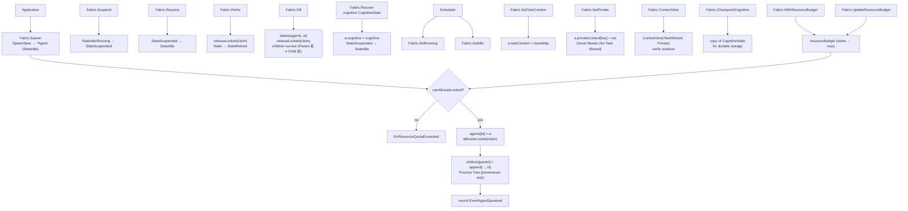

`internal/agentfabric` 包（包名 `agentfabric`）是 ARES Kernel 的 **Agent
Lifecycle** 支柱。它持有智能体注册表、Process Tree（spawn 溯源）、生命周期
状态机（`IDLE → RUNNING → SUSPENDED → {IDLE | RETIRED}`）、三层上下文隔离
（Task Shared / Agent Private / IPC）以及 P5 资源准入门。

核心不变量是 **A ≡ B ≡ C**（智能体是同级认知进程；父子关系仅为溯源，不构成
权限层级）与 **Agent disposable，Task durable**（新智能体恢复死亡智能体的
认知 checkpoint）。Fabric 不负责调度（那是 `taskfabric` 的事），也不负责
IPC（那是 `agentipc` 的事）。

## 职责

- 持有智能体注册表（`Fabric.agents`）与 Process Tree（`Fabric.children`
  ——parent → child ID，仅用于溯源）。
- 实现生命周期状态机：`Spawn`（创建 `StateIdle` 智能体）、`Suspend` /
  `Resume`（Lifecycle 暂停，非 Task 暂停）、`Retire`（优雅永久退役）、
  `Kill`（强制崩溃路径）、`Recover`（将认知 checkpoint 恢复进 IDLE 或
  SUSPENDED 智能体）。
- 强制 P5 资源准入：`WithResourceBudget` 设置命名配额；`Spawn` 在请求资源
  超出剩余配额时以 `ErrResourceQuotaExceeded` 拒绝；`UpdateResourceBudget`
  动态替换配额（v0.4.0 M2-2：进化驱动的资源分配）；claim 在 `Kill` /
  `Retire` 时释放，故配额仅反映在世智能体。
- 提供三层上下文隔离：`SetTaskContext` / `TaskContext`（Task Shared State，
  经 copy 故智能体永不改写调用方 map）、`SetPrivate` / `Private`（Agent
  Private State——绝不泄漏到 Task Shared 或其他智能体）、`ContextView`
  （只读快照，用于校验隔离：Private 不得出现在 TaskShared）。
- 提供可独立 checkpoint 的认知状态：
  `CognitiveState{Context, Observation, WorkingMemory, Decision, ToolState,
  Checkpoint}`；`CheckpointCognitive` 返回用于持久存储的快照。Runtime 不
  依赖隐藏 CoT，仅依赖此可 checkpoint 状态（§13 不变量 #5）。
- 经可选 `EventSink` 发射生命周期事件（`agent.spawned` …
  `agent.recovered`），使 Runtime 可从事件日志重建智能体状态
  （Evidence-Driven）。发射失败永不破坏状态机——内存注册表是权威源。

## 架构图



## 智能体生命周期状态机

```mermaid
stateDiagram-v2
    [*] --> Idle: Spawn
    Idle --> Running: SetRunning (Scheduler binds Task)
    Running --> Idle: SetIdle (Task yields/completes)
    Idle --> Suspended: Suspend
    Running --> Suspended: Suspend
    Suspended --> Idle: Resume
    Idle --> Retired: Retire
    Suspended --> Retired: Retire
    Idle --> [*]: Kill
    Running --> [*]: Kill
    Suspended --> [*]: Kill
    note right of Retired
        Retired is terminal;
        resource claim released.
    end note
    note right of Recover
        Recover writes cognitive
        state into an IDLE/SUSPENDED
        agent (§13 #2: new agent
        resumes dead one's cognition).
    end note
```

## 外部接口

```go
package agentfabric

// Fabric owns the Agent registry, Process Tree, and lifecycle primitives.
// It is the Kernel's Lifecycle pillar: spawn / suspend / resume / retire /
// kill / recover. It does NOT schedule (taskfabric) and does NOT do IPC
// (agentipc).
type Fabric struct {
    // mu guards agents, children, idSeq, resourceBudget, allocated
    // agents map, children map, now func, sink EventSink
}
func NewFabric() *Fabric
func (f *Fabric) WithEventSink(sink EventSink) *Fabric
func (f *Fabric) WithClock(now func() time.Time) *Fabric
func (f *Fabric) WithResourceBudget(budget map[string]float64) *Fabric
func (f *Fabric) UpdateResourceBudget(budget map[string]float64)

// --- Registry / Process Tree ---

func (f *Fabric) Get(agentID string) (*Agent, error)
func (f *Fabric) Agents() []string
func (f *Fabric) Children(parentID string) []string

// --- Lifecycle primitives (design §13) ---

func (f *Fabric) Spawn(ctx context.Context, spec SpawnSpec) (*Agent, error)
func (f *Fabric) Suspend(ctx context.Context, agentID string) error
func (f *Fabric) Resume(ctx context.Context, agentID string) error
func (f *Fabric) Retire(ctx context.Context, agentID string) error
func (f *Fabric) Kill(ctx context.Context, agentID string) error
func (f *Fabric) Recover(ctx context.Context, agentID string, cognitive CognitiveState) error

// --- Internal scheduler hooks (not public lifecycle primitives) ---

func (f *Fabric) SetRunning(agentID string) error
func (f *Fabric) SetIdle(agentID string) error

// --- Three-layer context (design §13: do not share one brain) ---

func (f *Fabric) SetTaskContext(agentID string, taskCtx map[string]any) error
func (f *Fabric) TaskContext(agentID string) (map[string]any, error)
func (f *Fabric) SetPrivate(agentID, key string, val any) error
func (f *Fabric) Private(agentID, key string) (any, error)
func (f *Fabric) ContextView(agentID string) (ContextView, error)

// --- Independently checkpointable cognitive state ---

func (f *Fabric) CognitiveState(agentID string) (CognitiveState, error)
func (f *Fabric) SetCognitiveState(agentID string, cs CognitiveState) error
func (f *Fabric) CheckpointCognitive(agentID string) (CognitiveState, error)

// --- Types ---

type AgentState string
const (
    StateIdle     AgentState = "IDLE"
    StateRunning  AgentState = "RUNNING"
    StateSuspended AgentState = "SUSPENDED"
    StateRetired  AgentState = "RETIRED"
)

// Agent is a disposable, peer-equivalent cognitive process (design §3 + §13).
// Agents are NOT orchestrated — they are scheduled (by taskfabric) and managed
// (by this Fabric). An Agent independently holds its own Cognitive State; the
// Runtime never depends on hidden CoT, only on checkpointable state.
type Agent struct {
    Identity     string         // stable agent identifier
    Capabilities []string       // declared capabilities (capability-aware scheduler)
    State        AgentState     // current lifecycle state
    Load         float64        // current utilization (0 = idle; scheduler hint)
    Confidence   float64        // experience-derived prior (ares_skills source)
    Parent       string         // spawning agent's identity ("" for root; PROVENANCE ONLY)
    Priority     float64        // scheduling priority (>= 0; 0 = normal; OS-thread analog)
    SpawnedAt    time.Time      // when the agent was created via spawn
    // resources map[string]float64 — P5 resource claim; guarded by Fabric.mu
    // mu sync.RWMutex — guards CognitiveState, PrivateContext, State, Load
    // cognitive CognitiveState
    // privateContext map[string]any
    // taskContext map[string]any — shared task state (read-only view)
}

// CognitiveState is the agent's independent cognitive content (design §13).
// It is independently checkpointable — the Runtime does NOT depend on hidden
// chain-of-thought, only on this durable state.
type CognitiveState struct {
    Context       any  // active reasoning context (task goal + constraints)
    Observation   any  // latest observation from environment/tools
    WorkingMemory any  // scratchpad for intermediate reasoning
    Decision      any  // current decision/hypothesis
    ToolState     any  // state of active tools (open files, connections…)
    Checkpoint    any  // durable progress pointer (links to taskfabric Checkpoint)
}

// SpawnSpec is the syscall-style spawn request (design §13: spawn is a syscall,
// not an orchestration API). The Kernel validates quota / capability / resource
// / policy, then creates the Agent + (optionally) a Task + the parent-child
// provenance link.
type SpawnSpec struct {
    Identity     string           // requested agent id; "" means Fabric assigns one
    Capabilities []string         // declared capabilities of the new agent
    ParentID     string           // spawning agent's id ("" for a root agent)
    TaskContext  map[string]any   // shared task state passed from parent (snapshot/projection)
    Resources    map[string]any   // resource hints (quota/capability/policy validation surface)
    Priority     float64          // scheduling priority (>= 0; 0 = normal; OS-thread analog)
}

// --- Context layer (design §13: three-layer context) ---

type ContextLayer int
const (
    ContextTaskShared   ContextLayer = iota  // shared task state (objective)
    ContextAgentPrivate                       // per-agent scratchpad (never leaks)
    ContextIPC                                // inter-agent messages (P4)
)

type ContextView struct {
    TaskShared map[string]any
    Private    map[string]any
}

// --- Event sink ---

type EventSink interface {
    Emit(ctx context.Context, ev AgentEvent) error
}
type AgentEvent struct {
    Type     AgentEventType
    AgentID  string
    ParentID string
    State    AgentState
    At       time.Time
    Payload  map[string]any
}
type AgentEventType string
const (
    EventAgentSpawned   AgentEventType = "agent.spawned"
    EventAgentSuspended AgentEventType = "agent.suspended"
    EventAgentResumed   AgentEventType = "agent.resumed"
    EventAgentRetired   AgentEventType = "agent.retired"
    EventAgentKilled    AgentEventType = "agent.killed"
    EventAgentRecovered AgentEventType = "agent.recovered"
)

// --- Sentinel errors ---

var (
    ErrAgentNotFound
    ErrAgentExists
    ErrAgentNotIdle
    ErrAgentRetired
    ErrAgentNotSuspended
    ErrAgentRunning
    ErrInvalidSpawnSpec
    ErrResourceQuotaExceeded
)
```

## 关键类型与方法

| 类型 / 方法 | 用途 |
| --- | --- |
| `Fabric` | Agent Lifecycle 支柱；持有智能体注册表、Process Tree、资源配额、事件 sink。 |
| `NewFabric` | 构造空 `Fabric`；用 `WithEventSink` / `WithClock` / `WithResourceBudget` 链式注入。 |
| `Spawn` | 创建 `StateIdle` 智能体的 Kernel syscall；校验 spec、检查 P5 配额、记录父子溯源。 |
| `Suspend` / `Resume` | Lifecycle 暂停（非 Task 暂停）；内存状态保留；Resume 重启同一实例。 |
| `Retire` | 优雅永久退役；智能体不得处于 `RUNNING`（需先 suspend）；资源 claim 释放；子智能体存活。 |
| `Kill` | 强制崩溃路径；任意状态可用；注册表项被删除；子智能体存活（Parent 死 ≠ Child 死）；资源 claim 释放。 |
| `Recover` | 将认知 checkpoint 恢复进 IDLE/SUSPENDED 智能体——新智能体恢复死亡智能体认知的路径（§13 不变量 #2）。 |
| `SetRunning` / `SetIdle` | 调度器内部钩子（非公开生命周期原语）；Scheduler 绑定 Task 时标 RUNNING，Task yield/complete 时标 IDLE。 |
| `SetTaskContext` / `TaskContext` | Task Shared State 层；经 copy 故智能体永不改写调用方 map。 |
| `SetPrivate` / `Private` | Agent Private State 层（scratchpad）；绝不泄漏到 Task Shared 或其他智能体（§13 不变量 #5 + #6）。 |
| `ContextView` | Task Shared + Private 层的只读快照；用于校验隔离：Private 不得出现在 TaskShared。 |
| `CognitiveState` / `CheckpointCognitive` | 可独立 checkpoint 的认知内容；Runtime 不依赖隐藏 CoT，仅依赖此 durable 状态。 |
| `WithResourceBudget` / `UpdateResourceBudget` | P5 资源准入：命名配额（如 `{"cpu": 8, "memory": 4096}`）；`Spawn` 溢出即拒绝；`UpdateResourceBudget` 运行时动态替换配额（v0.4.0 M2-2）。 |
| `Children` | Process Tree：parent → child ID，仅用于溯源（§13 不变量 #1 + #7）。 |
| `AgentEvent` / `EventSink` | 不可变生命周期事件日志；回放可重建完整智能体状态。 |

## 模块协作

- `agentfabric` -> `internal/taskfabric`：调度器在 `agentfabric.Agent`
  实例间挑选；`Agent.Capabilities` / `Load` / `Confidence` / `Priority`
  填入 `taskfabric.Candidate`。
- `agentfabric` -> `internal/agentipc`：IPC 支柱按 `Agent.Identity` 寻址；
  `Children` 为 IPC 策略提供溯源图。
- `agentfabric` -> `internal/ares_skills`（经 `Confidence` 字段）：
  Experience 的 `BestMatch` `SuccessRate` 是天然 confidence 先验。
- `agentfabric` -> `internal/ares_events`（经 `EventSink`）：生命周期事件
  best-effort 持久化以支持跨重启重建；进程内注册表仍是权威源。
- `agentfabric` -> `internal/system_runtime`：Fabric 作为组件被注册，由
  Orchestrator 启停。

## 扩展方式

1. **接线生命周期事件 sink**：通过 `Fabric.WithEventSink(sink)`，使
   Runtime 可从事件日志重建智能体状态（Evidence-Driven）；发射失败永不
   破坏状态机。
2. **启用 P5 资源准入**：通过 `Fabric.WithResourceBudget(budget)`；
   `Spawn` 在请求资源超出剩余配额时以 `ErrResourceQuotaExceeded` 拒绝。
   通过 `UpdateResourceBudget` 运行时动态替换配额（v0.4.0 M2-2：进化驱动的
   资源分配）。
3. **校验上下文隔离**：在写入 `SetTaskContext` 与 `SetPrivate` 后读取
   `ContextView`：Private 层不得出现在 TaskShared（§13 不变量 #5 + #6）。
4. **Checkpoint 认知状态**：通过 `CheckpointCognitive` 进行持久存储；通过
   `Recover` 将其恢复进新的 IDLE 智能体——此即 §13 不变量 #2 的路径
   （Agent disposable，Task durable；新智能体接过认知 checkpoint）。
5. **注入确定性时钟**：通过 `Fabric.WithClock(now)` 对 spawn 顺序与事件
   时间戳进行密闭测试。
6. **测试父子独立性**：`Spawn`(parent) → `Spawn`(child with `ParentID`) →
   `Kill`(parent)：子智能体存活，其 `Parent` 字段作为溯源保留，Process
   Tree 边仍可被发现（§13 不变量 #1 + #7）。

## 双语状态

本页为英文参考的结构镜像中文版。所有代码标识符、类型名与签名在两份文件中均
保持英文，仅叙述性文字不同。英文版发布为 `agentfabric.en.md`。

## 成熟度

Production。该包由 `agent.go` / `lifecycle.go` / `context.go` /
`resource.go` 的测试覆盖，包括 `resource_test.go` 与 `fabric_test.go`。
它实现了带 P5 资源准入的智能体生命周期状态机，通过 `system_runtime` 集成
进 ARES Kernel，且不含任何实验性标记。


