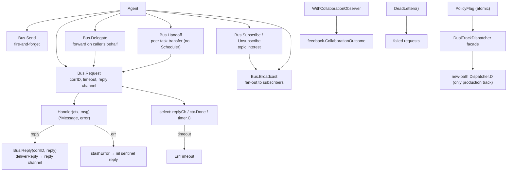

The `internal/agentipc` package (package `agentipc`) is the **IPC** pillar of
the ARES Kernel. It implements the peer-to-peer message bus on which
same-level cognitive processes (A ≡ B ≡ C) communicate, plus the
`PolicyFlag` / `DualTrackDispatcher` vocabulary. Production wires a single
Task Fabric path (`PolicyTaskFabric`, shadow off); the legacy leader track
was removed.

Design invariants (`ares-runtime.md` §13):

- Agents are same-level cognitive processes — A ≡ B ≡ C; parent/child does
  NOT restrict communication.
- IPC is the third context layer (Task Shared / Agent Private / **IPC
  Messages**): "I found X" / "help me verify Y" / "your conclusion conflicts
  with mine".
- Agents express intent (`Send` / `Request` / `Delegate` / `Handoff` /
  `Subscribe`); the Kernel enforces delivery.

## Responsibility

- Own the peer message bus (`Bus`): agent id → `Handler` map, topic →
  subscriber list, pending-request table keyed by correlation id.
- Provide the full IPC primitive set:
  - `Send` — fire-and-forget; handler invoked synchronously in the caller's
    goroutine.
  - `Request` / `Reply` — synchronous request/reply with correlation id
    pairing, per-request buffered reply channel, timeout → `ErrTimeout`.
  - `Delegate` — forward a request on the caller's behalf; target sees the
    delegator as `From`; original correlation id preserved end-to-end.
  - `Handoff` — peer-to-peer task ownership transfer; carries a structured
    payload (`task_id` + context snapshot + artifacts); receiver
    acknowledges; does NOT go through the Scheduler.
  - `Subscribe` / `Unsubscribe` — topic interest registration.
  - `Broadcast` — fire-and-forget fan-out to every subscriber of a topic;
    returns the count of successful deliveries.
- Provide the dual-track dispatch vocabulary (`PolicyFlag`, `DualTrackDispatcher`,
  `Dispatcher`): `PolicyLegacy` is retained as a library constant for config
  compatibility; `PolicyTaskFabric` is the only production policy. Production
  wires a nil legacy track and shadow off — the dispatch entry that routed by
  policy was removed (HTTP submits tasks to the Task Fabric directly; the
  kernel scheduler drains them).
- Provide collaboration observability: `WithCollaborationObserver` records
  Request/Delegate/Handoff receipts and Send delivery receipts for the
  evolution feedback loop; `DeadLetters()` exposes failed requests.

## Architecture



## External interfaces

```go
package agentipc

// --- Bus ---

type Bus struct {
    // mu sync.RWMutex — guards handlers, subscribers, pending, pendingErr
    // handlers map[string]Handler
    // subscribers map[string][]string
    // pending map[string]chan *Message  (buffered 1, keyed by correlation id)
    // pendingErr map[string]error
    // idSeq uint64
    // now func() time.Time
}
func NewBus() *Bus
func (b *Bus) WithClock(now func() time.Time) *Bus
func (b *Bus) WithLogger(logger *slog.Logger) *Bus
func (b *Bus) WithCollaborationObserver(obs CollaborationObserver) *Bus
func (b *Bus) DeadLetters() *DeadLetterStore
func (b *Bus) Register(agentID string, h Handler) error
func (b *Bus) Unregister(agentID string)

// --- Peer primitives (design §13 IPC) ---

func (b *Bus) Send(ctx context.Context, from, to, topic string, payload any) error
func (b *Bus) Request(ctx context.Context, from, to, topic string, payload any, timeout time.Duration) (*Message, error)
func (b *Bus) Reply(corrID string, reply *Message) error
func (b *Bus) Delegate(ctx context.Context, delegator, to, topic string, payload any, timeout time.Duration) (*Message, error)
func (b *Bus) Handoff(ctx context.Context, from, to, taskID string, contextSnapshot map[string]any, timeout time.Duration) (*Message, error)
func (b *Bus) Subscribe(agentID, topic string) error
func (b *Bus) Unsubscribe(agentID, topic string)
func (b *Bus) Broadcast(ctx context.Context, from, topic string, payload any) int

// --- Dual-track dispatch policy (P4 D4) ---

type ExecutionPolicy int
const (
    PolicyLegacy ExecutionPolicy = iota
    PolicyTaskFabric
)
type PolicyFlag struct {
    // v atomic.Int64 — 0 = legacy, 1 = task fabric
}
func NewPolicyFlag(initial ExecutionPolicy) *PolicyFlag
func (p *PolicyFlag) Set(policy ExecutionPolicy)
func (p *PolicyFlag) Active() ExecutionPolicy
func (p *PolicyFlag) IsLegacy() bool
func (p *PolicyFlag) IsTaskFabric() bool

type Dispatcher interface {
    D(ctx context.Context, agentID, taskID string, payload any) error
}
type DualTrackDispatcher struct {
    flag    *PolicyFlag
    legacy  Dispatcher
    newPath Dispatcher
    // shadow bool — facade state; the routing entry that used it was removed
}
func NewDualTrackDispatcher(flag *PolicyFlag, legacy, newPath Dispatcher, shadow bool) *DualTrackDispatcher
func (d *DualTrackDispatcher) SetShadow(shadow bool)
func (d *DualTrackDispatcher) SetNewPath(newPath Dispatcher)
func (d *DualTrackDispatcher) NewPath() Dispatcher

// --- Collaboration observer (feedback) ---

type CollaborationObserver interface {
    // receives feedback.CollaborationOutcome after each observed attempt
}
```

type Message struct {
    ID            string
    From          string
    To            string
    Topic         string
    CorrelationID string  // pairs reply with request; "" for fire-and-forget
    Payload       any
    At            time.Time
}
type Handler func(ctx context.Context, msg *Message) (*Message, error)

// --- Sentinel errors ---

var (
    ErrAgentNotRegistered
    ErrNoHandler
    ErrTimeout
    ErrInvalidMessage
    ErrHandlerPanic
)
```

## Key types and methods

| Type / Method | Purpose |
| --- | --- |
| `Bus` | Peer-to-peer IPC message bus; agent id → `Handler`, topic → subscribers, correlation id → pending reply. |
| `NewBus` / `WithClock` | Construct an empty bus; inject a deterministic clock for hermetic tests. |
| `Register` / `Unregister` | Associate a `Handler` with an agent id; re-registering replaces (idempotent for restart/resurrection). |
| `Send` | Fire-and-forget; handler invoked synchronously; no reply channel. |
| `Request` / `Reply` | Synchronous request/reply with correlation-id pairing, per-request buffered reply channel, and timeout → `ErrTimeout`. |
| `Delegate` | Forward a request on the caller's behalf; target sees the delegator as `From`. |
| `Handoff` | Peer-to-peer task ownership transfer; structured payload (`task_id` + context snapshot + artifacts); receiver acknowledges; does NOT go through the Scheduler. |
| `Subscribe` / `Unsubscribe` | Topic interest registration. |
| `Broadcast` | Fire-and-forget fan-out to every subscriber of a topic; returns successful delivery count. |
| `DeadLetters` / `WithCollaborationObserver` | Failed-request store and the collaboration receipt observer feeding the evolution feedback loop. |
| `PolicyFlag` | Atomic flag recording `PolicyLegacy` vs `PolicyTaskFabric`; production starts at `PolicyTaskFabric`. |
| `DualTrackDispatcher` / `Dispatcher` | Mutable dispatcher facade: `SetNewPath` / `SetShadow` for startup wiring; production has a nil legacy track. |
| `Message` / `Handler` | Unit of peer IPC and the delivery callback signature. |

## Module collaboration

- `agentipc` -> `internal/fabric/agent`: the bus addresses agents by
  `agentfabric.Agent.Identity`; `Children` provides the provenance graph for
  IPC policy.
- `agentipc` -> `internal/fabric/task`: `Handoff` is the peer-to-peer task
  transfer primitive that bypasses the Scheduler; production HTTP submits
  tasks to the Task Fabric directly and the kernel scheduler drains them.
- `agentipc` -> `internal/feedback` (via `CollaborationObserver`): Request /
  Send receipts feed the evolution collaboration channel without the bus
  importing the evolution layer.
- `agentipc` -> `internal/kernel` (System Runtime control plane): the bus and
  dispatcher are adopted as components (`Orchestrator.Adopt`); wiring in
  `cmd/ares/kernel.go` and `internal/ares_bootstrap/system_runtime_wiring.go`.

## Extension points

1. **Register an agent's handler** via `Bus.Register(agentID, handler)`; the
   handler receives `*Message` and may return a reply synchronously or call
   `Reply` asynchronously later.
2. **Observe collaboration outcomes** via `Bus.WithCollaborationObserver(obs)`
   so Request/Delegate/Handoff and Send receipts feed the evolution feedback
   loop; the bus stays a kernel primitive that does not import evolution.
3. **Record failed requests** via `Bus.DeadLetters()` for undeliverable /
   timed-out requests (observability and redelivery).
4. **Inject a deterministic clock** via `Bus.WithClock(now)` for hermetic
   tests of correlation-id pairing and timeouts.
5. **Test peer transfer** by `Handoff(from, to, taskID, snapshot, ttl)`:
   the receiver acknowledges, ownership moves peer-to-peer without going
   through the Scheduler.
6. **Contain handler panics** — a panicking handler returns `ErrHandlerPanic`
   to the caller instead of killing the process; optional `WithLogger` reports
   the panic.

## Bilingual status

This page is the English reference. A Chinese translation with identical
structure and technical content is published as `agentipc.zh.md`. All code
identifiers, type names, and signatures are kept in English in both files;
only the prose differs.

## Maturity

Production. The package is covered by `bus_test.go`,
`collaboration_observer_test.go`, `deadletter_test.go`, `trace_test.go`,
`e2e_spawn_ipc_test.go`, and `benchmark_test.go`. It implements the full
peer IPC primitive set and the dispatch-policy vocabulary, integrates with
the ARES Kernel via `internal/kernel` (System Runtime adoption), and exposes
no experimental markers.


