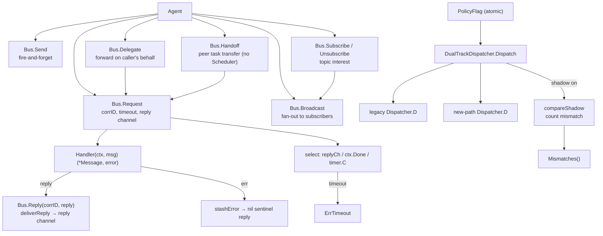

The `internal/agentipc` package (package `agentipc`) is the **IPC** pillar of
the ARES Kernel. It implements the peer-to-peer message bus on which
same-level cognitive processes (A ≡ B ≡ C) communicate, and the dual-track
dispatch policy that lets the legacy leader path and the new Task Fabric →
Scheduler → Agent path run side by side under a feature flag.

Design invariants (`ares-runtime.md` §13):

- Agents are same-level cognitive processes — A ≡ B ≡ C; parent/child does
  NOT restrict communication.
- IPC is the third context layer (Task Shared / Agent Private / **IPC
  Messages**): "I found X" / "help me verify Y" / "your conclusion conflicts
  with mine".
- Agents express intent (`Send` / `Request` / `Delegate` / `Handoff` /
  `Subscribe`); the Kernel enforces delivery.

## Responsibility

- Own the peer message bus (`Bus`): agent id → `Handler` map, topic →
  subscriber list, pending-request table keyed by correlation id.
- Provide the full IPC primitive set:
  - `Send` — fire-and-forget; handler invoked synchronously in the caller's
    goroutine.
  - `Request` / `Reply` — synchronous request/reply with correlation id
    pairing, per-request buffered reply channel, timeout → `ErrTimeout`.
  - `Delegate` — forward a request on the caller's behalf; target sees the
    delegator as `From`; original correlation id preserved end-to-end.
  - `Handoff` — peer-to-peer task ownership transfer; carries a structured
    payload (`task_id` + context snapshot + artifacts); receiver
    acknowledges; does NOT go through the Scheduler.
  - `Subscribe` / `Unsubscribe` — topic interest registration.
  - `Broadcast` — fire-and-forget fan-out to every subscriber of a topic;
    returns the count of successful deliveries.
- Provide the high-level collaboration patterns (v0.4.0 M1) as composition
  layers over the peer primitives — `DelegateToSpecialist` (delegation),
  `Pipeline` (A → B → C ordered execution), `Orchestrate` (coordinator fans
  out to multiple workers in parallel and aggregates results).
- Provide the dual-track dispatch policy (`PolicyFlag`, `DualTrackDispatcher`,
  `Dispatcher`): `PolicyLegacyLeader` (old leader+sub dispatch) and
  `PolicyTaskFabric` (new Kernel path) coexist; a `PolicyFlag` selects the
  active one atomically so a live flip takes effect on the next dispatch
  without restart.
- Provide shadow-mode equivalence verification: when shadow is on, the
  inactive path also runs and its outcome is compared with the active path's;
  `Mismatches()` surfaces the count (the "双轨等价" verification surface).

## Architecture



## External interfaces

```go
package agentipc

// --- Bus ---

type Bus struct {
    // mu sync.RWMutex — guards handlers, subscribers, pending, pendingErr
    // handlers map[string]Handler
    // subscribers map[string][]string
    // pending map[string]chan *Message  (buffered 1, keyed by correlation id)
    // pendingErr map[string]error
    // idSeq uint64
    // now func() time.Time
}
func NewBus() *Bus
func (b *Bus) WithClock(now func() time.Time) *Bus
func (b *Bus) Register(agentID string, h Handler) error
func (b *Bus) Unregister(agentID string)

// --- Peer primitives (design §13 IPC) ---

func (b *Bus) Send(ctx context.Context, from, to, topic string, payload any) error
func (b *Bus) Request(ctx context.Context, from, to, topic string, payload any, timeout time.Duration) (*Message, error)
func (b *Bus) Reply(corrID string, reply *Message) error
func (b *Bus) Delegate(ctx context.Context, delegator, to, topic string, payload any, timeout time.Duration) (*Message, error)
func (b *Bus) Handoff(ctx context.Context, from, to, taskID string, contextSnapshot map[string]any, timeout time.Duration) (*Message, error)
func (b *Bus) Subscribe(agentID, topic string) error
func (b *Bus) Unsubscribe(agentID, topic string)
func (b *Bus) Broadcast(ctx context.Context, from, topic string, payload any) int

// --- High-level collaboration patterns (v0.4.0 M1) ---

func (b *Bus) DelegateToSpecialist(ctx context.Context, delegator, specialist, taskID, specialization string, payload any, timeout time.Duration) (*Message, error)
func (b *Bus) Orchestrate(ctx context.Context, coordinator string, workers []string, taskID string, payload any, timeout time.Duration) ([]OrchestrationResult, error)

type Pipeline struct {
    bus     *Bus
    stages  []string
    timeout time.Duration
}
func NewPipeline(bus *Bus, stages []string, timeout time.Duration) (*Pipeline, error)
func (p *Pipeline) Run(ctx context.Context, from string, input any) (*Message, error)

type OrchestrationResult struct {
    Worker string
    Reply  *Message
    Err    error
}

// --- Dual-track dispatch policy (P4 D4) ---

type ExecutionPolicy int
const (
    PolicyLegacyLeader ExecutionPolicy = iota
    PolicyTaskFabric
)
type PolicyFlag struct {
    // v atomic.Int64 — 0 = legacy, 1 = task fabric
}
func NewPolicyFlag(initial ExecutionPolicy) *PolicyFlag
func (p *PolicyFlag) Set(policy ExecutionPolicy)
func (p *PolicyFlag) Active() ExecutionPolicy
func (p *PolicyFlag) IsLegacy() bool
func (p *PolicyFlag) IsTaskFabric() bool

type Dispatcher interface {
    D(ctx context.Context, agentID, taskID string, payload any) error
}
type DualTrackDispatcher struct {
    flag    *PolicyFlag
    legacy  Dispatcher
    newPath Dispatcher
    // shadow bool, mismatches int
}
func NewDualTrackDispatcher(flag *PolicyFlag, legacy, newPath Dispatcher, shadow bool) *DualTrackDispatcher
func (d *DualTrackDispatcher) Dispatch(ctx context.Context, agentID, taskID string, payload any) error
func (d *DualTrackDispatcher) SetShadow(shadow bool)
func (d *DualTrackDispatcher) SetNewPath(newPath Dispatcher)
func (d *DualTrackDispatcher) NewPath() Dispatcher
func (d *DualTrackDispatcher) Mismatches() int

// --- Message ---

type Message struct {
    ID            string
    From          string
    To            string
    Topic         string
    CorrelationID string  // pairs reply with request; "" for fire-and-forget
    Payload       any
    At            time.Time
}
type Handler func(ctx context.Context, msg *Message) (*Message, error)

// --- Sentinel errors ---

var (
    ErrAgentNotRegistered
    ErrNoHandler
    ErrTimeout
    ErrInvalidMessage
    ErrPipelineEmpty
    ErrNoWorkers
    ErrDispatcherNotRegistered
)
```

## Key types and methods

| Type / Method | Purpose |
| --- | --- |
| `Bus` | Peer-to-peer IPC message bus; agent id → `Handler`, topic → subscribers, correlation id → pending reply. |
| `NewBus` / `WithClock` | Construct an empty bus; inject a deterministic clock for hermetic tests. |
| `Register` / `Unregister` | Associate a `Handler` with an agent id; re-registering replaces (idempotent for restart/resurrection). |
| `Send` | Fire-and-forget; handler invoked synchronously; no reply channel. |
| `Request` / `Reply` | Synchronous request/reply with correlation-id pairing, per-request buffered reply channel, and timeout → `ErrTimeout`. |
| `Delegate` | Forward a request on the caller's behalf; target sees the delegator as `From`. |
| `Handoff` | Peer-to-peer task ownership transfer; structured payload (`task_id` + context snapshot + artifacts); receiver acknowledges; does NOT go through the Scheduler. |
| `Subscribe` / `Unsubscribe` | Topic interest registration. |
| `Broadcast` | Fire-and-forget fan-out to every subscriber of a topic; returns successful delivery count. |
| `DelegateToSpecialist` | Delegation pattern (v0.4.0 M1-1): Leader → Specialist with result return. |
| `Pipeline` / `NewPipeline` / `Run` | Pipeline pattern (v0.4.0 M1-2): A → B → C ordered execution, data flows via IPC. |
| `Orchestrate` | Orchestration pattern (v0.4.0 M1-3): coordinator fans out to multiple workers in parallel and aggregates results. |
| `PolicyFlag` | Atomic feature flag selecting `PolicyLegacyLeader` vs. `PolicyTaskFabric`; live flip takes effect on the next dispatch. |
| `DualTrackDispatcher` / `Dispatcher` | Dual-track dispatch: both paths coexist; `Dispatch` routes to the active one; shadow mode compares outcomes and counts mismatches. |
| `Message` / `Handler` | Unit of peer IPC and the delivery callback signature. |

## Module collaboration

- `agentipc` -> `internal/agentfabric`: the bus addresses agents by
  `agentfabric.Agent.Identity`; `Children` provides the provenance graph for
  IPC policy.
- `agentipc` -> `internal/taskfabric`: `Handoff` is the peer-to-peer task
  transfer primitive that bypasses the Scheduler; the new-path dispatcher
  routes through `taskfabric`.
- `agentipc` -> `internal/agents/leader`: the legacy dispatcher routes
  through the leader+sub dispatch path (`PolicyLegacyLeader`).
- `agentipc` -> `internal/system_runtime`: the bus is registered as a
  component and started/stopped by the Orchestrator.

## Extension points

1. **Register an agent's handler** via `Bus.Register(agentID, handler)`; the
   handler receives `*Message` and may return a reply synchronously or call
   `Reply` asynchronously later.
2. **Add a collaboration pattern** by composing the peer primitives — the
   three v0.4.0 M1 patterns (delegation / pipeline / orchestration) are
   composition layers on top of `Request` / `Reply` and do not change the
   bus primitives.
3. **Flip the dispatch policy live** via `PolicyFlag.Set(PolicyTaskFabric)`;
   the flag is read atomically so the flip takes effect on the next dispatch
   without restart. Flip shadow off in the same critical section to avoid
   double execution.
4. **Verify dual-track equivalence** by enabling shadow mode
   (`NewDualTrackDispatcher(..., shadow: true)`) while the legacy path is
   active: the new path runs in shadow, outcomes are compared, and
   `Mismatches()` surfaces the count.
5. **Inject a deterministic clock** via `Bus.WithClock(now)` for hermetic
   tests of correlation-id pairing and timeouts.
6. **Test peer transfer** by `Handoff(from, to, taskID, snapshot, ttl)`:
   the receiver acknowledges, ownership moves peer-to-peer without going
   through the Scheduler.

## Bilingual status

This page is the English reference. A Chinese translation with identical
structure and technical content is published as `agentipc.zh.md`. All code
identifiers, type names, and signatures are kept in English in both files;
only the prose differs.

## Maturity

Production. The package is covered by `bus_test.go`,
`collaboration_test.go`, `collaboration_bench_test.go`, and
`benchmark_test.go`. It implements the full peer IPC primitive set and the
dual-track dispatch policy, integrates with the ARES Kernel via
`system_runtime`, and exposes no experimental markers.


