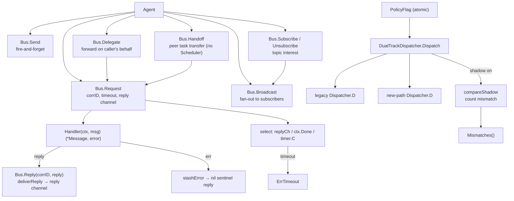

`internal/agentipc` 包（包名 `agentipc`）是 ARES Kernel 的 **IPC** 支柱。
它实现了同级认知进程（A ≡ B ≡ C）之间通信的对等消息总线，以及让旧
leader 路径与新 Task Fabric → Scheduler → Agent 路径在 feature flag 下并行
运行的双轨调度策略。

设计不变量（`ares-runtime.md` §13）：

- 智能体是同级认知进程——A ≡ B ≡ C；父子关系不限制通信。
- IPC 是第三层上下文（Task Shared / Agent Private / **IPC Messages**）：
  "我发现 X" / "帮我验证 Y" / "你的结论与我冲突"。
- 智能体表达意图（`Send` / `Request` / `Delegate` / `Handoff` /
  `Subscribe`），Kernel 强制投递。

## 职责

- 持有对等消息总线（`Bus`）：agent id → `Handler` 映射、topic → 订阅者
  列表、按 correlation id 索引的 pending-request 表。
- 提供完整 IPC 原语集：
  - `Send`——fire-and-forget；在调用方 goroutine 中同步调用 handler。
  - `Request` / `Reply`——同步请求/应答，correlation id 配对，每请求一个
    缓冲 reply channel，超时 → `ErrTimeout`。
  - `Delegate`——代为转发请求；目标看到 delegator 为 `From`；保留原始
    correlation id 端到端。
  - `Handoff`——对等任务所有权转移；结构化 payload（`task_id` + 上下文
    快照 + artifacts）；接收方确认；不经 Scheduler。
  - `Subscribe` / `Unsubscribe`——topic 兴趣注册。
  - `Broadcast`——向某 topic 的所有订阅者 fire-and-forget 扇出；返回成功
    投递计数。
- 提供高级协作模式（v0.4.0 M1）——在 peer 原语之上的组合层：
  `DelegateToSpecialist`（委托）、`Pipeline`（A → B → C 有序执行）、
  `Orchestrate`（coordinator 并行扇出到多个 worker 并聚合结果）。
- 提供双轨调度策略（`PolicyFlag`、`DualTrackDispatcher`、`Dispatcher`）：
  `PolicyLegacyLeader`（旧 leader+sub 派发）与 `PolicyTaskFabric`（新
  Kernel 路径）共存；`PolicyFlag` 原子选择活动路径，live flip 在下一次
  dispatch 生效，无需重启。
- 提供 shadow-mode 等价性验证：shadow 开启时，非活动路径也运行，并与活动
  路径比较结果；`Mismatches()` 暴露计数（"双轨等价"验证面）。

## 架构图



## 外部接口

```go
package agentipc

// --- Bus ---

type Bus struct {
    // mu sync.RWMutex — guards handlers, subscribers, pending, pendingErr
    // handlers map[string]Handler
    // subscribers map[string][]string
    // pending map[string]chan *Message  (buffered 1, keyed by correlation id)
    // pendingErr map[string]error
    // idSeq uint64
    // now func() time.Time
}
func NewBus() *Bus
func (b *Bus) WithClock(now func() time.Time) *Bus
func (b *Bus) Register(agentID string, h Handler) error
func (b *Bus) Unregister(agentID string)

// --- Peer primitives (design §13 IPC) ---

func (b *Bus) Send(ctx context.Context, from, to, topic string, payload any) error
func (b *Bus) Request(ctx context.Context, from, to, topic string, payload any, timeout time.Duration) (*Message, error)
func (b *Bus) Reply(corrID string, reply *Message) error
func (b *Bus) Delegate(ctx context.Context, delegator, to, topic string, payload any, timeout time.Duration) (*Message, error)
func (b *Bus) Handoff(ctx context.Context, from, to, taskID string, contextSnapshot map[string]any, timeout time.Duration) (*Message, error)
func (b *Bus) Subscribe(agentID, topic string) error
func (b *Bus) Unsubscribe(agentID, topic string)
func (b *Bus) Broadcast(ctx context.Context, from, topic string, payload any) int

// --- High-level collaboration patterns (v0.4.0 M1) ---

func (b *Bus) DelegateToSpecialist(ctx context.Context, delegator, specialist, taskID, specialization string, payload any, timeout time.Duration) (*Message, error)
func (b *Bus) Orchestrate(ctx context.Context, coordinator string, workers []string, taskID string, payload any, timeout time.Duration) ([]OrchestrationResult, error)

type Pipeline struct {
    bus     *Bus
    stages  []string
    timeout time.Duration
}
func NewPipeline(bus *Bus, stages []string, timeout time.Duration) (*Pipeline, error)
func (p *Pipeline) Run(ctx context.Context, from string, input any) (*Message, error)

type OrchestrationResult struct {
    Worker string
    Reply  *Message
    Err    error
}

// --- Dual-track dispatch policy (P4 D4) ---

type ExecutionPolicy int
const (
    PolicyLegacyLeader ExecutionPolicy = iota
    PolicyTaskFabric
)
type PolicyFlag struct {
    // v atomic.Int64 — 0 = legacy, 1 = task fabric
}
func NewPolicyFlag(initial ExecutionPolicy) *PolicyFlag
func (p *PolicyFlag) Set(policy ExecutionPolicy)
func (p *PolicyFlag) Active() ExecutionPolicy
func (p *PolicyFlag) IsLegacy() bool
func (p *PolicyFlag) IsTaskFabric() bool

type Dispatcher interface {
    D(ctx context.Context, agentID, taskID string, payload any) error
}
type DualTrackDispatcher struct {
    flag    *PolicyFlag
    legacy  Dispatcher
    newPath Dispatcher
    // shadow bool, mismatches int
}
func NewDualTrackDispatcher(flag *PolicyFlag, legacy, newPath Dispatcher, shadow bool) *DualTrackDispatcher
func (d *DualTrackDispatcher) Dispatch(ctx context.Context, agentID, taskID string, payload any) error
func (d *DualTrackDispatcher) SetShadow(shadow bool)
func (d *DualTrackDispatcher) SetNewPath(newPath Dispatcher)
func (d *DualTrackDispatcher) NewPath() Dispatcher
func (d *DualTrackDispatcher) Mismatches() int

// --- Message ---

type Message struct {
    ID            string
    From          string
    To            string
    Topic         string
    CorrelationID string  // pairs reply with request; "" for fire-and-forget
    Payload       any
    At            time.Time
}
type Handler func(ctx context.Context, msg *Message) (*Message, error)

// --- Sentinel errors ---

var (
    ErrAgentNotRegistered
    ErrNoHandler
    ErrTimeout
    ErrInvalidMessage
    ErrPipelineEmpty
    ErrNoWorkers
    ErrDispatcherNotRegistered
)
```

## 关键类型与方法

| 类型 / 方法 | 用途 |
| --- | --- |
| `Bus` | 对等 IPC 消息总线；agent id → `Handler`、topic → 订阅者、correlation id → pending reply。 |
| `NewBus` / `WithClock` | 构造空总线；注入确定性时钟用于密闭测试。 |
| `Register` / `Unregister` | 将 `Handler` 与 agent id 关联；重复注册替换（重启/复活幂等）。 |
| `Send` | Fire-and-forget；handler 同步调用；无 reply channel。 |
| `Request` / `Reply` | 同步请求/应答，correlation id 配对，每请求缓冲 reply channel，超时 → `ErrTimeout`。 |
| `Delegate` | 代为转发请求；目标看到 delegator 为 `From`；保留原始 correlation id 端到端。 |
| `Handoff` | 对等任务所有权转移；结构化 payload（`task_id` + 上下文快照 + artifacts）；接收方确认；不经 Scheduler。 |
| `Subscribe` / `Unsubscribe` | Topic 兴趣注册。 |
| `Broadcast` | 向某 topic 的所有订阅者 fire-and-forget 扇出；返回成功投递计数。 |
| `DelegateToSpecialist` | 委托模式（v0.4.0 M1-1）：Leader → Specialist 带结果返回。 |
| `Pipeline` / `NewPipeline` / `Run` | 流水线模式（v0.4.0 M1-2）：A → B → C 有序执行，数据经 IPC 流动。 |
| `Orchestrate` | 编排模式（v0.4.0 M1-3）：coordinator 并行扇出到多个 worker 并聚合结果。 |
| `PolicyFlag` | 原子 feature flag 选择 `PolicyLegacyLeader` vs. `PolicyTaskFabric`；live flip 下次 dispatch 生效。 |
| `DualTrackDispatcher` / `Dispatcher` | 双轨调度：两路径共存；`Dispatch` 路由到活动路径；shadow 模式比较结果并计数 mismatch。 |
| `Message` / `Handler` | 对等 IPC 单元与投递回调签名。 |

## 模块协作

- `agentipc` -> `internal/agentfabric`：总线按 `agentfabric.Agent.Identity`
  寻址；`Children` 为 IPC 策略提供溯源图。
- `agentipc` -> `internal/taskfabric`：`Handoff` 是绕过 Scheduler 的对等
  任务转移原语；新路径 dispatcher 经 `taskfabric` 路由。
- `agentipc` -> `internal/agents/leader`：旧 dispatcher 经 leader+sub 派发
  路径（`PolicyLegacyLeader`）。
- `agentipc` -> `internal/system_runtime`：总线作为组件被注册，由
  Orchestrator 启停。

## 扩展方式

1. **注册智能体 handler**：通过 `Bus.Register(agentID, handler)`；handler
   接收 `*Message`，可同步返回 reply，也可稍后异步调用 `Reply`。
2. **新增协作模式**：组合 peer 原语——v0.4.0 M1 的三个模式（委托/流水线/
   编排）是 `Request` / `Reply` 之上的组合层，不改变总线原语。
3. **Live flip 调度策略**：通过 `PolicyFlag.Set(PolicyTaskFabric)`；flag
   原子读取，flip 在下次 dispatch 生效，无需重启。在同一临界区关闭 shadow
   以避免双执行。
4. **验证双轨等价**：legacy 活动时开启 shadow
   （`NewDualTrackDispatcher(..., shadow: true)`）：新路径在 shadow 中
   运行，结果被比较，`Mismatches()` 暴露计数。
5. **注入确定性时钟**：通过 `Bus.WithClock(now)` 对 correlation id 配对
   与超时进行密闭测试。
6. **测试对等转移**：通过 `Handoff(from, to, taskID, snapshot, ttl)`：
   接收方确认，所有权对等移动，不经 Scheduler。

## 双语状态

本页为英文参考的结构镜像中文版。所有代码标识符、类型名与签名在两份文件中均
保持英文，仅叙述性文字不同。英文版发布为 `agentipc.en.md`。

## 成熟度

Production。该包由 `bus_test.go`、`collaboration_test.go`、
`collaboration_bench_test.go`、`benchmark_test.go` 覆盖。它实现了完整的
peer IPC 原语集与双轨调度策略，通过 `system_runtime` 集成进 ARES Kernel，
且不含任何实验性标记。


