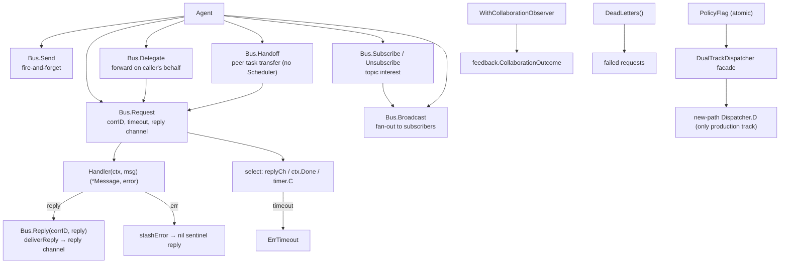

`internal/agentipc` 包（包名 `agentipc`）是 ARES Kernel 的 **IPC** 支柱。
它实现了同级认知进程（A ≡ B ≡ C）之间通信的对等消息总线，以及
`PolicyFlag` / `DualTrackDispatcher` 策略词表。生产仅接线 Task Fabric 路径
（`PolicyTaskFabric`，shadow 关闭）；旧 leader 轨道已删除。

设计不变量（`ares-runtime.md` §13）：

- 智能体是同级认知进程——A ≡ B ≡ C；父子关系不限制通信。
- IPC 是第三层上下文（Task Shared / Agent Private / **IPC Messages**）：
  "我发现 X" / "帮我验证 Y" / "你的结论与我冲突"。
- 智能体表达意图（`Send` / `Request` / `Delegate` / `Handoff` /
  `Subscribe`），Kernel 强制投递。

## 职责

- 持有对等消息总线（`Bus`）：agent id → `Handler` 映射、topic → 订阅者
  列表、按 correlation id 索引的 pending-request 表。
- 提供完整 IPC 原语集：
  - `Send`——fire-and-forget；在调用方 goroutine 中同步调用 handler。
  - `Request` / `Reply`——同步请求/应答，correlation id 配对，每请求一个
    缓冲 reply channel，超时 → `ErrTimeout`。
  - `Delegate`——代为转发请求；目标看到 delegator 为 `From`；保留原始
    correlation id 端到端。
  - `Handoff`——对等任务所有权转移；结构化 payload（`task_id` + 上下文
    快照 + artifacts）；接收方确认；不经 Scheduler。
  - `Subscribe` / `Unsubscribe`——topic 兴趣注册。
  - `Broadcast`——向某 topic 的所有订阅者 fire-and-forget 扇出；返回成功
    投递计数。
- 提供双轨调度策略词表（`PolicyFlag`、`DualTrackDispatcher`、
  `Dispatcher`）：`PolicyLegacy` 作为库常量保留以兼容配置；
  `PolicyTaskFabric` 是唯一生产策略。生产接线 nil legacy 轨道且 shadow 关闭
  ——按策略路由的 dispatch 入口已删除（HTTP 直接向 Task Fabric 提交任务，
  内核调度器排空）。
- 提供协作观测：`WithCollaborationObserver` 记录 Request/Delegate/Handoff
  回执与 Send 投递回执供进化反馈使用；`DeadLetters()` 暴露失败请求。

## 架构图



## 外部接口

```go
package agentipc

// --- Bus ---

type Bus struct {
    // mu sync.RWMutex — guards handlers, subscribers, pending, pendingErr
    // handlers map[string]Handler
    // subscribers map[string][]string
    // pending map[string]chan *Message  (buffered 1, keyed by correlation id)
    // pendingErr map[string]error
    // idSeq uint64
    // now func() time.Time
}
func NewBus() *Bus
func (b *Bus) WithClock(now func() time.Time) *Bus
func (b *Bus) WithLogger(logger *slog.Logger) *Bus
func (b *Bus) WithCollaborationObserver(obs CollaborationObserver) *Bus
func (b *Bus) DeadLetters() *DeadLetterStore
func (b *Bus) Register(agentID string, h Handler) error
func (b *Bus) Unregister(agentID string)

// --- Peer primitives (design §13 IPC) ---

func (b *Bus) Send(ctx context.Context, from, to, topic string, payload any) error
func (b *Bus) Request(ctx context.Context, from, to, topic string, payload any, timeout time.Duration) (*Message, error)
func (b *Bus) Reply(corrID string, reply *Message) error
func (b *Bus) Delegate(ctx context.Context, delegator, to, topic string, payload any, timeout time.Duration) (*Message, error)
func (b *Bus) Handoff(ctx context.Context, from, to, taskID string, contextSnapshot map[string]any, timeout time.Duration) (*Message, error)
func (b *Bus) Subscribe(agentID, topic string) error
func (b *Bus) Unsubscribe(agentID, topic string)
func (b *Bus) Broadcast(ctx context.Context, from, topic string, payload any) int

// --- Dual-track dispatch policy (P4 D4) ---

type ExecutionPolicy int
const (
    PolicyLegacy ExecutionPolicy = iota
    PolicyTaskFabric
)
type PolicyFlag struct {
    // v atomic.Int64 — 0 = legacy, 1 = task fabric
}
func NewPolicyFlag(initial ExecutionPolicy) *PolicyFlag
func (p *PolicyFlag) Set(policy ExecutionPolicy)
func (p *PolicyFlag) Active() ExecutionPolicy
func (p *PolicyFlag) IsLegacy() bool
func (p *PolicyFlag) IsTaskFabric() bool

type Dispatcher interface {
    D(ctx context.Context, agentID, taskID string, payload any) error
}
type DualTrackDispatcher struct {
    flag    *PolicyFlag
    legacy  Dispatcher
    newPath Dispatcher
    // shadow bool — facade state; the routing entry that used it was removed
}
func NewDualTrackDispatcher(flag *PolicyFlag, legacy, newPath Dispatcher, shadow bool) *DualTrackDispatcher
func (d *DualTrackDispatcher) SetShadow(shadow bool)
func (d *DualTrackDispatcher) SetNewPath(newPath Dispatcher)
func (d *DualTrackDispatcher) NewPath() Dispatcher

// --- Collaboration observer (feedback) ---

type CollaborationObserver interface {
    // receives feedback.CollaborationOutcome after each observed attempt
}

// --- Message ---

type Message struct {
    ID            string
    From          string
    To            string
    Topic         string
    CorrelationID string  // pairs reply with request; "" for fire-and-forget
    Payload       any
    At            time.Time
}
type Handler func(ctx context.Context, msg *Message) (*Message, error)

// --- Sentinel errors ---

var (
    ErrAgentNotRegistered
    ErrNoHandler
    ErrTimeout
    ErrInvalidMessage
    ErrHandlerPanic
)
```

## 关键类型与方法

| 类型 / 方法 | 用途 |
| --- | --- |
| `Bus` | 对等 IPC 消息总线；agent id → `Handler`、topic → 订阅者、correlation id → pending reply。 |
| `NewBus` / `WithClock` | 构造空总线；注入确定性时钟用于密闭测试。 |
| `Register` / `Unregister` | 将 `Handler` 与 agent id 关联；重复注册替换（重启/复活幂等）。 |
| `Send` | Fire-and-forget；handler 同步调用；无 reply channel。 |
| `Request` / `Reply` | 同步请求/应答，correlation id 配对，每请求缓冲 reply channel，超时 → `ErrTimeout`。 |
| `Delegate` | 代为转发请求；目标看到 delegator 为 `From`；保留原始 correlation id 端到端。 |
| `Handoff` | 对等任务所有权转移；结构化 payload（`task_id` + 上下文快照 + artifacts）；接收方确认；不经 Scheduler。 |
| `Subscribe` / `Unsubscribe` | Topic 兴趣注册。 |
| `Broadcast` | 向某 topic 的所有订阅者 fire-and-forget 扇出；返回成功投递计数。 |
| `DeadLetters` / `WithCollaborationObserver` | 失败请求存储与协作回执观察器，喂给进化反馈回路。 |
| `PolicyFlag` | 原子 flag 记录 `PolicyLegacy` vs `PolicyTaskFabric`；生产始于 `PolicyTaskFabric`。 |
| `DualTrackDispatcher` / `Dispatcher` | 可变 dispatcher facade：`SetNewPath` / `SetShadow` 用于启动接线；生产 legacy 为 nil。 |
| `Message` / `Handler` | 对等 IPC 单元与投递回调签名。 |

## 模块协作

- `agentipc` -> `internal/fabric/agent`：总线按 `agentfabric.Agent.Identity`
  寻址；`Children` 为 IPC 策略提供溯源图。
- `agentipc` -> `internal/fabric/task`：`Handoff` 是绕过 Scheduler 的对等
  任务转移原语；生产 HTTP 直接向 Task Fabric 提交任务，内核调度器排空。
- `agentipc` -> `internal/feedback`（经 `CollaborationObserver`）：Request /
  Send 回执喂给进化协作通道，总线不导入 evolution 层。
- `agentipc` -> `internal/kernel`（System Runtime 控制面）：总线与
  dispatcher 经 `Orchestrator.Adopt` 注册为组件；接线在
  `cmd/ares/kernel.go` 与 `internal/ares_bootstrap/system_runtime_wiring.go`。

## 扩展方式

1. **注册智能体 handler**：通过 `Bus.Register(agentID, handler)`；handler
   接收 `*Message`，可同步返回 reply，也可稍后异步调用 `Reply`。
2. **观测协作结果**：通过 `Bus.WithCollaborationObserver(obs)`，使
   Request/Delegate/Handoff 与 Send 回执喂给进化反馈回路；总线不导入
   evolution。
3. **记录失败请求**：通过 `Bus.DeadLetters()` 暴露不可达 / 超时请求
  （观测与重投递）。
4. **注入确定性时钟**：通过 `Bus.WithClock(now)` 对 correlation id 配对
  与超时进行密闭测试。
5. **测试对等转移**：通过 `Handoff(from, to, taskID, snapshot, ttl)`：
   接收方确认，所有权对等移动，不经 Scheduler。
6. **遏制 handler panic** —— panic 的 handler 向调用方返回
   `ErrHandlerPanic` 而非杀死进程；可选 `WithLogger` 报告 panic。

## 双语状态

本页为英文参考的结构镜像中文版。所有代码标识符、类型名与签名在两份文件中均
保持英文，仅叙述性文字不同。英文版发布为 `agentipc.en.md`。

## 成熟度

Production。该包由 `bus_test.go`、`collaboration_observer_test.go`、
`deadletter_test.go`、`trace_test.go`、`e2e_spawn_ipc_test.go`、
`benchmark_test.go` 覆盖。它实现了完整的 peer IPC 原语集与调度策略词表，
经 `internal/kernel`（System Runtime 采纳）集成进 ARES Kernel，且不含任何
实验性标记。


