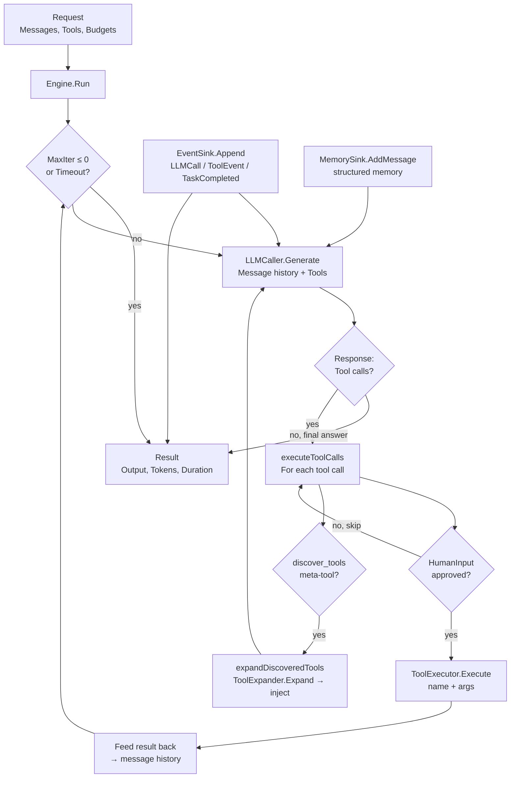

The `internal/agentloop` package (package `agentloop`) provides the **ReAct
(reason+act) execution loop** — the core iterative engine that drives an
agent's reasoning and tool-use cycle. It was extracted from `sdk.Agent.Run`
into an independently testable unit with mock LLM, mock tools, mock events,
and mock memory.

The loop follows a strict **iterate → generate → tool-call → feed-back**
pattern:

1. **Iterate**: repeat until the LLM produces a final answer or a budget is
   exhausted.
2. **Generate**: call the LLM with the accumulated message history and
   available tools.
3. **Tool-call**: inspect the LLM response for tool calls; execute each via
   the `ToolExecutor`.
4. **Feed-back**: append tool results to the message history and loop back
   to step 2.

## Responsibility

- Drive the ReAct loop with configurable budgets: `MaxIter` (default 10),
  `MaxTokens` (per-iteration), and `Timeout` (total wall-clock budget).
- Invoke the LLM via `LLMCaller.Generate` with the full message history,
  tool definitions, and iteration-specific token budget.
- Execute tool calls via `ToolExecutor.Execute` sequentially, feeding each
  result back into the message history.
- Support **runtime tool discovery** via the `ToolExpander` interface: when
  the LLM calls the meta-tool `discover_tools`, the engine extracts the
  requested tool names, calls `ToolExpander.Expand`, and injects the
  expanded tool definitions into the next LLM turn.
- Support **human-in-the-loop** approval via `HumanInputFunc`: before each
  tool call, the user can approve or reject it; the engine waits for the
  decision.
- Persist structured memory via `MemorySink.AddMessage` and `structuredMemorySink`
  for full round-trip memory (session/role/content).
- Emit every LLM call, tool event, and completion as structured events via
  `EventSink.Append`.
- Return a `Result` with the final output, tool-call count, memory usage
  flag, token consumption, and wall-clock duration.

## Architecture



## External interfaces

```go
package agentloop

const DefaultMaxIterations = 10
const DiscoverToolsName = "discover_tools"

// --- Engine ---

type Engine struct {
    LLM            LLMCaller
    Tools          ToolExecutor
    Events         EventSink
    Memory         MemorySink
    Tracer         func(format string, args ...any)
    MemEnabled     bool
    DistillEnabled bool
}

// --- Request / Result ---

type Request struct {
    Messages     []*core.LLMMessage
    Tools        []core.Tool
    MaxIter      int
    MaxTokens    int
    Timeout      time.Duration
    AgentName    string
    SessionID    string
    Input        string
    HumanInput   HumanInputFunc
    ToolExpander ToolExpander
}

type Result struct {
    Output       string
    ToolCalls    int
    MemoryUsed   bool
    InputTokens  int
    OutputTokens int
    Duration     time.Duration
}

// --- Interfaces ---

type HumanInputFunc func(ctx context.Context, toolName string, args map[string]any) (bool, error)

type LLMCaller interface {
    Generate(ctx context.Context, req *core.GenerateRequest) (*core.GenerateResponse, error)
    GetProvider() core.LLMProvider
}

type ToolExecutor interface {
    Execute(ctx context.Context, name string, args map[string]any) (tools.Result, error)
}

type ToolExpander interface {
    Expand(ctx context.Context, names []string) ([]core.Tool, error)
}

type EventSink interface {
    Append(ctx context.Context, streamID string, events []*ares_events.Event, expectedVersion int64) error
}

type MemorySink interface {
    AddMessage(ctx context.Context, sessionID, role, content string) error
}

// --- Main entry point ---

func (e *Engine) Run(ctx context.Context, req *Request) (*Result, error)

// --- Helper ---

func FriendlyErr(scope string, provider core.LLMProvider, origErr error) error
```

## Key types and methods

| Type / Method | Purpose |
| --- | --- |
| `Engine` | Stateless ReAct loop engine. Fields: `LLM`, `Tools`, `Events`, `Memory`, `Tracer`, `MemEnabled`, `DistillEnabled`. Designed to be wired with mock implementations for independent testing. |
| `Run` | The main entry point. Executes the ReAct loop: generate → tool-call → feed-back → repeat until final answer, budget exhaustion, or timeout. Returns `Result` with output, token counts, and duration. |
| `Request` | Encapsulates the full input: message history, available tools, iteration/token/timeout budgets, agent/session identification, human-in-the-loop function, and runtime tool expander. |
| `Result` | Structured output: final answer text, tool-call count, memory usage flag, input/output token counts, and wall-clock duration. |
| `LLMCaller` | Generates LLM responses. Called once per iteration with the full message history and tool definitions. |
| `ToolExecutor` | Executes a single tool call. Invoked per tool call in the LLM response. |
| `ToolExpander` | Expands a set of requested tool names into full `core.Tool` definitions. Used by runtime tool discovery. |
| `EventSink` | Persists structured events (LLM call, tool event, task completed) to durable storage with optimistic concurrency control (`expectedVersion`). |
| `MemorySink` | Persists structured memory (session, role, content) for agent memory recall across turns. |
| `HumanInputFunc` | Human-in-the-loop approval function. Invoked before each tool call; returns `true` to execute or `false` to skip. |
| `FriendlyErr` | Wraps an LLM error with a human-readable scope identifier and provider name for observability. |

## Module collaboration

- `agentloop` -> `internal/llm` (via `LLMCaller`): generates LLM responses with the full message history and tool definitions.
- `agentloop` -> `internal/tools` (via `ToolExecutor`): executes tool calls and feeds results back into the loop.
- `agentloop` -> `internal/ares_events` (via `EventSink`): emits structured events for every LLM call, tool execution, and task completion.
- `agentloop` -> `internal/ares_memory` (via `MemorySink`): persists structured memory for agent recall across iterations.
- `agentloop` -> `internal/core` (via `core.LLMMessage`, `core.GenerateRequest`, `core.GenerateResponse`, `core.Tool`, `core.ToolCall`, `core.LLMProvider`): shares core model types.

## Extension points

1. **Replace the LLM backend** by implementing `LLMCaller` with any provider; the engine is provider-agnostic and only depends on `core.GenerateRequest` / `core.GenerateResponse`.
2. **Add human-in-the-loop approval** by providing a `HumanInputFunc`; the engine pauses before each tool call and waits for the decision.
3. **Enable runtime tool discovery** by wiring a `ToolExpander`; when the LLM calls `discover_tools`, the engine extracts the requested names, expands them, and injects the definitions into the next turn.
4. **Instrument the loop** via the `Tracer` field; every significant event (iteration, tool call, discovery) is traced.
5. **Customise budgets** per request: `MaxIter` (default 10), `MaxTokens` (per-iteration), and `Timeout` (total wall-clock budget). Return a `Result` with the final output, tool-call count, memory usage flag, token consumption, and wall-clock duration.

## Bilingual status

This page is the English reference. A Chinese translation with identical structure and technical content is published as `agentloop.zh.md`. All code identifiers, type names, and signatures are kept in English in both files; only the prose differs.

## Maturity

Production. The package is extracted from production `sdk.Agent.Run` into an independently testable unit with mock LLM, mock tools, mock events, and mock memory. It exposes no experimental markers.


