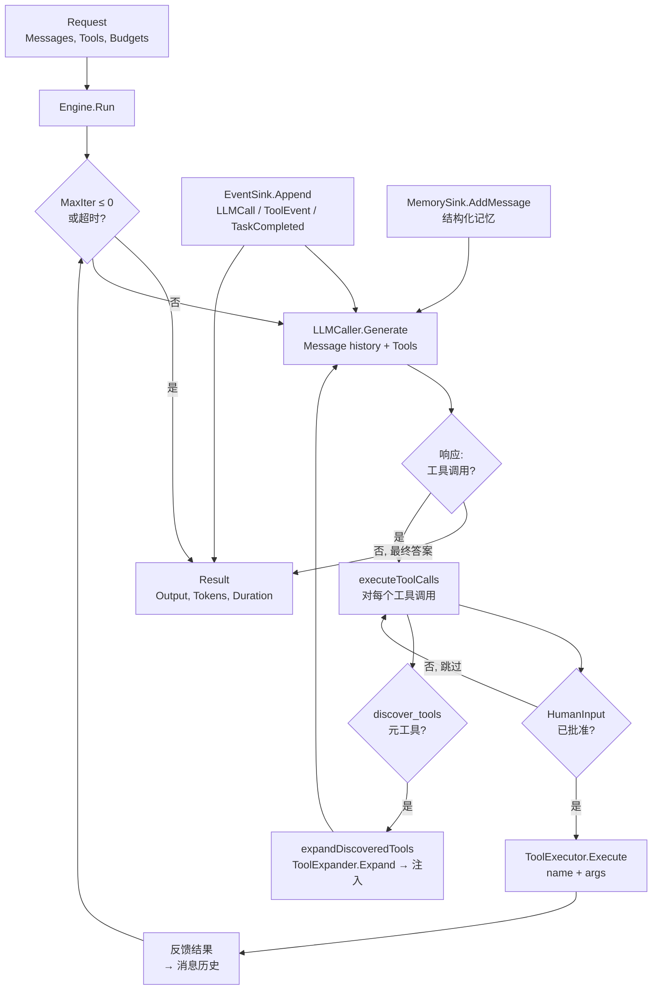

`internal/agentloop` 包（package `agentloop`）提供了 **ReAct（推理+行动）执行循环**
——驱动 Agent 推理和工具使用周期的核心迭代引擎。它从 `sdk.Agent.Run` 中提取出来，成为
一个可独立测试的单元，支持 Mock LLM、Mock 工具、Mock 事件和 Mock 记忆。

该循环遵循严格的 **迭代 → 生成 → 工具调用 → 反馈** 模式：

1. **迭代**：重复直到 LLM 生成最终答案或预算耗尽。
2. **生成**：使用累积的消息历史和可用工具调用 LLM。
3. **工具调用**：检查 LLM 响应中的工具调用；通过 `ToolExecutor` 执行每个调用。
4. **反馈**：将工具结果追加到消息历史中，回到步骤 2。

## 职责

- 使用可配置的预算驱动 ReAct 循环：`MaxIter`（默认 10）、`MaxTokens`（每次迭代）和
  `Timeout`（总挂钟时间预算）。
- 通过 `LLMCaller.Generate` 调用 LLM，传入完整消息历史、工具定义和迭代特定的 Token 预算。
- 通过 `ToolExecutor.Execute` 顺序执行工具调用，将每个结果反馈回消息历史。
- 支持**运行时工具发现**：通过 `ToolExpander` 接口，当 LLM 调用元工具 `discover_tools`
  时，引擎提取请求的工具名称，调用 `ToolExpander.Expand`，并将展开的工具定义注入下一轮
  LLM 调用。
- 支持**人工审批**：通过 `HumanInputFunc`，在每次工具调用前，用户可以批准或拒绝；引擎
  等待决策。
- 通过 `MemorySink.AddMessage` 和 `structuredMemorySink` 持久化结构化记忆，实现完整的
  往返记忆（session/role/content）。
- 通过 `EventSink.Append` 将每次 LLM 调用、工具事件和完成事件作为结构化事件发出。
- 返回 `Result`，包含最终输出、工具调用次数、记忆使用标志、Token 消耗和挂钟时间。

## 架构



## 外部接口

```go
package agentloop

const DefaultMaxIterations = 10
const DiscoverToolsName = "discover_tools"

// --- Engine ---

type Engine struct {
    LLM            LLMCaller
    Tools          ToolExecutor
    Events         EventSink
    Memory         MemorySink
    Tracer         func(format string, args ...any)
    MemEnabled     bool
    DistillEnabled bool
}

// --- Request / Result ---

type Request struct {
    Messages     []*core.LLMMessage
    Tools        []core.Tool
    MaxIter      int
    MaxTokens    int
    Timeout      time.Duration
    AgentName    string
    SessionID    string
    Input        string
    HumanInput   HumanInputFunc
    ToolExpander ToolExpander
}

type Result struct {
    Output       string
    ToolCalls    int
    MemoryUsed   bool
    InputTokens  int
    OutputTokens int
    Duration     time.Duration
}

// --- Interfaces ---

type HumanInputFunc func(ctx context.Context, toolName string, args map[string]any) (bool, error)

type LLMCaller interface {
    Generate(ctx context.Context, req *core.GenerateRequest) (*core.GenerateResponse, error)
    GetProvider() core.LLMProvider
}

type ToolExecutor interface {
    Execute(ctx context.Context, name string, args map[string]any) (tools.Result, error)
}

type ToolExpander interface {
    Expand(ctx context.Context, names []string) ([]core.Tool, error)
}

type EventSink interface {
    Append(ctx context.Context, streamID string, events []*ares_events.Event, expectedVersion int64) error
}

type MemorySink interface {
    AddMessage(ctx context.Context, sessionID, role, content string) error
}

// --- Main entry point ---

func (e *Engine) Run(ctx context.Context, req *Request) (*Result, error)

// --- Helper ---

func FriendlyErr(scope string, provider core.LLMProvider, origErr error) error
```

## 关键类型与方法

| 类型 / 方法 | 用途 |
| --- | --- |
| `Engine` | 无状态 ReAct 循环引擎。字段：`LLM`、`Tools`、`Events`、`Memory`、`Tracer`、`MemEnabled`、`DistillEnabled`。设计为可注入 Mock 实现进行独立测试。 |
| `Run` | 主入口。执行 ReAct 循环：生成 → 工具调用 → 反馈 → 重复，直到最终答案、预算耗尽或超时。返回 `Result`，包含输出、Token 计数和持续时间。 |
| `Request` | 封装完整输入：消息历史、可用工具、迭代/Token/超时预算、Agent/会话标识、人工审批函数和运行时工具展开器。 |
| `Result` | 结构化输出：最终答案文本、工具调用次数、记忆使用标志、输入/输出 Token 计数和挂钟时间。 |
| `LLMCaller` | 生成 LLM 响应。每次迭代调用一次，传入完整消息历史和工具定义。 |
| `ToolExecutor` | 执行单个工具调用。为 LLM 响应中的每个工具调用调用一次。 |
| `ToolExpander` | 将请求的工具名称集合展开为完整的 `core.Tool` 定义。用于运行时工具发现。 |
| `EventSink` | 将结构化事件（LLM 调用、工具事件、任务完成）持久化到可靠存储，支持乐观并发控制（`expectedVersion`）。 |
| `MemorySink` | 持久化结构化记忆（session、role、content），用于 Agent 跨轮次记忆回放。 |
| `HumanInputFunc` | 人工审批函数。在每次工具调用前调用；返回 `true` 执行，`false` 跳过。 |
| `FriendlyErr` | 将 LLM 错误包装为人类可读的作用域标识符和提供者名称，用于可观测性。 |

## 模块协作

- `agentloop` -> `internal/llm`（通过 `LLMCaller`）：使用完整消息历史和工具定义生成 LLM 响应。
- `agentloop` -> `internal/tools`（通过 `ToolExecutor`）：执行工具调用并将结果反馈到循环中。
- `agentloop` -> `internal/ares_events`（通过 `EventSink`）：为每次 LLM 调用、工具执行和任务完成发出结构化事件。
- `agentloop` -> `internal/ares_memory`（通过 `MemorySink`）：持久化结构化记忆，用于 Agent 跨迭代回放。
- `agentloop` -> `internal/core`（通过 `core.LLMMessage`、`core.GenerateRequest`、`core.GenerateResponse`、`core.Tool`、`core.ToolCall`、`core.LLMProvider`）：共享核心模型类型。

## 扩展点

1. **替换 LLM 后端**：实现 `LLMCaller` 接口，引擎与提供者无关，仅依赖 `core.GenerateRequest` / `core.GenerateResponse`。
2. **添加人工审批**：提供 `HumanInputFunc`，引擎在每次工具调用前暂停并等待决策。
3. **启用运行时工具发现**：接入 `ToolExpander`，当 LLM 调用 `discover_tools` 时，引擎提取请求的名称，展开并注入定义到下一轮。
4. **检测循环**：通过 `Tracer` 字段，每次重要事件（迭代、工具调用、发现）都被追踪。
5. **自定义预算**：每个请求的 `MaxIter`（默认 10）、`MaxTokens`（每次迭代）和 `Timeout`（总挂钟时间预算）。

## 双语状态

本页为中文翻译。英文参考以相同结构和内容发布为 `agentloop.en.md`。所有代码标识符、类型名和签名在两种语言中都保持英文；仅散文部分不同。

## 成熟度

Production。该包从生产环境的 `sdk.Agent.Run` 中提取，成为可独立测试的单元，支持 Mock LLM、Mock 工具、Mock 事件和 Mock 记忆。无实验性标记。


