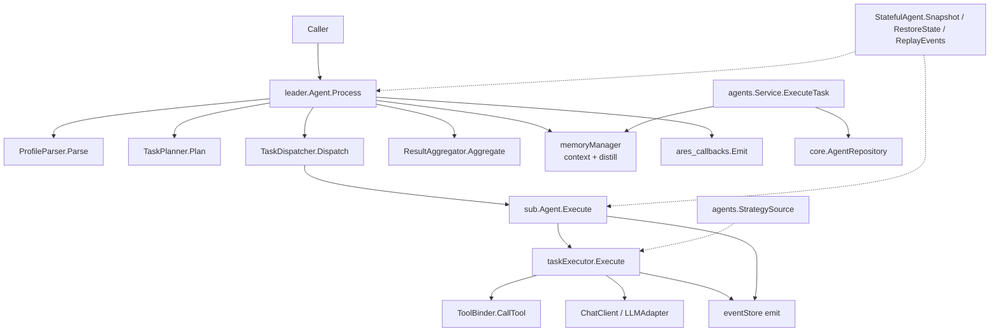

The `internal/agents` tree provides the concrete agent implementations used by
the runtime. `base` defines the shared `Agent` interface and lifecycle event
types. `leader` implements the orchestration agent (parse profile, plan,
dispatch, aggregate). `sub` implements the task-executing worker agent with
tool binding and an LLM-backed executor. The top-level `agents` package adds
the agent `Service` (CRUD + task execution) and the shared `StrategySource`
contract that lets live agents be steered by the evolution engine.

## Responsibility

- Define the `base.Agent` interface (`ID`, `Type`, `Status`, `Start`, `Stop`,
  `Process`, `ProcessStream`) and the optional `Messenger`, `Heartbeater`, and
  `StatefulAgent` capabilities.
- Implement `leader.Agent`: a four-step pipeline (parse, plan, dispatch,
  aggregate) with memory context, distillation, feedback recording, event
  sourcing, and snapshot/restore for resurrection.
- Implement `sub.Agent`: a worker that executes `*models.Task` via a
  `TaskExecutor`, binds tools through a `ToolBinder`, and emits
  `TaskCreated` / `TaskCompleted` / `TaskFailed` events.
- Provide `agents.Service` for agent CRUD and `ExecuteTask` against a
  `core.AgentRepository` with optional memory context.
- Expose `agents.StrategySource` so the evolution engine can override an
  agent's prompt template and LLM params at runtime.

## Architecture



## External interfaces

```go
// internal/agents/base
type Agent interface {
    ID() string
    Type() models.AgentType
    Status() models.AgentStatus
    Start(ctx context.Context) error
    Stop(ctx context.Context) error
    Process(ctx context.Context, input any) (any, error)
    ProcessStream(ctx context.Context, input any) (<-chan AgentEvent, error)
}

type Messenger interface {
    SendMessage(ctx context.Context, msg *ahp.AHPMessage) error
    ReceiveMessage(ctx context.Context) (*ahp.AHPMessage, error)
}

type Heartbeater interface {
    Heartbeat(ctx context.Context) error
    IsAlive() bool
}

type StatefulAgent interface {
    RestoreState(state map[string]any) error
    ReplayEvents(events []*ares_events.Event) error
    Snapshot() (map[string]any, error)
}

type SnapshotStore interface {
    Save(ctx context.Context, agentID string, snapshot map[string]any) error
    Load(ctx context.Context, agentID string) (map[string]any, error)
    Delete(ctx context.Context, agentID string) error
}

type EventType int
const (
    EventPlanning EventType = iota
    EventTaskStart
    EventTaskProgress
    EventTaskComplete
    EventAggregating
    EventComplete
    EventError
)
type AgentEvent struct {
    Type   EventType
    Source string
    Data   any
    Err    error
}
type Config struct {
    ID                string
    Type              models.AgentType
    HeartbeatInterval time.Duration
    MaxRetries        int
    Timeout           time.Duration
}
func DefaultConfig(agentType models.AgentType) *Config

// internal/agents (shared strategy + service)
type ActiveStrategy struct {
    ID     string
    Prompt string
    Params map[string]any
}
type StrategySource interface {
    GetActiveStrategy(ctx context.Context) (*ActiveStrategy, error)
}

type Service struct {
    repo      core.AgentRepository
    memoryMgr memory.MemoryManager
    config    *core.BaseConfig
}
type Config struct {
    BaseConfig *core.BaseConfig
    MemoryMgr  memory.MemoryManager
    Repo       core.AgentRepository
}
func NewService(config *Config) (*Service, error)
func (s *Service) CreateAgent(ctx context.Context, agentConfig *core.AgentConfig) (*core.Agent, error)
func (s *Service) GetAgent(ctx context.Context, agentID string) (*core.Agent, error)
func (s *Service) UpdateAgent(ctx context.Context, agentID string, updates map[string]interface{}) (*core.Agent, error)
func (s *Service) DeleteAgent(ctx context.Context, agentID string) error
func (s *Service) ListAgents(ctx context.Context, filter *core.AgentFilter) ([]*core.Agent, *core.PaginationResponse, error)
func (s *Service) ExecuteTask(ctx context.Context, task *core.Task) (*core.TaskResult, error)
func (s *Service) GetTaskResult(ctx context.Context, taskID string) (*core.TaskResult, error)

// internal/agents/leader
type Agent interface{ base.Agent }

type ProfileParser interface {
    Parse(ctx context.Context, input string) (*models.UserProfile, error)
}
type TaskPlanner interface {
    Plan(ctx context.Context, profile *models.UserProfile, inputText string) ([]*models.Task, error)
    Replan(ctx context.Context, profile *models.UserProfile, inputText string, previousResult *models.RecommendResult, feedback string) ([]*models.Task, error)
}
type TaskDispatcher interface {
    Dispatch(ctx context.Context, tasks []*models.Task) ([]*models.TaskResult, error)
    RegisterExecutor(agentType models.AgentType, fn func(ctx context.Context, task *models.Task) (*models.TaskResult, error))
}
type ResultAggregator interface {
    Aggregate(ctx context.Context, results []*models.TaskResult, tasks []*models.Task) (*models.RecommendResult, error)
}

func New(
    id string,
    parser ProfileParser,
    planner TaskPlanner,
    dispatcher TaskDispatcher,
    aggregator ResultAggregator,
    msgQueue *ahp.MessageQueue,
    hbMon *ahp.HeartbeatMonitor,
    memMgr memory.MemoryManager,
    cfg *LeaderAgentConfig,
    opts ...LeaderOption,
) (Agent, error)

type LeaderOption func(*leaderAgent)
func WithCheckpoint(cp *CheckpointRepository) LeaderOption
func WithEventStore(store ares_events.EventStore) LeaderOption
func WithStrategySource(src agents.StrategySource) LeaderOption
func WithCallbacks(emitter ares_callbacks.Emitter) LeaderOption
func WithFeedbackService(svc *experience.FeedbackService) LeaderOption

type LeaderAgentConfig struct {
    base.Config
    MaxParallelTasks int
    MaxSteps         int
    EnableCache      bool
    UserID           string
    Loop             LoopConfig
}
type LoopConfig struct {
    MaxIterations    int
    QualityThreshold float64
    EnableReflection bool
    MaxTotalLLMCalls int
    MaxLoopDuration  time.Duration
}
func DefaultLeaderAgentConfig() *LeaderAgentConfig

// internal/agents/sub
type Agent interface {
    base.Agent
    Execute(ctx context.Context, task *models.Task) (*models.TaskResult, error)
}

type TaskExecutor interface {
    Execute(ctx context.Context, task *models.Task) (*models.TaskResult, error)
    RegisterFallback(agentType models.AgentType, handler FallbackHandler)
}
type MessageHandler interface {
    Handle(ctx context.Context, msg *ahp.AHPMessage) error
}
type ToolBinder interface {
    BindTool(name string, toolFunc func(ctx context.Context, args map[string]any) (any, error))
    CallTool(ctx context.Context, name string, args map[string]any) (any, error)
    ListTools() []string
    IsToolIdempotent(name string) bool
    ListIdempotentTools() []string
    GetToolSchemas() []resources.ToolSchema
    BridgeFromRegistry(registry *resources.Registry)
    WithPlannerBridge(bridge interface {
        Execute(ctx context.Context, toolName string, params map[string]any, userRequest string) (resources.Result, error)
    })
}
// NOTE: BindIdempotentTool is NOT on the ToolBinder interface; it lives on
// the concrete *toolBinder type returned by NewToolBinder.
func (b *toolBinder) BindIdempotentTool(name string, toolFunc func(ctx context.Context, args map[string]any) (any, error))
func NewToolBinder() ToolBinder

type FallbackHandler func(ctx context.Context, task *models.Task) ([]*models.RecommendItem, string, error)
type ChatClient interface {
    Chat(ctx context.Context, messages []*core.LLMMessage, tools []core.Tool, params map[string]any) (*core.GenerateResponse, error)
}

func New(
    id string,
    agentType models.AgentType,
    executor TaskExecutor,
    handler MessageHandler,
    msgQueue *ahp.MessageQueue,
    hbMon *ahp.HeartbeatMonitor,
    cfg *SubAgentConfig,
    opts ...SubAgentOption,
) Agent

type SubAgentOption func(*subAgent)
func WithEventStore(store ares_events.EventStore) SubAgentOption

type SubAgentConfig struct {
    base.Config
    EnableTools bool
}
func DefaultSubAgentConfig(agentType models.AgentType) *SubAgentConfig

func NewTaskExecutor(
    toolBinder ToolBinder,
    llmAdapter output.LLMAdapter,
    template *output.TemplateEngine,
    promptTpl string,
    validator *output.Validator,
    maxRetries int,
    opts ...TaskExecutorOption,
) TaskExecutor
func NewTaskExecutorWithValidation(
    toolBinder ToolBinder,
    llmAdapter output.LLMAdapter,
    template *output.TemplateEngine,
    promptTpl string,
    validator *output.Validator,
    maxRetries int,
    retryOnFail bool,
    strictMode bool,
    opts ...TaskExecutorOption,
) TaskExecutor
type TaskExecutorOption func(*taskExecutor)
func WithTaskExecutorCallbacks(emitter ares_callbacks.Emitter) TaskExecutorOption

// Constants
const defaultMaxToolRounds = 5   // sub/executor.go
const leader.DefaultMaxSteps = 10
const leader.DefaultEventChanSize = 64
```

## Key types and methods

| Type / Method | Purpose |
| --- | --- |
| `base.Agent` | Shared interface for all agents (lifecycle + Process/ProcessStream). |
| `base.StatefulAgent` | Snapshot/restore + event replay for resurrection recovery. |
| `base.AgentEvent` / `EventType` | Streamed agent lifecycle events over `ProcessStream`. |
| `leader.Agent` | Leader interface embedding `base.Agent`. |
| `leader.New` | Constructs a leader from parser/planner/dispatcher/aggregator/memory/queue/heartbeat deps. |
| `leader.ProfileParser` | Parses a `*models.UserProfile` from input text. |
| `leader.TaskPlanner` | Plans and replans `[]*models.Task` from a profile. |
| `leader.TaskDispatcher` | Dispatches tasks to sub-agents and accepts executor registration. |
| `leader.ResultAggregator` | Aggregates `[]*models.TaskResult` into a `*models.RecommendResult`. |
| `leader.LoopConfig` | Loop iteration/quality/reflection/LLM-call/duration bounds. |
| `sub.Agent` | Worker interface adding `Execute(*models.Task)`. |
| `sub.New` | Constructs a sub-agent from executor, handler, queue, heartbeat, config. |
| `sub.TaskExecutor` | Executes a task; supports per-type fallback handlers. |
| `sub.NewTaskExecutor` | Builds the LLM-backed executor (maxToolRounds defaults to 5). |
| `sub.ToolBinder` | Binds, lists, and calls tools; tracks idempotency for retry safety. |
| `*toolBinder.BindIdempotentTool` | Concrete-only method marking a tool safe to retry. |
| `sub.ChatClient` | Optional native tool-calling LLM client with per-call param overrides. |
| `agents.StrategySource` | Yields the live `ActiveStrategy` for runtime steering. |
| `agents.Service` | CRUD + `ExecuteTask` over a `core.AgentRepository`. |
| `agents.NewService` | Builds the service from `agents.Config` (base config, memory, repo). |

## Module collaboration

- `agents/base` -> `internal/core/models` for `AgentType` / `AgentStatus` and
  `internal/ares_protocol/ahp` for `AHPMessage`.
- `leader` -> `base`, `ahp` (`MessageQueue`, `HeartbeatMonitor`),
  `ares_memory`, `ares_events`, `ares_callbacks`, `ares_experience`
  (`FeedbackService`), and `agents` (`StrategySource`).
- `sub` -> `base`, `ahp`, `ares_events`, `internal/llm/output`
  (`LLMAdapter`, `TemplateEngine`, `Validator`), `internal/tools/resources/core`
  (`Registry`, `ToolSchema`, `Result`), and `agents` (`StrategySource`).
- `sub.taskExecutor` -> `core` (`LLMMessage`, `Tool`, `GenerateResponse`) and
  optional `ChatClient` for native tool calling.
- `agents.Service` -> `core` (`AgentRepository`, `Agent`, `Task`,
  `TaskResult`, `AgentFilter`, `PaginationResponse`, `BaseConfig`) and
  `ares_memory.MemoryManager` for context building.
- The runtime (`ares_runtime`) and SDK construct leaders and sub-agents via
  these constructors and drive them through the `base.Agent` interface.

## Extension points

1. Add a new agent type by implementing `base.Agent` (and optionally
   `Messenger`, `Heartbeater`, `StatefulAgent`); register it with the
   runtime's factory and dispatch it through `leader.TaskDispatcher`.
2. Customise leader behaviour by passing `LeaderOption`s to `leader.New`:
   `WithEventStore` for event sourcing, `WithStrategySource` for live
   evolution steering, `WithCallbacks` for lifecycle hooks,
   `WithFeedbackService` for bandit feedback, `WithCheckpoint` for
   checkpoint recovery.
3. Plug a custom LLM into the sub-agent by implementing `sub.ChatClient` and
   injecting it via a `TaskExecutorOption` so the executor uses native tool
   calling instead of text-only generation.
4. Bind tools on a sub-agent through `sub.NewToolBinder()`; use `BindTool`
   for normal tools and the concrete `*toolBinder.BindIdempotentTool` for
   tools that are safe to retry, then bridge a `resources.Registry` with
   `BridgeFromRegistry` or an intent planner with `WithPlannerBridge`.
5. Add a per-type fallback for LLM-unavailable scenarios by implementing
   `sub.FallbackHandler` and calling `TaskExecutor.RegisterFallback`.
6. Persist agent state for resurrection by implementing
   `base.StatefulAgent` (`Snapshot`, `RestoreState`, `ReplayEvents`) and
   storing snapshots through a `base.SnapshotStore`.
7. Drive agent CRUD and task execution via `agents.Service` with a
   `core.AgentRepository` (nil repo falls back to in-memory behaviour) and
   an optional `memory.MemoryManager`.

## Bilingual status

This page is the English reference. A Chinese translation with identical
structure and technical content is published as `agents.zh.md`. All code
identifiers, type names, and signatures are kept in English in both files;
only the prose differs.

## Maturity

Production. The leader, sub, and base packages are covered by
`agent_test.go`, `service_impl_test.go`, `supervisor_test.go`,
`planner_test.go`, `evaluator_test.go`, `recovery_test.go`,
`checkpoint_test.go`, and the sub-agent test suite. They are integrated into
the runtime via `ares_runtime` and the SDK, implement resurrection through
`StatefulAgent`, and expose no experimental markers.


