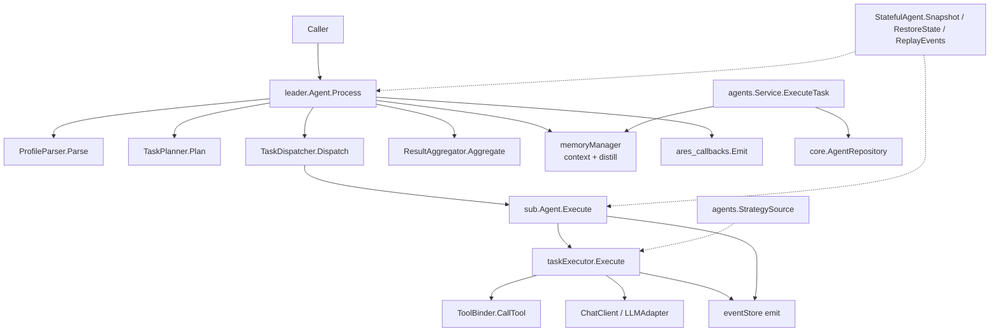

`internal/agents` 目录提供运行时使用的具体智能体实现。`base` 定义共享的
`Agent` 接口与生命周期事件类型；`leader` 实现编排型智能体（解析画像、规划、
派发、聚合）；`sub` 实现执行任务的 worker 智能体，提供工具绑定与基于 LLM 的
executor。顶层 `agents` 包额外提供智能体 `Service`（CRUD + 任务执行）以及
`StrategySource` 契约，使运行中的智能体可被进化引擎实时引导。

## 职责

- 定义 `base.Agent` 接口（`ID`、`Type`、`Status`、`Start`、`Stop`、
  `Process`、`ProcessStream`）以及可选的 `Messenger`、`Heartbeater`、
  `StatefulAgent` 能力。
- 实现 `leader.Agent`：四阶段流水线（解析、规划、派发、聚合），含内存上下文、
  蒸馏、反馈记录、事件溯源、快照/恢复以支持复活。
- 实现 `sub.Agent`：通过 `TaskExecutor` 执行 `*models.Task`，经 `ToolBinder`
  绑定工具，并发射 `TaskCreated` / `TaskCompleted` / `TaskFailed` 事件。
- 提供 `agents.Service`，基于 `core.AgentRepository` 进行智能体 CRUD 与
  `ExecuteTask`，可叠加内存上下文。
- 暴露 `agents.StrategySource`，使进化引擎可在运行时覆盖智能体的 prompt
  模板与 LLM 参数。

## 架构图



## 外部接口

```go
// internal/agents/base
type Agent interface {
    ID() string
    Type() models.AgentType
    Status() models.AgentStatus
    Start(ctx context.Context) error
    Stop(ctx context.Context) error
    Process(ctx context.Context, input any) (any, error)
    ProcessStream(ctx context.Context, input any) (<-chan AgentEvent, error)
}

type Messenger interface {
    SendMessage(ctx context.Context, msg *ahp.AHPMessage) error
    ReceiveMessage(ctx context.Context) (*ahp.AHPMessage, error)
}

type Heartbeater interface {
    Heartbeat(ctx context.Context) error
    IsAlive() bool
}

type StatefulAgent interface {
    RestoreState(state map[string]any) error
    ReplayEvents(events []*ares_events.Event) error
    Snapshot() (map[string]any, error)
}

type SnapshotStore interface {
    Save(ctx context.Context, agentID string, snapshot map[string]any) error
    Load(ctx context.Context, agentID string) (map[string]any, error)
    Delete(ctx context.Context, agentID string) error
}

type EventType int
const (
    EventPlanning EventType = iota
    EventTaskStart
    EventTaskProgress
    EventTaskComplete
    EventAggregating
    EventComplete
    EventError
)
type AgentEvent struct {
    Type   EventType
    Source string
    Data   any
    Err    error
}
type Config struct {
    ID                string
    Type              models.AgentType
    HeartbeatInterval time.Duration
    MaxRetries        int
    Timeout           time.Duration
}
func DefaultConfig(agentType models.AgentType) *Config

// internal/agents (shared strategy + service)
type ActiveStrategy struct {
    ID     string
    Prompt string
    Params map[string]any
}
type StrategySource interface {
    GetActiveStrategy(ctx context.Context) (*ActiveStrategy, error)
}

type Service struct {
    repo      core.AgentRepository
    memoryMgr memory.MemoryManager
    config    *core.BaseConfig
}
type Config struct {
    BaseConfig *core.BaseConfig
    MemoryMgr  memory.MemoryManager
    Repo       core.AgentRepository
}
func NewService(config *Config) (*Service, error)
func (s *Service) CreateAgent(ctx context.Context, agentConfig *core.AgentConfig) (*core.Agent, error)
func (s *Service) GetAgent(ctx context.Context, agentID string) (*core.Agent, error)
func (s *Service) UpdateAgent(ctx context.Context, agentID string, updates map[string]interface{}) (*core.Agent, error)
func (s *Service) DeleteAgent(ctx context.Context, agentID string) error
func (s *Service) ListAgents(ctx context.Context, filter *core.AgentFilter) ([]*core.Agent, *core.PaginationResponse, error)
func (s *Service) ExecuteTask(ctx context.Context, task *core.Task) (*core.TaskResult, error)
func (s *Service) GetTaskResult(ctx context.Context, taskID string) (*core.TaskResult, error)

// internal/agents/leader
type Agent interface{ base.Agent }

type ProfileParser interface {
    Parse(ctx context.Context, input string) (*models.UserProfile, error)
}
type TaskPlanner interface {
    Plan(ctx context.Context, profile *models.UserProfile, inputText string) ([]*models.Task, error)
    Replan(ctx context.Context, profile *models.UserProfile, inputText string, previousResult *models.RecommendResult, feedback string) ([]*models.Task, error)
}
type TaskDispatcher interface {
    Dispatch(ctx context.Context, tasks []*models.Task) ([]*models.TaskResult, error)
    RegisterExecutor(agentType models.AgentType, fn func(ctx context.Context, task *models.Task) (*models.TaskResult, error))
}
type ResultAggregator interface {
    Aggregate(ctx context.Context, results []*models.TaskResult, tasks []*models.Task) (*models.RecommendResult, error)
}

func New(
    id string,
    parser ProfileParser,
    planner TaskPlanner,
    dispatcher TaskDispatcher,
    aggregator ResultAggregator,
    msgQueue *ahp.MessageQueue,
    hbMon *ahp.HeartbeatMonitor,
    memMgr memory.MemoryManager,
    cfg *LeaderAgentConfig,
    opts ...LeaderOption,
) (Agent, error)

type LeaderOption func(*leaderAgent)
func WithCheckpoint(cp *CheckpointRepository) LeaderOption
func WithEventStore(store ares_events.EventStore) LeaderOption
func WithStrategySource(src agents.StrategySource) LeaderOption
func WithCallbacks(emitter ares_callbacks.Emitter) LeaderOption
func WithFeedbackService(svc *experience.FeedbackService) LeaderOption

type LeaderAgentConfig struct {
    base.Config
    MaxParallelTasks int
    MaxSteps         int
    EnableCache      bool
    UserID           string
    Loop             LoopConfig
}
type LoopConfig struct {
    MaxIterations    int
    QualityThreshold float64
    EnableReflection bool
    MaxTotalLLMCalls int
    MaxLoopDuration  time.Duration
}
func DefaultLeaderAgentConfig() *LeaderAgentConfig

// internal/agents/sub
type Agent interface {
    base.Agent
    Execute(ctx context.Context, task *models.Task) (*models.TaskResult, error)
}

type TaskExecutor interface {
    Execute(ctx context.Context, task *models.Task) (*models.TaskResult, error)
    RegisterFallback(agentType models.AgentType, handler FallbackHandler)
}
type MessageHandler interface {
    Handle(ctx context.Context, msg *ahp.AHPMessage) error
}
type ToolBinder interface {
    BindTool(name string, toolFunc func(ctx context.Context, args map[string]any) (any, error))
    CallTool(ctx context.Context, name string, args map[string]any) (any, error)
    ListTools() []string
    IsToolIdempotent(name string) bool
    ListIdempotentTools() []string
    GetToolSchemas() []resources.ToolSchema
    BridgeFromRegistry(registry *resources.Registry)
    WithPlannerBridge(bridge interface {
        Execute(ctx context.Context, toolName string, params map[string]any, userRequest string) (resources.Result, error)
    })
}
// NOTE: BindIdempotentTool is NOT on the ToolBinder interface; it lives on
// the concrete *toolBinder type returned by NewToolBinder.
func (b *toolBinder) BindIdempotentTool(name string, toolFunc func(ctx context.Context, args map[string]any) (any, error))
func NewToolBinder() ToolBinder

type FallbackHandler func(ctx context.Context, task *models.Task) ([]*models.RecommendItem, string, error)
type ChatClient interface {
    Chat(ctx context.Context, messages []*core.LLMMessage, tools []core.Tool, params map[string]any) (*core.GenerateResponse, error)
}

func New(
    id string,
    agentType models.AgentType,
    executor TaskExecutor,
    handler MessageHandler,
    msgQueue *ahp.MessageQueue,
    hbMon *ahp.HeartbeatMonitor,
    cfg *SubAgentConfig,
    opts ...SubAgentOption,
) Agent

type SubAgentOption func(*subAgent)
func WithEventStore(store ares_events.EventStore) SubAgentOption

type SubAgentConfig struct {
    base.Config
    EnableTools bool
}
func DefaultSubAgentConfig(agentType models.AgentType) *SubAgentConfig

func NewTaskExecutor(
    toolBinder ToolBinder,
    llmAdapter output.LLMAdapter,
    template *output.TemplateEngine,
    promptTpl string,
    validator *output.Validator,
    maxRetries int,
    opts ...TaskExecutorOption,
) TaskExecutor
func NewTaskExecutorWithValidation(
    toolBinder ToolBinder,
    llmAdapter output.LLMAdapter,
    template *output.TemplateEngine,
    promptTpl string,
    validator *output.Validator,
    maxRetries int,
    retryOnFail bool,
    strictMode bool,
    opts ...TaskExecutorOption,
) TaskExecutor
type TaskExecutorOption func(*taskExecutor)
func WithTaskExecutorCallbacks(emitter ares_callbacks.Emitter) TaskExecutorOption

// Constants
const defaultMaxToolRounds = 5   // sub/executor.go
const leader.DefaultMaxSteps = 10
const leader.DefaultEventChanSize = 64
```

## 关键类型与方法

| 类型 / 方法 | 用途 |
| --- | --- |
| `base.Agent` | 所有智能体的共享接口（生命周期 + Process/ProcessStream）。 |
| `base.StatefulAgent` | 快照/恢复 + 事件回放，用于复活恢复。 |
| `base.AgentEvent` / `EventType` | `ProcessStream` 上发射的智能体生命周期事件。 |
| `leader.Agent` | 嵌入 `base.Agent` 的 leader 接口。 |
| `leader.New` | 从 parser/planner/dispatcher/aggregator/memory/queue/heartbeat 构造 leader。 |
| `leader.ProfileParser` | 从输入文本解析 `*models.UserProfile`。 |
| `leader.TaskPlanner` | 基于 profile 规划与重规划 `[]*models.Task`。 |
| `leader.TaskDispatcher` | 将任务派发给 sub-agent，并接受 executor 注册。 |
| `leader.ResultAggregator` | 将 `[]*models.TaskResult` 聚合为 `*models.RecommendResult`。 |
| `leader.LoopConfig` | 循环迭代/质量/反思/LLM 调用次数/时长上限。 |
| `sub.Agent` | 增加 `Execute(*models.Task)` 的 worker 接口。 |
| `sub.New` | 从 executor、handler、queue、heartbeat、config 构造 sub-agent。 |
| `sub.TaskExecutor` | 执行任务；支持按类型的 fallback handler。 |
| `sub.NewTaskExecutor` | 构建基于 LLM 的 executor（maxToolRounds 默认 5）。 |
| `sub.ToolBinder` | 绑定、列举并调用工具；跟踪幂等性以保障重试安全。 |
| `*toolBinder.BindIdempotentTool` | 仅存在于具体类型的方法，标记工具可安全重试。 |
| `sub.ChatClient` | 可选的原生工具调用 LLM 客户端，支持按调用覆盖参数。 |
| `agents.StrategySource` | 提供活跃的 `ActiveStrategy` 以在运行时引导智能体。 |
| `agents.Service` | 基于 `core.AgentRepository` 的 CRUD + `ExecuteTask`。 |
| `agents.NewService` | 从 `agents.Config`（base 配置、内存、repo）构建 service。 |

## 模块协作

- `agents/base` -> `internal/core/models`（`AgentType` / `AgentStatus`）与
  `internal/ares_protocol/ahp`（`AHPMessage`）。
- `leader` -> `base`、`ahp`（`MessageQueue`、`HeartbeatMonitor`）、
  `ares_memory`、`ares_events`、`ares_callbacks`、`ares_experience`
  （`FeedbackService`）以及 `agents`（`StrategySource`）。
- `sub` -> `base`、`ahp`、`ares_events`、`internal/llm/output`
  （`LLMAdapter`、`TemplateEngine`、`Validator`）、`internal/tools/resources/core`
  （`Registry`、`ToolSchema`、`Result`）以及 `agents`（`StrategySource`）。
- `sub.taskExecutor` -> `core`（`LLMMessage`、`Tool`、`GenerateResponse`）以及
  可选的 `ChatClient` 用于原生工具调用。
- `agents.Service` -> `core`（`AgentRepository`、`Agent`、`Task`、
  `TaskResult`、`AgentFilter`、`PaginationResponse`、`BaseConfig`）与
  `ares_memory.MemoryManager` 用于构建上下文。
- 运行时（`ares_runtime`）与 SDK 通过这些构造函数创建 leader 与 sub-agent，
  并以 `base.Agent` 接口驱动它们。

## 扩展方式

1. 实现新增智能体类型：实现 `base.Agent`（可选 `Messenger`、`Heartbeater`、
   `StatefulAgent`），在运行时工厂中注册，并通过 `leader.TaskDispatcher` 派发。
2. 通过向 `leader.New` 传入 `LeaderOption` 定制 leader 行为：
   `WithEventStore` 用于事件溯源、`WithStrategySource` 用于实时进化引导、
   `WithCallbacks` 用于生命周期钩子、`WithFeedbackService` 用于 bandit 反馈、
   `WithCheckpoint` 用于检查点恢复。
3. 为 sub-agent 接入自定义 LLM：实现 `sub.ChatClient` 并通过
   `TaskExecutorOption` 注入，使 executor 使用原生工具调用而非纯文本生成。
4. 通过 `sub.NewToolBinder()` 在 sub-agent 上绑定工具；普通工具用 `BindTool`，
   可安全重试的工具用具体类型上的 `*toolBinder.BindIdempotentTool`，再用
   `BridgeFromRegistry` 桥接 `resources.Registry` 或用 `WithPlannerBridge`
   桥接意图规划器。
5. 为 LLM 不可用场景增加按类型 fallback：实现 `sub.FallbackHandler` 并调用
   `TaskExecutor.RegisterFallback`。
6. 实现复活所需的持久化：实现 `base.StatefulAgent`
   （`Snapshot`、`RestoreState`、`ReplayEvents`），并通过
   `base.SnapshotStore` 存储快照。
7. 通过 `agents.Service` 驱动智能体 CRUD 与任务执行，传入
   `core.AgentRepository`（nil 则退化为内存行为）与可选的
   `memory.MemoryManager`。

## 双语状态

本页为中文参考。结构与技术内容完全相同的英文版本发布为 `agents.en.md`。两个文件中
所有代码标识符、类型名与签名均保持英文，仅叙述性文字不同。

## 成熟度

Production。leader、sub、base 包由 `agent_test.go`、`service_impl_test.go`、
`supervisor_test.go`、`planner_test.go`、`evaluator_test.go`、`recovery_test.go`、
`checkpoint_test.go` 以及 sub-agent 测试套件覆盖；通过 `ares_runtime` 与 SDK
集成到运行时；通过 `StatefulAgent` 实现复活；不含任何实验性标记。


