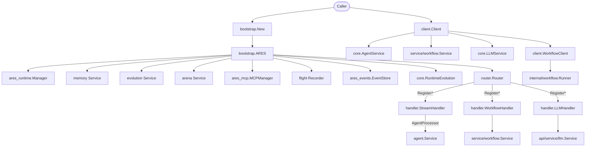

The `api` package is the top-level container for ARES. It owns the bootstrap
factory (`bootstrap.ARES`), the HTTP router with `Register*` methods per
domain, the SSE stream handler, and three library clients (`Client`,
`SimpleClient`, `WorkflowClient`) that embed ARES without importing any
`internal/` package.

## Responsibility

- Assemble the runtime graph from `internal/ares_bootstrap` and wrap each
  component through an `api/service/*` adapter so callers stay on the public
  surface.
- Expose a single HTTP mux (`router.Router`) with per-domain endpoint groups,
  API-key auth, and SSE streaming for agent events.
- Provide library-style clients (`client.Client`, `client.SimpleClient`,
  `client.WorkflowClient`) for embedding ARES into other Go binaries.
- Re-export the workflow engine contract (`api/workflow`) as type aliases so
  external modules can build and register workflows without touching
  `internal/workflow/engine`.

## Architecture



## External interfaces

```go
// api/bootstrap
type ARES struct {
    Runtime         *ares_runtime.Manager
    Memory          *memsvc.Service
    Evolution       *evosvc.Service
    Arena           *arenasvc.Service
    MCP             *ares_mcp.MCPManager
    Dashboard       *dashsvc.Dashboard
    Flight          *flightsvc.Recorder
    EventStore      ares_events.EventStore
    RuntimeEvolution core.RuntimeEvolution
}

func New(ctx context.Context, cfg *Config) (*ARES, error)
func (a *ARES) Start(ctx context.Context) error
func (a *ARES) Stop() error
func (a *ARES) RunEvolution(ctx context.Context, generations int) (*evosvc.EvolutionResult, error)
func (a *ARES) RunIdleEvolution(ctx context.Context, generations int) error
func (a *ARES) ExecuteArenaAction(ctx context.Context, action arenasvc.Action) arenasvc.Result

// api/router
type Router struct { /* unexported fields */ }
func NewRouter() *Router
func (r *Router) WithAPIKey(key string) *Router
func (r *Router) RegisterStreamEndpoint(processor handler.AgentProcessor)
func (r *Router) RegisterEvolutionEndpoints(h *handler.EvolutionHandler)
func (r *Router) RegisterRuntimeEvolutionEndpoints(h *handler.RuntimeEvolutionHandler)
func (r *Router) RegisterWorkflowEndpoints(h *handler.WorkflowHandler)
func (r *Router) RegisterAgentEndpoints(h *handler.AgentHandler)
func (r *Router) RegisterMemoryEndpoints(h *handler.MemoryHandler)
func (r *Router) RegisterArenaEndpoints(h *handler.ArenaHandler)
func (r *Router) RegisterRuntimeEndpoints(h *handler.RuntimeHandler)
func (r *Router) RegisterRetrievalEndpoints(h *handler.RetrievalHandler)
func (r *Router) RegisterEvalEndpoints(h *handler.EvalHandler)
func (r *Router) RegisterFlightEndpoints(h *handler.FlightHandler)
func (r *Router) RegisterLLMEndpoints(h *handler.LLMHandler)
func (r *Router) ServeHTTP(w http.ResponseWriter, req *http.Request)
func (r *Router) Handler() http.Handler

// api/handler
type StreamHandler struct { /* unexported */ }
func NewStreamHandler(opts ...StreamOption) *StreamHandler
func WithAPIKey(key string) StreamOption
func WithAllowedOrigins(origins ...string) StreamOption
func (h *StreamHandler) HandleStream(processor AgentProcessor) http.HandlerFunc

type AgentProcessor interface {
    ProcessStream(ctx context.Context, input any) (<-chan base.AgentEvent, error)
}
type StreamRequest struct {
    Query     string         `json:"query"`
    SessionID string         `json:"session_id,omitempty"`
    Options   map[string]any `json:"options,omitempty"`
}
type StreamResponse struct {
    Event string `json:"event"`
    Data  any    `json:"data"`
    Error string `json:"error,omitempty"`
}

// api/client
type Client struct { /* unexported */ }
func NewClient(config *Config) (*Client, error)
func (c *Client) Agent() (core.AgentService, error)
func (c *Client) Memory() (core.MemoryService, error)
func (c *Client) Retrieval() (core.RetrievalService, error)
func (c *Client) LLM() (core.LLMService, error)
func (c *Client) Workflow() (core.WorkflowService, error)
func (c *Client) Runtime(config *runtimeSvc.Config, _ interface{}) (*runtimeSvc.Service, error)
func (c *Client) Close(ctx context.Context) error
func (c *Client) Health(ctx context.Context) (*HealthReport, error)
func (c *Client) Ping(ctx context.Context) bool

type SimpleClient struct { /* unexported */ }
func NewSimpleClient(configPath string) (*SimpleClient, error)
func (s *SimpleClient) Execute(ctx context.Context, query string) (string, error)
func (s *SimpleClient) ExecuteWithAgent(ctx context.Context, agentID, query string) (string, error)
func (s *SimpleClient) Chat(ctx context.Context, messages []*core.Message) (string, error)
func (s *SimpleClient) Close(ctx context.Context) error

type WorkflowClient struct { /* unexported */ }
func NewWorkflowClient(client *Client) (*WorkflowClient, error)
func (w *WorkflowClient) LoadWorkflow(ctx context.Context, path string) (*engine.Workflow, error)
func (w *WorkflowClient) Execute(ctx context.Context, workflowDef *engine.Workflow, input string) (*engine.WorkflowResult, error)
func (w *WorkflowClient) ExecuteFromFile(ctx context.Context, path, input string) (*engine.WorkflowResult, error)

// api/service/workflow.Service implements core.WorkflowService
type Service struct { /* unexported */ }
func NewService(config *Config) (*Service, error)
func (s *Service) RegisterWorkflow(def *core.WorkflowDefinition) error
func (s *Service) Execute(ctx context.Context, req *core.WorkflowRequest) (*core.WorkflowResponse, error)
func (s *Service) ExecuteStream(ctx context.Context, req *core.WorkflowRequest) (<-chan core.WorkflowEvent, error)
func (s *Service) ListWorkflows(ctx context.Context) ([]*core.WorkflowSummary, error)
func (s *Service) GetWorkflow(ctx context.Context, id string) (*core.WorkflowDefinition, error)
```

## Key types and methods

| Type | Method | Purpose |
|------|--------|---------|
| `bootstrap.ARES` | `New(ctx, *Config)` | Assemble runtime graph from `internal/ares_bootstrap`. |
| `bootstrap.ARES` | `Start(ctx)` / `Stop()` | Lifecycle: start runtime, graceful stop of all modules. |
| `bootstrap.ARES` | `RunEvolution(ctx, generations)` | Drive the GA evolution loop. |
| `router.Router` | `NewRouter()` / `WithAPIKey(key)` | Build mux with `X-API-Key` constant-time auth. |
| `router.Router` | `Register*Endpoints(h)` | Wire one handler group per domain (12 groups total). |
| `handler.StreamHandler` | `HandleStream(processor)` | SSE event stream for agent runs; 1 MiB body cap, 8 KiB query cap. |
| `handler.AgentProcessor` | `ProcessStream(ctx, input)` | Adapter interface bridging HTTP to `base.AgentEvent` channels. |
| `client.Client` | `Agent()/Memory()/LLM()/Workflow()` | Lazy accessors returning the configured `core.*Service`. |
| `client.Client` | `Close(ctx)` | Graceful shutdown via optional `Stop`/`Close` type assertions. |
| `client.SimpleClient` | `Execute(ctx, query)` | One-shot prompt via the configured LLM service. |
| `client.WorkflowClient` | `Execute(ctx, *engine.Workflow, input)` | Compile engine workflow, bind, run via unified `workflow.Runner`. |
| `service/workflow.Service` | `Execute(ctx, *WorkflowRequest)` | Synchronous workflow run; returns `*WorkflowResponse`. |
| `service/workflow.Service` | `ExecuteStream(ctx, *WorkflowRequest)` | Stream `WorkflowEvent` over an `errgroup`-driven channel. |
| `core.WorkflowRequest` | field `WorkflowID`, `Input`, `Variables`, `Timeout` | Execution request payload. |
| `core.WorkflowResponse` | field `ExecutionID`, `Status`, `Output`, `Steps`, `Error` | Execution result aggregated from `workflow.Result`. |

## Module collaboration

- `bootstrap.New` delegates to `internal/ares_bootstrap.Bootstrap` for the
  runtime, MCP manager, event store, LLM client, and evolution components,
  then wraps each through `api/service/*` adapters so the public `ARES`
  struct never exposes internal types.
- `router.Router` is the single HTTP entry point. Each `Register*Endpoints`
  call binds one handler group to `POST/GET/DELETE` routes under
  `/api/v1/...`, all gated by `authMiddleware` (`X-API-Key`,
  `subtle.ConstantTimeCompare`).
- `handler.StreamHandler` is the only SSE endpoint. It pulls
  `base.AgentEvent` values from an `AgentProcessor` and serializes them as
  `event:`/`id:`/`data:` SSE frames, terminating with a `done` event.
- `client.Client` keeps the SDK embeddable: it holds `core.*Service`
  interfaces built by `api/bootstrap` and never imports `internal/`
  directly. `Close` uses optional interface assertions so services that
  expose `Stop(context.Context) error` or `Close()` are shut down
  gracefully.
- `client.WorkflowClient` and `service/workflow.Service` both compile the
  legacy `engine.Workflow` into the unified `workflow.WorkflowSpec` IR via
  `workflow.CompileFromEngineWithBindings`, then run it through
  `workflow.NewEngineNodeExecutor` + `workflow.Runner`.
- `api/workflow` re-exports `engine.Workflow`, `engine.Step`,
  `engine.AgentRegistry`, and status/recovery constants as type aliases so
  external modules can build workflow definitions without importing
  `internal/workflow/engine`.

## Extension points

1. **Add a new HTTP endpoint group.** Implement an `http.HandlerFunc` on a
   handler struct, then add a `Register<Domain>Endpoints(h *handler.X)`
   method on `router.Router` that loops over `method+path` tuples and
   wraps each with `r.authMiddleware`.
2. **Add a streaming event source.** Implement `handler.AgentProcessor`
   (`ProcessStream(ctx, input) (<-chan base.AgentEvent, error)`), then call
   `router.RegisterStreamEndpoint(processor)` to mount it at
   `POST /api/v1/stream`.
3. **Add a new service to `bootstrap.ARES`.** Add a field to `ARES`,
   construct it inside `bootstrap.New` (either from `ares_bootstrap.Bootstrap`
   components or directly), and expose a `Config` sub-struct so callers can
   opt in.
4. **Embed ARES as a library.** Build services via `api/bootstrap`, pass
   them into `client.Config{Agent, Memory, Retrieval, LLM, Workflow}`, call
   `client.NewClient`, and use the typed accessors. `Close(ctx)` handles
   graceful shutdown.
5. **Register a custom workflow agent type.** Create an
   `api/workflow.NewAgentRegistry()`, call `Register(type, factory)`, and
   pass the registry via `service/workflow.Config.AgentRegistry` or
   `WorkflowClient`'s auto-registration from `client.ConfigFile`.

## Bilingual status

This page is maintained in both English (`api.en.md`) and Chinese
(`api.zh.md`). Code blocks, type names, method names, and identifiers are
kept verbatim across both languages; prose is translated.

## Maturity

Production. The `api` package is the only public surface of ARES, is
covered by `bootstrap_test.go`, `router_test.go`, `client_test.go`,
`handler_test.go`, and `service/*_test.go`, and is integrated into the SDK
entry points (`sdk.New`) without any experimental markers.


