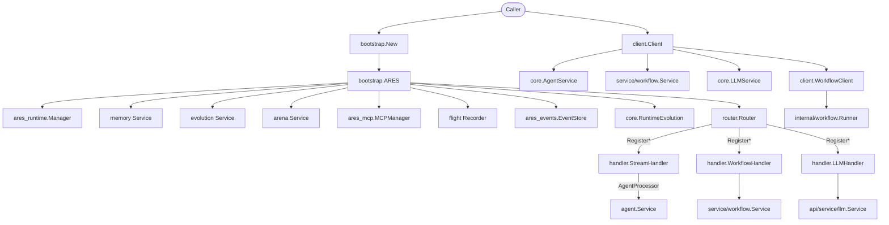

`api` 包是 ARES 的顶层容器。它持有引导工厂（`bootstrap.ARES`）、按领域划
分的 `Register*` HTTP 路由、SSE 流式处理器，以及三个库式客户端
（`Client`、`SimpleClient`、`WorkflowClient`），让外部程序无需导入任何
`internal/` 包即可嵌入 ARES。

## 职责

- 通过 `internal/ares_bootstrap` 组装运行时图，并通过 `api/service/*`
  适配器包装每个组件，使调用方仅接触公开 API。
- 暴露单一 HTTP mux（`router.Router`），按领域划分端点组，统一 API Key
  鉴权，并为 agent 事件提供 SSE 流。
- 提供库式客户端（`client.Client`、`client.SimpleClient`、
  `client.WorkflowClient`），便于将 ARES 嵌入其他 Go 二进制。
- 通过类型别名重新导出工作流引擎契约（`api/workflow`），让外部模块无需
  依赖 `internal/workflow/engine` 即可构建并注册工作流。

## 架构图



## 外部接口

```go
// api/bootstrap
type ARES struct {
    Runtime         *ares_runtime.Manager
    Memory          *memsvc.Service
    Evolution       *evosvc.Service
    Arena           *arenasvc.Service
    MCP             *ares_mcp.MCPManager
    Dashboard       *dashsvc.Dashboard
    Flight          *flightsvc.Recorder
    EventStore      ares_events.EventStore
    RuntimeEvolution core.RuntimeEvolution
}

func New(ctx context.Context, cfg *Config) (*ARES, error)
func (a *ARES) Start(ctx context.Context) error
func (a *ARES) Stop() error
func (a *ARES) RunEvolution(ctx context.Context, generations int) (*evosvc.EvolutionResult, error)
func (a *ARES) RunIdleEvolution(ctx context.Context, generations int) error
func (a *ARES) ExecuteArenaAction(ctx context.Context, action arenasvc.Action) arenasvc.Result

// api/router
type Router struct { /* unexported fields */ }
func NewRouter() *Router
func (r *Router) WithAPIKey(key string) *Router
func (r *Router) RegisterStreamEndpoint(processor handler.AgentProcessor)
func (r *Router) RegisterEvolutionEndpoints(h *handler.EvolutionHandler)
func (r *Router) RegisterRuntimeEvolutionEndpoints(h *handler.RuntimeEvolutionHandler)
func (r *Router) RegisterWorkflowEndpoints(h *handler.WorkflowHandler)
func (r *Router) RegisterAgentEndpoints(h *handler.AgentHandler)
func (r *Router) RegisterMemoryEndpoints(h *handler.MemoryHandler)
func (r *Router) RegisterArenaEndpoints(h *handler.ArenaHandler)
func (r *Router) RegisterRuntimeEndpoints(h *handler.RuntimeHandler)
func (r *Router) RegisterRetrievalEndpoints(h *handler.RetrievalHandler)
func (r *Router) RegisterEvalEndpoints(h *handler.EvalHandler)
func (r *Router) RegisterFlightEndpoints(h *handler.FlightHandler)
func (r *Router) RegisterLLMEndpoints(h *handler.LLMHandler)
func (r *Router) ServeHTTP(w http.ResponseWriter, req *http.Request)
func (r *Router) Handler() http.Handler

// api/handler
type StreamHandler struct { /* unexported */ }
func NewStreamHandler(opts ...StreamOption) *StreamHandler
func WithAPIKey(key string) StreamOption
func WithAllowedOrigins(origins ...string) StreamOption
func (h *StreamHandler) HandleStream(processor AgentProcessor) http.HandlerFunc

type AgentProcessor interface {
    ProcessStream(ctx context.Context, input any) (<-chan base.AgentEvent, error)
}
type StreamRequest struct {
    Query     string         `json:"query"`
    SessionID string         `json:"session_id,omitempty"`
    Options   map[string]any `json:"options,omitempty"`
}
type StreamResponse struct {
    Event string `json:"event"`
    Data  any    `json:"data"`
    Error string `json:"error,omitempty"`
}

// api/client
type Client struct { /* unexported */ }
func NewClient(config *Config) (*Client, error)
func (c *Client) Agent() (core.AgentService, error)
func (c *Client) Memory() (core.MemoryService, error)
func (c *Client) Retrieval() (core.RetrievalService, error)
func (c *Client) LLM() (core.LLMService, error)
func (c *Client) Workflow() (core.WorkflowService, error)
func (c *Client) Runtime(config *runtimeSvc.Config, _ interface{}) (*runtimeSvc.Service, error)
func (c *Client) Close(ctx context.Context) error
func (c *Client) Health(ctx context.Context) (*HealthReport, error)
func (c *Client) Ping(ctx context.Context) bool

type SimpleClient struct { /* unexported */ }
func NewSimpleClient(configPath string) (*SimpleClient, error)
func (s *SimpleClient) Execute(ctx context.Context, query string) (string, error)
func (s *SimpleClient) ExecuteWithAgent(ctx context.Context, agentID, query string) (string, error)
func (s *SimpleClient) Chat(ctx context.Context, messages []*core.Message) (string, error)
func (s *SimpleClient) Close(ctx context.Context) error

type WorkflowClient struct { /* unexported */ }
func NewWorkflowClient(client *Client) (*WorkflowClient, error)
func (w *WorkflowClient) LoadWorkflow(ctx context.Context, path string) (*engine.Workflow, error)
func (w *WorkflowClient) Execute(ctx context.Context, workflowDef *engine.Workflow, input string) (*engine.WorkflowResult, error)
func (w *WorkflowClient) ExecuteFromFile(ctx context.Context, path, input string) (*engine.WorkflowResult, error)

// api/service/workflow.Service implements core.WorkflowService
type Service struct { /* unexported */ }
func NewService(config *Config) (*Service, error)
func (s *Service) RegisterWorkflow(def *core.WorkflowDefinition) error
func (s *Service) Execute(ctx context.Context, req *core.WorkflowRequest) (*core.WorkflowResponse, error)
func (s *Service) ExecuteStream(ctx context.Context, req *core.WorkflowRequest) (<-chan core.WorkflowEvent, error)
func (s *Service) ListWorkflows(ctx context.Context) ([]*core.WorkflowSummary, error)
func (s *Service) GetWorkflow(ctx context.Context, id string) (*core.WorkflowDefinition, error)
```

## 关键类型与方法

| 类型 | 方法 | 用途 |
|------|------|------|
| `bootstrap.ARES` | `New(ctx, *Config)` | 通过 `internal/ares_bootstrap` 组装运行时图。 |
| `bootstrap.ARES` | `Start(ctx)` / `Stop()` | 生命周期：启动运行时，优雅停止所有模块。 |
| `bootstrap.ARES` | `RunEvolution(ctx, generations)` | 驱动遗传算法演化循环。 |
| `router.Router` | `NewRouter()` / `WithAPIKey(key)` | 构建带 `X-API-Key` 常量时间鉴权的 mux。 |
| `router.Router` | `Register*Endpoints(h)` | 为每个领域挂载一组 handler（共 12 组）。 |
| `handler.StreamHandler` | `HandleStream(processor)` | agent 运行的 SSE 事件流；body 上限 1 MiB，query 上限 8 KiB。 |
| `handler.AgentProcessor` | `ProcessStream(ctx, input)` | 将 HTTP 桥接到 `base.AgentEvent` channel 的适配接口。 |
| `client.Client` | `Agent()/Memory()/LLM()/Workflow()` | 惰性访问器，返回已配置的 `core.*Service`。 |
| `client.Client` | `Close(ctx)` | 通过可选的 `Stop`/`Close` 类型断言实现优雅关闭。 |
| `client.SimpleClient` | `Execute(ctx, query)` | 通过已配置的 LLM 服务做一次性提示。 |
| `client.WorkflowClient` | `Execute(ctx, *engine.Workflow, input)` | 编译 engine 工作流，绑定，通过统一 `workflow.Runner` 运行。 |
| `service/workflow.Service` | `Execute(ctx, *WorkflowRequest)` | 同步运行工作流，返回 `*WorkflowResponse`。 |
| `service/workflow.Service` | `ExecuteStream(ctx, *WorkflowRequest)` | 通过 `errgroup` 驱动的 channel 流式输出 `WorkflowEvent`。 |
| `core.WorkflowRequest` | 字段 `WorkflowID`、`Input`、`Variables`、`Timeout` | 执行请求载荷。 |
| `core.WorkflowResponse` | 字段 `ExecutionID`、`Status`、`Output`、`Steps`、`Error` | 由 `workflow.Result` 聚合的执行结果。 |

## 模块协作

- `bootstrap.New` 把核心装配委托给 `internal/ares_bootstrap.Bootstrap`
  （runtime、MCP manager、event store、LLM client、evolution 组件），
  再用 `api/service/*` 适配器包装，使公开的 `ARES` 结构体不暴露任何
  internal 类型。
- `router.Router` 是唯一的 HTTP 入口。每个 `Register*Endpoints` 调用将
  一组 handler 绑定到 `/api/v1/...` 下的 `POST/GET/DELETE` 路由，全部经
  `authMiddleware`（`X-API-Key`，`subtle.ConstantTimeCompare`）鉴权。
- `handler.StreamHandler` 是唯一的 SSE 端点。它从 `AgentProcessor` 拉取
  `base.AgentEvent`，按 `event:`/`id:`/`data:` 帧序列化，最后发送
  `done` 事件。
- `client.Client` 保持 SDK 可嵌入：它持有由 `api/bootstrap` 构建的
  `core.*Service` 接口，绝不直接导入 `internal/`。`Close` 通过可选接口
  断言，让实现了 `Stop(context.Context) error` 或 `Close()` 的服务被优雅
  关闭。
- `client.WorkflowClient` 与 `service/workflow.Service` 都通过
  `workflow.CompileFromEngineWithBindings` 把遗留的 `engine.Workflow`
  编译为统一的 `workflow.WorkflowSpec` IR，再用
  `workflow.NewEngineNodeExecutor` + `workflow.Runner` 运行。
- `api/workflow` 将 `engine.Workflow`、`engine.Step`、
  `engine.AgentRegistry` 以及状态/恢复常量作为类型别名重新导出，外部
  模块无需导入 `internal/workflow/engine` 即可构建工作流定义。

## 扩展方式

1. **新增一组 HTTP 端点。** 在 handler 结构体上实现 `http.HandlerFunc`，
   然后在 `router.Router` 上添加 `Register<Domain>Endpoints(h *handler.X)`
   方法，遍历 `method+path` 元组并用 `r.authMiddleware` 包装。
2. **新增流式事件源。** 实现 `handler.AgentProcessor`
   （`ProcessStream(ctx, input) (<-chan base.AgentEvent, error)`），再调用
   `router.RegisterStreamEndpoint(processor)` 挂载到
   `POST /api/v1/stream`。
3. **为 `bootstrap.ARES` 新增服务。** 在 `ARES` 上加字段，在
   `bootstrap.New` 中构造（来自 `ares_bootstrap.Bootstrap` 组件或直接
   构造），并暴露一个 `Config` 子结构让调用方按需开启。
4. **作为库嵌入 ARES。** 通过 `api/bootstrap` 构建服务，传入
   `client.Config{Agent, Memory, Retrieval, LLM, Workflow}`，调用
   `client.NewClient`，再用类型化访问器使用。`Close(ctx)` 负责优雅关闭。
5. **注册自定义工作流 agent 类型。** 创建
   `api/workflow.NewAgentRegistry()`，调用 `Register(type, factory)`，
   通过 `service/workflow.Config.AgentRegistry` 或 `WorkflowClient` 从
   `client.ConfigFile` 自动注册时传入。

## 双语状态

本页同时维护英文（`api.en.md`）与中文（`api.zh.md`）版本。两份文档中的
代码块、类型名、方法名与标识符保持原样，仅翻译散文。

## 成熟度

Production。`api` 包是 ARES 唯一的公开表面，由 `bootstrap_test.go`、
`router_test.go`、`client_test.go`、`handler_test.go` 以及
`service/*_test.go` 覆盖，已集成进 SDK 入口（`sdk.New`），无任何实验性
标记。


