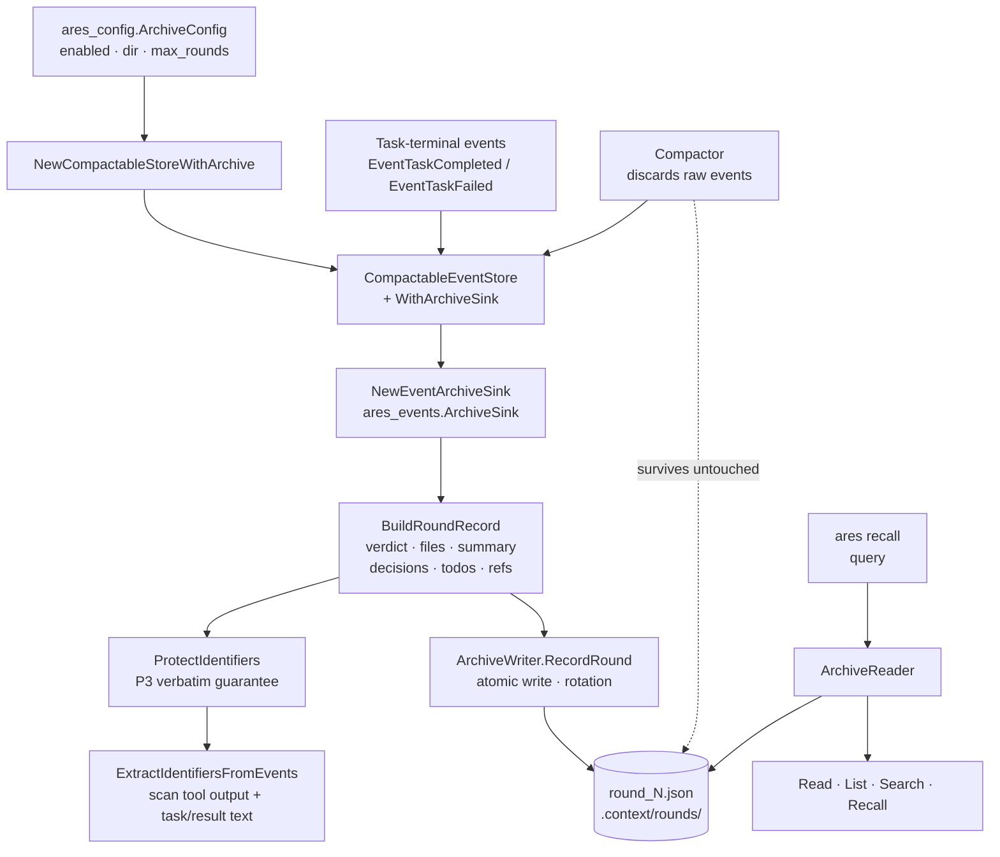

The `internal/ares_archive` package (package `ares_archive`) implements
**archive-style round summarization** for the closed-loop agent. Each
conversation round is persisted as an independent `RoundRecord` under
`.context/rounds/round_N.json`. Records are never merged (git-log-per-commit,
not git-squash), so a later round can reference "round N's conclusion" rather
than a fragment of a compacted tool output.

Design (per `plan/archive/historical/context_compression_strategy.md`):

- **Compaction-independent**: the archive is separate from the compaction core
  (`internal/ares_events.Compactor`); archive files survive compaction
  untouched. The integration point is the `CompactableEventStore` wrapper,
  which flushes the archive before compaction triggers via an
  `ares_events.ArchiveSink` callback.
- **Multi-level retention** (P0–P5):

| Priority | Content | Retention |
| --- | --- | --- |
| P0 | Architecture decisions, key constraints, data-model definitions | Preserved verbatim, never summarized |
| P1 | File-change list, change reason | Structured (file + lines + summary) |
| P2 | Verification state (pass/fail), coverage change | Conclusion only; raw tool output discarded |
| P3 | Identifiers (commit hash, PR#, IP:port, URL, UUID) | Preserved verbatim, **never truncated** |
| P4 | Tool output (stdout, log, debug prints) | Discarded; only pass/fail conclusions survive |
| P5 | TODO notes, rollback notes, known limitations | Preserved verbatim |

## Responsibility

- Persist each conversation round as an independent `round_N.json` file via
  the `ArchiveWriter` interface; the file implementation writes atomically
  (temp file + rename) and rotates the oldest rounds when `MaxRounds` is
  exceeded.
- Bridge into the event store via `NewEventArchiveSink`, which returns an
  `ares_events.ArchiveSink` that builds a `RoundRecord` from a round's events
  and persists it through the writer. The sink is invoked at round boundaries
  (task completion/failure) and before compaction, so a record is durable
  before the compaction core discards the raw events (best effort — a write
  failure is logged, never blocks compaction).
- Orchestrate extraction with `BuildRoundRecord`: it validates inputs,
  protects caller-supplied identifiers, runs the sub-extractors (verdict,
  file changes, summary, decisions, TODOs, identifiers), and returns a
  validated record ready for archival.
- Enforce the P3 "never truncate" guarantee with `ProtectIdentifiers`, which
  validates each caller-supplied ref against its role pattern (commit hash,
  PR/issue number, IP / IP:port, owner/repo), and augment it with
  `ExtractIdentifiersFromEvents`, which scans tool outputs and task/result
  text. Caller-supplied refs take precedence over extracted ones.
- Query the archive through the `ArchiveReader` interface: `Read` a round,
  `List` all rounds, `Search` by keyword, and `Recall` a human-readable
  multi-round conclusion.
- Build the archive-enabled event store with `NewCompactableStoreWithArchive`
  — the single construction source shared by `ares serve` and `ares start`
  so the two real entry points never diverge on how the store is wired.
- Configure via `ares_config.ArchiveConfig`: `enabled` (default on, a nil
  value is treated as enabled), `dir` (default `.context/rounds`), and
  `max_rounds` (default 200).

## Architecture



## External interfaces

```go
package ares_archive

// --- Record ---

type RoundRecord struct {
    Round     int               `json:"round"`               // 1-based, must be > 0
    Action    string            `json:"action"`              // "plan" | "implement" | "fix" | "review"
    Summary   string            `json:"summary"`             // one-line round description
    Files     []FileChange      `json:"files"`               // P1 structured file changes
    Verdict   Verdict           `json:"verdict"`             // P2 verification conclusion
    TODOs     []string          `json:"todos,omitempty"`     // P5 notes, verbatim
    Decisions []string          `json:"decisions,omitempty"` // P0 architecture decisions, verbatim
    Refs      map[string]string `json:"refs,omitempty"`      // P3 identifiers by role, verbatim
}

type FileChange struct {
    Path       string `json:"path"`
    LinesAdded int    `json:"lines_added"`
    Summary    string `json:"summary"`
}

type Verdict struct {
    GoVet        string `json:"go_vet"`        // "pass" | "fail" | ""
    GoLint       string `json:"go_lint"`       // "N issues" | "pass" | ""
    GoTest       string `json:"go_test"`       // "pass" | "fail" | "skip" | ""
    RaceDetector string `json:"race_detector"` // "pass" | "fail" | ""
    Examples     string `json:"examples"`      // "pass" | "fail" | ""
}

func (r *RoundRecord) Validate() error

// --- Writer / Reader ---

type ArchiveWriter interface {
    RecordRound(ctx context.Context, record RoundRecord) error
    Flush(ctx context.Context) error
}
func NewFileArchiveWriter(dir string, maxRounds int) (ArchiveWriter, error)

type ArchiveReader interface {
    Read(ctx context.Context, round int) (*RoundRecord, error)
    List(ctx context.Context) ([]int, error)
    Search(ctx context.Context, query string) ([]RoundRecord, error)
    Recall(ctx context.Context, query string) (string, error)
}
func NewFileArchiveReader(dir string) (ArchiveReader, error)

// --- Sink + store wiring ---

func NewEventArchiveSink(w ArchiveWriter) ares_events.ArchiveSink
func NewCompactableStoreWithArchive(cfg ares_config.ArchiveConfig) (*ares_events.CompactableEventStore, *ares_events.MemoryEventStore, error)

// --- Extraction ---

func BuildRoundRecord(ctx context.Context, round int, action string, events []*ares_events.Event, refs map[string]string) (*RoundRecord, error)
func ProtectIdentifiers(refs map[string]string) (map[string]string, error)
func ExtractIdentifiers(text string) map[string][]string
func ExtractIdentifiersFromEvents(events []*ares_events.Event) map[string][]string

// --- Sentinel errors ---

var (
    ErrInvalidRound      = errors.New("invalid round: must be > 0")
    ErrInvalidAction     = errors.New("invalid action: must be one of plan|implement|fix|review")
    ErrInvalidIdentifier = errors.New("invalid identifier: does not match expected pattern")
    ErrRoundNotFound     = errors.New("round not found")
    ErrEmptyQuery        = errors.New("empty query")
    ErrEmptyDir          = errors.New("archive directory must be non-empty")
    ErrNoEvents          = errors.New("no events to archive")
)
```

## Key types and methods

| Type / Method | Purpose |
| --- | --- |
| `RoundRecord` | Independent per-round archive entry mirroring git-log-per-commit. JSON tags follow the compression-strategy doc §3.1. |
| `Validate` | Enforces the invariants later rounds trust: positive `Round` and a recognised `Action`; returns `ErrInvalidRound` / `ErrInvalidAction`. |
| `ArchiveWriter` | Persists `RoundRecord`s; implementations must be safe for concurrent use. |
| `NewFileArchiveWriter` | File-based writer: `MkdirAll(0o750)`, atomic temp-file + rename, rotation of the oldest rounds past `maxRounds` (best-effort). |
| `ArchiveReader` | Read-only archive queries: `Read` / `List` / `Search` / `Recall`. |
| `NewFileArchiveReader` | File-based reader; tolerates a missing/empty directory so a recall CLI can print a friendly "no archive" message. |
| `NewEventArchiveSink` | Bridges `ares_events.ArchiveSink` (owned by ares_events) to `ArchiveWriter` (implemented here), breaking the import cycle. Infers the round action from task text (default `implement`). |
| `NewCompactableStoreWithArchive` | Single construction source for the archive-enabled `CompactableEventStore`; no sink is attached when archiving is disabled. Returns the store and its underlying `*MemoryEventStore`. |
| `BuildRoundRecord` | Extraction orchestrator: validates, protects caller refs, runs all sub-extractors, returns a validated record. |
| `ProtectIdentifiers` | Validates caller-supplied refs against role patterns (P3 verbatim guarantee); a silently-truncated hash is rejected, never archived. |
| `ExtractIdentifiers` / `ExtractIdentifiersFromEvents` | Scan free text (or the event stream) for commit/PR/IP/owner-repo/go-cmd/verdict identifiers, deduplicated per role. |

## Module collaboration

- `ares_archive` -> `internal/ares_events`: consumes `EventToolCallCompleted`, `EventLLMCall`, and `EventMessageAdded` payloads for extraction; provides the `ArchiveSink` bridge so `CompactableEventStore` flushes each round before compaction. `ArchiveSink` is defined in ares_events to avoid a cyclic import.
- `ares_archive` -> `internal/ares_config`: `NewCompactableStoreWithArchive` reads `ArchiveConfig` (`enabled` / `dir` / `max_rounds`; defaults `.context/rounds`, 200, default-on).
- `ares_archive` -> `cmd/ares`: `serve.go` builds the shared archive-enabled store via `NewCompactableStoreWithArchive`; `recall.go` exposes the `recall query <text>` / `recall round <N>` CLI over `ArchiveReader`.
- `ares_archive` -> `internal/api_impl`: `NewEventStoreWithArchive` adapts the shared store into the api_impl `*EventStore` shape (`RawStore()` exposes the underlying `*MemoryEventStore`, e.g. for `dashboard.SetEventStore`).

## Extension points

1. **Enable / disable archiving** in config: archiving is default-on; set `memory.archive.enabled: false` to disable. Tune `memory.archive.dir` and `memory.archive.max_rounds` (rotation keeps the newest N rounds).
2. **Query past rounds** with `ares recall query <text>` (case-insensitive keyword search, newest first, human-readable conclusion) or `ares recall round <N>` (pretty-printed JSON record). A missing archive directory yields a friendly message.
3. **Supply caller-side identifiers** to `BuildRoundRecord` via `refs`; each value is validated against its role pattern, and caller-supplied refs take precedence over identifiers extracted from the event stream.
4. **Rely on rule-based action inference**: the sink infers the round action from task/event text using word-boundary keywords (`fix`/`bug` → fix; `review` → review; `plan`/`design` → plan), defaulting to `implement`.
5. **Implement custom persistence** by satisfying `ArchiveWriter` / `ArchiveReader` (e.g. a remote or encrypted store) and passing it to `NewEventArchiveSink` / recall tooling.

## Bilingual status

This page is the English reference. A Chinese translation with identical structure and technical content is published as `ares_archive.zh.md`. All code identifiers, type names, and signatures are kept in English in both files; only the prose differs.

## Maturity

Production. The package is covered by `extract_test.go`, `identifiers_test.go`, `reader_test.go`, `sink_test.go`, `store_test.go`, and `writer_test.go`, and is integrated into the real service entry points: the archive-enabled store is built by `ares serve` / `ares start` (default-on), and the `ares recall` CLI reads the same archive. It exposes no experimental markers. Note that extraction is rule-based and deterministic — summaries, verdicts, decisions, and TODOs are heuristic extractions from event payloads, not LLM-generated prose.


