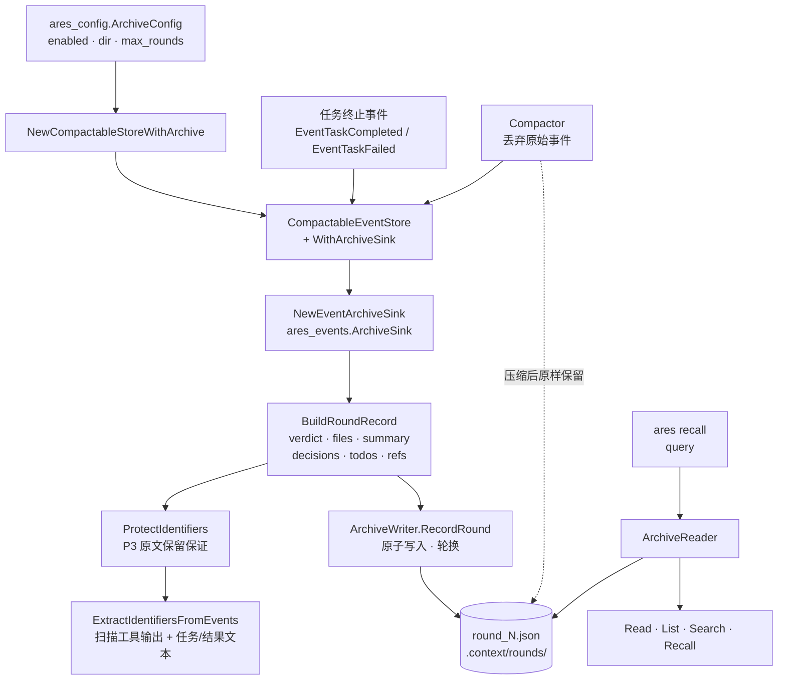

`internal/ares_archive` 包（package `ares_archive`）实现了闭环 Agent 的
**归档式轮次摘要（round summarization）**。每轮对话作为一个独立的
`RoundRecord` 持久化在 `.context/rounds/round_N.json` 下。记录从不合并
（类似 git-log-per-commit，而非 git-squash），因此后续轮次可以引用
"第 N 轮的结论"，而不是压缩后工具输出的片段。

设计依据（`plan/archive/historical/context_compression_strategy.md`）：

- **与压缩解耦**：归档独立于压缩核心（`internal/ares_events.Compactor`）；
  归档文件在压缩后原样保留。集成点是 `CompactableEventStore` 包装器，它在
  压缩触发前通过 `ares_events.ArchiveSink` 回调刷新归档。
- **多级保留**（P0–P5）：

| 优先级 | 内容 | 保留方式 |
| --- | --- | --- |
| P0 | 架构决策、关键约束、数据模型定义 | 原文保留，**不得摘要** |
| P1 | 文件变更清单、变更原因 | 结构化摘要（文件+行数+摘要） |
| P2 | 验证状态（pass/fail）、覆盖率变化 | 仅保留结论；丢弃原始工具输出 |
| P3 | 标识符（commit hash、PR#、IP:port、URL、UUID） | 原文保留，**不得截断** |
| P4 | 工具输出（stdout、log、debug 打印） | 删除；仅保留 pass/fail 结论 |
| P5 | TODO 笔记、回滚笔记、已知限制 | 原文保留 |

## 职责

- 通过 `ArchiveWriter` 接口将每轮对话持久化为独立的 `round_N.json` 文件；
  文件实现采用原子写入（临时文件 + rename），当轮次数超过 `MaxRounds` 时
  轮换删除最旧的轮次。
- 通过 `NewEventArchiveSink` 桥接事件存储：它返回一个 `ares_events.ArchiveSink`，
  从一轮的事件构建 `RoundRecord` 并通过 writer 持久化。该 sink 在轮次边界
  （任务完成/失败）和压缩之前被调用，因此在压缩核心丢弃原始事件之前记录
  已经落盘（best effort — 写入失败仅记录日志，绝不阻塞压缩）。
- 通过 `BuildRoundRecord` 编排提取：验证输入、保护调用方提供的标识符、
  运行各子提取器（verdict、文件变更、摘要、决策、TODOs、标识符），并返回
  已通过校验、可直接归档的记录。
- 通过 `ProtectIdentifiers` 执行 P3 "不得截断" 保证：对调用方提供的每个 ref
  按角色模式（commit hash、PR/issue 编号、IP / IP:port、owner/repo）校验；
  并通过 `ExtractIdentifiersFromEvents` 扫描工具输出与任务/结果文本补充提取。
  调用方提供的 ref 优先级高于自动提取的。
- 通过 `ArchiveReader` 接口查询归档：`Read` 读取某一轮，`List` 列出所有轮次，
  `Search` 按关键字搜索，`Recall` 输出人类可读的多轮结论。
- 通过 `NewCompactableStoreWithArchive` 构建启用归档的事件存储 — 这是
  `ares serve` 与 `ares start` 共用的唯一构造来源，确保两个真实入口点对
  事件存储的接线永不产生分歧。
- 通过 `ares_config.ArchiveConfig` 配置：`enabled`（默认开启，nil 视为开启）、
  `dir`（默认 `.context/rounds`）、`max_rounds`（默认 200）。

## 架构



## 外部接口

```go
package ares_archive

// --- Record ---

type RoundRecord struct {
    Round     int               `json:"round"`               // 从 1 开始，必须 > 0
    Action    string            `json:"action"`              // "plan" | "implement" | "fix" | "review"
    Summary   string            `json:"summary"`             // 单行轮次描述
    Files     []FileChange      `json:"files"`               // P1 结构化文件变更
    Verdict   Verdict           `json:"verdict"`             // P2 验证结论
    TODOs     []string          `json:"todos,omitempty"`     // P5 笔记，原文保留
    Decisions []string          `json:"decisions,omitempty"` // P0 架构决策，原文保留
    Refs      map[string]string `json:"refs,omitempty"`      // P3 按角色区分的标识符，原文保留
}

type FileChange struct {
    Path       string `json:"path"`
    LinesAdded int    `json:"lines_added"`
    Summary    string `json:"summary"`
}

type Verdict struct {
    GoVet        string `json:"go_vet"`        // "pass" | "fail" | ""
    GoLint       string `json:"go_lint"`       // "N issues" | "pass" | ""
    GoTest       string `json:"go_test"`       // "pass" | "fail" | "skip" | ""
    RaceDetector string `json:"race_detector"` // "pass" | "fail" | ""
    Examples     string `json:"examples"`      // "pass" | "fail" | ""
}

func (r *RoundRecord) Validate() error

// --- Writer / Reader ---

type ArchiveWriter interface {
    RecordRound(ctx context.Context, record RoundRecord) error
    Flush(ctx context.Context) error
}
func NewFileArchiveWriter(dir string, maxRounds int) (ArchiveWriter, error)

type ArchiveReader interface {
    Read(ctx context.Context, round int) (*RoundRecord, error)
    List(ctx context.Context) ([]int, error)
    Search(ctx context.Context, query string) ([]RoundRecord, error)
    Recall(ctx context.Context, query string) (string, error)
}
func NewFileArchiveReader(dir string) (ArchiveReader, error)

// --- Sink + store wiring ---

func NewEventArchiveSink(w ArchiveWriter) ares_events.ArchiveSink
func NewCompactableStoreWithArchive(cfg ares_config.ArchiveConfig) (*ares_events.CompactableEventStore, *ares_events.MemoryEventStore, error)

// --- Extraction ---

func BuildRoundRecord(ctx context.Context, round int, action string, events []*ares_events.Event, refs map[string]string) (*RoundRecord, error)
func ProtectIdentifiers(refs map[string]string) (map[string]string, error)
func ExtractIdentifiers(text string) map[string][]string
func ExtractIdentifiersFromEvents(events []*ares_events.Event) map[string][]string

// --- Sentinel errors ---

var (
    ErrInvalidRound      = errors.New("invalid round: must be > 0")
    ErrInvalidAction     = errors.New("invalid action: must be one of plan|implement|fix|review")
    ErrInvalidIdentifier = errors.New("invalid identifier: does not match expected pattern")
    ErrRoundNotFound     = errors.New("round not found")
    ErrEmptyQuery        = errors.New("empty query")
    ErrEmptyDir          = errors.New("archive directory must be non-empty")
    ErrNoEvents          = errors.New("no events to archive")
)
```

## 关键类型与方法

| 类型 / 方法 | 用途 |
| --- | --- |
| `RoundRecord` | 独立的按轮归档条目，镜像 git-log-per-commit。JSON 标签遵循压缩策略文档 §3.1。 |
| `Validate` | 强制执行后续轮次可信任的不变量：`Round` 为正数、`Action` 为已识别动作；返回 `ErrInvalidRound` / `ErrInvalidAction`。 |
| `ArchiveWriter` | 持久化 `RoundRecord`；实现必须支持并发安全。 |
| `NewFileArchiveWriter` | 文件型 writer：`MkdirAll(0o750)`、原子临时文件 + rename、超过 `maxRounds` 时轮换删除最旧轮次（best-effort）。 |
| `ArchiveReader` | 只读归档查询：`Read` / `List` / `Search` / `Recall`。 |
| `NewFileArchiveReader` | 文件型 reader；容忍目录缺失/为空，使 recall CLI 可以打印友好的 "no archive" 消息。 |
| `NewEventArchiveSink` | 将 `ares_events.ArchiveSink`（由 ares_events 定义）与 `ArchiveWriter`（在此实现）桥接，打破导入环。从任务文本推断轮次动作（默认 `implement`）。 |
| `NewCompactableStoreWithArchive` | 启用归档的 `CompactableEventStore` 的唯一构造来源；禁用时不安插 sink。返回存储及其底层 `*MemoryEventStore`。 |
| `BuildRoundRecord` | 提取编排器：验证、保护调用方 refs、运行所有子提取器、返回已校验记录。 |
| `ProtectIdentifiers` | 按角色模式校验调用方提供的 refs（P3 原文保留保证）；被静默截断的 hash 会被拒绝，绝不归档。 |
| `ExtractIdentifiers` / `ExtractIdentifiersFromEvents` | 从自由文本（或事件流）扫描 commit/PR/IP/owner-repo/go-cmd/verdict 标识符，按角色去重。 |

## 模块协作

- `ares_archive` -> `internal/ares_events`：消费 `EventToolCallCompleted`、`EventLLMCall` 和 `EventMessageAdded` 的 payload 进行提取；提供 `ArchiveSink` 桥接，使 `CompactableEventStore` 在压缩前刷新每轮记录。`ArchiveSink` 定义在 ares_events 中以避免循环导入。
- `ares_archive` -> `internal/ares_config`：`NewCompactableStoreWithArchive` 读取 `ArchiveConfig`（`enabled` / `dir` / `max_rounds`；默认 `.context/rounds`、200、默认开启）。
- `ares_archive` -> `cmd/ares`：`serve.go` 通过 `NewCompactableStoreWithArchive` 构建共享的归档存储；`recall.go` 基于 `ArchiveReader` 暴露 `recall query <text>` / `recall round <N>` CLI。
- `ares_archive` -> `internal/api_impl`：`NewEventStoreWithArchive` 将共享存储适配为 api_impl 的 `*EventStore` 形态（`RawStore()` 暴露底层 `*MemoryEventStore`，例如供 `dashboard.SetEventStore` 使用）。

## 扩展点

1. **启用 / 禁用归档**：归档默认开启；设置 `memory.archive.enabled: false` 可禁用。可通过 `memory.archive.dir` 和 `memory.archive.max_rounds` 调优（轮换保留最新的 N 轮）。
2. **查询历史轮次**：使用 `ares recall query <text>`（大小写不敏感的关键字搜索，最新在前，人类可读结论）或 `ares recall round <N>`（美化 JSON 记录）。归档目录缺失时输出友好提示。
3. **向 `BuildRoundRecord` 提供调用方侧标识符**（`refs`）：每个值按角色模式校验，调用方提供的 ref 优先于从事件流提取的标识符。
4. **依赖规则化动作推断**：sink 通过词边界关键字（`fix`/`bug` → fix；`review` → review；`plan`/`design` → plan）从任务/事件文本推断轮次动作，默认 `implement`。
5. **实现自定义持久化**：实现 `ArchiveWriter` / `ArchiveReader`（例如远程或加密存储），并传递给 `NewEventArchiveSink` 或 recall 工具。

## 双语状态

本页为中文翻译。英文参考以相同结构和内容发布为 `ares_archive.en.md`。所有代码标识符、类型名和签名在两种语言中都保持英文；仅散文部分不同。

## 成熟度

Production。该包由 `extract_test.go`、`identifiers_test.go`、`reader_test.go`、`sink_test.go`、`store_test.go` 和 `writer_test.go` 覆盖，并集成进真实服务入口点：`ares serve` / `ares start` 构建启用归档的存储（默认开启），`ares recall` CLI 读取同一归档。无实验性标记。注意：提取是规则化且确定性的 — 摘要、verdict、决策和 TODOs 是对事件 payload 的启发式提取，而非 LLM 生成的散文。


