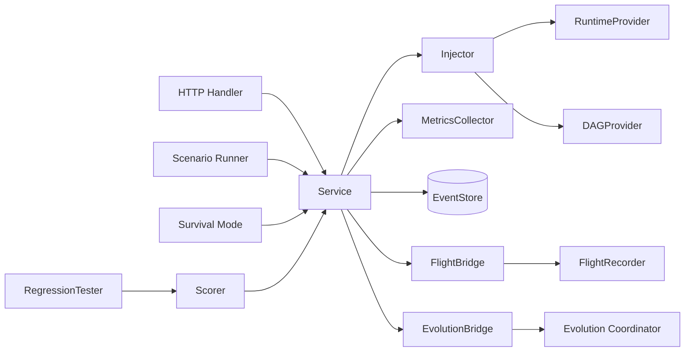

The `ares_arena` package (`internal/ares_arena`, import path `arena`) is the
chaos engineering layer that proves ARES is a self-healing runtime. It
deliberately injects faults into running agents and the DAG, records results,
and feeds failures to the evolution coordinator and flight recorder. Recovery
is handled by the existing resurrection plugin, failover, and checkpoint
mechanisms.

## Responsibility

- Inject faults via `Injector` against a `RuntimeProvider` (kill/pause/resume/
  slow agents, network partition, tool timeout, memory corruption, MCP
  disconnect, LLM failure) and a `DAGProvider` (remove nodes and edges).
- Orchestrate chaos through `Service.Execute`, which records results, updates
  stats, records metrics, emits arena events, and forwards failures to the
  flight and evolution bridges.
- Run declarative `Scenario` files (YAML) with warmup/cooldown, per-action
  delays, stop-on-error, and expectation verification
  (`ExpectSuccess` / `ExpectFailure`).
- Run continuous `Survival` mode that emits random chaos actions at intervals
  for a configured duration, building a `SurvivalReport` with a resilience
  score.
- Score resilience with a 3-dimensional weighted model (availability 40%,
  recovery 30%, consistency 30%) and grade the result.
- A/B test strategies with `RegressionTester`, using parallel scoring,
  optional adaptive early stopping, and a Welch's t-test for statistical
  significance.
- Expose HTTP endpoints (with optional API-key auth) and SSE streaming of
  arena events.

## Architecture



`Service` is the central orchestrator. `Execute` dispatches an `Action` to the
`Injector`, which calls the appropriate `RuntimeProvider` or `DAGProvider`
method. Results flow to stats, `MetricsCollector`, the event store, and both
bridges. `Scenario`, `Survival`, and `RegressionTester` are higher-level
drivers built on top of `Service.Execute`. `EvolutionBridge` converts failed
actions into `PatchProposal`s, applying high-priority (>=9) faults immediately
via `ApplyEmergency` and submitting the rest to the coordinator.

## External interfaces

These interfaces are implemented by the runtime and injected into the arena.
Signatures are extracted verbatim from `injector.go`, `service.go`, and
`regression.go`.

```go
// RuntimeProvider is the subset of ares_runtime capabilities needed by the arena.
type RuntimeProvider interface {
    StopAgent(ctx context.Context, agentID string) error
    ListAgents() []ares_runtime.AgentInfo
    PauseAgent(ctx context.Context, agentID string) error
    ResumeAgent(ctx context.Context, agentID string) error
    SlowAgent(ctx context.Context, agentID string, delay time.Duration) error
    PartitionNetwork(ctx context.Context, agentID string) error
    ToolTimeout(ctx context.Context, agentID string, timeout time.Duration) error
    CorruptMemory(ctx context.Context, agentID string) error
    DisconnectMCP(ctx context.Context, agentID string) error
    InjectLLMFailure(ctx context.Context, agentID string, errType string) error
}

// DAGProvider is the subset of DAG mutation capabilities needed by the arena.
type DAGProvider interface {
    ListNodes(ctx context.Context) []string
    ListEdges(ctx context.Context) [][2]string
    RemoveNode(ctx context.Context, id string) error
    RemoveEdge(ctx context.Context, from, to string) error
}

// EventStore is the subset of event store capabilities needed by the arena.
type EventStore interface {
    Append(ctx context.Context, streamID string, events []*ares_events.Event, expectedVersion int64) error
    StreamVersion(ctx context.Context, streamID string) (int64, error)
    Subscribe(ctx context.Context, filter ares_events.EventFilter) (<-chan *ares_events.Event, error)
}

// Scorer defines how to score a single strategy or its execution result.
type Scorer interface {
    Score(input any) (float64, error)
}
```

## Key types and methods

| Type | Purpose | Key methods |
|------|---------|-------------|
| `Service` | Orchestrates chaos actions and emits events | `NewService`, `Execute`, `History`, `Stats`, `Metrics`, `Reset`, `Subscribe`, `SetFlightBridge`, `SetEvolutionBridge`, `RunSurvival`, `GetSurvivalStatus`, `StopSurvival` |
| `Injector` | Wraps runtime/DAG APIs to inject faults | `NewInjector`, `KillAgent`, `KillLeader`, `KillOrchestrator`, `PauseAgent`, `ResumeAgent`, `SlowAgent`, `NetworkPartition`, `ToolTimeout`, `CorruptMemory`, `DisconnectMCP`, `InjectLLMFailure`, `RemoveNode`, `RemoveEdge`, `DAGNodes`, `DAGEdges`, `AvailableAgentIDs` |
| `Handler` | HTTP endpoints for the arena | `NewHandler`, `RegisterRoutes`, `SetFlightRecorder`, `SetAPIKey`, `APIKeyAuthMiddleware` |
| `Action` | Single chaos action | (struct with `ID`, `Type`, `TargetID`, `SourceID`, `Metadata`, `CreatedAt`) |
| `Result` | Outcome of an action | (struct with `Success`, `Action`, `Error`, `Duration`) |
| `Scenario` | Declarative chaos scenario | `LoadScenario`, `LoadScenarioFile`, `ValidateScenario`, `RunScenarioReport` |
| `ScenarioReport` | Results of a scenario run | (struct with `Results`, `Passed`, `Failed`, `Score`, `Verified`) |
| `ResilienceScore` | Resilience rating | `CalculateScore`, `CalculateScoreV1` |
| `MetricsCollector` | Aggregates arena metrics | `NewMetricsCollector`, `RecordActionResult`, `Snapshot`, `Reset` |
| `RegressionTester` | A/B strategy comparison | `NewRegressionTester`, `Run` |
| `SurvivalConfig` | Survival test configuration | (struct with `Duration`, `Interval`) |
| `EnsembleScorer` | Weighted combination of scorers | `NewEnsembleScorer`, `Score` |
| `FlightBridge` | Arena -> flight recorder bridge | `NewFlightBridge`, `OnActionExecuted` |
| `EvolutionBridge` | Arena -> evolution coordinator bridge | `NewEvolutionBridge`, `OnActionExecuted` |

## Module collaboration

- **ares_runtime**: `RuntimeProvider` (typically `ares_runtime.Manager`) backs
  the `Injector` for agent-level fault injection and listing.
- **ares_events**: `Service` appends `arena.action.executed` /
  `arena.action.failed` events to the `"arena"` stream and exposes a
  `Subscribe` channel for SSE streaming.
- **ares_flight**: `FlightBridge` records each action as a timeline event and,
  on failure, as a diagnostic record with a suggested fix derived from the
  action type.
- **evolution/coordinator**: `EvolutionBridge` converts failed actions into
  `PatchProposal`s; high-priority faults (leader/orchestrator kill) bypass
  the decision policy via `ApplyEmergency` for self-healing.
- **evidence**: failed actions are also appended to the unified `evidence.Store`
  as `chaos` / `KindFailure` evidence when configured.
- **dashboard**: `dashboard.ArenaBridge` wraps `Service` to expose chaos and
  survival endpoints behind API-key auth.

## Extension points

1. Implement `RuntimeProvider` and `DAGProvider` against your runtime and DAG,
   then construct the `Injector` with `NewInjector(rt, dag)`.
2. Create the `Service` with `NewService(injector, store, evStore)`, where
   `store` is an `ares_events.EventStore` (nil disables event emission) and
   `evStore` is an optional `evidence.Store`.
3. Attach integrations with `SetFlightBridge` (to record timeline/diagnostics)
   and `SetEvolutionBridge` (to submit patch proposals on failure).
4. Author chaos scenarios as YAML and run them with `RunScenarioReport` (or
   the HTTP `POST /arena/scenario/run` endpoint); validate first with
   `ValidateScenario` or `POST /arena/scenario/validate`.
5. Start a survival run with `RunSurvival(ctx, cfg)` or
   `POST /arena/survival`; query progress with `GetSurvivalStatus` and stop
   with `StopSurvival`.
6. For A/B testing, implement `Scorer` (or compose several with
   `NewEnsembleScorer`), build a `RegressionTester` with
   `NewRegressionTester(arena, scorer)`, and call `Run` with a
   `RegressionConfig` (optionally enabling adaptive early stopping via
   `AdaptiveBatchSize` and `MinAdaptiveRuns`).
7. Serve HTTP by constructing a `Handler` with `NewHandler`, calling
   `RegisterRoutes(mux)`, and enabling auth with `SetAPIKey`; wrap the mux
   with `RecoverMiddleware` for panic safety.

## Bilingual status

This page is maintained in both English and Chinese with identical technical
content. Code identifiers, type names, and route paths remain in English in
both translations.

## Maturity

Beta. The package is functional and thoroughly tested
(`http_test.go`, `injector_test.go`, `integration_test.go`, `metrics_test.go`,
`regression_test.go`, `robustness_test.go`, `scenario_test.go`, `score_test.go`,
`scorer_test.go`, `service_test.go`, `survival_test.go`, `types_test.go`,
`evolution_bridge_test.go`), but the scenario runner warns that
`parallel_actions`, `max_concurrent`, and `depends_on` are configured but not
yet enforced, `RunScenario` is deprecated in favor of `RunScenarioReport`, and
several `MetricsCollector` recording methods are deprecated in favor of
`RecordActionResult`. The public API is therefore still evolving.


