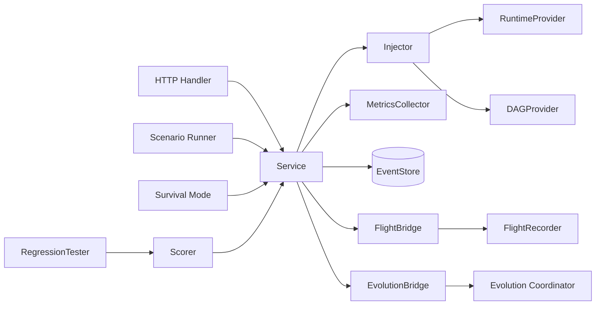

`ares_arena` 包（`internal/ares_arena`，导入路径 `arena`）是证明 ARES 为自愈运行时
的混沌工程层。它故意向运行中的 Agent 与 DAG 注入故障，记录结果，并将失败反馈给
演化协调器与飞行记录器。恢复由既有的 resurrection 插件、failover 与 checkpoint
机制处理。

## 职责

- 通过 `Injector` 向 `RuntimeProvider`（杀死/暂停/恢复/放慢 Agent、网络分区、
  工具超时、内存损坏、MCP 断开、LLM 失败）与 `DAGProvider`（移除节点与边）注入
  故障。
- 通过 `Service.Execute` 编排混沌：记录结果、更新统计、采集指标、发射竞技场事件，
  并将失败转发到 flight 与 evolution bridge。
- 运行声明式 `Scenario` 文件（YAML），支持 warmup/cooldown、按动作延迟、
  stop-on-error 及期望校验（`ExpectSuccess` / `ExpectFailure`）。
- 运行连续 `Survival` 模式：在配置时长内按间隔发射随机混沌动作，并生成带弹性分数
  的 `SurvivalReport`。
- 以三维加权模型（可用性 40%、恢复 30%、一致性 30%）评分弹性并给出等级。
- 使用 `RegressionTester` 对策略做 A/B 测试，支持并行评分、可选自适应提前停止与
  Welch t 检验判断统计显著性。
- 暴露 HTTP 端点（可选 API Key 鉴权）与竞技场事件的 SSE 流。

## 架构图



`Service` 是中央编排器。`Execute` 将 `Action` 分派给 `Injector`，后者调用对应的
`RuntimeProvider` 或 `DAGProvider` 方法。结果流向统计、`MetricsCollector`、事件
存储及两个 bridge。`Scenario`、`Survival` 与 `RegressionTester` 是构建在
`Service.Execute` 之上的高层驱动器。`EvolutionBridge` 将失败动作转换为
`PatchProposal`，对高优先级（>=9）故障通过 `ApplyEmergency` 立即应用，其余提交给
协调器。

## 外部接口

以下接口由运行时实现并注入竞技场，签名均从 `injector.go`、`service.go` 与
`regression.go` 中逐字提取。

```go
// RuntimeProvider is the subset of ares_runtime capabilities needed by the arena.
type RuntimeProvider interface {
    StopAgent(ctx context.Context, agentID string) error
    ListAgents() []ares_runtime.AgentInfo
    PauseAgent(ctx context.Context, agentID string) error
    ResumeAgent(ctx context.Context, agentID string) error
    SlowAgent(ctx context.Context, agentID string, delay time.Duration) error
    PartitionNetwork(ctx context.Context, agentID string) error
    ToolTimeout(ctx context.Context, agentID string, timeout time.Duration) error
    CorruptMemory(ctx context.Context, agentID string) error
    DisconnectMCP(ctx context.Context, agentID string) error
    InjectLLMFailure(ctx context.Context, agentID string, errType string) error
}

// DAGProvider is the subset of DAG mutation capabilities needed by the arena.
type DAGProvider interface {
    ListNodes(ctx context.Context) []string
    ListEdges(ctx context.Context) [][2]string
    RemoveNode(ctx context.Context, id string) error
    RemoveEdge(ctx context.Context, from, to string) error
}

// EventStore is the subset of event store capabilities needed by the arena.
type EventStore interface {
    Append(ctx context.Context, streamID string, events []*ares_events.Event, expectedVersion int64) error
    StreamVersion(ctx context.Context, streamID string) (int64, error)
    Subscribe(ctx context.Context, filter ares_events.EventFilter) (<-chan *ares_events.Event, error)
}

// Scorer defines how to score a single strategy or its execution result.
type Scorer interface {
    Score(input any) (float64, error)
}
```

## 关键类型与方法

| 类型 | 用途 | 关键方法 |
|------|------|----------|
| `Service` | 编排混沌动作并发射事件 | `NewService`, `Execute`, `History`, `Stats`, `Metrics`, `Reset`, `Subscribe`, `SetFlightBridge`, `SetEvolutionBridge`, `RunSurvival`, `GetSurvivalStatus`, `StopSurvival` |
| `Injector` | 包装 runtime/DAG API 以注入故障 | `NewInjector`, `KillAgent`, `KillLeader`, `KillOrchestrator`, `PauseAgent`, `ResumeAgent`, `SlowAgent`, `NetworkPartition`, `ToolTimeout`, `CorruptMemory`, `DisconnectMCP`, `InjectLLMFailure`, `RemoveNode`, `RemoveEdge`, `DAGNodes`, `DAGEdges`, `AvailableAgentIDs` |
| `Handler` | 竞技场的 HTTP 端点 | `NewHandler`, `RegisterRoutes`, `SetFlightRecorder`, `SetAPIKey`, `APIKeyAuthMiddleware` |
| `Action` | 单个混沌动作 | （结构体，含 `ID`, `Type`, `TargetID`, `SourceID`, `Metadata`, `CreatedAt`） |
| `Result` | 动作的结果 | （结构体，含 `Success`, `Action`, `Error`, `Duration`） |
| `Scenario` | 声明式混沌场景 | `LoadScenario`, `LoadScenarioFile`, `ValidateScenario`, `RunScenarioReport` |
| `ScenarioReport` | 场景运行结果 | （结构体，含 `Results`, `Passed`, `Failed`, `Score`, `Verified`） |
| `ResilienceScore` | 弹性评级 | `CalculateScore`, `CalculateScoreV1` |
| `MetricsCollector` | 聚合竞技场指标 | `NewMetricsCollector`, `RecordActionResult`, `Snapshot`, `Reset` |
| `RegressionTester` | 策略 A/B 比较 | `NewRegressionTester`, `Run` |
| `SurvivalConfig` | 生存测试配置 | （结构体，含 `Duration`, `Interval`） |
| `EnsembleScorer` | 多评分器加权组合 | `NewEnsembleScorer`, `Score` |
| `FlightBridge` | 竞技场到飞行记录器的桥接 | `NewFlightBridge`, `OnActionExecuted` |
| `EvolutionBridge` | 竞技场到演化协调器的桥接 | `NewEvolutionBridge`, `OnActionExecuted` |

## 模块协作

- **ares_runtime**：`RuntimeProvider`（通常为 `ares_runtime.Manager`）支撑
  `Injector` 进行 Agent 级故障注入与列举。
- **ares_events**：`Service` 向 `"arena"` 流追加 `arena.action.executed` /
  `arena.action.failed` 事件，并通过 `Subscribe` channel 暴露给 SSE 流。
- **ares_flight**：`FlightBridge` 将每个动作记录为时间线事件，失败时记录为带建议
  修复的诊断记录（修复建议由动作类型推导）。
- **evolution/coordinator**：`EvolutionBridge` 将失败动作转换为
  `PatchProposal`；高优先级故障（leader/orchestrator kill）通过 `ApplyEmergency`
  绕过决策策略以实现自愈。
- **evidence**：配置后，失败动作也会作为 `chaos` / `KindFailure` 证据追加到统一的
  `evidence.Store`。
- **dashboard**：`dashboard.ArenaBridge` 包装 `Service`，在 API Key 鉴权后暴露混沌
  与生存端点。

## 扩展方式

1. 针对你的 runtime 与 DAG 实现 `RuntimeProvider` 与 `DAGProvider`，再用
   `NewInjector(rt, dag)` 构造 `Injector`。
2. 用 `NewService(injector, store, evStore)` 创建 `Service`，其中 `store` 为
   `ares_events.EventStore`（nil 禁用事件发射），`evStore` 为可选的
   `evidence.Store`。
3. 通过 `SetFlightBridge`（记录时间线/诊断）与 `SetEvolutionBridge`（失败时提交
   patch 提案）挂载集成。
4. 以 YAML 编写混沌场景，用 `RunScenarioReport`（或 HTTP
   `POST /arena/scenario/run`）运行；先用 `ValidateScenario` 或
   `POST /arena/scenario/validate` 校验。
5. 通过 `RunSurvival(ctx, cfg)` 或 `POST /arena/survival` 启动生存测试；用
   `GetSurvivalStatus` 查询进度，用 `StopSurvival` 停止。
6. 做 A/B 测试时，实现 `Scorer`（或用 `NewEnsembleScorer` 组合多个），以
   `NewRegressionTester(arena, scorer)` 构建 `RegressionTester`，并用
   `RegressionConfig` 调用 `Run`（可通过 `AdaptiveBatchSize` 与
   `MinAdaptiveRuns` 启用自适应提前停止）。
7. 提供 HTTP 服务时，用 `NewHandler` 构造 `Handler`，调用 `RegisterRoutes(mux)`，
   用 `SetAPIKey` 启用鉴权；用 `RecoverMiddleware` 包装 mux 以保障 panic 安全。

## 双语状态

本页同时维护英文与中文版本，技术内容一致。两个译本中代码标识符、类型名与路由路径
均保持英文。

## 成熟度

Beta。该包功能完备且测试充分（`http_test.go`、`injector_test.go`、
`integration_test.go`、`metrics_test.go`、`regression_test.go`、
`robustness_test.go`、`scenario_test.go`、`score_test.go`、`scorer_test.go`、
`service_test.go`、`survival_test.go`、`types_test.go`、
`evolution_bridge_test.go`），但场景运行器会警告 `parallel_actions`、
`max_concurrent` 与 `depends_on` 已配置但尚未强制执行，`RunScenario` 已废弃并由
`RunScenarioReport` 取代，且若干 `MetricsCollector` 记录方法已废弃并由
`RecordActionResult` 取代。因此公开 API 仍在演进。


