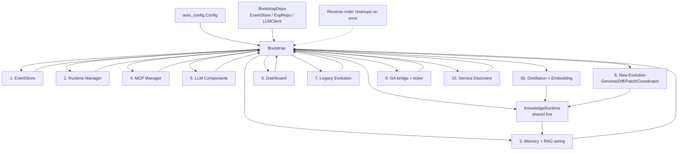

# ares_bootstrap

## Responsibility

`ares_bootstrap` is the single composition root for the ARES server. It takes a
parsed `ares_config.Config` plus a set of optional external dependencies
(database-backed repositories, an LLM client, an event store) and assembles
every subsystem the runtime needs: event store, runtime manager, memory, MCP,
LLM client, experience distillation, dashboard, the legacy evolution system,
the new genome/diff/coordinator evolution system, knowledge runtime, and the
optional service discovery engine.

It owns the failure contract for wiring: on any partial failure the already
created components are cleaned up in reverse order of creation before the error
is returned. It is the only package that should know how the cross-cutting
pieces fit together; `api/bootstrap`, `cmd/ares serve`, and tests all funnel
through `Bootstrap`.

## Architecture



The numbered steps mirror the order inside `Bootstrap`. The shared
`KnowledgeRuntime` is created once and reused by both the new evolution system
and the agent's AKF tools, so knowledge genome patches affect the real runtime.
The live memory manager is type-asserted to `MemoryConfigStore` and injected so
memory patches mutate the agent's actual config rather than an isolated copy.

## External interfaces

```go
// Bootstrap assembles all components from config and optional dependencies.
func Bootstrap(ctx context.Context, cfg *ares_config.Config, deps *BootstrapDeps) (*Components, error)

// ProvideNewEvolution wires Genome Registry -> Diff Registry -> Patch Registry -> Coordinator.
func ProvideNewEvolution(dag *engine.MutableDAG, rt *knowledgeruntime.KnowledgeRuntime, memoryStore aresmemory.MemoryConfigStore) (*NewEvolutionComponents, error)

// ProvideEvolution wires the legacy evolution system (adapter, scheduler, dream cycle, evaluators).
func ProvideEvolution(ctx context.Context, cfg *ares_config.EvolutionConfig, eventStore ares_events.EventStore, expRepo repositories.ExperienceRepositoryInterface, callbackReg *ares_callbacks.Registry, llmClient ares_eval.LLMClient) (*EvolutionComponents, error)

// ProvideMCP, ProvideDashboard, ProvideLLM, ProvideMemory, ProvideRuntime, ProvideDiscovery
// each construct a single subsystem and are called from Bootstrap.

// BuildKnowledgeRuntime builds a KnowledgeRuntime with memory + code providers.
func BuildKnowledgeRuntime() *knowledgeruntime.KnowledgeRuntime

// UpdateLiveDAG injects a live agent DAG into the evolution executors after bootstrap.
func (c *NewEvolutionComponents) UpdateLiveDAG(dag *engine.MutableDAG) error

// UpdateLiveKnowledgeRuntime swaps the live KnowledgeRuntime into the executor.
func (c *NewEvolutionComponents) UpdateLiveKnowledgeRuntime(rt *knowledgeruntime.KnowledgeRuntime)

func SetAllowedConfigDir(dir string) // re-exported security helper from ares_config
```

## Key types and methods

| Type / Method | Purpose |
|---|---|
| `Components` | Aggregate of every assembled subsystem; returned by `Bootstrap`. |
| `BootstrapDeps` | Optional external deps: `EventStore`, `ExpRepo`, `LLMClient`. |
| `LLMComponents` | Holds the LLM client and callback registry. |
| `EvolutionComponents` | Legacy evolution parts: adapter, scheduler, dream cycle, feedback, evaluators. |
| `NewEvolutionComponents` | New genome/diff/patch/coordinator system plus `StrategyStore` and `LLMAdapter`. |
| `DiscoveryComponents` | Optional service discovery engine (nil when disabled). |
| `Bootstrap(ctx, cfg, deps)` | Main wiring entry point with reverse-order cleanup on error. |
| `ProvideNewEvolution(dag, rt, memoryStore)` | Builds the registry/coordinator pipeline. |
| `UpdateLiveDAG(dag)` | Replaces synthetic executors with the live agent DAG. |
| `UpdateLiveKnowledgeRuntime(rt)` | Swaps the live knowledge runtime in place. |
| `BuildKnowledgeRuntime()` | Constructs a knowledge runtime with memory/code providers. |

## Module collaboration

- Depends on `ares_config` for the parsed configuration tree.
- Consumes `ares_events`, `ares_runtime`, `ares_memory`, `ares_mcp`,
  `ares_callbacks`, `ares_eval`, `ares_experience`, `ares_flight` for the
  legacy runtime and evolution wiring.
- Drives the new evolution stack from `internal/evolution`
  (`coordinator`, `diff`, `genome`, `patch`) and `internal/ares_evolution`
  (`service`, `scheduler`, `dream_cycle`, `genome_wiring`).
- Shares `internal/knowledge/runtime` between the evolution system and the
  agent's AKF tools, and `internal/workflow/engine` for the live mutable DAG.
- Optionally wires `internal/evolution/deployment` for safe patch promotion.

## Extension points

1. Pass a custom `BootstrapDeps` to `Bootstrap` to inject a pre-built event
   store, experience repository, or LLM client instead of letting bootstrap
   construct defaults.
2. After `Bootstrap` returns, call `comp.NewEvolution.UpdateLiveDAG(dag)` with
   the agent's real DAG so workflow/scheduler/recovery patches target live
   state instead of the synthetic placeholder.
3. Call `comp.NewEvolution.UpdateLiveKnowledgeRuntime(rt)` to swap the agent's
   live `KnowledgeRuntime` into the knowledge patch executor.
4. Set `cfg.Evolution.Deployment.Enabled = true` in YAML to route accepted
   patches through the `DeploymentPipeline` (staging then live) instead of
   direct application by the Coordinator.
5. Set `cfg.Discovery.Enabled = true` to opt into service discovery; otherwise
   discovery stays unwired and prior behavior is preserved.
6. Provide a custom `GuidanceProvider`/`LLMClient` through the distillation
   path so the GA evolution receives experience-guided mutation hints.

## Bilingual status

English source is the canonical reference. The Chinese translation mirrors the
same structure, signatures, and technical content; all code identifiers, type
names, and signatures remain in English in both pages.

## Maturity

`ares_bootstrap` is covered by `bootstrap_test.go`, `bootstrap_steps_test.go`,
`callback_injection_test.go`, `strategy_adapter_test.go`, and
`provide_new_evolution_live_memory_test.go`. It is the wiring entry point used
by `api/bootstrap` and `cmd/ares serve`, with no experimental markers.


