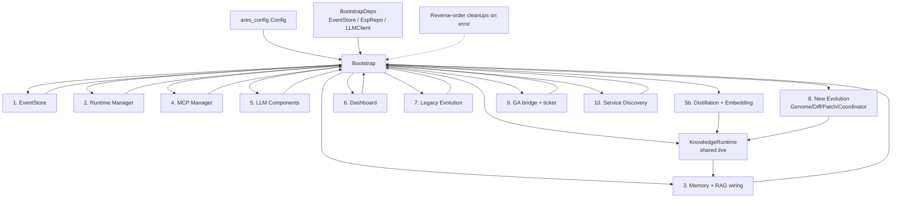

# ares_bootstrap

## 职责

`ares_bootstrap` 是 ARES 服务器的唯一装配根。它接收已解析的
`ares_config.Config` 以及一组可选外部依赖(数据库仓库、LLM 客户端、事件存储),
并组装运行时所需的全部子系统:事件存储、运行时管理器、记忆、MCP、LLM 客户端、
经验蒸馏、仪表盘、旧版进化系统、新版 genome/diff/coordinator 进化系统、
知识运行时,以及可选的服务发现引擎。

它拥有装配的失败契约:任何阶段失败时,已创建的组件会按创建顺序的逆序被清理,
然后才返回错误。只有该包应当知道这些横切组件如何拼接;`api/bootstrap`、
`cmd/ares serve` 与测试都经由 `Bootstrap` 汇聚。

## 架构图



编号步骤对应 `Bootstrap` 内部的执行顺序。共享的 `KnowledgeRuntime` 只创建一次,
同时被新版进化系统与 agent 的 AKF 工具复用,因此 knowledge genome 补丁会作用于
真实运行时。实时记忆管理器被类型断言为 `MemoryConfigStore` 并注入,使记忆补丁修改
agent 的实际配置而非隔离副本。

## 外部接口

```go
// Bootstrap assembles all components from config and optional dependencies.
func Bootstrap(ctx context.Context, cfg *ares_config.Config, deps *BootstrapDeps) (*Components, error)

// ProvideNewEvolution wires Genome Registry -> Diff Registry -> Patch Registry -> Coordinator.
func ProvideNewEvolution(dag *engine.MutableDAG, rt *knowledgeruntime.KnowledgeRuntime, memoryStore aresmemory.MemoryConfigStore) (*NewEvolutionComponents, error)

// ProvideEvolution wires the legacy evolution system (adapter, scheduler, dream cycle, evaluators).
func ProvideEvolution(ctx context.Context, cfg *ares_config.EvolutionConfig, eventStore ares_events.EventStore, expRepo repositories.ExperienceRepositoryInterface, callbackReg *ares_callbacks.Registry, llmClient ares_eval.LLMClient) (*EvolutionComponents, error)

// ProvideMCP, ProvideDashboard, ProvideLLM, ProvideMemory, ProvideRuntime, ProvideDiscovery
// each construct a single subsystem and are called from Bootstrap.

// BuildKnowledgeRuntime builds a KnowledgeRuntime with memory + code providers.
func BuildKnowledgeRuntime() *knowledgeruntime.KnowledgeRuntime

// UpdateLiveDAG injects a live agent DAG into the evolution executors after bootstrap.
func (c *NewEvolutionComponents) UpdateLiveDAG(dag *engine.MutableDAG) error

// UpdateLiveKnowledgeRuntime swaps the live KnowledgeRuntime into the executor.
func (c *NewEvolutionComponents) UpdateLiveKnowledgeRuntime(rt *knowledgeruntime.KnowledgeRuntime)

func SetAllowedConfigDir(dir string) // re-exported security helper from ares_config
```

## 关键类型与方法

| 类型 / 方法 | 用途 |
|---|---|
| `Components` | 所有已装配子系统的聚合;由 `Bootstrap` 返回。 |
| `BootstrapDeps` | 可选外部依赖:`EventStore`、`ExpRepo`、`LLMClient`。 |
| `LLMComponents` | 持有 LLM 客户端与回调注册表。 |
| `EvolutionComponents` | 旧版进化部件:adapter、scheduler、dream cycle、feedback、evaluators。 |
| `NewEvolutionComponents` | 新版 genome/diff/patch/coordinator 系统及 `StrategyStore`、`LLMAdapter`。 |
| `DiscoveryComponents` | 可选服务发现引擎(禁用时为 nil)。 |
| `Bootstrap(ctx, cfg, deps)` | 主装配入口,失败时按逆序清理。 |
| `ProvideNewEvolution(dag, rt, memoryStore)` | 构建 registry/coordinator 流水线。 |
| `UpdateLiveDAG(dag)` | 用 agent 实时 DAG 替换合成执行器。 |
| `UpdateLiveKnowledgeRuntime(rt)` | 原地将实时 knowledge runtime 注入执行器。 |
| `BuildKnowledgeRuntime()` | 构建带 memory/code provider 的 knowledge runtime。 |

## 模块协作

- 依赖 `ares_config` 获取已解析的配置树。
- 消费 `ares_events`、`ares_runtime`、`ares_memory`、`ares_mcp`、
  `ares_callbacks`、`ares_eval`、`ares_experience`、`ares_flight` 来装配
  旧版运行时与进化系统。
- 驱动 `internal/evolution`(`coordinator`、`diff`、`genome`、`patch`)
  与 `internal/ares_evolution`(`service`、`scheduler`、`dream_cycle`、
  `genome_wiring`)组成的新版进化栈。
- 在进化系统与 agent 的 AKF 工具之间共享 `internal/knowledge/runtime`,
  并使用 `internal/workflow/engine` 作为实时可变 DAG。
- 可选装配 `internal/evolution/deployment` 实现补丁安全提升。

## 扩展方式

1. 向 `Bootstrap` 传入自定义 `BootstrapDeps`,注入预构建的事件存储、经验仓库
   或 LLM 客户端,而非让 bootstrap 构造默认实现。
2. `Bootstrap` 返回后,调用 `comp.NewEvolution.UpdateLiveDAG(dag)` 传入 agent 的
   实际 DAG,使 workflow/scheduler/recovery 补丁作用于实时状态而非合成占位。
3. 调用 `comp.NewEvolution.UpdateLiveKnowledgeRuntime(rt)`,将 agent 的实时
   `KnowledgeRuntime` 注入 knowledge patch executor。
4. 在 YAML 中设置 `cfg.Evolution.Deployment.Enabled = true`,使被接受的补丁经由
   `DeploymentPipeline`(先 staging 后 live)而非由 Coordinator 直接应用。
5. 设置 `cfg.Discovery.Enabled = true` 开启服务发现;否则发现保持未装配,
   维持原有行为。
6. 通过蒸馏路径提供自定义 `GuidanceProvider`/`LLMClient`,使 GA 进化获得
   经验引导的变异提示。

## 双语状态

英文源为权威参考。中文翻译保持相同的结构、签名与技术内容;两份页面中所有代码标识符、
类型名与签名均保持英文。

## 成熟度

`ares_bootstrap` 由 `bootstrap_test.go`、`bootstrap_steps_test.go`、
`callback_injection_test.go`、`strategy_adapter_test.go` 与
`provide_new_evolution_live_memory_test.go` 覆盖。它是 `api/bootstrap` 与
`cmd/ares serve` 使用的装配入口,无实验性标记。


