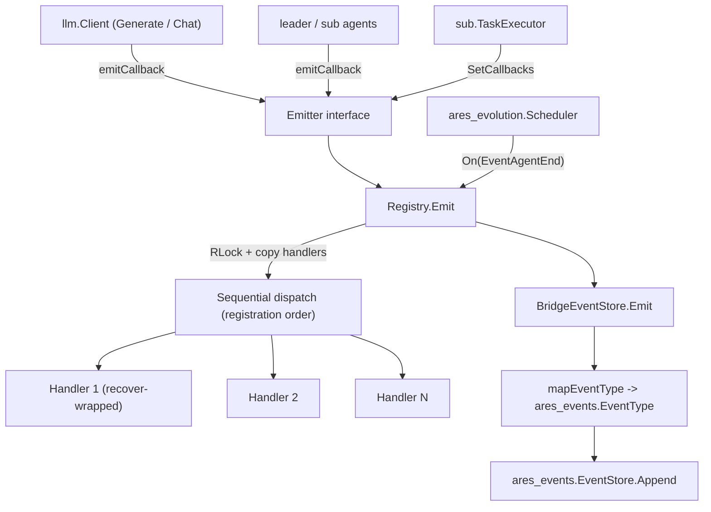

The `internal/ares_callbacks` package (package `ares_callbacks`) provides
lifecycle event hooks for LLM calls, agent execution, and tool invocations. It
exposes a thread-safe `Registry` that implements both the `Emitter` and
`CallbackRegistrar` interfaces, a `Context` carrying event metadata, ten
canonical `Event` types, and a `BridgeEventStore` that converts callback events
into persisted `ares_events.EventStore` entries so instrumentation consumers
only need to watch one stream.

## Responsibility

- Define the `Event` enum (`llm.start`, `llm.end`, `llm.error`, `llm.token`,
  `agent.start`, `agent.end`, `agent.error`, `tool.start`, `tool.end`,
  `tool.error`) and the `Context` struct carrying `AgentID`, `ToolName`,
  `Model`, `Input`, `Output`, `Error`, `Duration`, `TokenCount`, `Extra`, and a
  `GoCtx` for trace propagation.
- Provide `Registry` (`NewRegistry`, `On`, `Emit`, `Clear`, `Count`) that
  registers multiple handlers per event and dispatches them sequentially in
  registration order.
- Decouple producers from the concrete registry via the `Emitter` interface
  (`Emit`) and consumers via the `CallbackRegistrar` interface (`On`, `Count`).
- Guarantee concurrency safety: `Emit` snapshots the handler slice under a read
  lock and invokes handlers outside the lock, each wrapped in `recover()` so a
  panicking handler never crashes the caller.
- Bridge callback events into the event-sourcing system via
  `BridgeEventStore`, which maps `Event` constants to `ares_events.EventType`
  and appends them to an `EventStore` with a 5-second timeout.

## Architecture



## External interfaces

```go
// Event types (callbacks.go)
type Event string
const (
    EventLLMStart   Event = "llm.start"
    EventLLMEnd     Event = "llm.end"
    EventLLMError   Event = "llm.error"
    EventLLMToken   Event = "llm.token"
    EventAgentStart Event = "agent.start"
    EventAgentEnd   Event = "agent.end"
    EventAgentError Event = "agent.error"
    EventToolStart  Event = "tool.start"
    EventToolEnd    Event = "tool.end"
    EventToolError  Event = "tool.error"
)

// Event context (callbacks.go)
type Context struct {
    Event      Event
    AgentID    string
    ToolName   string
    Model      string
    Input      string
    Output     string
    Error      error
    Duration   time.Duration
    TokenCount int
    Extra      map[string]any
    GoCtx      context.Context // trace propagation; used by BridgeEventStore
}
type Handler func(ctx *Context)

// Abstraction interfaces (callbacks.go)
type Emitter interface {
    Emit(ctx *Context)
}
type CallbackRegistrar interface {
    On(event Event, handler Handler)
    Count(event Event) int
}

// Registry (callbacks.go)
type Registry struct {
    handlers map[Event][]Handler
    mu       sync.RWMutex
}
func NewRegistry() *Registry
func (r *Registry) On(event Event, handler Handler)
func (r *Registry) Emit(ctx *Context)
func (r *Registry) Clear()
func (r *Registry) Count(event Event) int

// EventStore bridge (callback_bridge.go)
type BridgeEventStore struct {
    store   ares_events.EventStore
    agentID string
}
func NewBridge(store ares_events.EventStore, agentID string) *BridgeEventStore
func (b *BridgeEventStore) Emit(ctx *Context)

// Public API wrapper (api/service/callbacks/service.go)
type Registry struct{ inner *internal.Registry }
type Event = internal.Event
type Context = internal.Context
type Handler = internal.Handler
func New() *Registry
func (r *Registry) On(event Event, handler Handler)
func (r *Registry) Emit(ctx *Context)
func (r *Registry) Clear()
func (r *Registry) Count(event Event) int
```

## Key types and methods

| Type / Method | Purpose |
| --- | --- |
| `Event` | String enum for the ten lifecycle event types across LLM, agent, and tool layers. |
| `Context` | Metadata carrier passed to handlers; `GoCtx` enables trace propagation into the bridge. |
| `Handler` | Function signature `func(ctx *Context)` invoked on event emission. |
| `Emitter` | Producer-facing interface with a single `Emit` method; decouples emitters from `Registry`. |
| `CallbackRegistrar` | Consumer-facing interface with `On` and `Count`; decouples subscribers from `Registry`. |
| `Registry` | Thread-safe handler store; implements both `Emitter` and `CallbackRegistrar` (compile-time asserted). |
| `Registry.On` | Appends a handler for an event; multiple handlers per event are allowed. |
| `Registry.Emit` | Snapshots handlers under `RLock`, dispatches sequentially in registration order, each `recover`-wrapped; nil context is a no-op. |
| `Registry.Clear` | Removes all handlers for all event types. |
| `Registry.Count` | Returns the number of handlers registered for a given event. |
| `BridgeEventStore` | `Emitter` implementation that translates callback events into `ares_events.EventStore` appends. |
| `BridgeEventStore.Emit` | Maps `Event` to `ares_events.EventType`, builds a payload, and appends with a 5s timeout using `ctx.GoCtx` when set. |
| `NewBridge` | Constructs a `BridgeEventStore` bound to an `EventStore` and stream `agentID`. |

## Module collaboration

- `ares_callbacks` -> `internal/ares_events` for `EventStore` and `EventType`
  (the bridge maps `EventLLMStart`/`End`/`Error` to `EventLLMCall`,
  `EventToolStart`/`End`/`Error` to `EventToolCallStarted`/`Completed`, and
  `EventAgentStart`/`End`/`Error` to `EventAgentStarted`/`Stopped`).
- `ares_callbacks` -> `internal/logger` via the package-level `log` variable
  (`logger.Module("ares_callbacks")`).
- `internal/llm` injects an `Emitter` through `llm.WithCallbacks` and emits
  `EventLLMStart` / `EventLLMEnd` / `EventLLMError` from `Generate`,
  `GenerateStream`, and `Chat`.
- `internal/agents/leader` and `internal/agents/sub` accept an `Emitter` via
  `WithCallbacks` / `SetCallbacks` and emit agent and tool lifecycle events.
- `internal/ares_bootstrap` wires one shared `Registry` into the LLM client,
  task executor, and leader agent through `NewCallbackRegistry`,
  `NewLLMClientWithCallbacks`, `WireTaskExecutorCallbacks`, and
  `WireLeaderAgentCallbacks`.
- `internal/ares_evolution` registers an `EventAgentEnd` handler on the shared
  registry to trigger evolution cycles after an agent stops.
- `api/service/callbacks` re-exports the registry as a thin wrapper for public
  consumers, aliasing `Event`, `Context`, and `Handler` to the internal types.

## Extension points

1. Subscribe to a lifecycle event by obtaining the shared `*Registry` (or any
   `CallbackRegistrar`) and calling `On(event, handler)`. Multiple handlers for
   the same event execute in registration order.
2. Emit events from a new component by depending on the `Emitter` interface
   and calling `Emit(&Context{...})` at the relevant lifecycle points; populate
   `GoCtx` so the bridge can propagate traces.
3. Persist callback events into the event-sourcing stream by constructing
   `NewBridge(store, agentID)` and registering it as a handler (or passing it
   as the `Emitter`); unmapped event types are silently skipped.
4. Add a new event type by extending the `Event` constants and, if bridging is
   required, adding a case to `BridgeEventStore.mapEventType`.
5. Reset state between tests or runs with `Registry.Clear()`; verify wiring
   with `Registry.Count(event)` in assertions.
6. Expose callbacks to external SDK users through
   `api/service/callbacks.New()`, which returns a wrapped `Registry` sharing
   the same `Event` / `Context` / `Handler` types.

## Bilingual status

This page is the English reference. A Chinese translation with identical
structure and technical content is published as `ares_callbacks.zh.md`. All code
identifiers, type names, and signatures are kept in English in both files;
only the prose differs.

## Maturity

Beta. The package is covered by `callbacks_test.go` and `integration_test.go`
(handler registration, dispatch order, nil-context safety, concurrent
emit/registration, all-field propagation, interface verification) and is wired
into the LLM client, leader/sub agents, and the evolution scheduler. The API is
functional but still evolving: the `Event` enum and `Context` fields may grow
as new instrumentation surfaces are added, and the bridge mapping is
incomplete for `EventLLMToken`.


