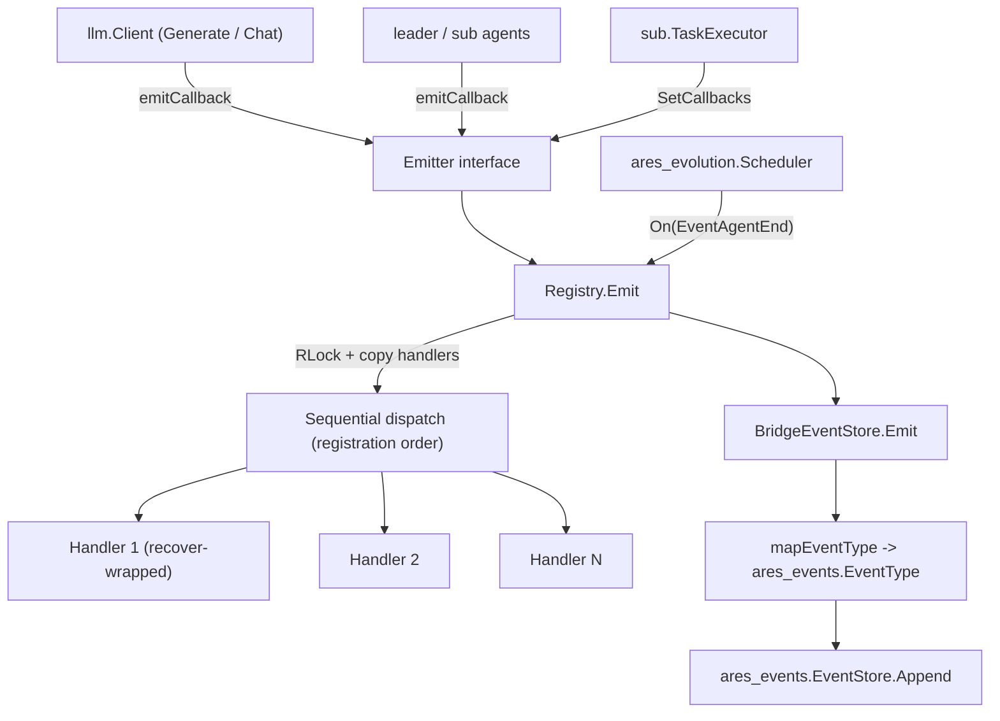

`internal/ares_callbacks` 包（包名 `ares_callbacks`）为 LLM 调用、智能体执行与
工具调用提供生命周期事件钩子。它提供线程安全的 `Registry`（同时实现 `Emitter` 与
`CallbackRegistrar` 接口）、携带事件元数据的 `Context`、十个标准 `Event` 类型，以及
`BridgeEventStore`（将回调事件转换为持久化的 `ares_events.EventStore` 条目，使插桩
消费方只需监听一个事件流）。

## 职责

- 定义 `Event` 枚举（`llm.start`、`llm.end`、`llm.error`、`llm.token`、
  `agent.start`、`agent.end`、`agent.error`、`tool.start`、`tool.end`、
  `tool.error`）与 `Context` 结构体，携带 `AgentID`、`ToolName`、`Model`、
  `Input`、`Output`、`Error`、`Duration`、`TokenCount`、`Extra` 以及用于链路传播的
  `GoCtx`。
- 提供 `Registry`（`NewRegistry`、`On`、`Emit`、`Clear`、`Count`），支持同一事件
  注册多个 handler，并按注册顺序依次派发。
- 通过 `Emitter` 接口（`Emit`）将生产者与具体 registry 解耦，通过
  `CallbackRegistrar` 接口（`On`、`Count`）将消费者与具体 registry 解耦。
- 保证并发安全：`Emit` 在读锁下快照 handler 切片，在锁外调用 handler，每个调用均
  包裹 `recover()`，确保 handler panic 不会拖垮调用方。
- 通过 `BridgeEventStore` 将回调事件桥接到事件溯源系统：把 `Event` 常量映射为
  `ares_events.EventType`，并以 5 秒超时追加到 `EventStore`。

## 架构图



## 外部接口

```go
// Event types (callbacks.go)
type Event string
const (
    EventLLMStart   Event = "llm.start"
    EventLLMEnd     Event = "llm.end"
    EventLLMError   Event = "llm.error"
    EventLLMToken   Event = "llm.token"
    EventAgentStart Event = "agent.start"
    EventAgentEnd   Event = "agent.end"
    EventAgentError Event = "agent.error"
    EventToolStart  Event = "tool.start"
    EventToolEnd    Event = "tool.end"
    EventToolError  Event = "tool.error"
)

// Event context (callbacks.go)
type Context struct {
    Event      Event
    AgentID    string
    ToolName   string
    Model      string
    Input      string
    Output     string
    Error      error
    Duration   time.Duration
    TokenCount int
    Extra      map[string]any
    GoCtx      context.Context // trace propagation; used by BridgeEventStore
}
type Handler func(ctx *Context)

// Abstraction interfaces (callbacks.go)
type Emitter interface {
    Emit(ctx *Context)
}
type CallbackRegistrar interface {
    On(event Event, handler Handler)
    Count(event Event) int
}

// Registry (callbacks.go)
type Registry struct {
    handlers map[Event][]Handler
    mu       sync.RWMutex
}
func NewRegistry() *Registry
func (r *Registry) On(event Event, handler Handler)
func (r *Registry) Emit(ctx *Context)
func (r *Registry) Clear()
func (r *Registry) Count(event Event) int

// EventStore bridge (callback_bridge.go)
type BridgeEventStore struct {
    store   ares_events.EventStore
    agentID string
}
func NewBridge(store ares_events.EventStore, agentID string) *BridgeEventStore
func (b *BridgeEventStore) Emit(ctx *Context)

// Public API wrapper (api/service/callbacks/service.go)
type Registry struct{ inner *internal.Registry }
type Event = internal.Event
type Context = internal.Context
type Handler = internal.Handler
func New() *Registry
func (r *Registry) On(event Event, handler Handler)
func (r *Registry) Emit(ctx *Context)
func (r *Registry) Clear()
func (r *Registry) Count(event Event) int
```

## 关键类型与方法

| 类型 / 方法 | 用途 |
| --- | --- |
| `Event` | 覆盖 LLM、智能体与工具层的十个生命周期事件类型的字符串枚举。 |
| `Context` | 传给 handler 的元数据载体；`GoCtx` 使桥接能够传播链路。 |
| `Handler` | 事件派发时调用的函数签名 `func(ctx *Context)`。 |
| `Emitter` | 面向生产者的接口，仅含 `Emit`；将发射方与 `Registry` 解耦。 |
| `CallbackRegistrar` | 面向消费者的接口，含 `On` 与 `Count`；将订阅方与 `Registry` 解耦。 |
| `Registry` | 线程安全的 handler 存储；同时实现 `Emitter` 与 `CallbackRegistrar`（编译期断言）。 |
| `Registry.On` | 为某事件追加 handler；同一事件允许注册多个 handler。 |
| `Registry.Emit` | 在 `RLock` 下快照 handler，按注册顺序依次派发，每个调用包裹 `recover`；nil context 为 no-op。 |
| `Registry.Clear` | 清空所有事件类型的全部 handler。 |
| `Registry.Count` | 返回指定事件已注册的 handler 数量。 |
| `BridgeEventStore` | `Emitter` 实现，将回调事件转换为 `ares_events.EventStore` 追加。 |
| `BridgeEventStore.Emit` | 将 `Event` 映射为 `ares_events.EventType`，构建 payload，在设置 `ctx.GoCtx` 时以 5s 超时追加。 |
| `NewBridge` | 构造绑定到指定 `EventStore` 与流 `agentID` 的 `BridgeEventStore`。 |

## 模块协作

- `ares_callbacks` -> `internal/ares_events`：使用 `EventStore` 与 `EventType`
  （桥接将 `EventLLMStart`/`End`/`Error` 映射为 `EventLLMCall`，
  `EventToolStart`/`End`/`Error` 映射为 `EventToolCallStarted`/`Completed`，
  `EventAgentStart`/`End`/`Error` 映射为 `EventAgentStarted`/`Stopped`）。
- `ares_callbacks` -> `internal/logger`：通过包级 `log` 变量
  （`logger.Module("ares_callbacks")`）。
- `internal/llm` 通过 `llm.WithCallbacks` 注入 `Emitter`，并在 `Generate`、
  `GenerateStream` 与 `Chat` 中发射 `EventLLMStart` / `EventLLMEnd` /
  `EventLLMError`。
- `internal/agents/leader` 与 `internal/agents/sub` 通过
  `WithCallbacks` / `SetCallbacks` 接收 `Emitter`，发射智能体与工具生命周期事件。
- `internal/ares_bootstrap` 通过 `NewCallbackRegistry`、
  `NewLLMClientWithCallbacks`、`WireTaskExecutorCallbacks` 与
  `WireLeaderAgentCallbacks`，将同一个共享 `Registry` 接入 LLM 客户端、
  TaskExecutor 与 leader 智能体。
- `internal/ares_evolution` 在共享 registry 上注册 `EventAgentEnd` handler，
  在智能体停止后触发进化循环。
- `api/service/callbacks` 将 registry 以薄包装形式对外暴露，把 `Event`、
  `Context`、`Handler` 别名为内部类型。

## 扩展方式

1. 订阅生命周期事件：获取共享 `*Registry`（或任意 `CallbackRegistrar`），调用
   `On(event, handler)`。同一事件的多个 handler 按注册顺序执行。
2. 从新组件发射事件：依赖 `Emitter` 接口，在相应生命周期节点调用
   `Emit(&Context{...})`；填充 `GoCtx` 以便桥接传播链路。
3. 将回调事件持久化到事件溯源流：构造 `NewBridge(store, agentID)` 并将其注册为
   handler（或直接作为 `Emitter` 传入）；未映射的事件类型会被静默跳过。
4. 新增事件类型：扩展 `Event` 常量，并在需要桥接时为
   `BridgeEventStore.mapEventType` 增加一个 case。
5. 在测试或运行之间重置状态：调用 `Registry.Clear()`；在断言中用
   `Registry.Count(event)` 验证接线。
6. 向外部 SDK 用户暴露回调：通过 `api/service/callbacks.New()` 返回包装后的
   `Registry`，共享相同的 `Event` / `Context` / `Handler` 类型。

## 双语状态

本页为中文参考。结构与技术内容完全相同的英文版本发布为 `ares_callbacks.en.md`。两个文件中
所有代码标识符、类型名与签名均保持英文，仅叙述性文字不同。

## 成熟度

Beta。该包由 `callbacks_test.go` 与 `integration_test.go` 覆盖（handler 注册、派发顺序、
nil context 安全、并发 emit/注册、全字段传播、接口验证），并已接入 LLM 客户端、
leader/sub 智能体与进化调度器。API 功能完备但仍在演进：`Event` 枚举与 `Context` 字段
可能随新插桩面扩展而增加，且桥接映射尚未覆盖 `EventLLMToken`。


