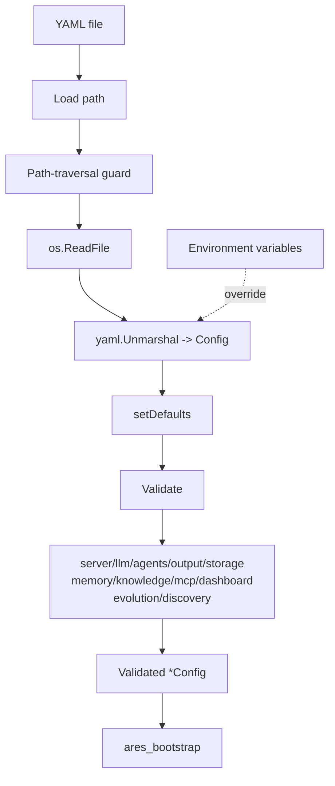

# ares_config

## Responsibility

`ares_config` owns the entire configuration surface for ARES. It reads a YAML
file, applies layered defaults, and runs
a section-by-section validation pass before handing a fully populated `Config`
to the bootstrap layer. It also guards against path-traversal attacks when an
allowed config directory is configured.

The package defines every configuration struct the server understands: server,
LLM (with fallbacks and scorer rate limits), agents, tools, prompts, output,
validation, workflow, storage (with pgvector), memory (session, profile,
distillation, RAG, archive), knowledge (AKG retrieval), MCP servers, dashboard,
evolution (GA, LLM scoring, deployment), embedding, and discovery.

## Architecture



`Load` is the single entry point: it secures the path, parses YAML, calls
`setDefaults` to fill zero values with sensible defaults, then calls `Validate`.
`LoadFromEnv` is applied separately to let environment variables override the
YAML-derived values. Defaults are conditional: RAG, distillation, and knowledge
retrieval parameters are only filled when their respective enable flag is true,
so opting out keeps those subsystems inert.

## External interfaces

```go
// Load reads configuration from a YAML file, applies defaults, and validates it.
func Load(path string) (*Config, error)

// (removed) The env-var override surface (LoadFromEnv / ARES_* variables)
// was deleted — ares.yaml is the single configuration entry point.

// SetAllowedConfigDir sets the allowed directory for config files (security).
func SetAllowedConfigDir(dir string)

// Validate validates the configuration values.
func (c *Config) Validate() error

// IsEnabled reports whether archiving is active (nil/true = enabled).
func (a ArchiveConfig) IsEnabled() bool

// DefaultArchiveDir is the default round-archive directory.
const DefaultArchiveDir = ".context/rounds"

// DefaultTaskDistillationPrompt is the default prompt for task distillation.
const DefaultTaskDistillationPrompt = "Please concisely summarize..."
```

## Key types and methods

| Type / Method | Purpose |
|---|---|
| `Config` | Top-level struct aggregating every config section. |
| `ServerConfig` | Host and port for the HTTP server. |
| `LLMConfig` | Provider, API key, model, timeouts, scorer rate/burst, fallbacks. |
| `AgentsConfig` / `LeaderConfig` / `SubAgentConfig` | Leader and sub-agent tuning. |
| `MemoryConfig` | Session, profile, distillation, RAG, archive settings. |
| `ArchiveConfig` | Round-archive dir and max rounds; `IsEnabled()` default-on semantics. |
| `KnowledgeConfig` | Optional AKG retrieval (TopK, MinScore). |
| `StorageConfig` / `PGVectorConfig` | Postgres/SQLite storage and pgvector. |
| `MCPConfig` / `MCPServerEntry` / `TransportEntry` | MCP server stdio/SSE transports. |
| `EvolutionConfig` | GA population, mutation, selection, deployment, LLM scoring. |
| `LLMScoringConfig` | Opt-in LLM-backed strategy scorer with seed and call budget. |
| `EmbeddingConfig` | Embedding client for experience distillation. |
| `DiscoveryConfig` | Optional service discovery engine. |
| `Load(path)` | Read, default, and validate a YAML config. |
| `LoadFromEnv(cfg)` | Overlay environment variables onto a config. |
| `setDefaults()` | Internal: conditional default filling. |
| `Validate()` | Internal: section-by-section validation. |

## Module collaboration

- Consumed by `ares_bootstrap` as the input to `Bootstrap`.
- `EvolutionConfig.Deployment` references `internal/evolution/deployment.DeploymentConfig`.
- Validation errors are wrapped via `internal/errors` before propagation.
- Memory and knowledge defaults feed `ares_memory` and the knowledge runtime so
  RAG/AKG retrieval only activates when explicitly enabled.

## Extension points

1. Add a new top-level section by defining a struct, adding a field to `Config`
   with a `yaml` tag, populating its defaults in `setDefaults`, and adding a
   `validate<Section>()` method called from `Validate`.
2. Add a new environment override by extending `LoadFromEnv` with a `os.Getenv`
   branch that maps to the target field.
3. Restrict config file locations by calling `SetAllowedConfigDir` at startup;
   `Load` then rejects any path that resolves outside that directory.
4. Opt into closed-loop memory by setting `memory.enable_rag: true`; the
   defaults layer fills `RAGTopK` (5) and `RAGMinScore` (0.4) only when enabled.
5. Opt into LLM strategy scoring by setting `evolution.llm_scoring.enabled: true`
   and tuning `max_calls_per_generation` to cap API cost per generation.

## Bilingual status

English source is canonical. The Chinese page mirrors structure, signatures,
and technical content; all code identifiers, type names, and YAML keys remain
in English in both pages.

## Maturity

`ares_config` is covered by `config_test.go`, `config_closed_loop_test.go`,
and `archive_config_test.go`. It is integrated into the SDK bootstrap path and
contains no experimental markers.


## External-surface configuration keys (ares.yaml)

All runtime configuration travels through ares.yaml — there is no CLI-flag or
env config surface.

- `server.default_capability` (default `ares/plan`) — capability used when
  `POST /api/tasks` omits one. AUDIT-ONLY: execution is normalized to
  `ares/plan` at the Submitter; this value never routes tasks to a different
  agent population.
- `tasks.wait_timeout` (default `60s`) — default sync-wait for
  `POST /api/tasks?wait=` AND the `ares run` context timeout when set.
  Hard cap 300s on both surfaces (handler clamps; `ares run` unset default
  is 120s). Negative/unparseable values are rejected by validation.
- `security.api_key` — dedicated HTTP control-plane credential; takes
  precedence over `llm.api_key`. Both empty → write gate answers 401 (loopback
  included). `ares init` generates a random value into the project template
  (ares.yaml written mode 0600). Redacted in `Config.Redacted()`.
- `tools.file_sandbox_dir` — workspace root the file_tools sandbox allows
  agents to read/write. Empty (default) falls back to a process-PRIVATE temp
  dir — agents cannot touch the served repo/workspace until this is set.
- `evolution.llm_scoring.{enabled,seed,max_calls_per_generation}` and
  `evolution.shadow.{min_samples,min_win_rate,replay_window_span,replay_query_limit}`
  gate the GA evidence path (see the ares_evolution module page for verdict
  semantics).


