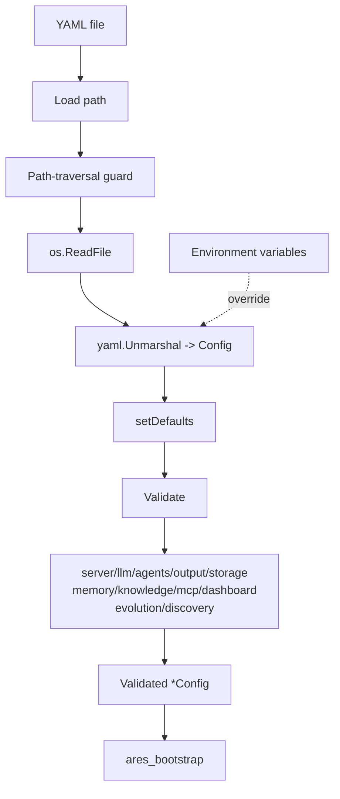

# ares_config

## 职责

`ares_config` 拥有 ARES 的全部配置面。它读取 YAML 文件,应用分层默认值,
在把完全填充的 `Config` 交给装配层之前执行逐节校验。ares.yaml 是唯一配置入口——不存在环境变量或 CLI flag 配置面。
当配置了允许的配置目录时,它还防御路径穿越攻击。

该包定义了服务器所理解的全部配置结构体:server、LLM(含 fallback 与
scorer 速率限制)、agents、tools、prompts、output、validation、workflow、
storage(含 pgvector)、memory(session、profile、distillation、RAG、
archive)、knowledge(AKG 检索)、MCP servers、dashboard、evolution(GA、
LLM scoring、deployment)、embedding 与 discovery。

## 架构图



`Load` 是唯一入口:它先保护路径,解析 YAML,调用 `setDefaults` 用合理默认值
填充零值,再调用 `Validate`。（历史：`LoadFromEnv` 曾提供环境变量覆盖，该表面已删除；
值。默认值是条件式的:RAG、distillation 与 knowledge retrieval 参数仅在其各自的
enable 标志为 true 时才填充,因此未启用时这些子系统保持惰性。

## 外部接口

```go
// Load reads configuration from a YAML file, applies defaults, and validates it.
func Load(path string) (*Config, error)

// (已移除) 环境变量覆盖表面（LoadFromEnv / ARES_*）已删除——ares.yaml 是唯一配置入口。

// SetAllowedConfigDir sets the allowed directory for config files (security).
func SetAllowedConfigDir(dir string)

// Validate validates the configuration values.
func (c *Config) Validate() error

// IsEnabled reports whether archiving is active (nil/true = enabled).
func (a ArchiveConfig) IsEnabled() bool

// DefaultArchiveDir is the default round-archive directory.
const DefaultArchiveDir = ".context/rounds"

// DefaultTaskDistillationPrompt is the default prompt for task distillation.
const DefaultTaskDistillationPrompt = "Please concisely summarize..."
```

## 关键类型与方法

| 类型 / 方法 | 用途 |
|---|---|
| `Config` | 聚合所有配置节的顶层结构体。 |
| `ServerConfig` | HTTP 服务器的 host 与 port。 |
| `LLMConfig` | provider、API key、model、超时、scorer 速率/突发、fallback。 |
| `AgentsConfig` / `LeaderConfig` / `SubAgentConfig` | Leader 与子 agent 调优。 |
| `MemoryConfig` | session、profile、distillation、RAG、archive 设置。 |
| `ArchiveConfig` | 轮次归档目录与最大轮数;`IsEnabled()` 默认开启语义。 |
| `KnowledgeConfig` | 可选 AKG 检索(TopK、MinScore)。 |
| `StorageConfig` / `PGVectorConfig` | Postgres/SQLite 存储与 pgvector。 |
| `MCPConfig` / `MCPServerEntry` / `TransportEntry` | MCP server 的 stdio/SSE 传输。 |
| `EvolutionConfig` | GA 种群、变异、选择、deployment、LLM scoring。 |
| `LLMScoringConfig` | 可选的 LLM 评分器,带 seed 与调用预算。 |
| `EmbeddingConfig` | 用于经验蒸馏的 embedding 客户端。 |
| `DiscoveryConfig` | 可选服务发现引擎。 |
| `Load(path)` | 读取、填充默认值并校验 YAML 配置。 |
| （已移除） | 环境变量覆盖表面（`LoadFromEnv`、`ARES_*`）已删除，仅经 ares.yaml 配置。 |
| `setDefaults()` | 内部:条件式默认值填充。 |
| `Validate()` | 内部:逐节校验。 |

## 模块协作

- 被 `ares_bootstrap` 消费,作为 `Bootstrap` 的输入。
- `EvolutionConfig.Deployment` 引用 `internal/evolution/deployment.DeploymentConfig`。
- 校验错误通过 `internal/errors` 包装后再传播。
- memory 与 knowledge 默认值喂给 `ares_memory` 与 knowledge runtime,使
  RAG/AKG 检索仅在显式启用时激活。

## 扩展方式

1. 新增顶层节:定义结构体,在 `Config` 中添加带 `yaml` tag 的字段,在
   `setDefaults` 中填充默认值,并新增一个从 `Validate` 调用的
   `validate<Section>()` 方法。
2. （历史）环境变量覆盖曾位于 `LoadFromEnv`；新字段仅从 ares.yaml 消费（G2 契约门要求生产消费者）：
   目标字段。
3. 通过启动时调用 `SetAllowedConfigDir` 限制配置文件位置;`Load` 会拒绝任何
   解析到该目录之外的路径。
4. 设置 `memory.enable_rag: true` 开启闭环记忆;默认值层仅在启用时填充
   `RAGTopK`(5)与 `RAGMinScore`(0.4)。
5. 设置 `evolution.llm_scoring.enabled: true` 开启 LLM 策略评分,并调整
   `max_calls_per_generation` 以限制每代 API 成本。

## 双语状态

英文源为权威参考。中文页面保持相同的结构、签名与技术内容;两份页面中所有代码
标识符、类型名与 YAML key 均保持英文。

## 成熟度

`ares_config` 由 `config_test.go`、`config_closed_loop_test.go` 与
`archive_config_test.go` 覆盖。它已集成进 SDK 装配路径,无实验性标记。


## 外部接口相关配置键（ares.yaml）

所有运行时配置只经 ares.yaml——不存在 CLI flag / 环境变量配置面。

- `server.default_capability`（默认 `ares/plan`）— `POST /api/tasks` 缺省
  capability 时使用。**仅审计**：执行侧在 Submitter 处规范化到 `ares/plan`，
  该值不会把任务路由到其他 agent 群体。
- `tasks.wait_timeout`（默认 `60s`）— `POST /api/tasks?wait=` 的默认同步等待，
  设置时同时作为 `ares run` 的 ctx 超时。两个面硬顶同为 300s（handler 收敛；
  `ares run` 未设置时默认 120s）。负值/不可解析值被校验拒绝。
- `security.api_key` — 专用 HTTP 控制面凭证，优先于 `llm.api_key`。两者皆空
  → write 门 401（含 loopback）。`ares init` 向项目模板生成随机值（ares.yaml
  以 0600 写盘）。在 `Config.Redacted()` 中脱敏。
- `tools.file_sandbox_dir` — file_tools 沙箱允许 agent 读写的工作区根目录。
  空值（默认）回退到进程私有临时目录——设置之前 agent 碰不到服务仓库/工作区。
- `evolution.llm_scoring.{enabled,seed,max_calls_per_generation}` 与
  `evolution.shadow.{min_samples,min_win_rate,replay_window_span,replay_query_limit}`
  控制 GA 证据路径（判决语义见 ares_evolution 模块页）。


