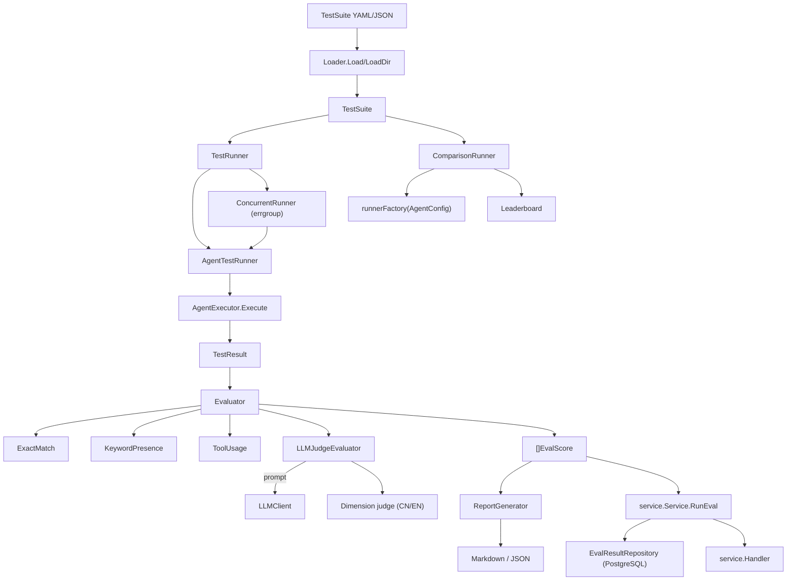

The `internal/ares_eval` package is ARES's evaluation and benchmarking
framework. It loads test suites, runs them against an agent, scores the
results with pluggable evaluators (exact match, keyword presence, tool
usage, LLM-as-judge, dimension-aware judge), and produces Markdown/JSON
reports. A `service` subpackage exposes an HTTP-friendly API with
PostgreSQL-backed persistence.

## Responsibility

- Define the core data model: `TestCase`, `TestSuite`, `TestResult`,
  `EvalScore`, and `Duration` (YAML/JSON-friendly `time.Duration`).
- Provide the `Evaluator` interface and four concrete evaluators:
  `ExactMatchEvaluator`, `KeywordPresenceEvaluator`, `ToolUsageEvaluator`,
  and `LLMJudgeEvaluator` (with `ScaleType` and dimension averaging).
- Run test cases via `TestRunner` implementations: `AgentTestRunner`
  (sequential), `ConcurrentRunner` (parallel with `errgroup`), and
  `ComparisonRunner` (side-by-side across `AgentConfig`s).
- Generate reports (`ReportGenerator.GenerateMarkdown`/`GenerateJSON`) and
  run end-to-end evaluation via `RunEvaluation`.
- Persist results through `service.Service` -> `EvalResultRepository`
  (PostgreSQL default), with `Handler` exposing `RunEval`, `GetResults`,
  `GetLeaderboard`, `GetComparison` over HTTP.

## Architecture



## External interfaces

```go
// internal/ares_eval
type Duration time.Duration  // YAML/JSON-unmarshalable duration

type TestCase struct {
    ID            string
    Name          string
    Input         string
    ExpectedOutput string
    ExpectedTools []string
    Timeout       Duration
    Metadata      map[string]interface{}
    Tags          []string
}

type TestSuite struct {
    Name        string
    Description string
    TestCases   []TestCase
    Tags        []string
}

type TestResult struct {
    TestCaseID  string
    ActualOutput string
    ToolsUsed   []string
    Duration    time.Duration
    TokensUsed  int
    Error       string
    Metrics     map[string]float64
    Timestamp   time.Time
}

type EvalScore struct {
    Metric  string
    Score   float64
    Details string
}

type Evaluator interface {
    Evaluate(ctx context.Context, testCase TestCase, result TestResult) ([]EvalScore, error)
}

type ExactMatchEvaluator struct{}
func NewExactMatchEvaluator() *ExactMatchEvaluator

type KeywordPresenceEvaluator struct{ Keywords []string }
func NewKeywordPresenceEvaluator(keywords []string) *KeywordPresenceEvaluator

type ToolUsageEvaluator struct{}
func NewToolUsageEvaluator() *ToolUsageEvaluator

type LLMClient interface {
    Generate(ctx context.Context, prompt string) (string, error)
}

type ScaleType int  // ScaleOneToTen, ScaleOneToFive, ScalePassFail

type LLMJudgeEvaluator struct { /* unexported */ }
type LLMJudgeOption func(*LLMJudgeEvaluator)
func WithPrompt(tmpl string) LLMJudgeOption
func WithScale(scale ScaleType) LLMJudgeOption
func WithChinesePrompt() LLMJudgeOption
func WithEnglishPrompt() LLMJudgeOption
func WithDimensionAveraging() LLMJudgeOption
func NewLLMJudgeEvaluator(client LLMClient, opts ...LLMJudgeOption) (*LLMJudgeEvaluator, error)
func (e *LLMJudgeEvaluator) Evaluate(ctx context.Context, tc TestCase, result TestResult) ([]EvalScore, error)
func (e *LLMJudgeEvaluator) Name() string

type EvaluatorRegistry struct { /* unexported */ }
func NewEvaluatorRegistry() *EvaluatorRegistry
func (r *EvaluatorRegistry) Register(name string, eval Evaluator) error
func (r *EvaluatorRegistry) Get(name string) (Evaluator, bool)
func (r *EvaluatorRegistry) Names() []string

type TestRunner interface {
    RunSuite(ctx context.Context, suite TestSuite) ([]TestResult, error)
    RunSingle(ctx context.Context, testCase TestCase) (TestResult, error)
}

type AgentExecutor interface {
    Execute(ctx context.Context, input string) (output string, toolsUsed []string, tokensUsed int, err error)
}

type AgentTestRunner struct { /* unexported */ }
func NewAgentTestRunner(executor AgentExecutor) (*AgentTestRunner, error)
func (r *AgentTestRunner) SetRegistry(registry *EvaluatorRegistry)
func (r *AgentTestRunner) RunSuite(ctx context.Context, suite TestSuite) ([]TestResult, error)
func (r *AgentTestRunner) RunSingle(ctx context.Context, testCase TestCase) (TestResult, error)
func (r *AgentTestRunner) RunAndEvaluate(ctx context.Context, suite TestSuite, evaluatorName string) ([]TestResult, [][]EvalScore, error)

type ConcurrentRunnerConfig struct {
    MaxParallel int
    Timeout     time.Duration
}
func DefaultConcurrentRunnerConfig() ConcurrentRunnerConfig

type ConcurrentRunner struct { /* unexported */ }
func NewConcurrentRunner(inner TestRunner, config ConcurrentRunnerConfig) (*ConcurrentRunner, error)
func (r *ConcurrentRunner) RunSuite(ctx context.Context, suite TestSuite) ([]TestResult, error)
func (r *ConcurrentRunner) RunSingle(ctx context.Context, testCase TestCase) (TestResult, error)

type AgentConfig struct {
    Name         string
    Model        string
    Parameters   map[string]any
    SystemPrompt string
}

type ComparisonResult struct {
    ConfigName       string
    Config           AgentConfig
    Results          []TestResult
    AggregatedScores map[string]float64
    OverallScore     float64
    TotalDuration    time.Duration
    PassRate         float64
    Error            string
}

type LeaderboardEntry struct {
    Rank       int
    ConfigName string
    Overall    float64
    Scores     map[string]float64
}

type ComparisonReport struct {
    SuiteName   string
    Timestamp   time.Time
    Results     []ComparisonResult
    Leaderboard []LeaderboardEntry
    Summary     ComparisonSummary
}

type ComparisonRunner struct { /* unexported */ }
func NewComparisonRunner(suite *TestSuite, runnerFactory func(AgentConfig) (TestRunner, error)) *ComparisonRunner
func (r *ComparisonRunner) Run(ctx context.Context, configs []AgentConfig) (*ComparisonReport, error)
func (r *ComparisonRunner) GenerateMarkdown(report *ComparisonReport) (string, error)
func GenerateLeaderboard(results []ComparisonResult) []LeaderboardEntry

type Loader struct{}
func NewLoader() *Loader
func (l *Loader) Load(path string) (*TestSuite, error)
func (l *Loader) LoadDir(dir string) ([]TestSuite, error)

type ReportGenerator struct{}
func NewReportGenerator() *ReportGenerator
func (g *ReportGenerator) GenerateMarkdown(suite TestSuite, results []TestResult, scores [][]EvalScore) (string, error)
func (g *ReportGenerator) GenerateJSON(suite TestSuite, results []TestResult, scores [][]EvalScore) (string, error)
func (g *ReportGenerator) SaveReport(path string, content string) error
func RunEvaluation(ctx context.Context, loader *Loader, runner TestRunner, evaluator Evaluator, suitePath string) ([]TestResult, [][]EvalScore, error)

// internal/ares_eval/service
type Service struct { /* unexported */ }
type Option func(*Service)
func WithAgentExecutor(exec ares_eval.AgentExecutor) Option
func NewService(repo EvalResultRepository, opts ...Option) (*Service, error)
func (s *Service) RunEval(ctx context.Context, req *RunEvalRequest) (*RunEvalResponse, error)
func (s *Service) GetResults(ctx context.Context, runID string) (*GetResultsResponse, error)
func (s *Service) GetLeaderboard(ctx context.Context, limit, offset int) (*LeaderboardResponse, error)
func (s *Service) GetComparison(ctx context.Context, runIDs []string) (*ComparisonResponse, error)

type EvalResult struct {
    ID            string
    RunID         string
    ConfigName    string
    SuiteName     string
    TestCaseID    string
    TestCaseName  string
    Score         float64
    Dimensions    map[string]float64
    Status        string
    ErrorMessage  *string
    DurationMs    int
    CreatedAt     time.Time
    UpdatedAt     time.Time
}

type EvalResultRepository interface {
    Store(ctx context.Context, result *EvalResult) error
    StoreBatch(ctx context.Context, results []*EvalResult) error
    GetByRunID(ctx context.Context, runID string) ([]*EvalResult, error)
    GetLeaderboard(ctx context.Context, limit, offset int) ([]*LeaderboardEntry, int, error)
    GetComparison(ctx context.Context, runIDs []string) ([]*ComparisonRow, error)
}

type Handler struct { /* unexported */ }
func NewHandler(svc *Service) *Handler
func (h *Handler) HandleRunEval(w http.ResponseWriter, r *http.Request)
func (h *Handler) HandleGetResults(w http.ResponseWriter, r *http.Request)
func (h *Handler) HandleGetLeaderboard(w http.ResponseWriter, r *http.Request)
func (h *Handler) HandleGetComparison(w http.ResponseWriter, r *http.Request)
```

## Key types and methods

| Type | Method | Purpose |
|------|--------|---------|
| `TestCase` / `TestSuite` | struct fields | YAML/JSON test definitions with tags and timeouts. |
| `TestResult` | struct fields | Execution outcome: output, tools, duration, tokens, error. |
| `EvalScore` | struct fields | One metric score (`Metric`, `Score`, `Details`). |
| `Evaluator` | interface `Evaluate(ctx, TestCase, TestResult)` | Pluggable scoring contract. |
| `ExactMatchEvaluator` | `NewExactMatchEvaluator()` | 1.0 if `ActualOutput == ExpectedOutput`, else 0.0. |
| `KeywordPresenceEvaluator` | `NewKeywordPresenceEvaluator(keywords)` | Fraction of keywords present (case-insensitive). |
| `ToolUsageEvaluator` | `NewToolUsageEvaluator()` | Fraction of `ExpectedTools` actually used. |
| `LLMJudgeEvaluator` | `NewLLMJudgeEvaluator(client, opts...)` | LLM-as-judge with prompt template, scale, dimension averaging. |
| `LLMJudgeEvaluator` | `WithChinesePrompt` / `WithEnglishPrompt` | Switch the built-in 4-dimension prompt (correctness/completeness/efficiency/safety). |
| `ScaleType` | `ScaleOneToTen` / `ScaleOneToFive` / `ScalePassFail` | Scoring scale enum. |
| `EvaluatorRegistry` | `Register(name, Evaluator)` / `Get(name)` / `Names()` | Thread-safe named evaluator lookup. |
| `TestRunner` | interface `RunSuite` / `RunSingle` | Runner contract. |
| `AgentExecutor` | interface `Execute(ctx, input)` | Adapter to the agent under test. |
| `AgentTestRunner` | `NewAgentTestRunner(executor)` | Sequential runner with optional registry for `RunAndEvaluate`. |
| `ConcurrentRunner` | `NewConcurrentRunner(inner, config)` | Parallel wrapper; preserves order, per-test timeout. |
| `ComparisonRunner` | `NewComparisonRunner(suite, factory)` | Run suite across multiple `AgentConfig`s. |
| `ComparisonRunner` | `Run(ctx, configs)` / `GenerateMarkdown(report)` | Produce `*ComparisonReport` + leaderboard. |
| `Loader` | `Load(path)` / `LoadDir(dir)` | YAML/JSON suite loading with path validation. |
| `ReportGenerator` | `GenerateMarkdown` / `GenerateJSON` / `SaveReport` | Aggregate stats + per-test table + metric min/avg/max. |
| `RunEvaluation` | function | End-to-end: load, run, evaluate, return results + scores. |
| `service.Service` | `RunEval` / `GetResults` / `GetLeaderboard` / `GetComparison` | Persisted evaluation API. |
| `EvalResultRepository` | interface | Persistence contract (PostgreSQL default). |
| `EvalResult` | struct fields | Persisted result row with dimensions and status. |
| `service.Handler` | `HandleRunEval` / `HandleGetResults` / `HandleGetLeaderboard` / `HandleGetComparison` | HTTP handlers (10 MiB body cap). |

## Module collaboration

- `Loader.Load`/`LoadDir` reads `TestSuite` YAML/JSON, validating paths
  against a blocklist of sensitive system directories. Each `TestCase`
  carries an optional `Timeout` (parsed via the custom `Duration` type that
  accepts `"30s"`, `"1m30s"`, etc.).
- `AgentTestRunner.RunSingle` derives a per-test timeout context, calls
  `AgentExecutor.Execute(ctx, input)`, and records `ActualOutput`,
  `ToolsUsed`, `TokensUsed`, `Duration`, and any error into a `TestResult`.
  `RunSuite` loops sequentially; `RunAndEvaluate` additionally resolves an
  evaluator by name from `EvaluatorRegistry` and produces `[][]EvalScore`.
- `ConcurrentRunner` wraps any `TestRunner` with `errgroup` and a semaphore
  sized by `MaxParallel`. Each test gets its own timeout context; results
  are placed back into the input-order slice.
- `LLMJudgeEvaluator` renders a prompt (default CN/EN templates in
  `prompts.go`, or a custom `WithPrompt` template), calls `LLMClient.Generate`,
  and parses the JSON `{"score": ..., "reason": ...}` response
  (`extractJudgeJSON` + `findJSONEnd` for robust extraction). With
  `WithDimensionAveraging`, it uses `evaluateWithDimensions` to score the
  four dimensions (correctness 0-3, completeness 0-3, efficiency 0-2,
  safety 0-2) and averages them.
- `ComparisonRunner.Run` iterates `AgentConfig`s, builds a `TestRunner` per
  config via `runnerFactory`, runs the same suite, aggregates scores
  (`aggregateScores`, `computeOverallScore`, `computePassRate`), and
  produces a `ComparisonReport` with `GenerateLeaderboard` and a
  `ComparisonSummary` (best config, avg, variance). `GenerateMarkdown`
  emits summary, leaderboard, per-test, and dimension-analysis sections.
- `service.Service.RunEval` orchestrates a run: validates the request,
  constructs a `placeholderRunner` via `WithAgentExecutor` when an executor
  is configured, runs each `AgentConfigRef` against the suite, scores via
  the configured evaluator, persists `EvalResult` rows through
  `EvalResultRepository.StoreBatch`, and returns a `RunEvalResponse`. The
  PostgreSQL repository (`pgEvalResultRepository`) implements
  `Store`/`StoreBatch`/`GetByRunID`/`GetLeaderboard`/`GetComparison`.
- `service.Handler` exposes the service over HTTP with a 10 MiB request
  body cap (`maxEvalRequestBodyBytes`); routes are mounted by the API
  router under `/api/v1/eval/...`.

## Extension points

1. **Add a custom evaluator.** Implement `Evaluator.Evaluate(ctx, TestCase,
   TestResult) ([]EvalScore, error)`, then register it with
   `EvaluatorRegistry.Register("my_metric", myEval)` for name-based lookup.
2. **Customize the LLM judge.** Build `NewLLMJudgeEvaluator(client,
   WithPrompt(myTmpl), WithScale(ScaleOneToFive), WithDimensionAveraging())`.
   The template may use `{{.Input}}`, `{{.ExpectedOutput}}`,
   `{{.ActualOutput}}`.
3. **Run suites concurrently.** Wrap an `AgentTestRunner` with
   `NewConcurrentRunner(runner, ConcurrentRunnerConfig{MaxParallel: 4,
   Timeout: 60 * time.Second})` and call `RunSuite`; order is preserved.
4. **Benchmark agent configurations.** Build `NewComparisonRunner(suite,
   factory)` where `factory(cfg AgentConfig) (TestRunner, error)` constructs
   a runner per config, then `Run(ctx, configs)` to get a `ComparisonReport`
   and `GenerateMarkdown(report)`.
5. **Persist results to PostgreSQL.** Implement `EvalResultRepository`
   (or use `NewPGEvalResultRepository`), construct `service.NewService(repo,
   WithAgentExecutor(exec))`, and expose it via `service.NewHandler(svc)`.
   Wire the handler routes in `api/router` under `/api/v1/eval/...`.
6. **Run end-to-end from a suite file.** Call `RunEvaluation(ctx,
   NewLoader(), runner, evaluator, "suite.yaml")` to load, run, and score
   in one step; feed the returned slices to `ReportGenerator`.

## Bilingual status

This page is maintained in both English (`ares_eval.en.md`) and Chinese
(`ares_eval.zh.md`). Code blocks, type names, method names, and identifiers
are kept verbatim across both languages; prose is translated.

## Maturity

Beta. The module is functional and well-tested (`eval_test.go`,
`llm_judge_test.go`, `dimension_judge_test.go`, `comparison_test.go`,
`concurrent_runner_test.go`, `eval_bench_test.go`, `handler_test.go`), but
the public surface - especially `ComparisonRunner`, the dimension judge
prompt set, and the `service` HTTP API - is still evolving. No experimental
markers are present, but breaking API changes remain likely before 1.0.


