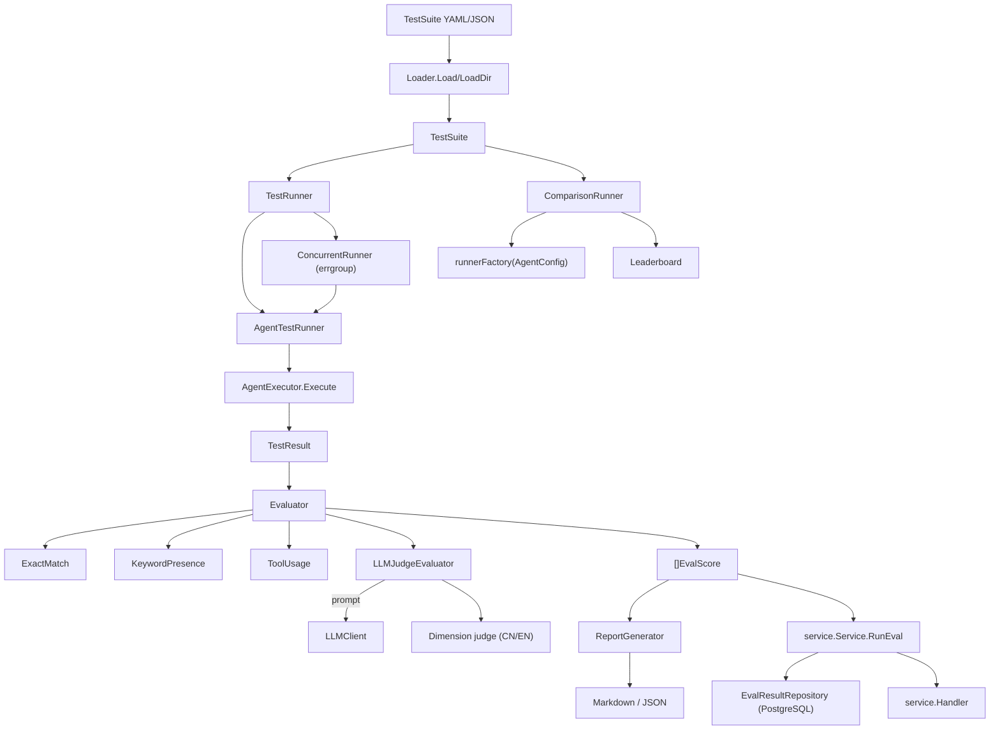

`internal/ares_eval` 包是 ARES 的评估与基准框架。它加载测试套件，针对
agent 运行，用可插拔评估器（精确匹配、关键词存在、工具使用、LLM-as-Judge、
维度感知 Judge）打分，并产出 Markdown/JSON 报告。`service` 子包提供 HTTP
友好的 API，背后是 PostgreSQL 持久化。

## 职责

- 定义核心数据模型：`TestCase`、`TestSuite`、`TestResult`、`EvalScore`，
  以及 YAML/JSON 友好的 `Duration`。
- 提供 `Evaluator` 接口与四个具体评估器：`ExactMatchEvaluator`、
  `KeywordPresenceEvaluator`、`ToolUsageEvaluator`、`LLMJudgeEvaluator`
  （含 `ScaleType` 与维度平均）。
- 通过 `TestRunner` 实现运行测试用例：`AgentTestRunner`（顺序）、
  `ConcurrentRunner`（基于 `errgroup` 并发）、`ComparisonRunner`
  （跨 `AgentConfig` 横向对比）。
- 生成报告（`ReportGenerator.GenerateMarkdown`/`GenerateJSON`）并通过
  `RunEvaluation` 跑端到端评估。
- 通过 `service.Service` -> `EvalResultRepository`（默认 PostgreSQL）持久
  化结果，并由 `Handler` 通过 HTTP 暴露 `RunEval`、`GetResults`、
  `GetLeaderboard`、`GetComparison`。

## 架构图



## 外部接口

```go
// internal/ares_eval
type Duration time.Duration  // YAML/JSON-unmarshalable duration

type TestCase struct {
    ID            string
    Name          string
    Input         string
    ExpectedOutput string
    ExpectedTools []string
    Timeout       Duration
    Metadata      map[string]interface{}
    Tags          []string
}

type TestSuite struct {
    Name        string
    Description string
    TestCases   []TestCase
    Tags        []string
}

type TestResult struct {
    TestCaseID  string
    ActualOutput string
    ToolsUsed   []string
    Duration    time.Duration
    TokensUsed  int
    Error       string
    Metrics     map[string]float64
    Timestamp   time.Time
}

type EvalScore struct {
    Metric  string
    Score   float64
    Details string
}

type Evaluator interface {
    Evaluate(ctx context.Context, testCase TestCase, result TestResult) ([]EvalScore, error)
}

type ExactMatchEvaluator struct{}
func NewExactMatchEvaluator() *ExactMatchEvaluator

type KeywordPresenceEvaluator struct{ Keywords []string }
func NewKeywordPresenceEvaluator(keywords []string) *KeywordPresenceEvaluator

type ToolUsageEvaluator struct{}
func NewToolUsageEvaluator() *ToolUsageEvaluator

type LLMClient interface {
    Generate(ctx context.Context, prompt string) (string, error)
}

type ScaleType int  // ScaleOneToTen, ScaleOneToFive, ScalePassFail

type LLMJudgeEvaluator struct { /* unexported */ }
type LLMJudgeOption func(*LLMJudgeEvaluator)
func WithPrompt(tmpl string) LLMJudgeOption
func WithScale(scale ScaleType) LLMJudgeOption
func WithChinesePrompt() LLMJudgeOption
func WithEnglishPrompt() LLMJudgeOption
func WithDimensionAveraging() LLMJudgeOption
func NewLLMJudgeEvaluator(client LLMClient, opts ...LLMJudgeOption) (*LLMJudgeEvaluator, error)
func (e *LLMJudgeEvaluator) Evaluate(ctx context.Context, tc TestCase, result TestResult) ([]EvalScore, error)
func (e *LLMJudgeEvaluator) Name() string

type EvaluatorRegistry struct { /* unexported */ }
func NewEvaluatorRegistry() *EvaluatorRegistry
func (r *EvaluatorRegistry) Register(name string, eval Evaluator) error
func (r *EvaluatorRegistry) Get(name string) (Evaluator, bool)
func (r *EvaluatorRegistry) Names() []string

type TestRunner interface {
    RunSuite(ctx context.Context, suite TestSuite) ([]TestResult, error)
    RunSingle(ctx context.Context, testCase TestCase) (TestResult, error)
}

type AgentExecutor interface {
    Execute(ctx context.Context, input string) (output string, toolsUsed []string, tokensUsed int, err error)
}

type AgentTestRunner struct { /* unexported */ }
func NewAgentTestRunner(executor AgentExecutor) (*AgentTestRunner, error)
func (r *AgentTestRunner) SetRegistry(registry *EvaluatorRegistry)
func (r *AgentTestRunner) RunSuite(ctx context.Context, suite TestSuite) ([]TestResult, error)
func (r *AgentTestRunner) RunSingle(ctx context.Context, testCase TestCase) (TestResult, error)
func (r *AgentTestRunner) RunAndEvaluate(ctx context.Context, suite TestSuite, evaluatorName string) ([]TestResult, [][]EvalScore, error)

type ConcurrentRunnerConfig struct {
    MaxParallel int
    Timeout     time.Duration
}
func DefaultConcurrentRunnerConfig() ConcurrentRunnerConfig

type ConcurrentRunner struct { /* unexported */ }
func NewConcurrentRunner(inner TestRunner, config ConcurrentRunnerConfig) (*ConcurrentRunner, error)
func (r *ConcurrentRunner) RunSuite(ctx context.Context, suite TestSuite) ([]TestResult, error)
func (r *ConcurrentRunner) RunSingle(ctx context.Context, testCase TestCase) (TestResult, error)

type AgentConfig struct {
    Name         string
    Model        string
    Parameters   map[string]any
    SystemPrompt string
}

type ComparisonResult struct {
    ConfigName       string
    Config           AgentConfig
    Results          []TestResult
    AggregatedScores map[string]float64
    OverallScore     float64
    TotalDuration    time.Duration
    PassRate         float64
    Error            string
}

type LeaderboardEntry struct {
    Rank       int
    ConfigName string
    Overall    float64
    Scores     map[string]float64
}

type ComparisonReport struct {
    SuiteName   string
    Timestamp   time.Time
    Results     []ComparisonResult
    Leaderboard []LeaderboardEntry
    Summary     ComparisonSummary
}

type ComparisonRunner struct { /* unexported */ }
func NewComparisonRunner(suite *TestSuite, runnerFactory func(AgentConfig) (TestRunner, error)) *ComparisonRunner
func (r *ComparisonRunner) Run(ctx context.Context, configs []AgentConfig) (*ComparisonReport, error)
func (r *ComparisonRunner) GenerateMarkdown(report *ComparisonReport) (string, error)
func GenerateLeaderboard(results []ComparisonResult) []LeaderboardEntry

type Loader struct{}
func NewLoader() *Loader
func (l *Loader) Load(path string) (*TestSuite, error)
func (l *Loader) LoadDir(dir string) ([]TestSuite, error)

type ReportGenerator struct{}
func NewReportGenerator() *ReportGenerator
func (g *ReportGenerator) GenerateMarkdown(suite TestSuite, results []TestResult, scores [][]EvalScore) (string, error)
func (g *ReportGenerator) GenerateJSON(suite TestSuite, results []TestResult, scores [][]EvalScore) (string, error)
func (g *ReportGenerator) SaveReport(path string, content string) error
func RunEvaluation(ctx context.Context, loader *Loader, runner TestRunner, evaluator Evaluator, suitePath string) ([]TestResult, [][]EvalScore, error)

// internal/ares_eval/service
type Service struct { /* unexported */ }
type Option func(*Service)
func WithAgentExecutor(exec ares_eval.AgentExecutor) Option
func NewService(repo EvalResultRepository, opts ...Option) (*Service, error)
func (s *Service) RunEval(ctx context.Context, req *RunEvalRequest) (*RunEvalResponse, error)
func (s *Service) GetResults(ctx context.Context, runID string) (*GetResultsResponse, error)
func (s *Service) GetLeaderboard(ctx context.Context, limit, offset int) (*LeaderboardResponse, error)
func (s *Service) GetComparison(ctx context.Context, runIDs []string) (*ComparisonResponse, error)

type EvalResult struct {
    ID            string
    RunID         string
    ConfigName    string
    SuiteName     string
    TestCaseID    string
    TestCaseName  string
    Score         float64
    Dimensions    map[string]float64
    Status        string
    ErrorMessage  *string
    DurationMs    int
    CreatedAt     time.Time
    UpdatedAt     time.Time
}

type EvalResultRepository interface {
    Store(ctx context.Context, result *EvalResult) error
    StoreBatch(ctx context.Context, results []*EvalResult) error
    GetByRunID(ctx context.Context, runID string) ([]*EvalResult, error)
    GetLeaderboard(ctx context.Context, limit, offset int) ([]*LeaderboardEntry, int, error)
    GetComparison(ctx context.Context, runIDs []string) ([]*ComparisonRow, error)
}

type Handler struct { /* unexported */ }
func NewHandler(svc *Service) *Handler
func (h *Handler) HandleRunEval(w http.ResponseWriter, r *http.Request)
func (h *Handler) HandleGetResults(w http.ResponseWriter, r *http.Request)
func (h *Handler) HandleGetLeaderboard(w http.ResponseWriter, r *http.Request)
func (h *Handler) HandleGetComparison(w http.ResponseWriter, r *http.Request)
```

## 关键类型与方法

| 类型 | 方法 | 用途 |
|------|------|------|
| `TestCase` / `TestSuite` | 结构体字段 | 带 tag 与超时的 YAML/JSON 测试定义。 |
| `TestResult` | 结构体字段 | 执行结果：输出、工具、时长、token、错误。 |
| `EvalScore` | 结构体字段 | 单指标分数（`Metric`、`Score`、`Details`）。 |
| `Evaluator` | 接口 `Evaluate(ctx, TestCase, TestResult)` | 可插拔打分契约。 |
| `ExactMatchEvaluator` | `NewExactMatchEvaluator()` | `ActualOutput == ExpectedOutput` 得 1.0，否则 0.0。 |
| `KeywordPresenceEvaluator` | `NewKeywordPresenceEvaluator(keywords)` | 关键词存在比例（忽略大小写）。 |
| `ToolUsageEvaluator` | `NewToolUsageEvaluator()` | `ExpectedTools` 实际被用的比例。 |
| `LLMJudgeEvaluator` | `NewLLMJudgeEvaluator(client, opts...)` | LLM-as-Judge，含 prompt 模板、scale、维度平均。 |
| `LLMJudgeEvaluator` | `WithChinesePrompt` / `WithEnglishPrompt` | 切换内置四维 prompt（正确性/完整性/效率性/安全性）。 |
| `ScaleType` | `ScaleOneToTen` / `ScaleOneToFive` / `ScalePassFail` | 评分尺度枚举。 |
| `EvaluatorRegistry` | `Register(name, Evaluator)` / `Get(name)` / `Names()` | 线程安全的具名评估器查找。 |
| `TestRunner` | 接口 `RunSuite` / `RunSingle` | 运行器契约。 |
| `AgentExecutor` | 接口 `Execute(ctx, input)` | 到被测 agent 的适配。 |
| `AgentTestRunner` | `NewAgentTestRunner(executor)` | 顺序运行器，可选 registry 供 `RunAndEvaluate` 使用。 |
| `ConcurrentRunner` | `NewConcurrentRunner(inner, config)` | 并发包装；保持顺序，支持单测超时。 |
| `ComparisonRunner` | `NewComparisonRunner(suite, factory)` | 跨多个 `AgentConfig` 运行同一套件。 |
| `ComparisonRunner` | `Run(ctx, configs)` / `GenerateMarkdown(report)` | 产出 `*ComparisonReport` + 排行榜。 |
| `Loader` | `Load(path)` / `LoadDir(dir)` | YAML/JSON 套件加载，带路径校验。 |
| `ReportGenerator` | `GenerateMarkdown` / `GenerateJSON` / `SaveReport` | 聚合统计 + 单测表 + 指标 min/avg/max。 |
| `RunEvaluation` | 函数 | 端到端：加载、运行、评估、返回结果与分数。 |
| `service.Service` | `RunEval` / `GetResults` / `GetLeaderboard` / `GetComparison` | 持久化评估 API。 |
| `EvalResultRepository` | 接口 | 持久化契约（默认 PostgreSQL）。 |
| `EvalResult` | 结构体字段 | 持久化的结果行，含维度与状态。 |
| `service.Handler` | `HandleRunEval` / `HandleGetResults` / `HandleGetLeaderboard` / `HandleGetComparison` | HTTP handler（body 上限 10 MiB）。 |

## 模块协作

- `Loader.Load`/`LoadDir` 读取 `TestSuite` YAML/JSON，按敏感系统目录黑名
  单校验路径。每个 `TestCase` 携带可选 `Timeout`（通过自定义 `Duration`
  类型解析，接受 `"30s"`、`"1m30s"` 等）。
- `AgentTestRunner.RunSingle` 派生单测超时 context，调用
  `AgentExecutor.Execute(ctx, input)`，把 `ActualOutput`、`ToolsUsed`、
  `TokensUsed`、`Duration` 与错误记录到 `TestResult`。`RunSuite` 顺序循
  环；`RunAndEvaluate` 额外按名从 `EvaluatorRegistry` 解析评估器，产出
  `[][]EvalScore`。
- `ConcurrentRunner` 用 `errgroup` 与按 `MaxParallel` 大小的信号量包装任
  意 `TestRunner`。每个测试有独立超时 context；结果按输入顺序写回切片。
- `LLMJudgeEvaluator` 渲染 prompt（`prompts.go` 中的默认中/英文模板，或
  `WithPrompt` 自定义模板），调用 `LLMClient.Generate`，解析 JSON
  `{"score": ..., "reason": ...}` 响应（`extractJudgeJSON` +
  `findJSONEnd` 健壮抽取）。启用 `WithDimensionAveraging` 时，通过
  `evaluateWithDimensions` 给四个维度（正确性 0-3、完整性 0-3、效率 0-2、
  安全 0-2）打分并取平均。
- `ComparisonRunner.Run` 遍历 `AgentConfig`，通过 `runnerFactory` 为每个
  config 构建 `TestRunner`，跑同一套件，聚合分数
  （`aggregateScores`、`computeOverallScore`、`computePassRate`），产出含
  `GenerateLeaderboard` 与 `ComparisonSummary`（最佳 config、均值、方差）
  的 `ComparisonReport`。`GenerateMarkdown` 输出摘要、排行榜、单测详情、
  维度分析等章节。
- `service.Service.RunEval` 编排一次运行：校验请求，当配置了 executor 时
  通过 `WithAgentExecutor` 构造 `placeholderRunner`，对每个
  `AgentConfigRef` 跑套件，用已配置评估器打分，通过
  `EvalResultRepository.StoreBatch` 持久化 `EvalResult` 行，返回
  `RunEvalResponse`。PostgreSQL 仓库（`pgEvalResultRepository`）实现
  `Store`/`StoreBatch`/`GetByRunID`/`GetLeaderboard`/`GetComparison`。
- `service.Handler` 通过 HTTP 暴露 service，请求 body 上限 10 MiB
  （`maxEvalRequestBodyBytes`）；路由由 API router 挂载到
  `/api/v1/eval/...`。

## 扩展方式

1. **新增自定义评估器。** 实现 `Evaluator.Evaluate(ctx, TestCase,
   TestResult) ([]EvalScore, error)`，再用
   `EvaluatorRegistry.Register("my_metric", myEval)` 按名注册。
2. **定制 LLM Judge。** 构建
   `NewLLMJudgeEvaluator(client, WithPrompt(myTmpl), WithScale(ScaleOneToFive),
   WithDimensionAveraging())`。模板可用 `{{.Input}}`、`{{.ExpectedOutput}}`、
   `{{.ActualOutput}}`。
3. **并发运行套件。** 用
   `NewConcurrentRunner(runner, ConcurrentRunnerConfig{MaxParallel: 4,
   Timeout: 60 * time.Second})` 包裹 `AgentTestRunner`，再调用
   `RunSuite`；顺序保持不变。
4. **对比 agent 配置。** 构建
   `NewComparisonRunner(suite, factory)`，其中
   `factory(cfg AgentConfig) (TestRunner, error)` 为每个 config 构造运行
  器，再 `Run(ctx, configs)` 得到 `ComparisonReport`，最后
  `GenerateMarkdown(report)`。
5. **持久化到 PostgreSQL。** 实现 `EvalResultRepository`（或用
   `NewPGEvalResultRepository`），构造
   `service.NewService(repo, WithAgentExecutor(exec))`，通过
   `service.NewHandler(svc)` 暴露。在 `api/router` 中把 handler 路由挂到
   `/api/v1/eval/...`。
6. **从套件文件跑端到端。** 调用
   `RunEvaluation(ctx, NewLoader(), runner, evaluator, "suite.yaml")` 一步
   完成加载、运行、打分；返回的切片交给 `ReportGenerator`。

## 双语状态

本页同时维护英文（`ares_eval.en.md`）与中文（`ares_eval.zh.md`）版本。两
份文档中的代码块、类型名、方法名与标识符保持原样，仅翻译散文。

## 成熟度

Beta。本模块功能完备且测试充分（`eval_test.go`、`llm_judge_test.go`、
`dimension_judge_test.go`、`comparison_test.go`、
`concurrent_runner_test.go`、`eval_bench_test.go`、`handler_test.go`），
但公开表面（尤其是 `ComparisonRunner`、维度 Judge prompt 集合与
`service` HTTP API）仍在演进。无实验性标记，但 1.0 前仍可能出现破坏性
API 变更。


