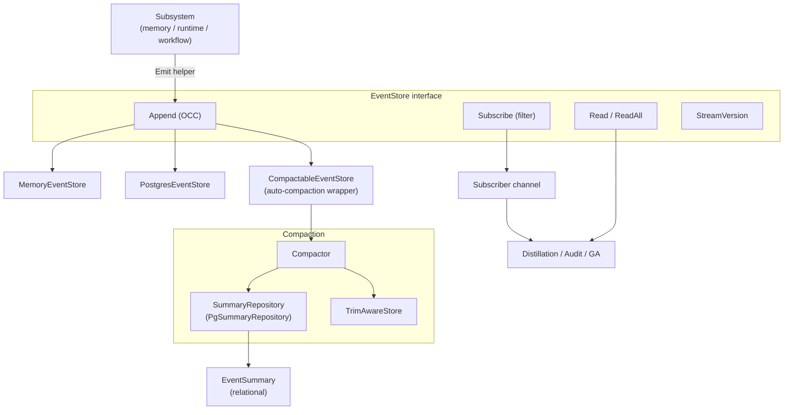

# ares_events

## Responsibility

The `ares_events` package (Go import path `internal/ares_events`, package name
`ares_events`) provides event sourcing for the ARES framework. Every subsystem
emits lifecycle events into append-only streams; downstream consumers
(distillation feedback loops, audit, GA) subscribe to or replay them.

Core responsibilities:

- **Event store contract** - the `EventStore` interface (`Append`, `Read`,
  `ReadAll`, `Subscribe`, `StreamVersion`) defines append, read, and
  subscription with optimistic concurrency control via `expectedVersion`.
- **Event types** - 18 typed `EventType` constants cover agent lifecycle
  (`agent.started` / `agent.stopped`), task lifecycle (`task.created`,
  `task.dispatched`, `task.completed`, `task.failed`), session and memory
  (`session.created`, `message.added`, `memory.distilled`), failover, LLM
  and tool calls, and step recovery.
- **Tenant handling** - `DefaultTenantID` ("default") is the tenant scope
  under which single-tenant deployments store distilled experiences; it must
  align with the GA's `GuidanceProvider` read tenant. Multi-tenant requires
  threading the caller's tenant through the request path.
- **Compaction and summaries** - `CompactableEventStore` wraps an `EventStore`
  to auto-compact old events into `EventSummary` records via the `Compactor`,
  with optional trimming through a `TrimAwareStore`. `PgSummaryRepository`
  persists summaries relationally.
- **Integrity** - `VerifyStreamIntegrity` detects version gaps or duplicates;
  `StreamHash` computes a deterministic hash for corruption detection.

## Architecture



## External interfaces

Signatures are extracted verbatim from source.

```go
// EventStore defines the interface for appending, reading, and subscribing to events.
type EventStore interface {
    Append(ctx context.Context, streamID string, events []*Event, expectedVersion int64) error
    Read(ctx context.Context, streamID string, opts ReadOptions) ([]*Event, error)
    ReadAll(ctx context.Context, opts ReadOptions) ([]*Event, error)
    Subscribe(ctx context.Context, filter EventFilter) (<-chan *Event, error)
    StreamVersion(ctx context.Context, streamID string) (int64, error)
}

// Constructors.
func NewMemoryEventStore() *MemoryEventStore
func NewPostgresEventStore(pool *postgres.Pool) (*PostgresEventStore, error)
func NewCompactableEventStore(store EventStore, repo SummaryRepository, trimStore TrimAwareStore, config CompactionConfig) (*CompactableEventStore, error)

// Canonical emit helper.
func Emit(ctx context.Context, store EventAppender, streamID string, eventType EventType, moduleName string, payload map[string]any) bool
func NewEventID() string

// Integrity helpers.
func VerifyStreamIntegrity(evts []*Event) error
func StreamHash(evts []*Event) string

// Tenant constant.
const DefaultTenantID = "default"
```

The 18 `EventType` constants include `EventTaskCompleted` ("task.completed"),
`EventTaskFailed` ("task.failed"), `EventTaskCreated` ("task.created"),
`EventTaskDispatched` ("task.dispatched"), `EventSessionCreated`
("session.created"), `EventMessageAdded` ("message.added"),
`EventMemoryDistilled` ("memory.distilled"), `EventAgentStarted`
("agent.started"), `EventAgentStopped` ("agent.stopped"),
`EventFailoverTriggered` / `EventFailoverCompleted`, `EventLLMCall`,
`EventToolCallStarted` / `EventToolCallCompleted`, and the
`EventStepRecovery*` family. Enriched payload keys (`EventKeyTask`,
`EventKeyResult`, `EventKeyTenantID`, `EventKeyUsedExperienceID`) let
downstream consumers reconstruct task/result text without re-deriving it.

## Key types and methods

| Type / Method | Kind | Purpose |
| --- | --- | --- |
| `EventStore` | interface | 5-method contract: Append, Read, ReadAll, Subscribe, StreamVersion. |
| `Event` | struct | Record: ID, StreamID, Type, ModuleName, Payload, Metadata, Version, Timestamp. |
| `EventType` | type | 18 string constants classifying events. |
| `EventTaskCompleted` | const | "task.completed" - terminal success event. |
| `DefaultTenantID` | const | "default" - single-tenant scope for distilled experiences. |
| `ReadOptions` | struct | FromVersion, Limit, Direction (Ascending/Descending), Since. |
| `ReadDirection` | type | Ascending or Descending ordering. |
| `EventFilter` | struct | Subscribe filter: StreamIDs, Types, Since. |
| `MemoryEventStore` | struct | In-memory `EventStore`; OCC, subscribers, non-blocking notify. |
| `PostgresEventStore` | struct | PostgreSQL `EventStore` backed by `postgres.Pool` with transactional OCC. |
| `CompactableEventStore` | struct | Wraps an `EventStore` to auto-trigger compaction on append. |
| `Compactor` | struct | Compacts old events into `EventSummary` records. |
| `EventSummary` | struct | Compacted snapshot: stream/agent/task IDs, summary text, metrics, outcome. |
| `SummaryRepository` | interface | Persists/queries `EventSummary` records. |
| `PgSummaryRepository` | struct | PostgreSQL `SummaryRepository` (table `event_summaries`). |
| `TrimAwareStore` | interface | Deletes compacted raw events. |
| `Emit` | function | Canonical single-event append helper; returns false on failure. |
| `EventAppender` | interface | Narrow `Append`-only subset; lets callers with narrower store types use `Emit`. |
| `VerifyStreamIntegrity` | function | Detects version gaps/duplicates; skips legacy Version 0 events. |
| `StreamHash` | function | Deterministic 8-char hash for corruption detection. |
| `ErrVersionConflict` | var | Optimistic concurrency violation sentinel. |
| `ErrStreamNotFound` | var | Missing stream; wraps `apperrors.ErrNotFound`. |

## Module collaboration

- **ares_memory** - `MemoryManager.SetEventStore` plugs an `EventStore` so the
  manager emits `task.created`, `task.completed`, `memory.distilled`, and
  related lifecycle events; the distillation feedback loop subscribes to
  `task.completed` / `task.failed` to rank experiences.
- **storage/postgres** - `PostgresEventStore` and `PgSummaryRepository` are
  backed by `postgres.Pool` and persist events/summaries in PostgreSQL
  (`events` and `event_summaries` tables).
- **knowledge** - the AKG distillation path consumes enriched task-lifecycle
  events (carrying `EventKeyTask` / `EventKeyResult`) to turn completed/failed
  tasks into ranked experiences.
- **Genetic Algorithm** - GA reads events to compute fitness and drive
  evolution; `DefaultTenantID` alignment ensures distilled hints are consumed.
- **agents/sub** - emitters populate the enriched payload keys so downstream
  consumers reconstruct task/result text without re-deriving it.

## Extension points

1. **Add a new event store backend.** Implement the 5-method `EventStore`
   interface against your storage, mirroring `PostgresEventStore` (which uses
   a transactional `SELECT MAX(version)` + insert for OCC). Honor the
   `expectedVersion` semantics: < 0 no check, 0 auto-detect, positive must
   match.
2. **Emit a new event type.** Define a new `EventType` string constant, then
   call `Emit(ctx, store, streamID, yourType, moduleName, payload)`. The
   helper auto-generates the ID and timestamp; pass `nil` store to make it a
   no-op.
3. **Subscribe to a stream or event type.** Call `Subscribe` with an
   `EventFilter` (StreamIDs, Types, Since). The returned channel is buffered
   (64 in-memory) and closed when the context is cancelled; non-blocking
   delivery drops on overflow and increments a dropped counter.
4. **Enable auto-compaction.** Wrap your `EventStore` with
   `NewCompactableEventStore(store, summaryRepo, trimStore, config)`.
   `CompactionConfig` controls the threshold, keep-recent window, and
   trimming; `DefaultCompactionConfig` provides sane defaults. Provide a
   `TrimAwareStore` to delete compacted raw events.
5. **Customize summary generation.** Call `Compactor.WithSummarizer` with a
   custom `EventSummarizer` function (rule-based default, or LLM-powered) to
   control how compacted events become human-readable summary text.
6. **Verify stream integrity.** After reading a stream, run
   `VerifyStreamIntegrity` to detect gaps or duplicate versions, and
   `StreamHash` to compare deterministic hashes across replicas for silent
   corruption detection.

## Bilingual status

Source code, identifiers, type names, and code comments are in English. This
English page is the canonical reference. A Chinese translation with identical
structure and technical content is published alongside as `ares_events.zh.md`;
all code blocks, signatures, and identifiers remain in English in both pages.

## Maturity

Production. The package is covered by `memory_store_test.go`,
`pg_store_test.go`, `compactor_test.go`, `compactable_store_archive_test.go`,
`summary_repository_test.go`, `edge_cases_test.go`, `benchmark_test.go`, and
the package's `memory_summary_repo`/`trim_store`/`archive_hook` components. It
is integrated into the SDK via `MemoryManager.SetEventStore`,
`PostgresEventStore`, and the `CompactableEventStore` wrapper. No experimental
markers remain; optimistic concurrency, integrity verification, and
auto-compaction are production features.


