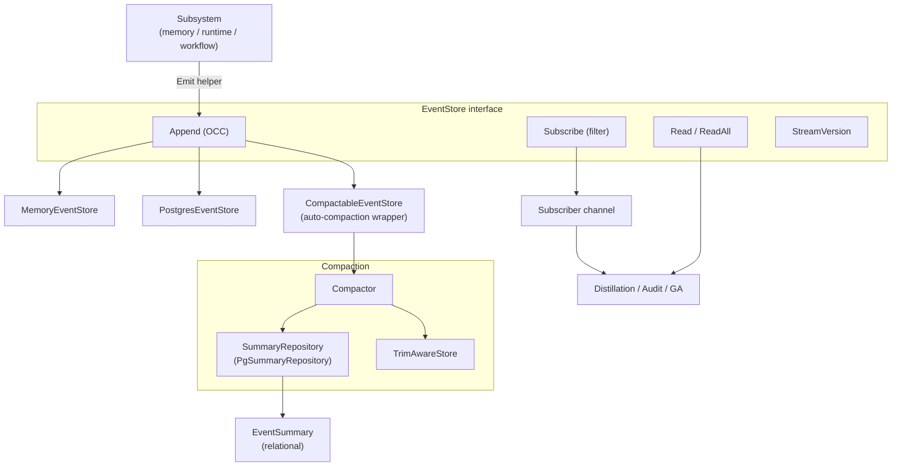

# ares_events

## 职责

`ares_events` 包（Go 导入路径 `internal/ares_events`，包名 `ares_events`）为 ARES 框架提供
事件溯源。每个子系统向只追加流发射生命周期事件；下游消费者（蒸馏反馈回路、审计、GA）订阅或
回放这些事件。

核心职责：

- **事件存储契约** —— `EventStore` 接口（`Append`、`Read`、`ReadAll`、`Subscribe`、
  `StreamVersion`）定义追加、读取与订阅，并通过 `expectedVersion` 实现乐观并发控制。
- **事件类型** —— 18 个带类型的 `EventType` 常量覆盖智能体生命周期
  （`agent.started` / `agent.stopped`）、任务生命周期（`task.created`、`task.dispatched`、
  `task.completed`、`task.failed`）、会话与记忆（`session.created`、`message.added`、
  `memory.distilled`）、故障转移、LLM 与工具调用以及步骤恢复。
- **租户处理** —— `DefaultTenantID`（"default"）是单租户部署存储蒸馏经验时所用的租户作用域；
  它必须与 GA 的 `GuidanceProvider` 读取租户对齐。多租户需在请求路径中透传调用方租户。
- **压缩与摘要** —— `CompactableEventStore` 包装 `EventStore`，在追加时通过 `Compactor`
  自动将旧事件压缩为 `EventSummary` 记录，并可通过 `TrimAwareStore` 可选地裁剪原始事件。
  `PgSummaryRepository` 以关系型方式持久化摘要。
- **完整性** —— `VerifyStreamIntegrity` 检测版本缺口或重复；`StreamHash` 计算确定性哈希以检测
  静默损坏。

## 架构图



## 外部接口

下列签名均逐字取自源码。

```go
// EventStore defines the interface for appending, reading, and subscribing to events.
type EventStore interface {
    Append(ctx context.Context, streamID string, events []*Event, expectedVersion int64) error
    Read(ctx context.Context, streamID string, opts ReadOptions) ([]*Event, error)
    ReadAll(ctx context.Context, opts ReadOptions) ([]*Event, error)
    Subscribe(ctx context.Context, filter EventFilter) (<-chan *Event, error)
    StreamVersion(ctx context.Context, streamID string) (int64, error)
}

// Constructors.
func NewMemoryEventStore() *MemoryEventStore
func NewPostgresEventStore(pool *postgres.Pool) (*PostgresEventStore, error)
func NewCompactableEventStore(store EventStore, repo SummaryRepository, trimStore TrimAwareStore, config CompactionConfig) (*CompactableEventStore, error)

// Canonical emit helper.
func Emit(ctx context.Context, store EventAppender, streamID string, eventType EventType, moduleName string, payload map[string]any) bool
func NewEventID() string

// Integrity helpers.
func VerifyStreamIntegrity(evts []*Event) error
func StreamHash(evts []*Event) string

// Tenant constant.
const DefaultTenantID = "default"
```

18 个 `EventType` 常量包括 `EventTaskCompleted`（"task.completed"）、`EventTaskFailed`
（"task.failed"）、`EventTaskCreated`（"task.created"）、`EventTaskDispatched`
（"task.dispatched"）、`EventSessionCreated`（"session.created"）、`EventMessageAdded`
（"message.added"）、`EventMemoryDistilled`（"memory.distilled"）、`EventAgentStarted`
（"agent.started"）、`EventAgentStopped`（"agent.stopped"）、
`EventFailoverTriggered` / `EventFailoverCompleted`、`EventLLMCall`、
`EventToolCallStarted` / `EventToolCallCompleted` 以及 `EventStepRecovery*` 系列。增强的
payload 键（`EventKeyTask`、`EventKeyResult`、`EventKeyTenantID`、`EventKeyUsedExperienceID`）
使下游消费者无需重新推导即可重建任务/结果文本。

## 关键类型与方法

| 类型 / 方法 | 类别 | 用途 |
| --- | --- | --- |
| `EventStore` | interface | 5 方法契约：Append、Read、ReadAll、Subscribe、StreamVersion。 |
| `Event` | struct | 记录：ID、StreamID、Type、ModuleName、Payload、Metadata、Version、Timestamp。 |
| `EventType` | type | 18 个字符串常量，对事件分类。 |
| `EventTaskCompleted` | const | "task.completed" —— 终端成功事件。 |
| `DefaultTenantID` | const | "default" —— 蒸馏经验的单租户作用域。 |
| `ReadOptions` | struct | FromVersion、Limit、Direction（Ascending/Descending）、Since。 |
| `ReadDirection` | type | 升序或降序排序。 |
| `EventFilter` | struct | 订阅过滤器：StreamIDs、Types、Since。 |
| `MemoryEventStore` | struct | 内存版 `EventStore`；含 OCC、订阅者、非阻塞通知。 |
| `PostgresEventStore` | struct | 基于 `postgres.Pool` 的 PostgreSQL `EventStore`，事务化 OCC。 |
| `CompactableEventStore` | struct | 包装 `EventStore`，在追加时自动触发压缩。 |
| `Compactor` | struct | 将旧事件压缩为 `EventSummary` 记录。 |
| `EventSummary` | struct | 压缩快照：stream/agent/task ID、摘要文本、指标、outcome。 |
| `SummaryRepository` | interface | 持久化/查询 `EventSummary` 记录。 |
| `PgSummaryRepository` | struct | PostgreSQL `SummaryRepository`（表 `event_summaries`）。 |
| `TrimAwareStore` | interface | 删除已压缩的原始事件。 |
| `Emit` | function | 标准单事件追加助手；失败返回 false。 |
| `EventAppender` | interface | 仅含 `Append` 的窄子集；使持有更窄 store 类型的调用方也能使用 `Emit`。 |
| `VerifyStreamIntegrity` | function | 检测版本缺口/重复；跳过 Version 0 的遗留事件。 |
| `StreamHash` | function | 8 字符确定性哈希，用于检测损坏。 |
| `ErrVersionConflict` | var | 乐观并发冲突哨兵错误。 |
| `ErrStreamNotFound` | var | 流不存在；包装 `apperrors.ErrNotFound`。 |

## 模块协作

- **ares_memory** —— `MemoryManager.SetEventStore` 注入 `EventStore`，使 manager 发射
  `task.created`、`task.completed`、`memory.distilled` 等生命周期事件；蒸馏反馈回路订阅
  `task.completed` / `task.failed` 以对经验排序。
- **storage/postgres** —— `PostgresEventStore` 与 `PgSummaryRepository` 以 `postgres.Pool`
  为底层，将事件/摘要持久化到 PostgreSQL（`events` 与 `event_summaries` 表）。
- **knowledge** —— AKG 蒸馏路径消费增强的任务生命周期事件（携带 `EventKeyTask` /
  `EventKeyResult`），将已完成/失败的任务转化为带排序的经验。
- **遗传算法** —— GA 读取事件以计算适应度并驱动进化；`DefaultTenantID` 对齐确保蒸馏提示被消费。
- **agents/sub** —— 发射者填充增强 payload 键，使下游消费者无需重新推导即可重建任务/结果文本。

## 扩展方式

1. **新增事件存储后端。** 针对你的存储实现 5 方法的 `EventStore` 接口，参照
   `PostgresEventStore`（使用事务化 `SELECT MAX(version)` + insert 实现 OCC）。遵循
   `expectedVersion` 语义：< 0 不检查，0 自动检测，正值必须匹配。
2. **发射新事件类型。** 定义新的 `EventType` 字符串常量，再调用
   `Emit(ctx, store, streamID, yourType, moduleName, payload)`。该助手自动生成 ID 与时间戳；
   传入 `nil` store 则变为 no-op。
3. **订阅流或事件类型。** 调用 `Subscribe` 并传入 `EventFilter`（StreamIDs、Types、Since）。
   返回的 channel 带缓冲（内存版为 64），并在 context 取消时关闭；非阻塞投递在溢出时丢弃并
   递增 dropped 计数器。
4. **启用自动压缩。** 用 `NewCompactableEventStore(store, summaryRepo, trimStore, config)`
   包装 `EventStore`。`CompactionConfig` 控制阈值、保留最近窗口与裁剪；
   `DefaultCompactionConfig` 提供合理默认值。提供 `TrimAwareStore` 可删除已压缩的原始事件。
5. **自定义摘要生成。** 调用 `Compactor.WithSummarizer` 传入自定义 `EventSummarizer` 函数
   （默认基于规则，也可由 LLM 驱动），控制压缩事件如何变成人类可读的摘要文本。
6. **校验流完整性。** 读取流后运行 `VerifyStreamIntegrity` 检测缺口或重复版本，并用
   `StreamHash` 比较跨副本的确定性哈希以发现静默损坏。

## 双语状态

源码、标识符、类型名与代码注释均为英文，本英文页面为权威参考。中文译本以相同结构与同等
技术内容随附发布为 `ares_events.zh.md`；两份页面中的所有代码块、签名与标识符均保持英文。

## 成熟度

Production。该包由 `memory_store_test.go`、`pg_store_test.go`、`compactor_test.go`、
`compactable_store_archive_test.go`、`summary_repository_test.go`、`edge_cases_test.go`、
`benchmark_test.go` 以及包内的 `memory_summary_repo`/`trim_store`/`archive_hook` 组件覆盖。
它通过 `MemoryManager.SetEventStore`、`PostgresEventStore` 与 `CompactableEventStore` 包装器
接入 SDK。无实验性标记；乐观并发、完整性校验与自动压缩均为生产特性。


