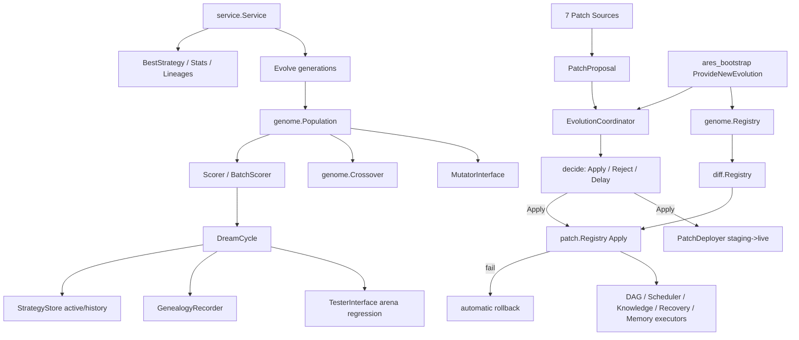

# ares_evolution

## Responsibility

`ares_evolution` is the autonomous evolution layer for ARES. It spans two
packages: `internal/runtime/ares_evolution` (the legacy GA dream-cycle stack, scheduler,
strategy stores, guardrails, shadow evaluator, rollback policy, and the
high-level `service.Service`) and `internal/runtime/evolution` (the new genome/diff/
patch/coordinator stack plus the LLM adapter). Together they mutate agent
decision strategies, evaluate candidates via arena regression, record
genealogy, and promote accepted mutations to the live runtime as universal
`RuntimePatch` units.

The layer exposes a clean public API through `service.Service`
(`Evolve`/`BestStrategy`/`Stats`/`Lineages`) for running full GA generations,
and a `coordinator.EvolutionCoordinator` that collects `PatchProposal`s from
seven sources and decides apply/reject/delay per patch.

## Architecture



The left side is the patch pipeline: any source submits a `PatchProposal`,
the Coordinator decides, and accepted patches are applied through the
`patch.Registry` (with optional safe-deployment staging) or rolled back on
failure. The right side is the GA path: `Service.Evolve` drives a population
through mutation, crossover, scoring, and dream-cycle evaluation, persisting
the winner via `StrategyStore` and recording lineage via `GenealogyRecorder`.

## External interfaces

```go
// Strategy represents an evolved agent decision strategy.
type Strategy struct {
    ID            string         `json:"id"`
    Name          string         `json:"name,omitempty"`
    Version       int            `json:"version"`
    Params        map[string]any `json:"params,omitempty"`
    ParentID      string         `json:"parent_id,omitempty"`
    PromptTemplate string        `json:"prompt_template,omitempty"`
    MutationType  string         `json:"mutation_type"`
    Score         float64        `json:"score"`
    CreatedAt     time.Time      `json:"created_at"`
}

// Core evolution interfaces (internal/runtime/ares_evolution/interfaces.go).
type MutatorInterface interface {
    Mutate(ctx context.Context, parent Strategy, n int) ([]Strategy, error)
}
type TesterInterface interface {
    Run(ctx context.Context, cfg RegressionConfig) (*RegressionResult, error)
}
type StrategyStore interface {
    GetActive(ctx context.Context) (*Strategy, error)
    SetActive(ctx context.Context, strategy *Strategy) error
    GetHistory(ctx context.Context, id string, n int) ([]*Strategy, error)
}
type GenealogyRecorder interface {
    Record(ctx context.Context, lineage StrategyLineage) error
}

// Strategy store implementations.
func NewMemoryStrategyStore(maxHistory int) *MemoryStrategyStore
func NewPGStrategyStore(db *sql.DB, tableName string, maxHistory int) (*PGStrategyStore, error)

// Dream cycle + modes + triggers.
type EvolutionMode int  // ModeEvolutionStrategy | ModeGeneticAlgorithm
type EvolutionTrigger int // TriggerOnIdle | TriggerOnThreshold | TriggerOnDemand
func NewDreamCycle(scheduler *EvolutionScheduler, mutator MutatorInterface, tester TesterInterface, genealogy GenealogyRecorder, opts ...DreamCycleOption) (*DreamCycle, error)
func DefaultDreamCycleConfig() DreamCycleConfig

// Scheduler.
func NewEvolutionScheduler(cb CallbackRegistrar, adapter AdapterRunner, opts ...SchedulerOption) *EvolutionScheduler

// High-level service API (internal/runtime/ares_evolution/service).
func NewService(cfg *SystemConfig) (*Service, error)
func DefaultConfig() *SystemConfig
func (s *Service) Evolve(ctx context.Context, generations int) (*EvolutionResult, error)
func (s *Service) BestStrategy() (*Strategy, error)
func (s *Service) Stats() (*Stats, error)
func (s *Service) Lineages() ([]StrategyLineage, error)
func (s *Service) RunIdleEvolution(ctx context.Context, generations int) error
func (s *Service) Shutdown()
func LoadBestStrategy(path string) (*Strategy, error)

// Coordinator + 7 patch sources (internal/runtime/evolution/coordinator).
type PatchSource string
const (
    SourceGA    PatchSource = "genome" // Genetic Algorithm
    SourceChaos PatchSource = "chaos"  // Chaos Engineering
    SourceAKF   PatchSource = "akf"    // Knowledge Runtime
    SourceHuman PatchSource = "human"  // Manual operator
    SourceLLM   PatchSource = "llm"    // LLM suggestion
    SourceK8s   PatchSource = "k8s"    // Kubernetes Operator
    SourceRule  PatchSource = "rule"   // Rule Engine
)
func NewEvolutionCoordinator(policy PolicyGenome, patchReg *patch.Registry) *EvolutionCoordinator
func (ec *EvolutionCoordinator) Submit(proposal PatchProposal)
func (ec *EvolutionCoordinator) Evaluate(ctx context.Context)
func (ec *EvolutionCoordinator) ApplyEmergency(ctx context.Context, p patch.RuntimePatch) error
func (ec *EvolutionCoordinator) SetDeployer(d PatchDeployer)
func DefaultPolicy() PolicyGenome

// Bootstrap wiring (ares_bootstrap.ProvideNewEvolution returns NewEvolutionComponents).
```

## Key types and methods

| Type / Method | Purpose |
|---|---|
| `Strategy` | Evolvable decision strategy (params, prompt, score, lineage). |
| `StrategyLineage` | Parent-child record with win rate and score delta. |
| `MutatorInterface` | Generates N candidate strategies from a parent. |
| `TesterInterface` | Arena regression test: candidate vs baseline. |
| `StrategyStore` | Persistent active + history strategy storage. |
| `MemoryStrategyStore` | In-memory `StrategyStore` implementation. |
| `PGStrategyStore` | PostgreSQL-backed `StrategyStore`. |
| `GenealogyRecorder` | Persists `StrategyLineage` entries. |
| `DreamCycle` | Orchestrates mutate -> test -> deploy loop. |
| `EvolutionMode` | ES (1+lambda) vs full GeneticAlgorithm. |
| `EvolutionTrigger` | Idle / threshold / on-demand trigger. |
| `EvolutionScheduler` | Callback-driven cycle trigger with score trend detection. |
| `Service` | High-level GA API wrapping wired or raw population. |
| `SystemConfig` | Full service config (population, mutation, scorer, guardrails). |
| `EvolutionResult` | Result of `Evolve`: best strategy, stats, lineages. |
| `Stats` / `DiversityReporter` | Per-generation population statistics. |
| `PatchSource` | Enum of the 7 patch origins. |
| `PatchProposal` | Patch + source + priority + fitness metadata. |
| `EvolutionCoordinator` | Decides apply/reject/delay for every proposal. |
| `PolicyGenome` | Evolvable decision policy (thresholds, rate limits). |
| `PatchDeployer` | Optional safe-promotion staging interface. |
| `NewEvolutionComponents` | Bootstrap aggregate: registries + coordinator + LLM adapter. |
| `Service.Evolve` | Run N generations and return best strategy + stats. |
| `Service.BestStrategy` / `Stats` / `Lineages` | Inspect current state. |
| `Coordinator.Submit` / `Evaluate` | Feed and process the proposal queue. |

## Module collaboration

- `internal/runtime/ares_evolution` consumes `ares_callbacks`, `ares_events`,
  `ares_flight`, `ares_eval`, `ares_experience`, and the `genome`/`mutation`/
  `scoring`/`promotion` subpackages.
- `internal/runtime/evolution/coordinator` depends only on `internal/runtime/evolution/patch`,
  keeping the decision engine decoupled from how patches are generated.
- `ares_bootstrap.ProvideNewEvolution` wires `genome.Registry` ->
  `diff.Registry` -> `patch.Registry` -> `EvolutionCoordinator` and shares the
  `KnowledgeRuntime` and live memory store with the agent.
- The LLM adapter (`evoparent.LLMAdapter`) parses natural-language suggestions
  into `PatchProposal`s for the `SourceLLM` path.
- `ares_observability` records evolution deploy, guardrail, and shadow metrics.

## Extension points

1. Implement `MutatorInterface` to add a custom mutation strategy (e.g.
   prompt-only or param-only mutators) and pass it to `NewDreamCycle` or wire
   it into `SystemConfig`.
2. Implement `StrategyStore` (e.g. a Redis-backed store) to persist active and
   historical strategies; `MemoryStrategyStore` and `PGStrategyStore` are the
   reference implementations.
3. Add a new patch source by defining a `PatchSource` constant, building a
   `PatchProposal` with that source, and calling
   `EvolutionCoordinator.Submit`; the Coordinator's `decide` already routes by
   source (GA is fitness-gated, Chaos uses `ApplyEmergency`, others fall back
   to priority + rate-limit rules).
4. Plug a custom `PatchDeployer` via `Coordinator.SetDeployer` to route
   accepted patches through staging before live promotion; otherwise the
   Coordinator applies directly via `patch.Registry`.
5. Register a new `RuntimeComponent` (e.g. a new executor) with
   `patch.Registry.RegisterComponent` so the Coordinator can apply patches to
   a new subsystem; implement `Name`/`Snapshot`/`Apply`/`CanApply`.
6. Tune the decision policy by constructing a custom `PolicyGenome` (auto-apply
   threshold, max patches per minute, fitness thresholds, self-healing) and
   passing it to `NewEvolutionCoordinator`.
7. Switch evolution algorithms via `DreamCycleConfig.EvolutionMode`
   (`ModeEvolutionStrategy` for 1+lambda, `ModeGeneticAlgorithm` for full GA
   with population, crossover, and selection strategy).

## Bilingual status

English source is canonical. The Chinese page mirrors structure, signatures,
and technical content; all code identifiers, type names, source constants, and
patch types remain in English in both pages.

## Maturity

`ares_evolution` is covered by `dream_cycle_test.go`, `scheduler_test.go`,
`e2e_test.go`, `genome_wiring_test.go`, `guardrails_test.go`,
`shadow_evaluator_test.go`, `rollback_policy_test.go`,
`feedback_recorder_test.go`, `service_test.go`, and
`coordinator_test.go`. The GA service API and coordinator are functional and
tested, but the cross-package wiring and `SystemConfig` surface are still
evolving, so the module is marked Beta.


## Evidence loop and gate semantics (verified against code, 2026-09)

- **Active-strategy seeding**: bootstrap persists the base strategy
  `bootstrap-root` (Score 0.5) into the StrategyStore only when the store has
  no active strategy; an existing active (e.g. recovered from Postgres) is
  never overwritten. `ActiveStrategyManager.Current()` falls back to the
  durable store when its promote-path cache is empty — the store is the
  source of truth.
- **Score write-back**: `aresrecovery.DeterministicScorer` →
  `strategyScoreAdapter.WriteActiveScore` → StrategyStore. The write-back
  requires an active strategy (seeded at bootstrap); without one every write
  fails with "no active strategy" and the GA accumulates no fitness.
- **EvolutionScheduler TriggerOnIdle (default trigger)**: score window
  `scoreWindowSize=50`; periodic threshold `periodicEvolutionScoreThreshold=40`
  (must stay ≤ the window — values above it are unreachable); reliability
  floor `minScoreCountForReliability=20`; an all-failure window (avg ≤ 0 with
  count ≥ 20) triggers exploration; a degradation drop ≥ 0.15 also triggers.
- **Guardrails**: `PreEvolveCheck`'s unevaluated-majority check is EXEMPT at
  generation 0 (the bootstrap population is unevaluated by definition — the
  first cycle evaluates it). Established generations (≥ 1) keep the >50%
  unevaluated block.
- **Tick evolve runs** execute in an errgroup goroutine with a per-run
  recover: a panic is logged and the next tick retries (`lastRun` is not
  advanced on panic).
- **WorkflowGenome**: serve wiring seeds `AgentPool` with
  `["ares/plan","ares/answer"]`; `mutateInsertNode`/`mutateReplaceNode` no-op
  on an empty pool instead of panicking.
- **Live agent DAG**: the `agents.peers` topology is registered on the
  runtime manager and injected into evolution executors (`UpdateLiveDAG`) so
  structure patches act on it — it is NOT compiled into the task fabric.
  Agent topology is not work; only session/plan graphs compile into
  executable tasks.
- **Shadow gate**: the sampler runs `shadow.min_samples` Prime iterations over
  disjoint replay windows; exact ties are excluded from the decisive count.
  Evidence draws go through `TieredScorer.ScoreEvidence`, which bypasses the
  per-generation fitness cache (independent draws, budget counted) on a
  DEDICATED budget `max(4, MaxLLMCallsPerGeneration/4)` refreshed per Prime —
  population scoring cannot starve gate sampling. Serve installs the
  ReplayScorer only when the evaluator has no independent scorer; with
  `evolution.llm_scoring.enabled=true` the ScoreEvidence path is kept.
  Verdicts: decisive < MinSamples → the gate SKIPS when rollback is armed
  (reason recorded on the lifecycle snapshot as `shadow_gate_skip_reason`)
  and stays fail-closed when disarmed; decisive evidence that the candidate
  loses (win rate below threshold) rejects regardless of rollback.


