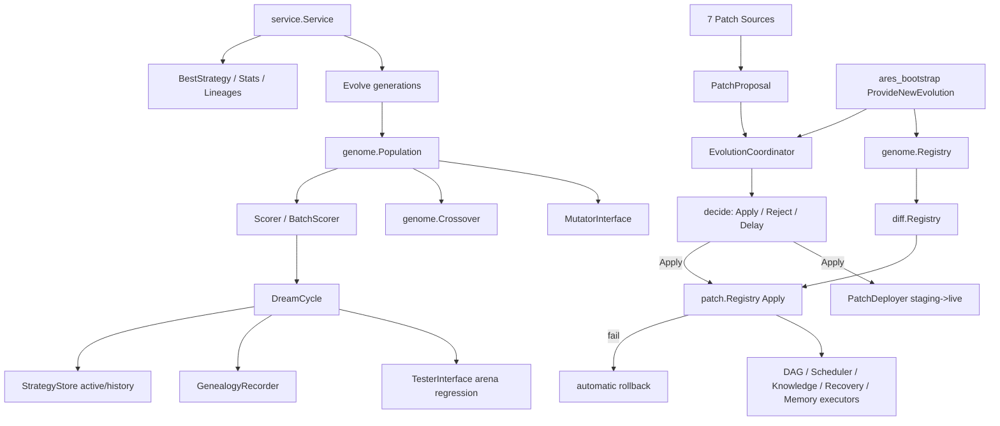

# ares_evolution

## 职责

`ares_evolution` 是 ARES 的自主进化层。它跨越两个包:`internal/ares_evolution`
(旧版 GA dream-cycle 栈、调度器、策略存储、guardrails、shadow evaluator、回滚策略
以及高层 `service.Service`)与 `internal/evolution`(新版 genome/diff/patch/
coordinator 栈及 LLM adapter)。二者共同变异 agent 决策策略,通过 arena 回归评估
候选,记录谱系,并将被接受的变异以通用 `RuntimePatch` 单元提升到实时运行时。

该层通过 `service.Service`(`Evolve`/`BestStrategy`/`Stats`/`Lineages`)暴露干净的
公共 API 以运行完整 GA 代次,并通过 `coordinator.EvolutionCoordinator` 收集来自
七个源的 `PatchProposal`,对每个补丁决定 apply/reject/delay。

## 架构图



左侧是补丁流水线:任意源提交 `PatchProposal`,Coordinator 决策,被接受的补丁通过
`patch.Registry` 应用(可选安全部署 staging),失败则自动回滚。右侧是 GA 路径:
`Service.Evolve` 驱动种群经历变异、交叉、评分与 dream-cycle 评估,通过
`StrategyStore` 持久化胜者,通过 `GenealogyRecorder` 记录谱系。

## 外部接口

```go
// Strategy represents an evolved agent decision strategy.
type Strategy struct {
    ID            string         `json:"id"`
    Name          string         `json:"name,omitempty"`
    Version       int            `json:"version"`
    Params        map[string]any `json:"params,omitempty"`
    ParentID      string         `json:"parent_id,omitempty"`
    PromptTemplate string        `json:"prompt_template,omitempty"`
    MutationType  string         `json:"mutation_type"`
    Score         float64        `json:"score"`
    CreatedAt     time.Time      `json:"created_at"`
}

// Core evolution interfaces (internal/ares_evolution/interfaces.go).
type MutatorInterface interface {
    Mutate(ctx context.Context, parent Strategy, n int) ([]Strategy, error)
}
type TesterInterface interface {
    Run(ctx context.Context, cfg RegressionConfig) (*RegressionResult, error)
}
type StrategyStore interface {
    GetActive(ctx context.Context) (*Strategy, error)
    SetActive(ctx context.Context, strategy *Strategy) error
    GetHistory(ctx context.Context, id string, n int) ([]*Strategy, error)
}
type GenealogyRecorder interface {
    Record(ctx context.Context, lineage StrategyLineage) error
}

// Strategy store implementations.
func NewMemoryStrategyStore(maxHistory int) *MemoryStrategyStore
func NewPGStrategyStore(db *sql.DB, tableName string, maxHistory int) (*PGStrategyStore, error)

// Dream cycle + modes + triggers.
type EvolutionMode int  // ModeEvolutionStrategy | ModeGeneticAlgorithm
type EvolutionTrigger int // TriggerOnIdle | TriggerOnThreshold | TriggerOnDemand
func NewDreamCycle(scheduler *EvolutionScheduler, mutator MutatorInterface, tester TesterInterface, genealogy GenealogyRecorder, opts ...DreamCycleOption) (*DreamCycle, error)
func DefaultDreamCycleConfig() DreamCycleConfig

// Scheduler.
func NewEvolutionScheduler(cb CallbackRegistrar, adapter AdapterRunner, opts ...SchedulerOption) *EvolutionScheduler

// High-level service API (internal/ares_evolution/service).
func NewService(cfg *SystemConfig) (*Service, error)
func DefaultConfig() *SystemConfig
func (s *Service) Evolve(ctx context.Context, generations int) (*EvolutionResult, error)
func (s *Service) BestStrategy() (*Strategy, error)
func (s *Service) Stats() (*Stats, error)
func (s *Service) Lineages() ([]StrategyLineage, error)
func (s *Service) RunIdleEvolution(ctx context.Context, generations int) error
func (s *Service) Shutdown()
func LoadBestStrategy(path string) (*Strategy, error)

// Coordinator + 7 patch sources (internal/evolution/coordinator).
type PatchSource string
const (
    SourceGA    PatchSource = "genome" // Genetic Algorithm
    SourceChaos PatchSource = "chaos"  // Chaos Engineering
    SourceAKF   PatchSource = "akf"    // Knowledge Runtime
    SourceHuman PatchSource = "human"  // Manual operator
    SourceLLM   PatchSource = "llm"    // LLM suggestion
    SourceK8s   PatchSource = "k8s"    // Kubernetes Operator
    SourceRule  PatchSource = "rule"   // Rule Engine
)
func NewEvolutionCoordinator(policy PolicyGenome, patchReg *patch.Registry) *EvolutionCoordinator
func (ec *EvolutionCoordinator) Submit(proposal PatchProposal)
func (ec *EvolutionCoordinator) Evaluate(ctx context.Context)
func (ec *EvolutionCoordinator) ApplyEmergency(ctx context.Context, p patch.RuntimePatch) error
func (ec *EvolutionCoordinator) SetDeployer(d PatchDeployer)
func DefaultPolicy() PolicyGenome

// Bootstrap wiring (ares_bootstrap.ProvideNewEvolution returns NewEvolutionComponents).
```

## 关键类型与方法

| 类型 / 方法 | 用途 |
|---|---|
| `Strategy` | 可进化的决策策略(参数、prompt、分数、谱系)。 |
| `StrategyLineage` | 父子记录,含胜率与分数差。 |
| `MutatorInterface` | 从父策略生成 N 个候选策略。 |
| `TesterInterface` | arena 回归测试:候选 vs 基线。 |
| `StrategyStore` | 持久化的活跃 + 历史策略存储。 |
| `MemoryStrategyStore` | 内存版 `StrategyStore` 实现。 |
| `PGStrategyStore` | PostgreSQL 版 `StrategyStore`。 |
| `GenealogyRecorder` | 持久化 `StrategyLineage` 条目。 |
| `DreamCycle` | 编排 变异 -> 测试 -> 部署 循环。 |
| `EvolutionMode` | ES(1+lambda) vs 完整 GeneticAlgorithm。 |
| `EvolutionTrigger` | idle / threshold / on-demand 触发。 |
| `EvolutionScheduler` | 回调驱动的循环触发,带分数趋势检测。 |
| `Service` | 包装 wired 或原始种群的高层 GA API。 |
| `SystemConfig` | 完整服务配置(种群、变异、scorer、guardrails)。 |
| `EvolutionResult` | `Evolve` 结果:最佳策略、统计、谱系。 |
| `Stats` / `DiversityReporter` | 每代种群统计。 |
| `PatchSource` | 7 个补丁来源的枚举。 |
| `PatchProposal` | 补丁 + 来源 + 优先级 + 适应度元数据。 |
| `EvolutionCoordinator` | 对每个 proposal 决定 apply/reject/delay。 |
| `PolicyGenome` | 可进化的决策策略(阈值、速率限制)。 |
| `PatchDeployer` | 可选的安全提升 staging 接口。 |
| `NewEvolutionComponents` | 装配聚合:registries + coordinator + LLM adapter。 |
| `Service.Evolve` | 运行 N 代并返回最佳策略 + 统计。 |
| `Service.BestStrategy` / `Stats` / `Lineages` | 查看当前状态。 |
| `Coordinator.Submit` / `Evaluate` | 投喂并处理 proposal 队列。 |

## 模块协作

- `internal/ares_evolution` 消费 `ares_callbacks`、`ares_events`、`ares_flight`、
  `ares_eval`、`ares_experience` 以及 `genome`/`mutation`/`scoring`/`promotion`
  子包。
- `internal/evolution/coordinator` 仅依赖 `internal/evolution/patch`,使决策引擎与
  补丁的生成方式解耦。
- `ares_bootstrap.ProvideNewEvolution` 装配 `genome.Registry` -> `diff.Registry` ->
  `patch.Registry` -> `EvolutionCoordinator`,并与 agent 共享 `KnowledgeRuntime`
  和实时 memory store。
- LLM adapter(`evoparent.LLMAdapter`)将自然语言建议解析为 `PatchProposal`,
  供 `SourceLLM` 路径使用。
- `ares_observability` 记录 evolution deploy、guardrail 与 shadow 指标。

## 扩展方式

1. 实现 `MutatorInterface` 以添加自定义变异策略(如仅 prompt 或仅参数的变异器),
   传给 `NewDreamCycle` 或装配进 `SystemConfig`。
2. 实现 `StrategyStore`(如 Redis 后端存储)以持久化活跃与历史策略;
   `MemoryStrategyStore` 与 `PGStrategyStore` 为参考实现。
3. 新增补丁源:定义一个 `PatchSource` 常量,用该来源构建 `PatchProposal`,并调用
   `EvolutionCoordinator.Submit`;Coordinator 的 `decide` 已按来源路由(GA 按
   适应度门控,Chaos 走 `ApplyEmergency`,其余回退到优先级 + 速率限制规则)。
4. 通过 `Coordinator.SetDeployer` 插入自定义 `PatchDeployer`,使被接受的补丁经
   staging 后再提升到 live;否则 Coordinator 直接通过 `patch.Registry` 应用。
5. 用 `patch.Registry.RegisterComponent` 注册新的 `RuntimeComponent`(如新执行器),
   使 Coordinator 能对新的子系统应用补丁;实现 `Name`/`Snapshot`/`Apply`/`CanApply`。
6. 通过构造自定义 `PolicyGenome`(自动应用阈值、每分钟最大补丁数、适应度阈值、
   self-healing)并传给 `NewEvolutionCoordinator` 来调优决策策略。
7. 通过 `DreamCycleConfig.EvolutionMode` 切换进化算法
   (`ModeEvolutionStrategy` 为 1+lambda,`ModeGeneticAlgorithm` 为带种群、交叉与
   选择策略的完整 GA)。

## 双语状态

英文源为权威参考。中文页面保持相同的结构、签名与技术内容;两份页面中所有代码
标识符、类型名、来源常量与补丁类型均保持英文。

## 成熟度

`ares_evolution` 由 `dream_cycle_test.go`、`scheduler_test.go`、`e2e_test.go`、
`genome_wiring_test.go`、`guardrails_test.go`、`shadow_evaluator_test.go`、
`rollback_policy_test.go`、`feedback_recorder_test.go`、`service_test.go` 与
`coordinator_test.go` 覆盖。GA 服务 API 与 coordinator 功能完备且经过测试,但跨包
装配与 `SystemConfig` 表面仍在演进,故该模块标记为 Beta。


