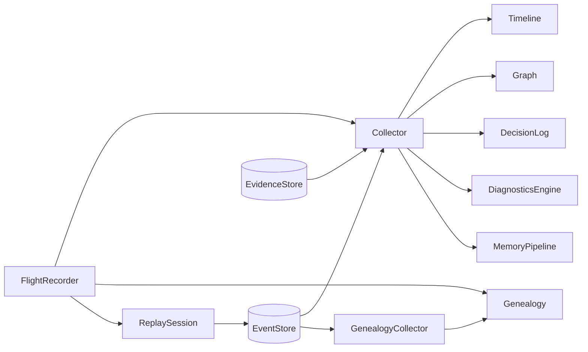

The `ares_flight` package (`internal/ares_flight`, import path `flight`) is the
runtime intelligence layer for ARES agents. It records execution timelines,
call graphs, decisions, memory pipelines, and diagnostics, acting as the
"flight recorder" for multi-agent systems. A `Collector` subscribes to the
event store and populates in-memory data structures that the
`FlightRecorder` aggregates.

## Responsibility

- Subscribe to `ares_events.EventStore` and route each event to the right data
  structure (timeline, graph, decision log, diagnostics, memory pipeline).
- Maintain an execution `Timeline` of ordered `TimelineEvent` records with
  filtering by agent/type and a time-distribution `Summary`.
- Build a call `Graph` of agents, tools, and LLM calls with parent/child links
  and status updates, exportable as Mermaid, DOT, or JSON.
- Record agent `Decision`s (tool selection, model selection, retry, routing)
  in a `DecisionLog`.
- Classify failures via `DiagnosticsEngine`, auto-diagnose errors with
  `ClassifyError` and `AutoDiagnose`, and suggest fixes with `SuggestFix`.
- Track the complete agent family tree with `Genealogy` (spawn, resurrection,
  promotion, death) via a dedicated `GenealogyCollector`.
- Track memory evolution per session with `MemoryPipeline` and its
  `PipelineSummary` (compression ratio, stage counts).
- Replay a task's event stream step by step with `ReplaySession`.
- Expose per-agent `AgentSnapshot` views aggregating timeline, decisions, and
  diagnostics.

## Architecture



`FlightRecorder` is the unified entry point. It owns a `Collector` that runs a
background `collectLoop` consuming events from the store and dispatching them
by type (agent start/stop, task start/end, failover, memory distilled, LLM
call, tool events, decision events). A separate `GenealogyCollector` can run
independently to maintain the lineage tree. `ReplaySession` reads events
directly from the store on demand for step-by-step replay.

## External interfaces

The flight recorder is configured through these structs. Signatures are
extracted verbatim from `recorder.go` and `collector.go`.

```go
// FlightRecorderConfig holds dependencies for the flight recorder.
type FlightRecorderConfig struct {
    EventStore    ares_events.EventStore
    EvidenceStore evidence.Store // optional: unified Evidence Store
    MemManager    memory.MemoryManager
    Genealogy     *Genealogy // optional, for agent genealogy tracking
}

// CollectorConfig holds dependencies for the collector.
type CollectorConfig struct {
    EventStore    ares_events.EventStore
    EvidenceStore evidence.Store // optional: unified Evidence Store
}
```

The package consumes `ares_events.EventStore` (for `Subscribe`, `Read`),
`evidence.Store` and `evidence.Collector` (for unified evidence emission), and
`memory.MemoryManager` (optional, for memory integration).

## Key types and methods

| Type | Purpose | Key methods |
|------|---------|-------------|
| `FlightRecorder` | Unified entry point for all flight data | `NewFlightRecorder`, `Start`, `Stop`, `Timeline`, `Graph`, `Decisions`, `Diagnostics`, `Pipeline`, `Genealogy`, `SetGenealogy`, `EventStoreRef`, `Replay`, `Snapshot` |
| `Collector` | Subscribes to events and populates structures | `NewCollector`, `Start`, `Stop`, `Timeline`, `Graph`, `Decisions`, `Diagnostics`, `Pipeline` |
| `Timeline` | Ordered execution events | `NewTimeline`, `Add`, `Events`, `FilterByAgent`, `FilterByType`, `Summary`, `Len` |
| `Graph` | Agent/tool/LLM call tree | `NewGraph`, `AddNode`, `GetNode`, `UpdateNodeStatus`, `Root`, `Nodes`, `Depth`, `ExportMermaid`, `ExportDOT`, `ExportJSON` |
| `DecisionLog` | Records agent decisions | `NewDecisionLog`, `Add`, `All`, `FilterByAgent`, `FilterByType`, `Len` |
| `DiagnosticsEngine` | Failure analysis and root-cause classification | `NewDiagnosticsEngine`, `Record`, `All`, `FilterByAgent`, `FilterByCategory`, `Distribution`, `Len` |
| `Genealogy` | Agent family tree | `NewGenealogy`, `RecordSpawn`, `RecordResurrection`, `RecordRoot`, `RecordDeath`, `RecordPromotion`, `GetNode`, `Roots`, `Descendants`, `Ancestors`, `IsAlive`, `ExportMermaid`, `ExportJSON`, `AllNodes` |
| `GenealogyCollector` | Populates genealogy from events | `NewGenealogyCollector`, `Start`, `Stop`, `Genealogy` |
| `MemoryPipeline` | Memory evolution per session | `NewMemoryPipeline`, `AddStage`, `Stages`, `Summary`, `SessionID` |
| `ReplaySession` | Step-by-step task replay | `NewReplaySession`, `Step`, `StepTo`, `Current`, `Summary`, `TotalSteps`, `IsFinished`, `Reset` |
| `TimelineEvent` | Single timeline entry | (struct with `ID`, `AgentID`, `Type`, `Name`, `StartAt`, `EndAt`, `Duration`, `Metadata`) |
| `GraphNode` | Node in the call graph | (struct with `ID`, `ParentID`, `Type`, `Name`, `Status`, `StartAt`, `Children`) |
| `Decision` | Why an agent made a choice | (struct with `Type`, `Candidates`, `Selected`, `Reason`, `Confidence`) |
| `DiagnosticRecord` | Failure with root cause | (struct with `Category`, `RootCause`, `Suggestion`, `Duration`, `Context`) |
| `LineageNode` | Agent in the genealogy tree | (struct with `ID`, `Type`, `ParentID`, `Relation`, `SpawnedAt`, `DiedAt`, `IsAlive`, `Children`) |
| `AgentSnapshot` | Point-in-time view of one agent | (struct with `Timeline`, `Decisions`, `Diagnostics`) |

## Module collaboration

- **ares_events**: `Collector` and `GenealogyCollector` subscribe to
  `ares_events.EventStore`; `ReplaySession` reads events with
  `ReadOptions{Direction: ReadAscending}`. Event types handled include
  `EventAgentStarted`, `EventAgentStopped`, `EventTaskCreated`,
  `EventTaskCompleted`, `EventTaskFailed`, `EventFailoverTriggered`,
  `EventFailoverCompleted`, `EventMemoryDistilled`, and `EventLLMCall`.
- **evidence**: when an `EvidenceStore` is configured, the collector emits
  `KindExecutionTrace` evidence for every processed event.
- **ares_memory**: `FlightRecorderConfig.MemManager` accepts a
  `memory.MemoryManager` for memory integration.
- **dashboard**: the dashboard orchestrator records timeline, decision, and
  diagnostic events through the flight recorder during agent runs, and the
  arena `FlightBridge` records fault-injection actions and failures.
- **ares_arena**: `arena.FlightBridge` calls `Timeline().Add` and
  `Diagnostics().Record` for each executed chaos action.

## Extension points

1. Create a flight recorder with `NewFlightRecorder` passing an
   `ares_events.EventStore` (required) and optional `EvidenceStore`,
   `MemManager`, and `Genealogy`.
2. Call `Start(ctx)` to begin background collection; the collector subscribes
   to all events and routes them to the timeline, graph, decisions,
   diagnostics, and memory pipeline. Call `Stop()` to shut down cleanly.
3. Attach an agent genealogy tree with `SetGenealogy`, or run a standalone
   `GenealogyCollector` via `NewGenealogyCollector(eventStore)` and `Start` to
   track spawns, resurrections, promotions, and deaths.
4. Query data through the accessors: `Timeline().FilterByAgent`,
   `Graph().ExportMermaid`, `Decisions().FilterByType`,
   `Diagnostics().Distribution`, `Pipeline(sessionID).Summary`, and
   `Genealogy().Descendants`.
5. Replay a task with `Replay(ctx, taskID)` to get a `ReplaySession`; use
   `Step`, `StepTo`, `Current`, `Reset`, and `Summary` to inspect execution
   step by step.
6. Use `Snapshot(agentID)` to get a combined `AgentSnapshot` of timeline,
   decisions, and diagnostics for a single agent.
7. Consume raw events directly via `EventStoreRef()` when you need to bypass
   the collector's processing pipeline (for example, in evolution adapters).

## Bilingual status

This page is maintained in both English and Chinese with identical technical
content. Code identifiers, type names, and event-type constants remain in
English in both translations.

## Maturity

Beta. The package is functional and tested (`flight_test.go`,
`genealogy_test.go`) and integrates with the dashboard, arena, and evolution
subsystems, but the `Graph` and `Genealogy` exporters still embed decorative
emoji in their Mermaid/JSON output, the `MemManager` field is accepted but not
fully exercised by the collector, and the API surface around memory pipeline
stages is still consolidating.


