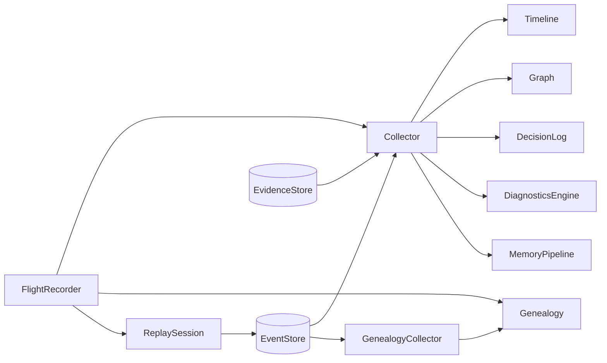

`ares_flight` 包（`internal/ares_flight`，导入路径 `flight`）是 ARES Agent 的运行时
智能层。它记录执行时间线、调用图、决策、记忆管道与诊断，充当多 Agent 系统的
“飞行记录器”。`Collector` 订阅事件存储，并填充由 `FlightRecorder` 聚合的内存数据
结构。

## 职责

- 订阅 `ares_events.EventStore`，将每个事件路由到正确的数据结构（时间线、调用图、
  决策日志、诊断、记忆管道）。
- 维护按序排列的 `TimelineEvent` 执行 `Timeline`，支持按 agent/type 过滤及时间分布
  `Summary`。
- 构建由 agent、tool、LLM 调用组成的调用 `Graph`，含父子链接与状态更新，可导出为
  Mermaid、DOT 或 JSON。
- 在 `DecisionLog` 中记录 Agent `Decision`（工具选择、模型选择、重试、路由）。
- 通过 `DiagnosticsEngine` 分类失败，使用 `ClassifyError` 与 `AutoDiagnose` 自动
  诊断错误，并用 `SuggestFix` 给出修复建议。
- 通过 `Genealogy`（spawn、resurrection、promotion、death）借助独立的
  `GenealogyCollector` 跟踪完整的 Agent 家谱。
- 通过 `MemoryPipeline` 及其 `PipelineSummary`（压缩比、阶段计数）按 session 跟踪
  记忆演化。
- 通过 `ReplaySession` 逐步回放任务的事件流。
- 暴露聚合时间线、决策与诊断的按 Agent `AgentSnapshot` 视图。

## 架构图



`FlightRecorder` 是统一入口。它持有一个 `Collector`，后者在后台 `collectLoop` 中
消费存储事件并按类型分发（agent start/stop、task start/end、failover、
memory distilled、LLM call、tool 事件、decision 事件）。独立的
`GenealogyCollector` 可单独运行以维护家谱树。`ReplaySession` 按需直接从存储读取
事件以逐步回放。

## 外部接口

飞行记录器通过以下结构体配置，签名均从 `recorder.go` 与 `collector.go` 中逐字
提取。

```go
// FlightRecorderConfig holds dependencies for the flight recorder.
type FlightRecorderConfig struct {
    EventStore    ares_events.EventStore
    EvidenceStore evidence.Store // optional: unified Evidence Store
    MemManager    memory.MemoryManager
    Genealogy     *Genealogy // optional, for agent genealogy tracking
}

// CollectorConfig holds dependencies for the collector.
type CollectorConfig struct {
    EventStore    ares_events.EventStore
    EvidenceStore evidence.Store // optional: unified Evidence Store
}
```

该包消费 `ares_events.EventStore`（用于 `Subscribe`、`Read`）、`evidence.Store`
与 `evidence.Collector`（用于统一证据发射），以及 `memory.MemoryManager`
（可选，用于记忆集成）。

## 关键类型与方法

| 类型 | 用途 | 关键方法 |
|------|------|----------|
| `FlightRecorder` | 所有飞行数据的统一入口 | `NewFlightRecorder`, `Start`, `Stop`, `Timeline`, `Graph`, `Decisions`, `Diagnostics`, `Pipeline`, `Genealogy`, `SetGenealogy`, `EventStoreRef`, `Replay`, `Snapshot` |
| `Collector` | 订阅事件并填充数据结构 | `NewCollector`, `Start`, `Stop`, `Timeline`, `Graph`, `Decisions`, `Diagnostics`, `Pipeline` |
| `Timeline` | 有序的执行事件 | `NewTimeline`, `Add`, `Events`, `FilterByAgent`, `FilterByType`, `Summary`, `Len` |
| `Graph` | agent/tool/LLM 调用树 | `NewGraph`, `AddNode`, `GetNode`, `UpdateNodeStatus`, `Root`, `Nodes`, `Depth`, `ExportMermaid`, `ExportDOT`, `ExportJSON` |
| `DecisionLog` | 记录 Agent 决策 | `NewDecisionLog`, `Add`, `All`, `FilterByAgent`, `FilterByType`, `Len` |
| `DiagnosticsEngine` | 失败分析与根因分类 | `NewDiagnosticsEngine`, `Record`, `All`, `FilterByAgent`, `FilterByCategory`, `Distribution`, `Len` |
| `Genealogy` | Agent 家谱树 | `NewGenealogy`, `RecordSpawn`, `RecordResurrection`, `RecordRoot`, `RecordDeath`, `RecordPromotion`, `GetNode`, `Roots`, `Descendants`, `Ancestors`, `IsAlive`, `ExportMermaid`, `ExportJSON`, `AllNodes` |
| `GenealogyCollector` | 从事件填充家谱 | `NewGenealogyCollector`, `Start`, `Stop`, `Genealogy` |
| `MemoryPipeline` | 按 session 的记忆演化 | `NewMemoryPipeline`, `AddStage`, `Stages`, `Summary`, `SessionID` |
| `ReplaySession` | 逐步任务回放 | `NewReplaySession`, `Step`, `StepTo`, `Current`, `Summary`, `TotalSteps`, `IsFinished`, `Reset` |
| `TimelineEvent` | 单条时间线条目 | （结构体，含 `ID`, `AgentID`, `Type`, `Name`, `StartAt`, `EndAt`, `Duration`, `Metadata`） |
| `GraphNode` | 调用图中的节点 | （结构体，含 `ID`, `ParentID`, `Type`, `Name`, `Status`, `StartAt`, `Children`） |
| `Decision` | Agent 为何做出某选择 | （结构体，含 `Type`, `Candidates`, `Selected`, `Reason`, `Confidence`） |
| `DiagnosticRecord` | 带根因的失败 | （结构体，含 `Category`, `RootCause`, `Suggestion`, `Duration`, `Context`） |
| `LineageNode` | 家谱树中的 Agent | （结构体，含 `ID`, `Type`, `ParentID`, `Relation`, `SpawnedAt`, `DiedAt`, `IsAlive`, `Children`） |
| `AgentSnapshot` | 单个 Agent 的某时刻视图 | （结构体，含 `Timeline`, `Decisions`, `Diagnostics`） |

## 模块协作

- **ares_events**：`Collector` 与 `GenealogyCollector` 订阅
  `ares_events.EventStore`；`ReplaySession` 以
  `ReadOptions{Direction: ReadAscending}` 读取事件。处理的事件类型包括
  `EventAgentStarted`、`EventAgentStopped`、`EventTaskCreated`、
  `EventTaskCompleted`、`EventTaskFailed`、`EventFailoverTriggered`、
  `EventFailoverCompleted`、`EventMemoryDistilled` 与 `EventLLMCall`。
- **evidence**：配置 `EvidenceStore` 后，collector 为每个处理过的事件发射
  `KindExecutionTrace` 证据。
- **ares_memory**：`FlightRecorderConfig.MemManager` 接受
  `memory.MemoryManager` 用于记忆集成。
- **dashboard**：仪表盘编排器在 Agent 运行期间通过飞行记录器记录时间线、决策与
  诊断事件，竞技场 `FlightBridge` 记录故障注入动作与失败。
- **ares_arena**：`arena.FlightBridge` 对每个执行的混沌动作调用
  `Timeline().Add` 与 `Diagnostics().Record`。

## 扩展方式

1. 用 `NewFlightRecorder` 创建飞行记录器，传入 `ares_events.EventStore`（必需）
   及可选的 `EvidenceStore`、`MemManager` 与 `Genealogy`。
2. 调用 `Start(ctx)` 开始后台采集；collector 订阅所有事件并路由到时间线、调用图、
   决策、诊断与记忆管道。调用 `Stop()` 优雅关闭。
3. 通过 `SetGenealogy` 挂载 Agent 家谱树，或通过
   `NewGenealogyCollector(eventStore)` 与 `Start` 运行独立的
   `GenealogyCollector`，以跟踪 spawn、resurrection、promotion 与 death。
4. 通过访问器查询数据：`Timeline().FilterByAgent`、`Graph().ExportMermaid`、
   `Decisions().FilterByType`、`Diagnostics().Distribution`、
   `Pipeline(sessionID).Summary` 与 `Genealogy().Descendants`。
5. 通过 `Replay(ctx, taskID)` 获取 `ReplaySession` 回放任务；使用 `Step`、
   `StepTo`、`Current`、`Reset` 与 `Summary` 逐步检视执行。
6. 使用 `Snapshot(agentID)` 获取单个 Agent 的组合 `AgentSnapshot`（时间线、决策与
   诊断）。
7. 当需要绕过 collector 的处理管道（例如在演化适配器中）时，通过 `EventStoreRef()`
   直接消费原始事件。

## 双语状态

本页同时维护英文与中文版本，技术内容一致。两个译本中代码标识符、类型名与事件类型
常量均保持英文。

## 成熟度

Beta。该包功能完备且有测试（`flight_test.go`、`genealogy_test.go`），并与仪表盘、
竞技场及演化子系统集成，但 `Graph` 与 `Genealogy` 的导出器在 Mermaid/JSON 输出中
仍嵌有装饰性 emoji，`MemManager` 字段虽被接受但未被 collector 充分使用，且围绕
记忆管道阶段的 API 仍在整合中。


