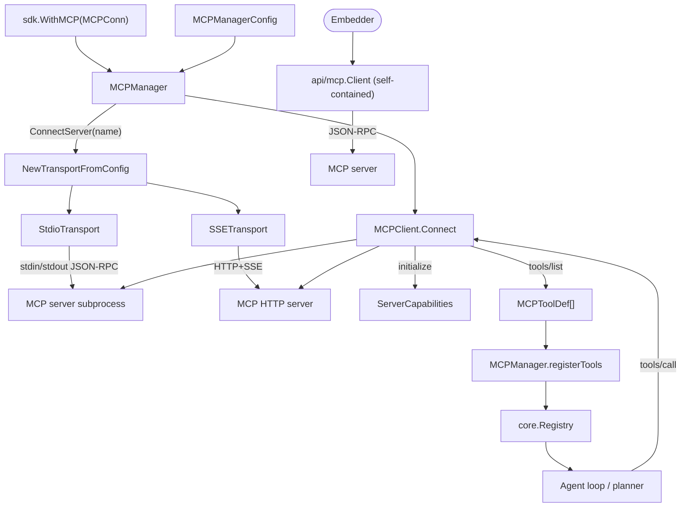

The `ares_mcp` module connects ARES to external Model Context Protocol
servers. `internal/ares_mcp` owns the JSON-RPC client, multi-server
manager, stdio/SSE transports, and the tool adapter that registers remote
tools into the internal `core.Registry`. `api/mcp` ships a self-contained
client with zero `internal/` dependencies for embedders that only need MCP
access.

## Responsibility

- Speak MCP over JSON-RPC 2.0: `initialize` handshake, `tools/list`,
  `tools/call`, and `notifications/tools/list_changed` for live tool
  refresh.
- Manage multiple MCP servers via `MCPManager`: connect/disconnect,
  register/unregister remote tools into the shared `core.Registry`, and
  apply config changes live via `ApplyConfig`.
- Provide `stdio` (subprocess) and `SSE` transports behind a common
  `Transport` interface, plus `NewTransportFromConfig` dispatch.
- Adapt each remote tool to `core.Tool` via `MCPTool` so the planner and
  agent loop can invoke them like builtins.
- Expose `MCPToolFactory` for config-driven tool creation and the
  self-contained `api/mcp.Client` for embedders.

## Architecture



## External interfaces

```go
// internal/ares_mcp
type Transport interface {
    Start(ctx context.Context) error
    Send(ctx context.Context, msg *JSONRPCMessage) error
    Receive(ctx context.Context) (*JSONRPCMessage, error)
    Close() error
}

type TransportConfig struct {
    Type  string       `yaml:"type" json:"type"`
    Stdio *StdioConfig `yaml:"stdio,omitempty" json:"stdio,omitempty"`
    SSE   *SSEConfig   `yaml:"sse,omitempty" json:"sse,omitempty"`
}

type StdioConfig struct {
    Command string            `yaml:"command" json:"command"`
    Args    []string          `yaml:"args" json:"args"`
    Env     map[string]string `yaml:"env" json:"env"`
    WorkDir string            `yaml:"work_dir" json:"work_dir"`
}

func NewTransportFromConfig(config TransportConfig) (Transport, error)
func NewStdioTransport(config StdioConfig) *StdioTransport
func NewSSETransport(config SSEConfig) *SSETransport

type MCPClientConfig struct {
    ServerName string
    Transport  TransportConfig
    Timeout    time.Duration
    OnChange   func()
}

type MCPClient struct { /* unexported */ }
func NewMCPClient(config MCPClientConfig) *MCPClient
func (c *MCPClient) Connect(ctx context.Context, transport Transport) error
func (c *MCPClient) ListTools(ctx context.Context) ([]MCPToolDef, error)
func (c *MCPClient) CallTool(ctx context.Context, name string, args map[string]any) (*ToolCallResult, error)
func (c *MCPClient) ServerName() string
func (c *MCPClient) ServerCapabilities() *ServerCapabilities
func (c *MCPClient) GetTool(name string) (*MCPToolDef, bool)
func (c *MCPClient) ToolCount() int
func (c *MCPClient) IsConnected() bool
func (c *MCPClient) Close() error

type MCPServerConfig struct {
    Name      string          `yaml:"name" json:"name"`
    Transport TransportConfig `yaml:"transport" json:"transport"`
    Timeout   time.Duration   `yaml:"timeout" json:"timeout"`
    Enabled   bool            `yaml:"enabled" json:"enabled"`
    AutoStart bool            `yaml:"auto_start" json:"auto_start"`
}

type MCPManagerConfig struct {
    Servers []MCPServerConfig `yaml:"servers" json:"servers"`
}

type MCPServerStatus struct {
    Name      string    `json:"name"`
    Connected bool      `json:"connected"`
    ToolCount int       `json:"tool_count"`
    Version   string    `json:"version"`
    Error     string    `json:"error,omitempty"`
    ConnAt    time.Time `json:"connected_at,omitempty"`
}

type MCPManager struct { /* unexported */ }
func NewMCPManager(config *MCPManagerConfig, registry *core.Registry) (*MCPManager, error)
func (m *MCPManager) Start(ctx context.Context) error
func (m *MCPManager) Stop(ctx context.Context) error
func (m *MCPManager) ConnectServer(ctx context.Context, name string) error
func (m *MCPManager) DisconnectServer(ctx context.Context, name string) error
func (m *MCPManager) RefreshTools(ctx context.Context, serverName string) error
func (m *MCPManager) ListServers() []MCPServerStatus
func (m *MCPManager) GetClient(serverName string) (*MCPClient, bool)
func (m *MCPManager) ApplyConfig(ctx context.Context, newCfg *MCPManagerConfig) []string

type MCPTool struct { /* unexported */ }
func NewMCPTool(client *MCPClient, def *MCPToolDef) (*MCPTool, error)
func (t *MCPTool) Execute(ctx context.Context, params map[string]interface{}) (core.Result, error)
func (t *MCPTool) ServerName() string
func (t *MCPTool) Close() error

type MCPToolFactory struct { /* unexported */ }
func NewMCPToolFactory(manager *MCPManager) *MCPToolFactory
func (f *MCPToolFactory) Name() string
func (f *MCPToolFactory) Description() string
func (f *MCPToolFactory) Create(config map[string]interface{}) (core.Tool, error)
func (f *MCPToolFactory) ValidateConfig(config map[string]interface{}) error

// api/mcp (self-contained, no internal/ imports)
type Client struct { /* unexported */ }
type ToolInfo struct {
    Name        string `json:"name"`
    Description string `json:"description,omitempty"`
}
type CallResult struct {
    Content []ContentBlock `json:"content"`
    IsError bool           `json:"is_error"`
}
type ContentBlock struct {
    Type     string `json:"type"`
    Text     string `json:"text,omitempty"`
    MimeType string `json:"mimeType,omitempty"`
}
type ServerConfig struct { /* unexported fields */ }
func ConnectFromConfig(ctx context.Context, cfg ServerConfig) (*Client, error)
func DiscoverServers(projectDir string) []ServerConfig
func (c *Client) ListTools(ctx context.Context) ([]ToolInfo, error)
func (c *Client) CallTool(ctx context.Context, name string, args map[string]any) (*CallResult, error)
func (c *Client) Name() string
func (c *Client) Close() error

// sdk (top-level convenience)
type MCPConn struct {
    Name    string
    Command string
    Args    []string
}
func WithMCP(conn MCPConn) Option
```

## Key types and methods

| Type | Method | Purpose |
|------|--------|---------|
| `ares_mcp.Transport` | interface (Start/Send/Receive/Close) | JSON-RPC transport abstraction. |
| `ares_mcp.StdioTransport` | `NewStdioTransport(StdioConfig)` | Subprocess transport over stdin/stdout (1 MiB read buffer). |
| `ares_mcp.SSETransport` | `NewSSETransport(SSEConfig)` | HTTP+SSE transport. |
| `NewTransportFromConfig` | function | Dispatch on `TransportConfig.Type` (`stdio`/`sse`). |
| `MCPClient` | `NewMCPClient(MCPClientConfig)` | Per-server client with timeout + `OnChange` callback. |
| `MCPClient` | `Connect(ctx, Transport)` | Start transport, run `initialize` handshake, list initial tools. |
| `MCPClient` | `ListTools(ctx)` | `tools/list` and cache results; fires `OnChange` on `tools/list_changed`. |
| `MCPClient` | `CallTool(ctx, name, args)` | `tools/call` returning `*ToolCallResult`. |
| `MCPClient` | `IsConnected()` / `Close()` | Atomic connected flag; cancel + transport close + drain errgroup. |
| `MCPManager` | `NewMCPManager(*MCPManagerConfig, *core.Registry)` | Multi-server manager; registry is required for tool registration. |
| `MCPManager` | `Start(ctx)` / `Stop(ctx)` | Connect all `Enabled+AutoStart` servers / disconnect all. |
| `MCPManager` | `ConnectServer(ctx, name)` / `DisconnectServer(ctx, name)` | Per-server lifecycle; auto-registers/unregisters tools. |
| `MCPManager` | `RefreshTools(ctx, serverName)` | Force re-fetch and re-register tools. |
| `MCPManager` | `ListServers()` / `GetClient(name)` | Status snapshot and client lookup. |
| `MCPManager` | `ApplyConfig(ctx, *MCPManagerConfig)` | Live diff; returns names of changed servers. |
| `MCPTool` | `NewMCPTool(client, def)` | Adapter: makes a remote tool behave as `core.Tool`. |
| `MCPTool` | `Execute(ctx, params)` | Calls `MCPClient.CallTool`, extracts text from content blocks. |
| `MCPToolFactory` | `Create(config)` | Config-driven tool creation; implements `core.ToolFactory`. |
| `api/mcp.Client` | `ConnectFromConfig(ctx, ServerConfig)` | Self-contained client for embedders (no `internal/`). |
| `api/mcp.Client` | `ListTools` / `CallTool` / `Close` | Minimal MCP surface for direct use. |
| `api/mcp.DiscoverServers` | function | Scan a project dir for MCP server configs. |
| `sdk.MCPConn` | fields `Name`, `Command`, `Args` | SDK option payload for `sdk.WithMCP`. |
| `sdk.WithMCP` | function | Append an MCP server connection to the runtime. |

## Module collaboration

- The SDK collects `MCPConn` values from repeated `sdk.WithMCP` calls and
  translates each into an `MCPServerConfig` (stdio transport) consumed by
  `internal/ares_bootstrap`, which constructs the `MCPManager` against the
  shared `core.Registry`.
- `MCPManager.Start` connects every `Enabled && AutoStart` server. Each
  `ConnectServer` builds a transport via `NewTransportFromConfig`, creates
  an `MCPClient`, calls `Connect` (initialize + initial `tools/list`), then
  `registerTools` wraps every `MCPToolDef` as an `MCPTool` and registers it
  into `core.Registry` under a server-namespaced name.
- `MCPClient.receiveLoop` dispatches JSON-RPC responses by `id` (correlated
  via `pending` channel map) and forks notifications to a goroutine so a
  `tools/list_changed` notification can issue a new `ListTools` without
  deadlocking the receive loop. Successful refresh invokes `OnChange`.
- `MCPTool.Execute` marshals params, calls `MCPClient.CallTool`, and
  flattens the returned `ContentBlock`s into a single text `core.Result`,
  so the agent loop and planner treat remote tools identically to builtins.
- `MCPManager.ApplyConfig` diffs old vs. new `MCPServerConfig` (command,
  args, env, transport type) and returns the changed server names so the
  runtime can reconnect selectively; `config_watcher.go` can drive this
  from a file watcher.
- `api/mcp.Client` is the escape hatch for embedders who only need MCP: it
  implements the JSON-RPC envelope locally (`jsonrpcRequest`/
  `jsonrpcResponse`), supports `ConnectFromConfig` and `DiscoverServers`,
  and has no `internal/` imports.

## Extension points

1. **Connect an MCP server from the SDK.** Call
   `sdk.WithMCP(sdk.MCPConn{Name: "...", Command: "...", Args: []string{...}})`
   once per server. Discovered tools are auto-registered into the runtime
   tool registry.
2. **Add a new transport.** Implement the `Transport` interface
   (Start/Send/Receive/Close) and add a case to
   `NewTransportFromConfig` keyed on a new `TransportConfig.Type` string.
3. **Manage servers programmatically.** Build `MCPManagerConfig` with one
   `MCPServerConfig` per server, construct `NewMCPManager(cfg, registry)`,
   call `Start(ctx)` for auto-start or `ConnectServer(ctx, name)` on
   demand. Use `ApplyConfig` for live reconfiguration.
4. **React to tool-list changes.** Set `MCPClientConfig.OnChange` to a
   callback; the client invokes it after every successful
   `notifications/tools/list_changed` refresh.
5. **Use MCP without the runtime.** Call `api/mcp.ConnectFromConfig(ctx,
   ServerConfig)` to get a self-contained `*Client`, then `ListTools` and
   `CallTool` directly. This path has no `internal/` dependencies.
6. **Expose MCP tools via the factory.** Register `NewMCPToolFactory(mgr)`
   with the tool factory registry; configs that reference an MCP server
   will then materialize `MCPTool` instances on demand.

## Bilingual status

This page is maintained in both English (`ares_mcp.en.md`) and Chinese
(`ares_mcp.zh.md`). Code blocks, type names, method names, and identifiers
are kept verbatim across both languages; prose is translated.

## Maturity

Production. The module is covered by `client_test.go`, `manager_test.go`,
`mcp_tool_test.go`, `schema_test.go`, `transport_test.go`,
`transport_server_test.go`, `server_test.go`, `config_watcher_test.go`,
`jsonrpc_test.go`, and `api/mcp/mcp_test.go`, is integrated into the SDK
via `sdk.WithMCP`/`MCPConn`, and ships no experimental markers.


