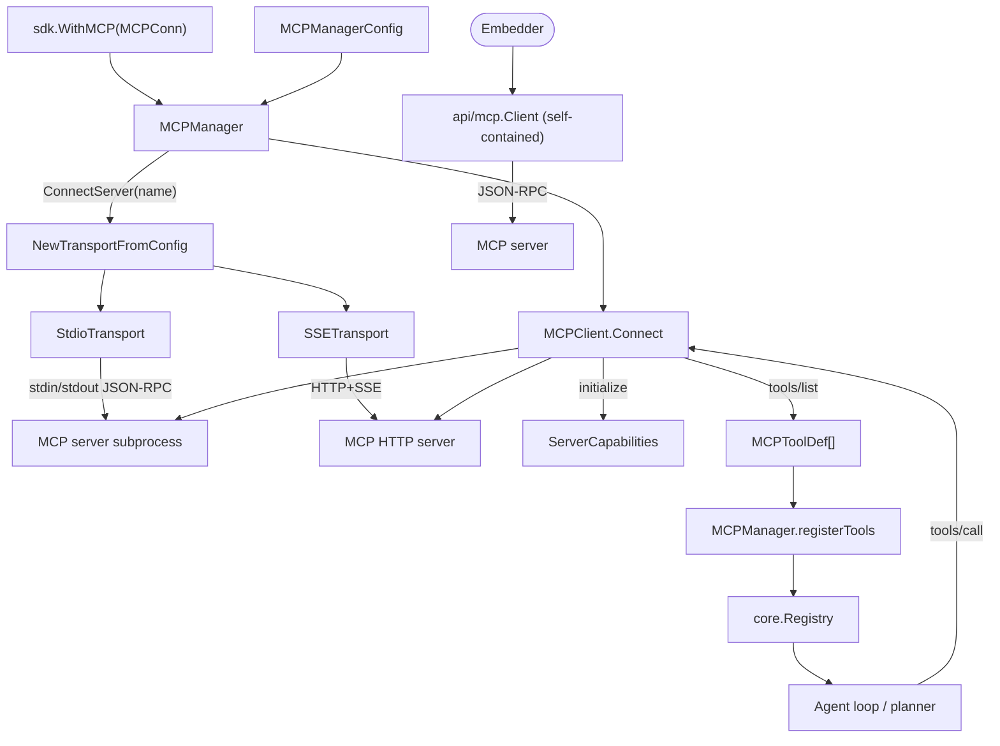

`ares_mcp` 模块将 ARES 连接到外部 Model Context Protocol 服务器。
`internal/ares_mcp` 持有 JSON-RPC 客户端、多服务器管理器、stdio/SSE 传输，
以及把远端工具注册进内部 `core.Registry` 的工具适配器。`api/mcp` 提供零
`internal/` 依赖的自包含客户端，供仅需 MCP 访问的嵌入者使用。

## 职责

- 通过 JSON-RPC 2.0 交互：`initialize` 握手、`tools/list`、`tools/call`，
  以及用于实时工具刷新的 `notifications/tools/list_changed`。
- 通过 `MCPManager` 管理多个 MCP 服务器：连接/断开、把远端工具注册/注销
  到共享 `core.Registry`，并通过 `ApplyConfig` 实时应用配置变更。
- 在统一 `Transport` 接口后提供 `stdio`（子进程）与 `SSE` 传输，并通过
  `NewTransportFromConfig` 分派。
- 通过 `MCPTool` 把每个远端工具适配为 `core.Tool`，使 planner 与 agent
  循环能像内置工具一样调用它们。
- 暴露用于配置驱动工具创建的 `MCPToolFactory`，以及面向嵌入者的自包含
  `api/mcp.Client`。

## 架构图



## 外部接口

```go
// internal/ares_mcp
type Transport interface {
    Start(ctx context.Context) error
    Send(ctx context.Context, msg *JSONRPCMessage) error
    Receive(ctx context.Context) (*JSONRPCMessage, error)
    Close() error
}

type TransportConfig struct {
    Type  string       `yaml:"type" json:"type"`
    Stdio *StdioConfig `yaml:"stdio,omitempty" json:"stdio,omitempty"`
    SSE   *SSEConfig   `yaml:"sse,omitempty" json:"sse,omitempty"`
}

type StdioConfig struct {
    Command string            `yaml:"command" json:"command"`
    Args    []string          `yaml:"args" json:"args"`
    Env     map[string]string `yaml:"env" json:"env"`
    WorkDir string            `yaml:"work_dir" json:"work_dir"`
}

func NewTransportFromConfig(config TransportConfig) (Transport, error)
func NewStdioTransport(config StdioConfig) *StdioTransport
func NewSSETransport(config SSEConfig) *SSETransport

type MCPClientConfig struct {
    ServerName string
    Transport  TransportConfig
    Timeout    time.Duration
    OnChange   func()
}

type MCPClient struct { /* unexported */ }
func NewMCPClient(config MCPClientConfig) *MCPClient
func (c *MCPClient) Connect(ctx context.Context, transport Transport) error
func (c *MCPClient) ListTools(ctx context.Context) ([]MCPToolDef, error)
func (c *MCPClient) CallTool(ctx context.Context, name string, args map[string]any) (*ToolCallResult, error)
func (c *MCPClient) ServerName() string
func (c *MCPClient) ServerCapabilities() *ServerCapabilities
func (c *MCPClient) GetTool(name string) (*MCPToolDef, bool)
func (c *MCPClient) ToolCount() int
func (c *MCPClient) IsConnected() bool
func (c *MCPClient) Close() error

type MCPServerConfig struct {
    Name      string          `yaml:"name" json:"name"`
    Transport TransportConfig `yaml:"transport" json:"transport"`
    Timeout   time.Duration   `yaml:"timeout" json:"timeout"`
    Enabled   bool            `yaml:"enabled" json:"enabled"`
    AutoStart bool            `yaml:"auto_start" json:"auto_start"`
}

type MCPManagerConfig struct {
    Servers []MCPServerConfig `yaml:"servers" json:"servers"`
}

type MCPServerStatus struct {
    Name      string    `json:"name"`
    Connected bool      `json:"connected"`
    ToolCount int       `json:"tool_count"`
    Version   string    `json:"version"`
    Error     string    `json:"error,omitempty"`
    ConnAt    time.Time `json:"connected_at,omitempty"`
}

type MCPManager struct { /* unexported */ }
func NewMCPManager(config *MCPManagerConfig, registry *core.Registry) (*MCPManager, error)
func (m *MCPManager) Start(ctx context.Context) error
func (m *MCPManager) Stop(ctx context.Context) error
func (m *MCPManager) ConnectServer(ctx context.Context, name string) error
func (m *MCPManager) DisconnectServer(ctx context.Context, name string) error
func (m *MCPManager) RefreshTools(ctx context.Context, serverName string) error
func (m *MCPManager) ListServers() []MCPServerStatus
func (m *MCPManager) GetClient(serverName string) (*MCPClient, bool)
func (m *MCPManager) ApplyConfig(ctx context.Context, newCfg *MCPManagerConfig) []string

type MCPTool struct { /* unexported */ }
func NewMCPTool(client *MCPClient, def *MCPToolDef) (*MCPTool, error)
func (t *MCPTool) Execute(ctx context.Context, params map[string]interface{}) (core.Result, error)
func (t *MCPTool) ServerName() string
func (t *MCPTool) Close() error

type MCPToolFactory struct { /* unexported */ }
func NewMCPToolFactory(manager *MCPManager) *MCPToolFactory
func (f *MCPToolFactory) Name() string
func (f *MCPToolFactory) Description() string
func (f *MCPToolFactory) Create(config map[string]interface{}) (core.Tool, error)
func (f *MCPToolFactory) ValidateConfig(config map[string]interface{}) error

// api/mcp (self-contained, no internal/ imports)
type Client struct { /* unexported */ }
type ToolInfo struct {
    Name        string `json:"name"`
    Description string `json:"description,omitempty"`
}
type CallResult struct {
    Content []ContentBlock `json:"content"`
    IsError bool           `json:"is_error"`
}
type ContentBlock struct {
    Type     string `json:"type"`
    Text     string `json:"text,omitempty"`
    MimeType string `json:"mimeType,omitempty"`
}
type ServerConfig struct { /* unexported fields */ }
func ConnectFromConfig(ctx context.Context, cfg ServerConfig) (*Client, error)
func DiscoverServers(projectDir string) []ServerConfig
func (c *Client) ListTools(ctx context.Context) ([]ToolInfo, error)
func (c *Client) CallTool(ctx context.Context, name string, args map[string]any) (*CallResult, error)
func (c *Client) Name() string
func (c *Client) Close() error

// sdk (top-level convenience)
type MCPConn struct {
    Name    string
    Command string
    Args    []string
}
func WithMCP(conn MCPConn) Option
```

## 关键类型与方法

| 类型 | 方法 | 用途 |
|------|------|------|
| `ares_mcp.Transport` | interface（Start/Send/Receive/Close） | JSON-RPC 传输抽象。 |
| `ares_mcp.StdioTransport` | `NewStdioTransport(StdioConfig)` | 通过 stdin/stdout 的子进程传输（1 MiB 读缓冲）。 |
| `ares_mcp.SSETransport` | `NewSSETransport(SSEConfig)` | HTTP+SSE 传输。 |
| `NewTransportFromConfig` | 函数 | 按 `TransportConfig.Type`（`stdio`/`sse`）分派。 |
| `MCPClient` | `NewMCPClient(MCPClientConfig)` | 单服务器客户端，含超时与 `OnChange` 回调。 |
| `MCPClient` | `Connect(ctx, Transport)` | 启动传输、执行 `initialize` 握手、列出初始工具。 |
| `MCPClient` | `ListTools(ctx)` | `tools/list` 并缓存；`tools/list_changed` 时触发 `OnChange`。 |
| `MCPClient` | `CallTool(ctx, name, args)` | `tools/call`，返回 `*ToolCallResult`。 |
| `MCPClient` | `IsConnected()` / `Close()` | 原子连接标志；cancel + 关闭传输 + 排空 errgroup。 |
| `MCPManager` | `NewMCPManager(*MCPManagerConfig, *core.Registry)` | 多服务器管理器；registry 为工具注册所必需。 |
| `MCPManager` | `Start(ctx)` / `Stop(ctx)` | 连接所有 `Enabled+AutoStart` 服务器 / 全部断开。 |
| `MCPManager` | `ConnectServer(ctx, name)` / `DisconnectServer(ctx, name)` | 单服务器生命周期；自动注册/注销工具。 |
| `MCPManager` | `RefreshTools(ctx, serverName)` | 强制重新拉取并注册工具。 |
| `MCPManager` | `ListServers()` / `GetClient(name)` | 状态快照与客户端查找。 |
| `MCPManager` | `ApplyConfig(ctx, *MCPManagerConfig)` | 实时 diff；返回变更服务器名列表。 |
| `MCPTool` | `NewMCPTool(client, def)` | 适配器：让远端工具表现为 `core.Tool`。 |
| `MCPTool` | `Execute(ctx, params)` | 调用 `MCPClient.CallTool`，从 content block 抽取文本。 |
| `MCPToolFactory` | `Create(config)` | 配置驱动的工具创建；实现 `core.ToolFactory`。 |
| `api/mcp.Client` | `ConnectFromConfig(ctx, ServerConfig)` | 面向嵌入者的自包含客户端（无 `internal/`）。 |
| `api/mcp.Client` | `ListTools` / `CallTool` / `Close` | 直连使用的最小 MCP 表面。 |
| `api/mcp.DiscoverServers` | 函数 | 扫描项目目录寻找 MCP 服务器配置。 |
| `sdk.MCPConn` | 字段 `Name`、`Command`、`Args` | `sdk.WithMCP` 的 SDK 选项载荷。 |
| `sdk.WithMCP` | 函数 | 向运行时追加一个 MCP 服务器连接。 |

## 模块协作

- SDK 收集每次 `sdk.WithMCP` 调用产生的 `MCPConn`，将其逐一翻译为
  `MCPServerConfig`（stdio 传输），由 `internal/ares_bootstrap` 消费并据
  此针对共享 `core.Registry` 构造 `MCPManager`。
- `MCPManager.Start` 连接每个 `Enabled && AutoStart` 服务器。每次
  `ConnectServer` 通过 `NewTransportFromConfig` 构建传输，创建
  `MCPClient`，调用 `Connect`（initialize + 初始 `tools/list`），再由
  `registerTools` 把每个 `MCPToolDef` 包装为 `MCPTool`，按服务器命名空间
  注册到 `core.Registry`。
- `MCPClient.receiveLoop` 按 `id` 分派 JSON-RPC 响应（通过 `pending`
  channel map 关联），并将通知 fork 到独立 goroutine，使
  `tools/list_changed` 通知能发出新的 `ListTools` 而不会阻塞接收循环。
  刷新成功时调用 `OnChange`。
- `MCPTool.Execute` 序列化参数，调用 `MCPClient.CallTool`，把返回的
  `ContentBlock` 拍平为单条文本 `core.Result`，使 agent 循环与 planner
  将远端工具与内置工具同等对待。
- `MCPManager.ApplyConfig` 对比新旧 `MCPServerConfig`（command、args、env、
  transport type），返回变更服务器名列表，便于运行时选择性重连；
  `config_watcher.go` 可由文件监听驱动该流程。
- `api/mcp.Client` 是仅需 MCP 的嵌入者的逃生口：本地实现 JSON-RPC 封装
  （`jsonrpcRequest`/`jsonrpcResponse`），支持 `ConnectFromConfig` 与
  `DiscoverServers`，且无任何 `internal/` 依赖。

## 扩展方式

1. **从 SDK 连接 MCP 服务器。** 调用
   `sdk.WithMCP(sdk.MCPConn{Name: "...", Command: "...", Args: []string{...}})`，
   每服务器一次。发现的工具会自动注册到运行时工具注册表。
2. **新增传输。** 实现 `Transport` 接口
   （Start/Send/Receive/Close），并在 `NewTransportFromConfig` 中加入以新
   `TransportConfig.Type` 字符串为键的 case。
3. **以编程方式管理服务器。** 用每服务器一个 `MCPServerConfig` 构建
   `MCPManagerConfig`，`NewMCPManager(cfg, registry)`，调用 `Start(ctx)`
   自动启动或按需 `ConnectServer(ctx, name)`。用 `ApplyConfig` 实时重配。
4. **响应工具列表变更。** 将 `MCPClientConfig.OnChange` 设为回调；客户端
   在每次成功的 `notifications/tools/list_changed` 刷新后调用它。
5. **脱离运行时使用 MCP。** 调用
   `api/mcp.ConnectFromConfig(ctx, ServerConfig)` 获得自包含的 `*Client`，
   再直接 `ListTools` 与 `CallTool`。此路径无 `internal/` 依赖。
6. **通过工厂暴露 MCP 工具。** 将 `NewMCPToolFactory(mgr)` 注册到工具工厂
   注册表；引用 MCP 服务器的配置会按需实例化 `MCPTool`。

## 双语状态

本页同时维护英文（`ares_mcp.en.md`）与中文（`ares_mcp.zh.md`）版本。两份
文档中的代码块、类型名、方法名与标识符保持原样，仅翻译散文。

## 成熟度

Production。本模块由 `client_test.go`、`manager_test.go`、
`mcp_tool_test.go`、`schema_test.go`、`transport_test.go`、
`transport_server_test.go`、`server_test.go`、`config_watcher_test.go`、
`jsonrpc_test.go`、`api/mcp/mcp_test.go` 覆盖，已通过
`sdk.WithMCP`/`MCPConn` 接入 SDK，无任何实验性标记。


