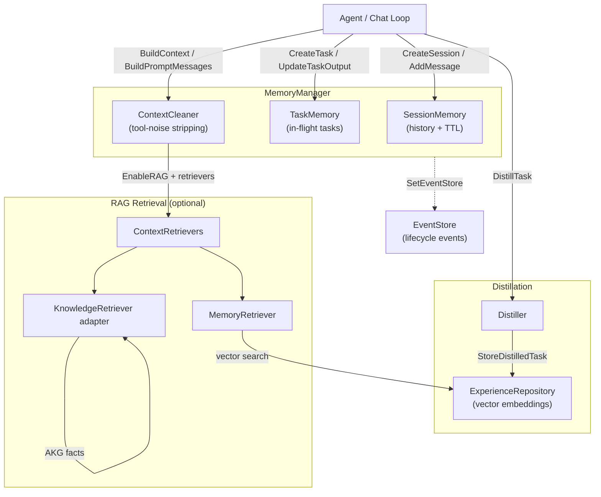

# ares_memory

## Responsibility

The `ares_memory` package (Go import path `internal/ares_memory`, package name
`memory`) provides unified memory management for the ARES agent framework. It
coordinates four concerns through a single `MemoryManager` interface:

- **Session memory** - per-user conversation history with TTL-based eviction.
- **Task memory** - in-flight task tracking (input, output, lifecycle).
- **Distilled experiences** - locally-embedded, vector-searchable memories
  extracted from completed tasks for future reuse.
- **Retrieval-augmented generation (RAG)** - optional injection of past
  experiences and external knowledge into the LLM prompt via pluggable
  `ContextRetriever` implementations.

Two concrete managers ship in-tree: the in-memory `memoryManager` (testing and
single-node deployments) and the production `ProductionMemoryManager` backed by
PostgreSQL + pgvector. Both honor the same interface, so callers switch backends
through configuration alone.

## Architecture



## External interfaces

The package exports the canonical manager interface, three constructors, and
the default configuration. Signatures are extracted verbatim from source.

```go
// MemoryManager provides unified memory management.
type MemoryManager interface {
    CreateSession(ctx context.Context, userID string) (string, error)
    AddMessage(ctx context.Context, sessionID, role, content string) error
    GetMessages(ctx context.Context, sessionID string) ([]Message, error)
    AddStructuredMessage(ctx context.Context, sessionID string, msg Message) error
    BuildPromptMessages(ctx context.Context, sessionID string) ([]Message, error)
    DeleteSession(ctx context.Context, sessionID string) error
    BuildContext(ctx context.Context, input string, sessionID string) (string, error)
    CreateTask(ctx context.Context, sessionID, userID, input string) (string, error)
    UpdateTaskOutput(ctx context.Context, taskID, output string) error
    DistillTask(ctx context.Context, taskID string) (*models.Task, error)
    StoreDistilledTask(ctx context.Context, taskID string, distilled *models.Task) error
    SearchSimilarTasks(ctx context.Context, query string, limit int) ([]*models.Task, error)
    GetLatestSessionForLeader(ctx context.Context, leaderID string) (string, error)
    Start(ctx context.Context) error
    Stop(ctx context.Context) error
    SetEventStore(store ares_events.EventStore, streamID string)
}

// Constructors
func NewMemoryManager(config *MemoryConfig) (MemoryManager, error)
func NewMemoryManagerWithDistiller(config *MemoryConfig, embedder apiembed.EmbeddingService, expRepo distillation.ExperienceRepository) (MemoryManager, error)
func NewProductionMemoryManager(dbPool *postgres.Pool, embeddingClient *embedding.EmbeddingClient, config *MemoryConfig) (*ProductionMemoryManager, error)
func DefaultMemoryConfig() *MemoryConfig

// ContextRetriever (defined in internal/ares_memory/context) is the RAG contract.
type ContextRetriever interface {
    Retrieve(ctx context.Context, input string, topK int) ([]ContextSnippet, error)
}
```

`DefaultMemoryConfig` seeds the canonical defaults: `MaxHistory` 10,
`SessionTTL` 24h, `MaxSessions` 100, `MaxTasks` 1000, `MaxDistilledTasks`
5000, `VectorDim` 128, `RAGTopK` 5, `RAGMinScore` 0.4 (RAG itself is opt-in
via `EnableRAG`, default false).

## Key types and methods

| Type / Method | Kind | Purpose |
| --- | --- | --- |
| `MemoryManager` | interface | 16-method contract for all memory operations. |
| `memoryManager` | struct | In-memory implementation; coordinates `SessionMemory`, `TaskMemory`, optional distiller, and RAG retrievers. |
| `ProductionMemoryManager` | struct | PostgreSQL + pgvector implementation with `TenantGuard`, `WriteBuffer`, and repository-backed storage. |
| `MemoryConfig` | struct | Configuration: limits, TTLs, vector dim, RAG knobs, structured-cleaning toggle. |
| `DefaultMemoryConfig` | function | Returns the canonical default config (MaxHistory 10, SessionTTL 24h, RAGTopK 5, RAGMinScore 0.4). |
| `NewMemoryManager` | function | Constructs the in-memory manager without distillation. |
| `NewMemoryManagerWithDistiller` | function | Constructs the in-memory manager with the distillation engine (recommended for production). |
| `NewProductionMemoryManager` | function | Constructs the production manager backed by PostgreSQL + pgvector. |
| `Message` | type alias | Alias for `context.Message`; carries Role, Content, TurnID, ToolCallID, ToolCalls. |
| `ContextRetriever` | interface | RAG contract; `MemoryRetriever` and the knowledge `KnowledgeRetriever` adapter both implement it. |
| `ContextSnippet` | struct | RAG result unit: Source, Content, Score, Metadata. |
| `SetRetrievers` | method | Wires RAG retrievers at runtime; retrieval only fires when `EnableRAG` is true and retrievers are non-empty. |
| `SetEventStore` | method | Optional event sink for emitting lifecycle events. |

## Module collaboration

- **ares_events** - `SetEventStore` plugs an `ares_events.EventStore` so the
  manager emits `task.created`, `task.completed`, `memory.distilled`, and
  related lifecycle events.
- **ares_memory/context** - provides `SessionMemory`, `TaskMemory`,
  `ContextCleaner`, the `ContextRetriever` interface, `MemoryRetriever`, and
  the `RAG` vector index used by the in-memory path.
- **ares_memory/distillation** - the `Distiller` and `ExperienceRepository`
  extract and store distilled experiences; `NewMemoryManagerWithDistiller`
  wires them in.
- **knowledge** - the `KnowledgeRetriever` adapter implements
  `ContextRetriever` and is registered via `SetRetrievers` to surface AKG
  facts in the prompt.
- **storage/postgres** - `ProductionMemoryManager` depends on `postgres.Pool`,
  `TenantGuard`, `WriteBuffer`, and the conversation/task-result repositories.
- **evidence** - `ProductionMemoryManager` accepts an `EvidenceCollector` to
  emit evidence to the unified evidence store (interface defined locally to
  avoid an import cycle).

## Extension points

1. **Add a new storage backend.** Implement the `MemoryManager` interface (all
   16 methods) against your storage, then expose a constructor mirroring
   `NewProductionMemoryManager`. The interface is the only contract callers
   depend on.
2. **Plug in a custom RAG retriever.** Implement
   `ares_memory/context.ContextRetriever` (a single `Retrieve` method), then
   register it via `manager.SetRetrievers([]memctx.ContextRetriever{...})`.
   Retrieval activates only when `MemoryConfig.EnableRAG` is true.
3. **Swap the distillation engine.** Pass a custom
   `distillation.ExperienceRepository` and `apiembed.EmbeddingService` to
   `NewMemoryManagerWithDistiller` to change how experiences are stored and
   searched.
4. **Tune retrieval thresholds.** Set `MemoryConfig.RAGTopK` and
   `RAGMinScore` (defaults 5 and 0.4) to control snippet count and relevance
   cutoff. The in-memory `RAG` also accepts a `WithPersistentStorage` option
   to delegate vector search to pgvector.
5. **Emit lifecycle events.** Call `SetEventStore(store, streamID)` to route
   task and memory lifecycle transitions into the event-sourcing stream; pass
   `nil` to make emission a no-op.
6. **Switch to structured prompt cleaning.** Set
   `MemoryConfig.UseStructuredCleaning = true` and call `BuildPromptMessages`
   instead of the legacy text-based `BuildContext` to preserve full message
   structure (TurnID, ToolCallID, ToolCalls) for turn-aware cleaning.

## Bilingual status

The Go source code, identifiers, type names, and code comments are entirely in
English. This English page is the canonical reference. A Chinese translation
with identical structure and technical content is published alongside as
`ares_memory.zh.md`; all code blocks, signatures, and identifiers remain in
English in both pages.

## Maturity

Production. The package is covered by `manager_test.go`,
`manager_impl_cosine_test.go`, `manager_rag_test.go`, `memory_patcher_test.go`,
and `pipeline_test.go`. The production manager integrates with the SDK entry
points through `NewProductionMemoryManager` and the in-memory path through
`NewMemoryManagerWithDistiller`. No experimental markers remain on the public
API; RAG is opt-in and fully defaulted.


