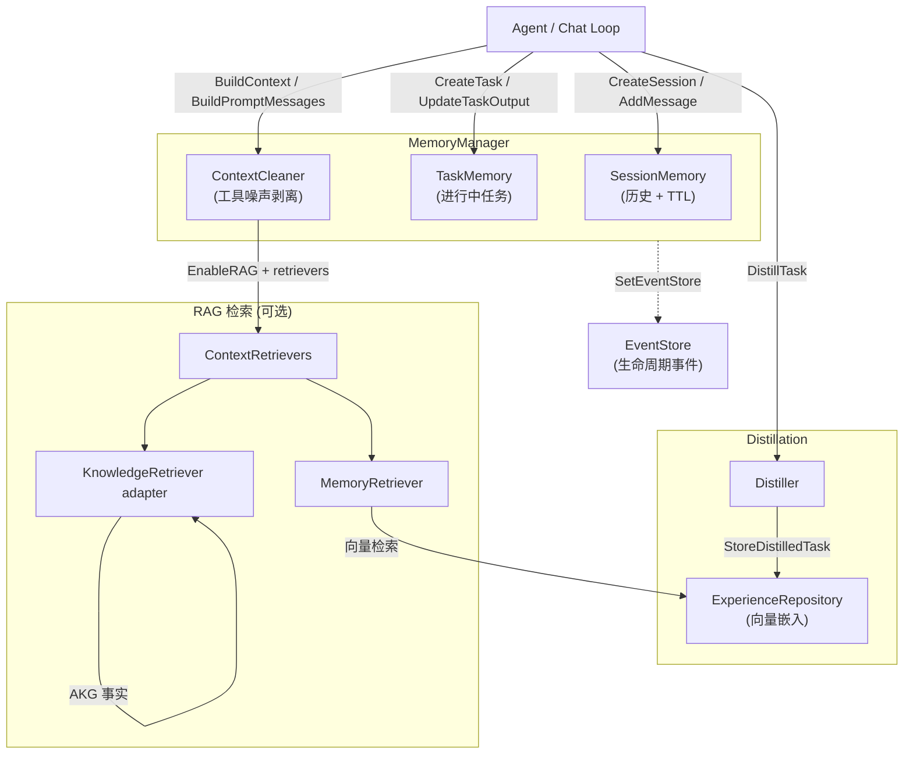

# ares_memory

## 职责

`ares_memory` 包（Go 导入路径 `internal/ares_memory`，包名 `memory`）为 ARES
智能体框架提供统一记忆管理。它通过单一的 `MemoryManager` 接口协调四类关注点：

- **会话记忆** —— 按用户隔离的对话历史，基于 TTL 过期回收。
- **任务记忆** —— 进行中任务的跟踪（输入、输出、生命周期）。
- **蒸馏经验** —— 从已完成任务中抽取、本地向量化、可向量检索的记忆，供后续复用。
- **检索增强生成（RAG）** —— 通过可插拔的 `ContextRetriever` 实现，将过往经验与外部知识注入 LLM 提示词。

包内自带两个具体实现：内存版 `memoryManager`（用于测试与单节点部署）与基于
PostgreSQL + pgvector 的生产版 `ProductionMemoryManager`。两者实现同一接口，
调用方仅通过配置即可切换后端。

## 架构图



## 外部接口

本包导出标准的 manager 接口、三个构造函数与默认配置。下列签名均逐字取自源码。

```go
// MemoryManager provides unified memory management.
type MemoryManager interface {
    CreateSession(ctx context.Context, userID string) (string, error)
    AddMessage(ctx context.Context, sessionID, role, content string) error
    GetMessages(ctx context.Context, sessionID string) ([]Message, error)
    AddStructuredMessage(ctx context.Context, sessionID string, msg Message) error
    BuildPromptMessages(ctx context.Context, sessionID string) ([]Message, error)
    DeleteSession(ctx context.Context, sessionID string) error
    BuildContext(ctx context.Context, input string, sessionID string) (string, error)
    CreateTask(ctx context.Context, sessionID, userID, input string) (string, error)
    UpdateTaskOutput(ctx context.Context, taskID, output string) error
    DistillTask(ctx context.Context, taskID string) (*models.Task, error)
    StoreDistilledTask(ctx context.Context, taskID string, distilled *models.Task) error
    SearchSimilarTasks(ctx context.Context, query string, limit int) ([]*models.Task, error)
    GetLatestSessionForLeader(ctx context.Context, leaderID string) (string, error)
    Start(ctx context.Context) error
    Stop(ctx context.Context) error
    SetEventStore(store ares_events.EventStore, streamID string)
}

// Constructors
func NewMemoryManager(config *MemoryConfig) (MemoryManager, error)
func NewMemoryManagerWithDistiller(config *MemoryConfig, embedder apiembed.EmbeddingService, expRepo distillation.ExperienceRepository) (MemoryManager, error)
func NewProductionMemoryManager(dbPool *postgres.Pool, embeddingClient *embedding.EmbeddingClient, config *MemoryConfig) (*ProductionMemoryManager, error)
func DefaultMemoryConfig() *MemoryConfig

// ContextRetriever (定义于 internal/ares_memory/context) 是 RAG 契约。
type ContextRetriever interface {
    Retrieve(ctx context.Context, input string, topK int) ([]ContextSnippet, error)
}
```

`DefaultMemoryConfig` 植入标准默认值：`MaxHistory` 10、`SessionTTL` 24h、
`MaxSessions` 100、`MaxTasks` 1000、`MaxDistilledTasks` 5000、`VectorDim` 128、
`RAGTopK` 5、`RAGMinScore` 0.4（RAG 本身通过 `EnableRAG` 显式开启，默认关闭）。

## 关键类型与方法

| 类型 / 方法 | 类别 | 用途 |
| --- | --- | --- |
| `MemoryManager` | interface | 16 个方法的记忆操作契约。 |
| `memoryManager` | struct | 内存实现；协调 `SessionMemory`、`TaskMemory`、可选 distiller 与 RAG retriever。 |
| `ProductionMemoryManager` | struct | PostgreSQL + pgvector 实现，含 `TenantGuard`、`WriteBuffer` 与仓储层存储。 |
| `MemoryConfig` | struct | 配置：上限、TTL、向量维度、RAG 参数、结构化清洗开关。 |
| `DefaultMemoryConfig` | function | 返回标准默认配置（MaxHistory 10、SessionTTL 24h、RAGTopK 5、RAGMinScore 0.4）。 |
| `NewMemoryManager` | function | 构造不含蒸馏的内存版 manager。 |
| `NewMemoryManagerWithDistiller` | function | 构造含蒸馏引擎的内存版 manager（生产推荐）。 |
| `NewProductionMemoryManager` | function | 构造基于 PostgreSQL + pgvector 的生产版 manager。 |
| `Message` | type alias | `context.Message` 的别名；承载 Role、Content、TurnID、ToolCallID、ToolCalls。 |
| `ContextRetriever` | interface | RAG 契约；`MemoryRetriever` 与 knowledge 的 `KnowledgeRetriever` 适配器均实现该接口。 |
| `ContextSnippet` | struct | RAG 结果单元：Source、Content、Score、Metadata。 |
| `SetRetrievers` | method | 运行时注入 RAG retriever；仅当 `EnableRAG` 为 true 且 retriever 非空时触发检索。 |
| `SetEventStore` | method | 可选的事件 sink，用于发射生命周期事件。 |

## 模块协作

- **ares_events** —— `SetEventStore` 注入 `ares_events.EventStore`，使 manager 发射
  `task.created`、`task.completed`、`memory.distilled` 等生命周期事件。
- **ares_memory/context** —— 提供 `SessionMemory`、`TaskMemory`、`ContextCleaner`、
  `ContextRetriever` 接口、`MemoryRetriever`，以及内存路径使用的 `RAG` 向量索引。
- **ares_memory/distillation** —— `Distiller` 与 `ExperienceRepository` 负责抽取与存储
  蒸馏经验；`NewMemoryManagerWithDistiller` 完成装配。
- **knowledge** —— `KnowledgeRetriever` 适配器实现 `ContextRetriever`，经
  `SetRetrievers` 注册后向提示词注入 AKG 事实。
- **storage/postgres** —— `ProductionMemoryManager` 依赖 `postgres.Pool`、
  `TenantGuard`、`WriteBuffer` 以及 conversation / task-result 仓储。
- **evidence** —— `ProductionMemoryManager` 接受 `EvidenceCollector`，向统一证据存储
  发射证据（接口在本地定义以避免循环导入）。

## 扩展方式

1. **新增存储后端。** 针对你的存储实现 `MemoryManager` 接口（全部 16 个方法），
   再提供一个与 `NewProductionMemoryManager` 对应的构造函数。调用方仅依赖接口契约。
2. **插入自定义 RAG retriever。** 实现
   `ares_memory/context.ContextRetriever`（仅一个 `Retrieve` 方法），再通过
   `manager.SetRetrievers([]memctx.ContextRetriever{...})` 注册。仅当
   `MemoryConfig.EnableRAG` 为 true 时检索才会生效。
3. **替换蒸馏引擎。** 向 `NewMemoryManagerWithDistiller` 传入自定义的
   `distillation.ExperienceRepository` 与 `apiembed.EmbeddingService`，即可改变经验
   的存储与检索方式。
4. **调整检索阈值。** 设置 `MemoryConfig.RAGTopK` 与 `RAGMinScore`（默认 5 与 0.4）
   控制片段数量与相关度下限。内存版 `RAG` 还接受 `WithPersistentStorage` 选项，将向量
   检索委托给 pgvector。
5. **发射生命周期事件。** 调用 `SetEventStore(store, streamID)` 将任务与记忆的生命周期
   转换路由进事件溯源流；传入 `nil` 则发射变为 no-op。
6. **切换到结构化提示词清洗。** 设置 `MemoryConfig.UseStructuredCleaning = true` 并改用
   `BuildPromptMessages`（而非基于文本的旧版 `BuildContext`），以保留完整的消息结构
   （TurnID、ToolCallID、ToolCalls），实现回合感知的清洗。

## 双语状态

Go 源码、标识符、类型名与代码注释全部为英文，本英文页面为权威参考。中文译本以相同
结构与同等的技术内容随附发布为 `ares_memory.zh.md`；两份页面中的所有代码块、签名与
标识符均保持英文。

## 成熟度

Production。本包由 `manager_test.go`、`manager_impl_cosine_test.go`、
`manager_rag_test.go`、`memory_patcher_test.go` 与 `pipeline_test.go` 覆盖。生产版
manager 通过 `NewProductionMemoryManager` 接入 SDK 入口，内存版通过
`NewMemoryManagerWithDistiller` 接入。公开 API 不再带有实验性标记；RAG 为可选开启且
已提供完整默认值。


