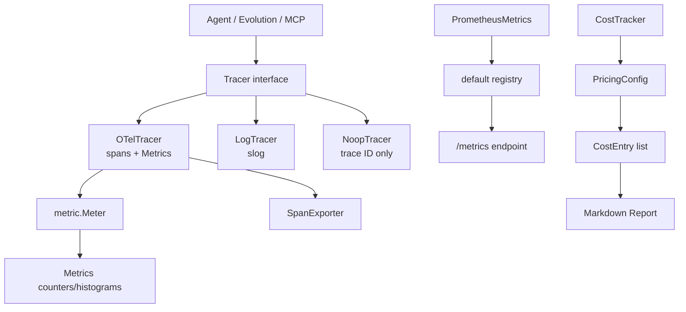

# ares_observability

## Responsibility

`ares_observability` provides the observability primitives every ARES subsystem
records through: a `Tracer` interface for LLM calls, tool calls, agent steps,
and errors; an OpenTelemetry-backed implementation that emits spans and metrics;
a Prometheus metrics bundle exposed at `/metrics`; a `LogTracer` for development;
a `NoopTracer` for minimal-overhead trace-ID propagation; and a `CostTracker`
that accumulates per-model LLM cost in USD.

The package unifies three signal pillars (traces, metrics, logs) behind one
interface so callers can swap implementations without touching instrumentation
sites. It records both operational telemetry (LLM/tool call counts and
durations, agent step durations, active agent gauges) and evolution-specific
telemetry (deploy totals, guardrail triggers, shadow evaluation results,
per-strategy score gauges).

## Architecture



`Tracer` is the central abstraction. `OTelTracer` constructs a tracer and meter
provider pair, builds the `Metrics` instrument set, and records each call as a
span plus metric attributes. `PrometheusMetrics` is a parallel, registry-based
bundle registered with the default Prometheus registry and served via
`MetricsHTTPHandler`. `CostTracker` is independent of both and computes cost
from a `PricingConfig` map keyed by model name.

## External interfaces

```go
// Tracer defines the interface for observability tracking.
type Tracer interface {
    RecordLLMCall(ctx context.Context, call *LLMCall)
    RecordToolCall(ctx context.Context, call *ToolCall)
    RecordAgentStep(ctx context.Context, step *AgentStep)
    RecordError(ctx context.Context, err *AgentError)
    GetTraceID(ctx context.Context) string
    WithTrace(ctx context.Context) context.Context
}

func NewOTelTracer(serviceName string, opts ...OTelOption) (*OTelTracer, error)
func NewLogTracer(cfg *LogTracerConfig) Tracer
func NewNoopTracer() Tracer
func NewMetrics(meter metric.Meter) (*Metrics, error)
func NewPrometheusMetrics() (*PrometheusMetrics, error)
func NewCostTracker(pricing PricingConfig) *CostTracker
func DefaultPricingConfig() PricingConfig
func MetricsHTTPHandler() http.Handler
func RegisterMetricsRouter(mux *http.ServeMux)

// OTelOption functional options.
func WithExporter(exp sdktrace.SpanExporter) OTelOption
func WithSampler(sampler sdktrace.Sampler) OTelOption
func WithMetricReader(reader sdkmetric.Reader) OTelOption
```

## Key types and methods

| Type / Method | Purpose |
|---|---|
| `Tracer` | Unified interface for trace/metric/log recording. |
| `OTelTracer` | OpenTelemetry SDK implementation; emits spans and metrics. |
| `LogTracer` | `slog`-backed tracer for development. |
| `NoopTracer` | Minimal tracer that only propagates trace IDs in context. |
| `Metrics` | OTel counters/histograms for LLM, tool, agent, error events. |
| `PrometheusMetrics` | Prometheus counters, histograms, gauges, summaries. |
| `CostTracker` | Accumulates per-call LLM cost in USD with Markdown report. |
| `LLMCall` / `ToolCall` / `AgentStep` / `AgentError` | Event payloads passed to `Tracer`. |
| `PricingConfig` / `ModelPricing` | Per-1K-token input/output pricing by model. |
| `NewOTelTracer(name, opts...)` | Build a full OTel tracer with providers. |
| `NewPrometheusMetrics()` | Register the Prometheus bundle with the default registry. |
| `RecordLLMCall` / `RecordToolCall` | Counter+histogram recorders on both OTel and Prometheus paths. |
| `CostTracker.RecordCall` / `TotalCost` / `Report` | Cost accumulation and reporting. |
| `OTelTracer.Shutdown(ctx)` | Flush spans/metrics and shut down providers. |

## Module collaboration

- Depends on `go.opentelemetry.io/otel` (trace, metric, sdk, stdouttrace) and
  `github.com/prometheus/client_golang`.
- Uses `internal/logger` for the package-level structured logger.
- Consumed by the agent runtime, MCP manager, and evolution system to record
  operational telemetry.
- `PrometheusMetrics` is intended to be mounted on the dashboard or server mux
  via `RegisterMetricsRouter`.

## Extension points

1. Implement the `Tracer` interface to add a custom backend (e.g. Jaeger,
   Datadog); pass it anywhere a `Tracer` is consumed.
2. Configure `OTelTracer` with `WithExporter`, `WithSampler`, and
   `WithMetricReader` to target a real collector instead of stdout.
3. Extend `PrometheusMetrics` by adding a new `*prometheus.CounterVec` field,
   registering it in `NewPrometheusMetrics`, and exposing a `Record...` helper.
4. Extend `CostTracker` pricing by adding entries to the `PricingConfig.Models`
   map passed to `NewCostTracker`, or call `DefaultPricingConfig` and mutate it.
5. Add a new metric instrument by extending `NewMetrics(meter)` with another
   counter/histogram and a corresponding `Record...` method.

## Bilingual status

English source is canonical. The Chinese page mirrors structure, signatures,
and technical content; all code identifiers, type names, and metric names
remain in English in both pages.

## Maturity

`ares_observability` is covered by `tracer_test.go`, `otel_tracer_test.go`,
`prometheus_test.go`, `cost_test.go`, and `cost_dashboard_test.go`. The public
API is functional and tested but still evolving (tracer options, metric
shapes), so it is marked Beta.


