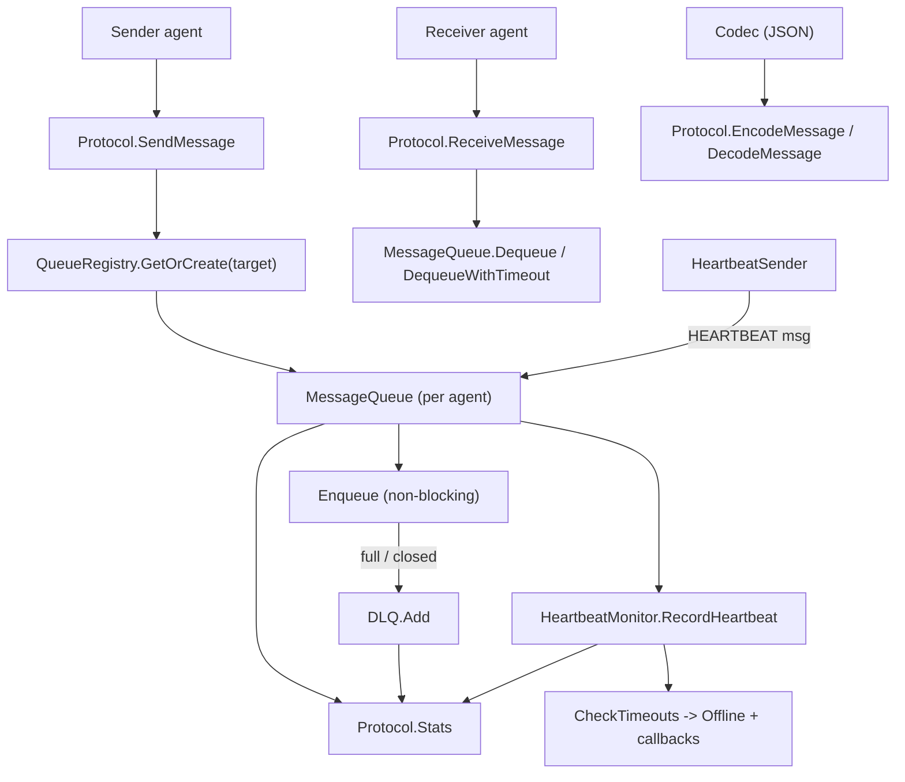

The `internal/ares_protocol/ahp` package (package `ahp`) implements the AHP
messaging protocol used for inter-agent communication. It provides typed
messages (`TASK`, `RESULT`, `PROGRESS`, `ACK`, `HEARTBEAT`), a per-agent
in-memory `MessageQueue` with a `QueueRegistry`, a `Protocol` manager that
ties queues together with a heartbeat monitor, a pluggable `Codec` (JSON by
default), and a `DLQ` dead-letter queue for messages that fail to enqueue.

## Responsibility

- Define `AHPMessage` and the `AHPMethod` enum, with constructors for each
  message kind and payload accessors (`GetResult`, `GetProgress`).
- Route messages between agents through `Protocol.SendMessage` /
  `ReceiveMessage` and the convenience `SendTask` / `SendResult`.
- Provide a bounded, non-blocking `MessageQueue` per agent (with backup
  buffer, `Peek`, `DequeueWithTimeout`) and a `QueueRegistry` to manage them.
- Track agent liveness via `HeartbeatMonitor` (`RecordHeartbeat`,
  `CheckTimeouts`, `GetStatus`, timeout callbacks) and emit periodic
  heartbeats via `HeartbeatSender`.
- Serialize messages through a `Codec` (default `JSONCodec`) selected via a
  `CodecRegistry`.
- Capture undeliverable messages in a `DLQ` with per-agent and per-session
  retrieval, removal, and clearing.

## Architecture



## External interfaces

```go
// Messages (message.go)
type AHPMethod string
const (
    AHPMethodTask      AHPMethod = "TASK"
    AHPMethodResult    AHPMethod = "RESULT"
    AHPMethodProgress  AHPMethod = "PROGRESS"
    AHPMethodACK       AHPMethod = "ACK"
    AHPMethodHeartbeat AHPMethod = "HEARTBEAT"
)
type AHPMessage struct {
    MessageID   string
    Method      AHPMethod
    AgentID     string
    TargetAgent string
    TaskID      string
    SessionID   string
    Payload     map[string]any
    Timestamp   time.Time
}
func NewMessage(method AHPMethod, agentID, targetAgent, taskID, sessionID string) *AHPMessage
func NewTaskMessage(agentID, targetAgent, taskID, sessionID string, payload map[string]any) *AHPMessage
func NewResultMessage(agentID, targetAgent, taskID, sessionID string, result *models.TaskResult) *AHPMessage
func NewProgressMessage(agentID, targetAgent, taskID, sessionID string, progress float64) *AHPMessage
func NewACKMessage(agentID, targetAgent, taskID, sessionID string) *AHPMessage
func NewHeartbeatMessage(agentID string) *AHPMessage
func (m *AHPMessage) IsTask() bool
func (m *AHPMessage) IsResult() bool
func (m *AHPMessage) IsHeartbeat() bool
func (m *AHPMessage) GetResult() (*models.TaskResult, bool)
func (m *AHPMessage) GetProgress() (float64, bool)

// Protocol manager (protocol.go)
type Protocol struct {
    registry  *QueueRegistry
    dlq       *DLQ
    codec     Codec
    heartbeat *HeartbeatMonitor
    config    *ProtocolConfig
}
type ProtocolConfig struct {
    QueueSize       int
    HeartbeatConfig *HeartbeatConfig
    EnableDLQ       bool
    DLQSize         int
}
func DefaultProtocolConfig() *ProtocolConfig
func NewProtocol(config *ProtocolConfig) *Protocol
func (p *Protocol) GetQueue(agentID string) *MessageQueue
func (p *Protocol) SendMessage(ctx context.Context, msg *AHPMessage) error
func (p *Protocol) ReceiveMessage(ctx context.Context, agentID string) (*AHPMessage, error)
func (p *Protocol) SendTask(ctx context.Context, targetAgent, taskID, sessionID string, payload map[string]any) error
func (p *Protocol) SendResult(ctx context.Context, targetAgent, taskID, sessionID string, result *models.TaskResult) error
func (p *Protocol) RecordHeartbeat(agentID string)
func (p *Protocol) GetAgentStatus(agentID string) (models.AgentStatus, bool)
func (p *Protocol) CheckTimeouts() []string
func (p *Protocol) GetDLQ() *DLQ
func (p *Protocol) EncodeMessage(msg *AHPMessage) ([]byte, error)
func (p *Protocol) DecodeMessage(data []byte) (*AHPMessage, error)
func (p *Protocol) Close()
func (p *Protocol) Stats() *ProtocolStats
type ProtocolStats struct {
    TotalQueues     int
    TotalMessages   int
    DLQSize         int
    MonitoredAgents int
}

// Message queue (queue.go)
type MessageQueue struct {
    messages chan *AHPMessage
    agentID  string
    opts     *QueueOptions
    // backupBuffer, closed, closeOnce
}
type QueueOptions struct {
    MaxSize    int
    MaxWorkers int
    Timeout    time.Duration
}
func DefaultQueueOptions() *QueueOptions
func NewMessageQueue(agentID string, opts *QueueOptions) *MessageQueue
func (q *MessageQueue) Enqueue(ctx context.Context, msg *AHPMessage) error
func (q *MessageQueue) Dequeue(ctx context.Context) (*AHPMessage, error)
func (q *MessageQueue) DequeueWithTimeout(timeout time.Duration) (*AHPMessage, error)
func (q *MessageQueue) Peek() (*AHPMessage, error)
func (q *MessageQueue) Size() int
func (q *MessageQueue) Capacity() int
func (q *MessageQueue) IsEmpty() bool
func (q *MessageQueue) IsFull() bool
func (q *MessageQueue) Available() int
func (q *MessageQueue) AgentID() string
func (q *MessageQueue) Close()

type QueueRegistry struct {
    queues      map[string]*MessageQueue
    defaultOpts *QueueOptions
}
func NewQueueRegistry(opts *QueueOptions) *QueueRegistry
func (r *QueueRegistry) GetOrCreate(agentID string) *MessageQueue
func (r *QueueRegistry) Get(agentID string) (*MessageQueue, bool)
func (r *QueueRegistry) Delete(agentID string)
func (r *QueueRegistry) ListAgents() []string
func (r *QueueRegistry) Size() int

// Codec (codec.go)
type Codec interface {
    Encode(msg *AHPMessage) ([]byte, error)
    Decode(data []byte) (*AHPMessage, error)
    EncodeMultiple(msgs []*AHPMessage) ([]byte, error)
    DecodeMultiple(data []byte) ([]*AHPMessage, error)
}
type JSONCodec struct{}
func NewJSONCodec() *JSONCodec
type CodecRegistry struct{ codecs map[string]Codec }
func NewCodecRegistry() *CodecRegistry
func (r *CodecRegistry) Register(name string, codec Codec)
func (r *CodecRegistry) Get(name string) (Codec, bool)
func (r *CodecRegistry) Default() Codec
func (r *CodecRegistry) InitDefaultCodecs()

// Heartbeat (heartbeat.go)
type HeartbeatConfig struct {
    Interval  time.Duration
    Timeout   time.Duration
    MaxMissed int
}
func DefaultHeartbeatConfig() *HeartbeatConfig
type TimeoutCallback func(agentID string)
type AgentHeartbeat struct {
    AgentID     string
    LastSeen    time.Time
    Status      models.AgentStatus
    MissedCount int
}
type HeartbeatMonitor struct {
    agentStatus map[string]*AgentHeartbeat
    config      *HeartbeatConfig
    callbacks   []TimeoutCallback
}
func NewHeartbeatMonitor(config *HeartbeatConfig) *HeartbeatMonitor
func (m *HeartbeatMonitor) RecordHeartbeat(agentID string)
func (m *HeartbeatMonitor) GetStatus(agentID string) (models.AgentStatus, bool)
func (m *HeartbeatMonitor) CheckTimeouts() []string
func (m *HeartbeatMonitor) RemoveAgent(agentID string)
func (m *HeartbeatMonitor) ListAgents() []string
func (m *HeartbeatMonitor) RegisterCallback(fn TimeoutCallback)

type HeartbeatSender struct {
    agentID  string
    interval time.Duration
    queue    *MessageQueue
}
func NewHeartbeatSender(agentID string, interval time.Duration, queue *MessageQueue) *HeartbeatSender
func (s *HeartbeatSender) Validate() error
func (s *HeartbeatSender) Start(ctx context.Context)
func (s *HeartbeatSender) Stop()

// Dead letter queue (dlq.go)
const MaxRetriesUnlimited = 0
type DLQEntry struct {
    Message    *AHPMessage
    Error      error
    Reason     string
    Timestamp  time.Time
    Retries    int
    MaxRetries int
}
type DLQ struct {
    messages []*DLQEntry
    maxSize  int
}
func NewDLQ(maxSize int) *DLQ
func (d *DLQ) Add(msg *AHPMessage, err error, reason string)
func (d *DLQ) GetAll() []*DLQEntry
func (d *DLQ) GetByAgent(agentID string) []*DLQEntry
func (d *DLQ) GetBySession(sessionID string) []*DLQEntry
func (d *DLQ) Size() int
func (d *DLQ) Clear()
func (d *DLQ) Remove(entry *DLQEntry)
func (d *DLQ) RemoveBySession(sessionID string)
```

## Key types and methods

| Type / Method | Purpose |
| --- | --- |
| `AHPMessage` / `AHPMethod` | Typed inter-agent message and method enum. |
| `NewTaskMessage` / `NewResultMessage` / `NewProgressMessage` | Convenience constructors for common payloads. |
| `AHPMessage.GetResult` / `GetProgress` | Typed payload accessors with JSON-map reconstruction. |
| `Protocol` | Top-level manager owning registry, DLQ, codec, and heartbeat monitor. |
| `Protocol.SendMessage` / `ReceiveMessage` | Route messages by `TargetAgent`; failed enqueues go to the DLQ. |
| `Protocol.SendTask` / `SendResult` | Higher-level task dispatch and result return helpers. |
| `Protocol.Stats` / `ProtocolStats` | Snapshot of queues, messages, DLQ size, monitored agents. |
| `MessageQueue` | Bounded non-blocking per-agent channel queue with backup buffer. |
| `MessageQueue.Peek` / `DequeueWithTimeout` | Non-destructive read and timed dequeue. |
| `QueueRegistry` | Lazy per-agent queue creation and lifecycle. |
| `Codec` / `JSONCodec` / `CodecRegistry` | Pluggable message serialization. |
| `HeartbeatMonitor` | Tracks `LastSeen`/`MissedCount` and marks agents offline after `MaxMissed`. |
| `HeartbeatMonitor.RegisterCallback` | Timeout notifications fired outside the lock. |
| `HeartbeatSender` | Periodic `HEARTBEAT` message producer with restart-safe Start/Stop. |
| `DLQ` / `DLQEntry` | Dead-letter store with per-agent/session queries and eviction. |

## Module collaboration

- `ahp` -> `internal/core/models` for `models.AgentStatus` and
  `models.TaskResult` / `models.RecommendItem` (result payload
  reconstruction).
- `ahp` -> `internal/errors` for sentinel errors (`ErrQueueClosed`,
  `ErrQueueFull`, `ErrQueueEmpty`, `ErrQueueNotInitialized`,
  `ErrInvalidMessage`, `ErrAgentNotFound`) and `errors.Wrap`.
- `internal/agents/base` defines `Messenger` in terms of `*ahp.AHPMessage`,
  and `leader` / `sub` agents send/receive via an injected `*ahp.MessageQueue`.
- `ares_runtime` injects `*ahp.MessageQueue` and `*ahp.HeartbeatMonitor` into
  agents and uses `Heartbeater.IsAlive()` (backed by heartbeat state) for its
  health check.

## Extension points

1. Add a new message kind by extending the `AHPMethod` constants and adding a
   `NewXxxMessage` constructor plus a typed accessor on `AHPMessage`.
2. Swap the wire format by implementing the `Codec` interface and registering
   it via `CodecRegistry.Register(name, codec)`; select it on the `Protocol`
   by reading from the registry.
3. Observe agent timeouts by registering a `TimeoutCallback` on the
   `HeartbeatMonitor` (callbacks run outside the lock, so they must be
   non-blocking).
4. Inspect undeliverable traffic through `Protocol.GetDLQ()` and the
   `GetByAgent` / `GetBySession` / `Remove` / `Clear` methods; tune capacity
   via `ProtocolConfig.DLQSize`.
5. Tune queue behaviour with `QueueOptions` (`MaxSize`, `MaxWorkers`,
   `Timeout`) applied through `NewQueueRegistry` or `NewMessageQueue`.
6. Drive heartbeats from an agent by constructing a `HeartbeatSender` with its
   `MessageQueue` and calling `Start(ctx)` / `Stop()`; `Validate()` guards
   against a nil queue.

## Bilingual status

This page is the English reference. A Chinese translation with identical
structure and technical content is published as `ares_protocol.zh.md`. All code
identifiers, type names, and signatures are kept in English in both files;
only the prose differs.

## Maturity

Production. The package is covered by `ahp_test.go`, `dlq_test.go`, and
`heartbeat_callback_test.go`. It is integrated into the agent layer
(`base.Messenger`, leader/sub agents) and the runtime supervision loop, and
exposes no experimental markers.


