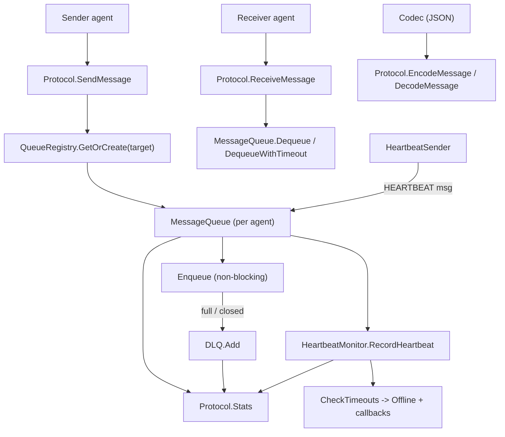

`internal/ares_protocol/ahp` 包（包名 `ahp`）实现了用于智能体间通信的 AHP 消息协议。
它提供类型化消息（`TASK`、`RESULT`、`PROGRESS`、`ACK`、`HEARTBEAT`）、按智能体的
内存 `MessageQueue` 与 `QueueRegistry`、将队列与心跳监控整合在一起的 `Protocol`
管理器、可插拔的 `Codec`（默认 JSON）以及用于暂存入队失败消息的 `DLQ` 死信队列。

## 职责

- 定义 `AHPMessage` 与 `AHPMethod` 枚举，提供各类消息的构造函数与 payload 访问器
  （`GetResult`、`GetProgress`）。
- 通过 `Protocol.SendMessage` / `ReceiveMessage` 以及便捷方法
  `SendTask` / `SendResult` 在智能体间路由消息。
- 为每个智能体提供有界、非阻塞的 `MessageQueue`（含 backup buffer、`Peek`、
  `DequeueWithTimeout`）与 `QueueRegistry` 统一管理。
- 通过 `HeartbeatMonitor`（`RecordHeartbeat`、`CheckTimeouts`、`GetStatus`、
  超时回调）跟踪智能体存活，并通过 `HeartbeatSender` 周期性发射心跳。
- 通过 `Codec`（默认 `JSONCodec`，由 `CodecRegistry` 选择）序列化消息。
- 将无法投递的消息捕获到 `DLQ`，支持按智能体/会话检索、删除与清空。

## 架构图



## 外部接口

```go
// Messages (message.go)
type AHPMethod string
const (
    AHPMethodTask      AHPMethod = "TASK"
    AHPMethodResult    AHPMethod = "RESULT"
    AHPMethodProgress  AHPMethod = "PROGRESS"
    AHPMethodACK       AHPMethod = "ACK"
    AHPMethodHeartbeat AHPMethod = "HEARTBEAT"
)
type AHPMessage struct {
    MessageID   string
    Method      AHPMethod
    AgentID     string
    TargetAgent string
    TaskID      string
    SessionID   string
    Payload     map[string]any
    Timestamp   time.Time
}
func NewMessage(method AHPMethod, agentID, targetAgent, taskID, sessionID string) *AHPMessage
func NewTaskMessage(agentID, targetAgent, taskID, sessionID string, payload map[string]any) *AHPMessage
func NewResultMessage(agentID, targetAgent, taskID, sessionID string, result *models.TaskResult) *AHPMessage
func NewProgressMessage(agentID, targetAgent, taskID, sessionID string, progress float64) *AHPMessage
func NewACKMessage(agentID, targetAgent, taskID, sessionID string) *AHPMessage
func NewHeartbeatMessage(agentID string) *AHPMessage
func (m *AHPMessage) IsTask() bool
func (m *AHPMessage) IsResult() bool
func (m *AHPMessage) IsHeartbeat() bool
func (m *AHPMessage) GetResult() (*models.TaskResult, bool)
func (m *AHPMessage) GetProgress() (float64, bool)

// Protocol manager (protocol.go)
type Protocol struct {
    registry  *QueueRegistry
    dlq       *DLQ
    codec     Codec
    heartbeat *HeartbeatMonitor
    config    *ProtocolConfig
}
type ProtocolConfig struct {
    QueueSize       int
    HeartbeatConfig *HeartbeatConfig
    EnableDLQ       bool
    DLQSize         int
}
func DefaultProtocolConfig() *ProtocolConfig
func NewProtocol(config *ProtocolConfig) *Protocol
func (p *Protocol) GetQueue(agentID string) *MessageQueue
func (p *Protocol) SendMessage(ctx context.Context, msg *AHPMessage) error
func (p *Protocol) ReceiveMessage(ctx context.Context, agentID string) (*AHPMessage, error)
func (p *Protocol) SendTask(ctx context.Context, targetAgent, taskID, sessionID string, payload map[string]any) error
func (p *Protocol) SendResult(ctx context.Context, targetAgent, taskID, sessionID string, result *models.TaskResult) error
func (p *Protocol) RecordHeartbeat(agentID string)
func (p *Protocol) GetAgentStatus(agentID string) (models.AgentStatus, bool)
func (p *Protocol) CheckTimeouts() []string
func (p *Protocol) GetDLQ() *DLQ
func (p *Protocol) EncodeMessage(msg *AHPMessage) ([]byte, error)
func (p *Protocol) DecodeMessage(data []byte) (*AHPMessage, error)
func (p *Protocol) Close()
func (p *Protocol) Stats() *ProtocolStats
type ProtocolStats struct {
    TotalQueues     int
    TotalMessages   int
    DLQSize         int
    MonitoredAgents int
}

// Message queue (queue.go)
type MessageQueue struct {
    messages chan *AHPMessage
    agentID  string
    opts     *QueueOptions
    // backupBuffer, closed, closeOnce
}
type QueueOptions struct {
    MaxSize    int
    MaxWorkers int
    Timeout    time.Duration
}
func DefaultQueueOptions() *QueueOptions
func NewMessageQueue(agentID string, opts *QueueOptions) *MessageQueue
func (q *MessageQueue) Enqueue(ctx context.Context, msg *AHPMessage) error
func (q *MessageQueue) Dequeue(ctx context.Context) (*AHPMessage, error)
func (q *MessageQueue) DequeueWithTimeout(timeout time.Duration) (*AHPMessage, error)
func (q *MessageQueue) Peek() (*AHPMessage, error)
func (q *MessageQueue) Size() int
func (q *MessageQueue) Capacity() int
func (q *MessageQueue) IsEmpty() bool
func (q *MessageQueue) IsFull() bool
func (q *MessageQueue) Available() int
func (q *MessageQueue) AgentID() string
func (q *MessageQueue) Close()

type QueueRegistry struct {
    queues      map[string]*MessageQueue
    defaultOpts *QueueOptions
}
func NewQueueRegistry(opts *QueueOptions) *QueueRegistry
func (r *QueueRegistry) GetOrCreate(agentID string) *MessageQueue
func (r *QueueRegistry) Get(agentID string) (*MessageQueue, bool)
func (r *QueueRegistry) Delete(agentID string)
func (r *QueueRegistry) ListAgents() []string
func (r *QueueRegistry) Size() int

// Codec (codec.go)
type Codec interface {
    Encode(msg *AHPMessage) ([]byte, error)
    Decode(data []byte) (*AHPMessage, error)
    EncodeMultiple(msgs []*AHPMessage) ([]byte, error)
    DecodeMultiple(data []byte) ([]*AHPMessage, error)
}
type JSONCodec struct{}
func NewJSONCodec() *JSONCodec
type CodecRegistry struct{ codecs map[string]Codec }
func NewCodecRegistry() *CodecRegistry
func (r *CodecRegistry) Register(name string, codec Codec)
func (r *CodecRegistry) Get(name string) (Codec, bool)
func (r *CodecRegistry) Default() Codec
func (r *CodecRegistry) InitDefaultCodecs()

// Heartbeat (heartbeat.go)
type HeartbeatConfig struct {
    Interval  time.Duration
    Timeout   time.Duration
    MaxMissed int
}
func DefaultHeartbeatConfig() *HeartbeatConfig
type TimeoutCallback func(agentID string)
type AgentHeartbeat struct {
    AgentID     string
    LastSeen    time.Time
    Status      models.AgentStatus
    MissedCount int
}
type HeartbeatMonitor struct {
    agentStatus map[string]*AgentHeartbeat
    config      *HeartbeatConfig
    callbacks   []TimeoutCallback
}
func NewHeartbeatMonitor(config *HeartbeatConfig) *HeartbeatMonitor
func (m *HeartbeatMonitor) RecordHeartbeat(agentID string)
func (m *HeartbeatMonitor) GetStatus(agentID string) (models.AgentStatus, bool)
func (m *HeartbeatMonitor) CheckTimeouts() []string
func (m *HeartbeatMonitor) RemoveAgent(agentID string)
func (m *HeartbeatMonitor) ListAgents() []string
func (m *HeartbeatMonitor) RegisterCallback(fn TimeoutCallback)

type HeartbeatSender struct {
    agentID  string
    interval time.Duration
    queue    *MessageQueue
}
func NewHeartbeatSender(agentID string, interval time.Duration, queue *MessageQueue) *HeartbeatSender
func (s *HeartbeatSender) Validate() error
func (s *HeartbeatSender) Start(ctx context.Context)
func (s *HeartbeatSender) Stop()

// Dead letter queue (dlq.go)
const MaxRetriesUnlimited = 0
type DLQEntry struct {
    Message    *AHPMessage
    Error      error
    Reason     string
    Timestamp  time.Time
    Retries    int
    MaxRetries int
}
type DLQ struct {
    messages []*DLQEntry
    maxSize  int
}
func NewDLQ(maxSize int) *DLQ
func (d *DLQ) Add(msg *AHPMessage, err error, reason string)
func (d *DLQ) GetAll() []*DLQEntry
func (d *DLQ) GetByAgent(agentID string) []*DLQEntry
func (d *DLQ) GetBySession(sessionID string) []*DLQEntry
func (d *DLQ) Size() int
func (d *DLQ) Clear()
func (d *DLQ) Remove(entry *DLQEntry)
func (d *DLQ) RemoveBySession(sessionID string)
```

## 关键类型与方法

| 类型 / 方法 | 用途 |
| --- | --- |
| `AHPMessage` / `AHPMethod` | 类型化的智能体间消息与方法枚举。 |
| `NewTaskMessage` / `NewResultMessage` / `NewProgressMessage` | 常见 payload 的便捷构造函数。 |
| `AHPMessage.GetResult` / `GetProgress` | 类型化 payload 访问器，支持 JSON map 重建。 |
| `Protocol` | 顶层管理器，持有 registry、DLQ、codec 与心跳监控。 |
| `Protocol.SendMessage` / `ReceiveMessage` | 按 `TargetAgent` 路由消息；入队失败转入 DLQ。 |
| `Protocol.SendTask` / `SendResult` | 更高层的任务派发与结果回传辅助。 |
| `Protocol.Stats` / `ProtocolStats` | 队列、消息、DLQ 大小、受监控智能体数的快照。 |
| `MessageQueue` | 有界、非阻塞的按智能体 channel 队列，含 backup buffer。 |
| `MessageQueue.Peek` / `DequeueWithTimeout` | 非破坏性读取与带超时的出队。 |
| `QueueRegistry` | 按智能体惰性创建与生命周期管理。 |
| `Codec` / `JSONCodec` / `CodecRegistry` | 可插拔的消息序列化。 |
| `HeartbeatMonitor` | 跟踪 `LastSeen`/`MissedCount`，超过 `MaxMissed` 标记为 offline。 |
| `HeartbeatMonitor.RegisterCallback` | 在锁外触发的超时通知。 |
| `HeartbeatSender` | 周期性 `HEARTBEAT` 消息生产者，Start/Stop 可重启。 |
| `DLQ` / `DLQEntry` | 死信存储，支持按智能体/会话查询与淘汰。 |

## 模块协作

- `ahp` -> `internal/core/models`：使用 `models.AgentStatus` 与
  `models.TaskResult` / `models.RecommendItem`（结果 payload 重建）。
- `ahp` -> `internal/errors`：使用哨兵错误（`ErrQueueClosed`、`ErrQueueFull`、
  `ErrQueueEmpty`、`ErrQueueNotInitialized`、`ErrInvalidMessage`、
  `ErrAgentNotFound`）与 `errors.Wrap`。
- `internal/agents/base` 基于 `*ahp.AHPMessage` 定义 `Messenger`，`leader` 与
  `sub` 智能体通过注入的 `*ahp.MessageQueue` 收发消息。
- `ares_runtime` 将 `*ahp.MessageQueue` 与 `*ahp.HeartbeatMonitor` 注入智能体，
  并使用由心跳状态支撑的 `Heartbeater.IsAlive()` 进行健康检查。

## 扩展方式

1. 新增消息类型：扩展 `AHPMethod` 常量，添加 `NewXxxMessage` 构造函数，并在
   `AHPMessage` 上增加类型化访问器。
2. 替换传输格式：实现 `Codec` 接口并通过 `CodecRegistry.Register(name, codec)`
   注册；在 `Protocol` 上从 registry 选取即可。
3. 监听智能体超时：在 `HeartbeatMonitor` 上注册 `TimeoutCallback`
   （回调在锁外执行，必须非阻塞）。
4. 通过 `Protocol.GetDLQ()` 及 `GetByAgent` / `GetBySession` / `Remove` / `Clear`
   检查无法投递的流量；通过 `ProtocolConfig.DLQSize` 调整容量。
5. 通过 `QueueOptions`（`MaxSize`、`MaxWorkers`、`Timeout`）调优队列行为，经
   `NewQueueRegistry` 或 `NewMessageQueue` 应用。
6. 智能体驱动心跳：用其 `MessageQueue` 构造 `HeartbeatSender`，调用
   `Start(ctx)` / `Stop()`；`Validate()` 可防止 queue 为 nil。

## 双语状态

本页为中文参考。结构与技术内容完全相同的英文版本发布为 `ares_protocol.en.md`。两个文件中
所有代码标识符、类型名与签名均保持英文，仅叙述性文字不同。

## 成熟度

Production。该包由 `ahp_test.go`、`dlq_test.go`、`heartbeat_callback_test.go`
覆盖；集成到智能体层（`base.Messenger`、leader/sub 智能体）与 runtime 监督循环；
不含任何实验性标记。


