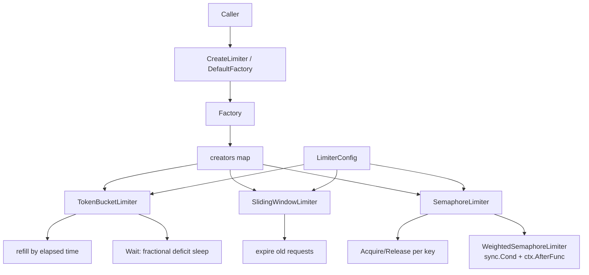

# ares_ratelimit

## Responsibility

`ares_ratelimit` provides the rate-limiting primitives used to throttle LLM
calls, tool calls, and concurrent agent work. It defines a single `Limiter`
interface backed by three implementations, a `Factory` that maps a
`LimiterType` to a constructor, and a package-level `DefaultFactory` plus
`CreateLimiter` convenience.

The token bucket limiter supports per-instance rate/burst tuning and a
precise fractional-token `Wait` that avoids the thundering-herd problem. The
sliding-window limiter tracks request timestamps within a window. The
semaphore limiter provides both a simple counted semaphore with per-key
accounting and a weighted semaphore that uses `sync.Cond` for efficient
waiting with context cancellation.

## Architecture



All three implementations satisfy the `Limiter` interface
(`Allow`/`Wait`/`Reset`/`Rate`). The `Factory.Register` method lets callers add
custom limiter types, and `Factory.Create` falls back to `DefaultConfig` when
`config` is nil.

## External interfaces

```go
// Limiter defines the rate limiter interface.
type Limiter interface {
    Allow(ctx context.Context) (bool, error)
    Wait(ctx context.Context) error
    Reset()
    Rate() float64
}

type LimiterConfig struct {
    Rate       float64       // requests per second
    Burst      int           // maximum burst size
    Timeout    time.Duration // wait timeout
    RefillRate time.Duration // token refill interval
}

func DefaultConfig() *LimiterConfig

type LimiterType string
const (
    LimiterTypeTokenBucket   LimiterType = "token_bucket"
    LimiterTypeSlidingWindow LimiterType = "sliding_window"
    LimiterTypeSemaphore     LimiterType = "semaphore"
)

type Factory struct{}
func NewFactory() *Factory
func (f *Factory) Register(limiterType LimiterType, creator func(*LimiterConfig) Limiter)
func (f *Factory) Create(limiterType LimiterType, config *LimiterConfig) (Limiter, error)

var DefaultFactory = NewFactory()
func CreateLimiter(limiterType LimiterType, config *LimiterConfig) (Limiter, error)

// Token bucket extras.
func NewTokenBucketLimiter(config *LimiterConfig) *TokenBucketLimiter
func (l *TokenBucketLimiter) AvailableTokens() float64
func (l *TokenBucketLimiter) SetRate(rate float64)
func (l *TokenBucketLimiter) SetBurst(burst int)

// Sliding window extras.
func NewSlidingWindowLimiter(config *LimiterConfig) Limiter
func (l *SlidingWindowLimiter) CurrentCount() int
func (l *SlidingWindowLimiter) Remaining() int

// Semaphore extras (per-key).
func NewSemaphoreLimiter(config *LimiterConfig) *SemaphoreLimiter
func (l *SemaphoreLimiter) Acquire(ctx context.Context, key string) error
func (l *SemaphoreLimiter) Release(key string)
func (l *SemaphoreLimiter) Available() int
func (l *SemaphoreLimiter) Acquired(key string) int

// Weighted semaphore.
func NewWeightedSemaphoreLimiter(config *LimiterConfig) *WeightedSemaphoreLimiter
func (l *WeightedSemaphoreLimiter) Acquire(ctx context.Context, key string, weight int) error
func (l *WeightedSemaphoreLimiter) Release(key string, weight int)
func (l *WeightedSemaphoreLimiter) Allow(ctx context.Context, weight int) (bool, error)
```

## Key types and methods

| Type / Method | Purpose |
|---|---|
| `Limiter` | Unified interface: `Allow`, `Wait`, `Reset`, `Rate`. |
| `LimiterConfig` | Rate, burst, timeout, refill interval. |
| `LimiterType` | String enum: token_bucket, sliding_window, semaphore. |
| `Factory` | Registry mapping `LimiterType` to a constructor. |
| `DefaultFactory` / `CreateLimiter` | Package-level convenience. |
| `TokenBucketLimiter` | Refill-by-elapsed-time bucket with precise `Wait`. |
| `SlidingWindowLimiter` | Timestamp-window limiter with `Remaining`. |
| `SemaphoreLimiter` | Counted semaphore with per-key `Acquired` tracking. |
| `WeightedSemaphoreLimiter` | Weighted slots via `sync.Cond` and `ctx.AfterFunc`. |
| `LimiterError` / `ErrUnsupportedLimiterType` | Error type and sentinel. |
| `DefaultConfig()` | Sensible defaults (rate 10, burst 20, 5s timeout). |

## Module collaboration

- Self-contained: depends only on the standard library and `internal/logger`
  (via `log.go`).
- Consumed by the LLM scorer path and the agent runtime to throttle outbound
  API calls and bound concurrency.
- The `LimiterConfig` shape is mirrored by `ares_config.LLMConfig.ScorerAPIRate`
  / `ScorerAPIBurst` so YAML can drive limiter construction.

## Extension points

1. Implement the `Limiter` interface for a custom algorithm (e.g. leaky bucket)
   and register it with `Factory.Register("leaky_bucket", constructor)`.
2. Create a limiter via `CreateLimiter(LimiterTypeTokenBucket, cfg)` where `cfg`
   is nil to get `DefaultConfig` applied automatically.
3. Tune a live token bucket at runtime using `SetRate` and `SetBurst` without
   rebuilding the limiter.
4. Use `WeightedSemaphoreLimiter.Acquire(ctx, key, weight)` to grant
   heterogeneous request costs under one semaphore, with context cancellation
   propagated via `context.AfterFunc`.
5. Replace `DefaultFactory` with a custom `*Factory` populated with only the
   limiter types your deployment needs.

## Bilingual status

English source is canonical. The Chinese page mirrors structure, signatures,
and technical content; all code identifiers, type names, and constants remain
in English in both pages.

## Maturity

`ares_ratelimit` is covered by `ratelimit_test.go`. The implementations are
functional and tested, but the public surface (extra methods on each limiter,
weighted semaphore API) is still settling, so it is marked Beta.


