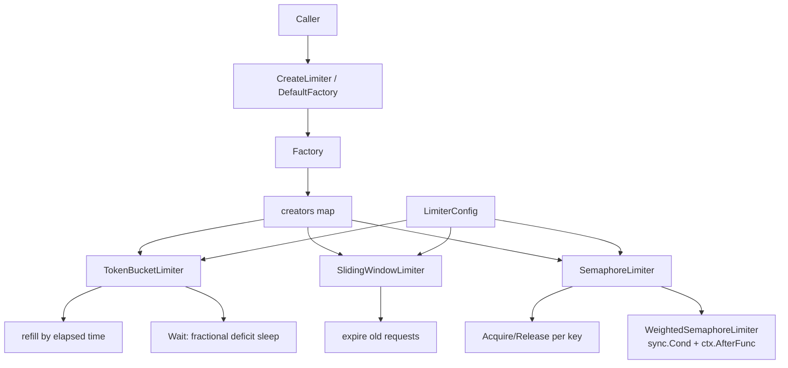

# ares_ratelimit

## 职责

`ares_ratelimit` 提供用于限制 LLM 调用、工具调用与并发 agent 任务的限流原语。
它定义了单一 `Limiter` 接口,由三种实现支撑,一个将 `LimiterType` 映射到构造函数的
`Factory`,以及包级 `DefaultFactory` 与 `CreateLimiter` 便捷函数。

令牌桶限流器支持按实例调节速率/突发,并具有精确的小数令牌 `Wait`,可避免惊群问题。
滑动窗口限流器在窗口内跟踪请求时间戳。信号量限流器既提供带按 key 计数的简单计数
信号量,也提供使用 `sync.Cond` 高效等待并支持 context 取消的加权信号量。

## 架构图



三种实现都满足 `Limiter` 接口(`Allow`/`Wait`/`Reset`/`Rate`)。`Factory.Register`
允许调用方添加自定义限流器类型,`Factory.Create` 在 `config` 为 nil 时回退到
`DefaultConfig`。

## 外部接口

```go
// Limiter defines the rate limiter interface.
type Limiter interface {
    Allow(ctx context.Context) (bool, error)
    Wait(ctx context.Context) error
    Reset()
    Rate() float64
}

type LimiterConfig struct {
    Rate       float64       // requests per second
    Burst      int           // maximum burst size
    Timeout    time.Duration // wait timeout
    RefillRate time.Duration // token refill interval
}

func DefaultConfig() *LimiterConfig

type LimiterType string
const (
    LimiterTypeTokenBucket   LimiterType = "token_bucket"
    LimiterTypeSlidingWindow LimiterType = "sliding_window"
    LimiterTypeSemaphore     LimiterType = "semaphore"
)

type Factory struct{}
func NewFactory() *Factory
func (f *Factory) Register(limiterType LimiterType, creator func(*LimiterConfig) Limiter)
func (f *Factory) Create(limiterType LimiterType, config *LimiterConfig) (Limiter, error)

var DefaultFactory = NewFactory()
func CreateLimiter(limiterType LimiterType, config *LimiterConfig) (Limiter, error)

// Token bucket extras.
func NewTokenBucketLimiter(config *LimiterConfig) *TokenBucketLimiter
func (l *TokenBucketLimiter) AvailableTokens() float64
func (l *TokenBucketLimiter) SetRate(rate float64)
func (l *TokenBucketLimiter) SetBurst(burst int)

// Sliding window extras.
func NewSlidingWindowLimiter(config *LimiterConfig) Limiter
func (l *SlidingWindowLimiter) CurrentCount() int
func (l *SlidingWindowLimiter) Remaining() int

// Semaphore extras (per-key).
func NewSemaphoreLimiter(config *LimiterConfig) *SemaphoreLimiter
func (l *SemaphoreLimiter) Acquire(ctx context.Context, key string) error
func (l *SemaphoreLimiter) Release(key string)
func (l *SemaphoreLimiter) Available() int
func (l *SemaphoreLimiter) Acquired(key string) int

// Weighted semaphore.
func NewWeightedSemaphoreLimiter(config *LimiterConfig) *WeightedSemaphoreLimiter
func (l *WeightedSemaphoreLimiter) Acquire(ctx context.Context, key string, weight int) error
func (l *WeightedSemaphoreLimiter) Release(key string, weight int)
func (l *WeightedSemaphoreLimiter) Allow(ctx context.Context, weight int) (bool, error)
```

## 关键类型与方法

| 类型 / 方法 | 用途 |
|---|---|
| `Limiter` | 统一接口:`Allow`、`Wait`、`Reset`、`Rate`。 |
| `LimiterConfig` | 速率、突发、超时、refill 间隔。 |
| `LimiterType` | 字符串枚举:token_bucket、sliding_window、semaphore。 |
| `Factory` | 将 `LimiterType` 映射到构造函数的注册表。 |
| `DefaultFactory` / `CreateLimiter` | 包级便捷入口。 |
| `TokenBucketLimiter` | 按流逝时间补充令牌,带精确 `Wait`。 |
| `SlidingWindowLimiter` | 时间戳窗口限流器,带 `Remaining`。 |
| `SemaphoreLimiter` | 计数信号量,带按 key 的 `Acquired` 跟踪。 |
| `WeightedSemaphoreLimiter` | 通过 `sync.Cond` 与 `ctx.AfterFunc` 的加权槽位。 |
| `LimiterError` / `ErrUnsupportedLimiterType` | 错误类型与哨兵值。 |
| `DefaultConfig()` | 合理默认值(速率 10、突发 20、5s 超时)。 |

## 模块协作

- 自包含:仅依赖标准库与 `internal/logger`(经 `log.go`)。
- 被 LLM 评分路径与 agent 运行时消费,用于限制出站 API 调用与并发上限。
- `LimiterConfig` 形状与 `ares_config.LLMConfig.ScorerAPIRate`/`ScorerAPIBurst`
  对应,使 YAML 能驱动限流器构造。

## 扩展方式

1. 为自定义算法(如漏桶)实现 `Limiter` 接口,并用
   `Factory.Register("leaky_bucket", constructor)` 注册。
2. 通过 `CreateLimiter(LimiterTypeTokenBucket, cfg)` 创建限流器,`cfg` 传 nil 即
   自动应用 `DefaultConfig`。
3. 用 `SetRate` 与 `SetBurst` 在运行时调整实时令牌桶,无需重建限流器。
4. 使用 `WeightedSemaphoreLimiter.Acquire(ctx, key, weight)` 在单个信号量下授予
   异构请求成本,context 取消经 `context.AfterFunc` 传播。
5. 用仅含部署所需限流器类型的自定义 `*Factory` 替换 `DefaultFactory`。

## 双语状态

英文源为权威参考。中文页面保持相同的结构、签名与技术内容;两份页面中所有代码
标识符、类型名与常量均保持英文。

## 成熟度

`ares_ratelimit` 由 `ratelimit_test.go` 覆盖。各实现功能完备且经过测试,但公共
表面(每个限流器的额外方法、加权信号量 API)仍在稳定中,故标记为 Beta。


