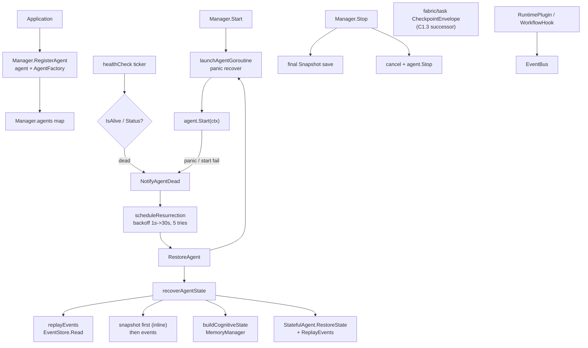

> **Status (verified 2026-09 against the source tree):** there is no
> `internal/ares_runtime` package. The Agent lifecycle manager lives in
> **`internal/runtime`** (package `runtime`, formerly `ares_runtime`).
> `CheckpointPlugin` / `MemoryPlugin` / `EvolutionPlugin` and the
> `CapCheckpoint` / `CapMemory` / `CapEvolution` capabilities were deleted
> (C1.3); `RecoverSnapshotOrEvents` was removed. Successors: fabric/task
> `CheckpointEnvelope`, retriever_wiring, direct `ares_evolution`
> consumption. Source is authoritative.

The `internal/runtime` package (package `runtime`) is the process-level
supervisor for agents. Agents are treated as disposable executors; the runtime
owns their birth, death, and resurrection. The `Manager` implements the
`Runtime` interface and runs each agent in a managed goroutine with panic
recovery, periodic health checks, and exponential-backoff resurrection driven
by an `AgentFactory`. It also exposes a plugin bus and a chaos-engineering
arena.

## Responsibility

- Register agents together with an `AgentFactory` so they can be recreated
  after death.
- Launch each agent in a managed errgroup goroutine with `panic` recovery that
  funnels into `NotifyAgentDead`.
- Run a background health-check loop that uses `base.Heartbeater.IsAlive()`
  (falling back to `Status()`) to detect dead agents and trigger resurrection.
- Resurrect dead agents via `RestoreAgent`: create from factory, replay events
  from the `EventStore`, restore snapshot state, enrich with cognitive memory
  state, then relaunch; exponential backoff (1s to 30s, 5 attempts) and a
  per-agent restart cap govern the retries.
- Snapshot and restore stateful agents (`base.StatefulAgent`) through a
  `SnapshotStore`, capturing final snapshots on shutdown. Recovery inlines
  snapshot-first then event replay (`RecoverSnapshotOrEvents` was removed).
- Persist execution checkpoints via fabric/task `CheckpointEnvelope` (the
  runtime `CheckpointPlugin` was deleted with C1.3).
- Provide a plugin contract (`RuntimePlugin`, `WorkflowHook`,
  `RecoveryPlugin`) and an `EventBus` for extension.
- Expose chaos-engineering fault injection (`PauseAgent`, `SlowAgent`,
  `ToolTimeout`, `PartitionNetwork`, etc.) for the arena.

## Architecture



## External interfaces

```go
// Runtime is the supervisor interface implemented by Manager.
type Runtime interface {
    StartAgent(ctx context.Context, agent base.Agent) error
    StopAgent(ctx context.Context, agentID string) error
    RestartAgent(ctx context.Context, agentID string) error
    RestoreAgent(ctx context.Context, agentID string, factory AgentFactory) error
    NotifyAgentDead(agentID string, reason string)
    RegisterAgent(agent base.Agent, factory AgentFactory)
    Start(ctx context.Context) error
    Stop() error
    Stats() RuntimeStats
}

type AgentFactory func() base.Agent

type Config struct {
    HealthCheckInterval time.Duration
    MaxRestartsPerAgent int  // 0 = unlimited
    MaxReplayEvents     int
    AgentStopTimeout    time.Duration
    OverallStopTimeout  time.Duration
    RestoreTimeout      time.Duration
}
func DefaultConfig() *Config

type RuntimeStats struct {
    ActiveAgents    int
    TotalRestarts   int
    Uptime          time.Duration
    BackgroundTasks map[string]int64
}

func New(config *Config, eventStore ares_events.EventStore, memManager memory.MemoryManager) *Manager

type Manager struct {
    // owns agents, factories, eventStore, memManager, snapshotStore,
    // errgroup g/gctx, config, chaosConfig, dagStore
}
func (m *Manager) WithSnapshotStore(store base.SnapshotStore) *Manager
func (m *Manager) RegisterAgent(agent base.Agent, factory AgentFactory)
func (m *Manager) RegisterAgentDAG(agentID string, dag any)
func (m *Manager) GetAgentDAG(agentID string) (any, bool)
func (m *Manager) StartAgent(ctx context.Context, agent base.Agent) error
func (m *Manager) StopAgent(ctx context.Context, agentID string) error
func (m *Manager) GetAgent(agentID string) base.Agent
func (m *Manager) RestartAgent(ctx context.Context, agentID string) error
func (m *Manager) RestoreAgent(ctx context.Context, agentID string, factory AgentFactory) error
func (m *Manager) NotifyAgentDead(agentID string, reason string)
func (m *Manager) Start(ctx context.Context) error
func (m *Manager) Stop() error
func (m *Manager) Stats() RuntimeStats

// Introspection + chaos (manager_chaos.go)
type AgentInfo struct {
    ID       string
    Type     string
    Status   string
    Restarts int
    Paused   bool
}
func (m *Manager) ListAgents() []AgentInfo
func (m *Manager) GetAgentInfo(agentID string) (*AgentInfo, bool)
func (m *Manager) PauseAgent(ctx context.Context, agentID string) error
func (m *Manager) ResumeAgent(ctx context.Context, agentID string) error
func (m *Manager) SlowAgent(ctx context.Context, agentID string, delay time.Duration) error
func (m *Manager) PartitionNetwork(ctx context.Context, agentID string) error
func (m *Manager) ToolTimeout(ctx context.Context, agentID string, timeout time.Duration) error
func (m *Manager) CorruptMemory(ctx context.Context, agentID string) error
func (m *Manager) DisconnectMCP(ctx context.Context, agentID string) error
func (m *Manager) InjectLLMFailure(ctx context.Context, agentID string, errType string) error

// Snapshot / restore helpers
func RecoverSnapshotOrEvents(ctx context.Context, store base.SnapshotStore, agentID string, eventFn func() map[string]any) map[string]any

// Sentinel errors
var (
    ErrAgentNotFound        // wraps apperrors.ErrNotFound
    ErrAgentAlreadyRegistered
    ErrRuntimeStopped
    ErrNilAgent
    ErrNilFactory
)
```

## Key types and methods

| Type / Method | Purpose |
| --- | --- |
| `Runtime` | Supervisor interface for agent lifecycle. |
| `Manager` | Concrete supervisor owning the agent map, factories, errgroup, and stores. |
| `New` | Constructs a `Manager` from `Config`, `EventStore`, and `MemoryManager`. |
| `AgentFactory` | Zero-arg constructor used to recreate a dead agent. |
| `Manager.RegisterAgent` | Registers an agent plus its factory for lifecycle management. |
| `Manager.Start` | Launches all registered agents and starts the health-check loop. |
| `Manager.Stop` | Captures final snapshots, cancels contexts, stops agents concurrently, waits for goroutines. |
| `Manager.StartAgent` / `StopAgent` | Per-agent start/stop with chaos-context injection. |
| `Manager.RestartAgent` | Stops and relaunches an agent from its factory (increments restart count). |
| `Manager.RestoreAgent` | Recreates an agent, replays events, restores state, and relaunches. |
| `Manager.NotifyAgentDead` | Triggers async resurrection with backoff, honouring `MaxRestartsPerAgent`. |
| `Manager.healthCheck` | Periodic liveness probe via `Heartbeater` or `Status()`. |
| `Manager.WithSnapshotStore` | Wires a `SnapshotStore` for snapshot-first recovery. |
| `CheckpointPlugin` | **Removed (C1.3)** — use fabric/task `CheckpointEnvelope`. |
| `RuntimePlugin` / `WorkflowHook` | Extension contracts for the plugin bus. |
| `EventBus` | Fan-out event system exposed to plugins. |
| `AgentInfo` / `ListAgents` | Introspection for dashboards. |
| `PauseAgent` / `SlowAgent` / `ToolTimeout` | Arena chaos fault injection. |
| `Config` | Health-check interval, restart cap, replay cap, stop/restore timeouts. |

## Module collaboration

- `ares_runtime` -> `internal/agents/base` for `Agent`, `StatefulAgent`,
  `Heartbeater`, `SnapshotStore`.
- `ares_runtime` -> `internal/ares_events` for the `EventStore` used in event
  replay, integrity verification, and lifecycle event emission.
- `ares_runtime` -> `internal/runtime/memory` for cognitive recovery
  (`GetMessages`) and event-store wiring (the former `internal/runtime/memory`
  path consolidated here).
- `ares_runtime` -> `internal/runtime` `ctxutil` for detached/labelled
  contexts and background-task stats (former `internal/runtime/ctxutil.go`).
- `ares_runtime` -> `internal/core/models` for `AgentStatus` constants used by
  the status-based health check fallback.
- Plugins (`RecoveryPlugin`, `WorkflowHook`) consume execution state and feed
  recovery decisions back into the runtime; checkpointing and evolution
  outcomes moved to fabric/task / `ares_evolution` (C1.3).

## Extension points

1. Implement `base.Agent` (and `StatefulAgent` for resurrection) and register
   it with `Manager.RegisterAgent(agent, factory)` before `Start`; the factory
   is invoked on every resurrection.
2. Enable snapshot-first recovery by implementing `base.SnapshotStore` and
   wiring it via `Manager.WithSnapshotStore(store)` before `Start`.
3. Add a workflow plugin by implementing `RuntimePlugin` (optionally
   `WorkflowHook` or `RecoveryPlugin`), declaring its `Capability` set, and
   registering it on the `EventBus` during `Start`.
4. Persist execution checkpoints via fabric/task `CheckpointEnvelope` (the
   runtime `CheckpointPlugin` path was removed with C1.3).
5. Inject faults in tests via the chaos methods (`PauseAgent`, `SlowAgent`,
   `ToolTimeout`, `PartitionNetwork`, `CorruptMemory`, `DisconnectMCP`,
   `InjectLLMFailure`) to exercise resurrection and fallback paths.
6. Tune supervision with a custom `Config` (restart cap, health-check
   interval, replay cap, stop/restore timeouts) passed to `New`.
7. Associate a workflow DAG with an agent via `RegisterAgentDAG` so the
   evolution system can apply live workflow patches; retrieve it with
   `GetAgentDAG`.

## Bilingual status

This page is the English reference. A Chinese translation with identical
structure and technical content is published as `ares_runtime.zh.md`. All code
identifiers, type names, and signatures are kept in English in both files;
only the prose differs.

## Maturity

Production. The package is covered by `runtime_test.go`, `runtime_core_test.go`,
`recovery_test.go`, `manager_chaos_test.go`, `resurrection_race_test.go`,
and arena tests under `internal/runtime/arena/`. It implements the `Runtime`
supervisor interface, integrates with the SDK and agents, and exposes no
experimental markers.


## RegisterAgentDAG caveat (verified)

`Manager.RegisterAgentDAG` stores agent topology for the runtime snapshot and
evolution patches. Serve registers the live `agents.peers` DAG under
`AgentDAGLiveKey` but does NOT compile it into the task fabric — agent
topology is not work (see `cmd/ares/serve_peer.go`). Only session/plan graphs
are compiled into executable tasks (via `planprojection` /
`Fabric.CompilePlan`).


