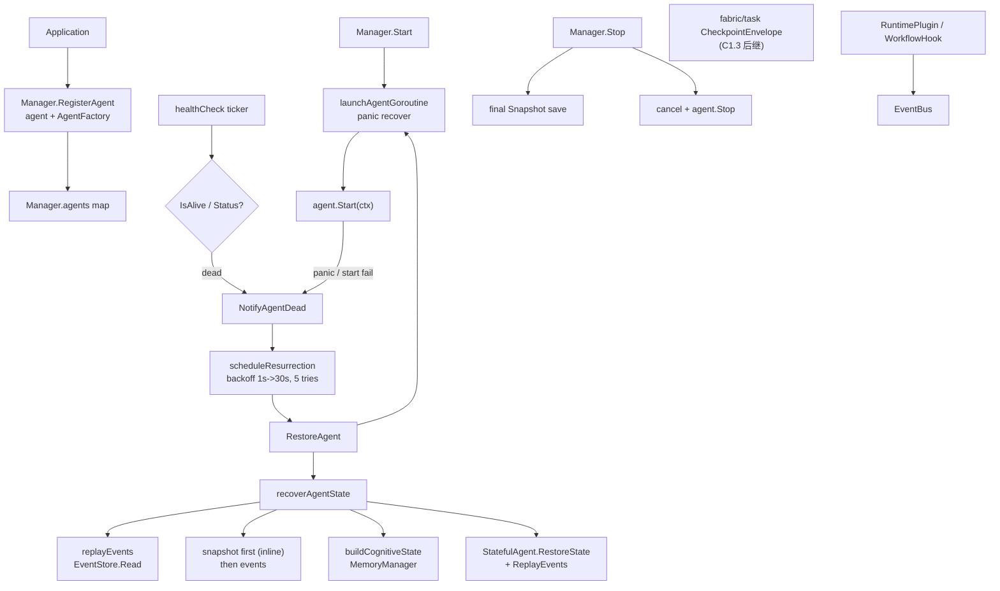

> **状态（2026-09 对照源码树核实）：** 不存在 `internal/ares_runtime` 包。
> Agent 生命周期管理器位于 **`internal/runtime`**（包名 `runtime`，原
> `ares_runtime`）。`CheckpointPlugin` / `MemoryPlugin` /
> `EvolutionPlugin` 及 `CapCheckpoint` / `CapMemory` / `CapEvolution`
> 能力已删除（C1.3）；`RecoverSnapshotOrEvents` 已移除。后继路径：
> fabric/task `CheckpointEnvelope`、retriever_wiring、`ares_evolution`
> 直接消费。以源码为准。

`internal/runtime` 包（包名 `runtime`）是智能体的进程级监督者。
智能体被视为可丢弃的执行器，runtime 负责其诞生、死亡与复活。`Manager` 实现
`Runtime` 接口，在受管 goroutine 中运行每个智能体，提供 panic 恢复、周期性健康
检查，以及由 `AgentFactory` 驱动的指数退避复活。它还暴露了插件总线与混沌工程
arena。

## 职责

- 将智能体连同 `AgentFactory` 一起注册，以便死亡后可重建。
- 在受管 errgroup goroutine 中启动每个智能体，提供 `panic` 恢复，并将失败汇入
  `NotifyAgentDead`。
- 运行后台健康检查循环，使用 `base.Heartbeater.IsAlive()`（退化为 `Status()`）
  探测死亡智能体并触发复活。
- 通过 `RestoreAgent` 复活死亡智能体：从工厂创建、回放 `EventStore` 事件、恢复
  快照状态、补充认知记忆状态后重新启动；指数退避（1s 到 30s，最多 5 次）与每智能体
  重启上限共同约束重试。
- 通过 `SnapshotStore` 对有状态智能体（`base.StatefulAgent`）做快照与恢复，并在
  关闭时捕获最终快照。恢复路径内联为快照优先、事件回放兜底
 （`RecoverSnapshotOrEvents` 已删除）。
- 执行检查点经 fabric/task `CheckpointEnvelope` 持久化（runtime 的
  `CheckpointPlugin` 随 C1.3 删除）。
- 提供插件契约（`RuntimePlugin`、`WorkflowHook`、`RecoveryPlugin`）与
  `EventBus` 以供扩展。
- 暴露混沌工程故障注入（`PauseAgent`、`SlowAgent`、`ToolTimeout`、
  `PartitionNetwork` 等）供 arena 使用。

## 架构图



## 外部接口

```go
// Runtime is the supervisor interface implemented by Manager.
type Runtime interface {
    StartAgent(ctx context.Context, agent base.Agent) error
    StopAgent(ctx context.Context, agentID string) error
    RestartAgent(ctx context.Context, agentID string) error
    RestoreAgent(ctx context.Context, agentID string, factory AgentFactory) error
    NotifyAgentDead(agentID string, reason string)
    RegisterAgent(agent base.Agent, factory AgentFactory)
    Start(ctx context.Context) error
    Stop() error
    Stats() RuntimeStats
}

type AgentFactory func() base.Agent

type Config struct {
    HealthCheckInterval time.Duration
    MaxRestartsPerAgent int  // 0 = unlimited
    MaxReplayEvents     int
    AgentStopTimeout    time.Duration
    OverallStopTimeout  time.Duration
    RestoreTimeout      time.Duration
}
func DefaultConfig() *Config

type RuntimeStats struct {
    ActiveAgents    int
    TotalRestarts   int
    Uptime          time.Duration
    BackgroundTasks map[string]int64
}

func New(config *Config, eventStore ares_events.EventStore, memManager memory.MemoryManager) *Manager

type Manager struct {
    // owns agents, factories, eventStore, memManager, snapshotStore,
    // errgroup g/gctx, config, chaosConfig, dagStore
}
func (m *Manager) WithSnapshotStore(store base.SnapshotStore) *Manager
func (m *Manager) RegisterAgent(agent base.Agent, factory AgentFactory)
func (m *Manager) RegisterAgentDAG(agentID string, dag any)
func (m *Manager) GetAgentDAG(agentID string) (any, bool)
func (m *Manager) StartAgent(ctx context.Context, agent base.Agent) error
func (m *Manager) StopAgent(ctx context.Context, agentID string) error
func (m *Manager) GetAgent(agentID string) base.Agent
func (m *Manager) RestartAgent(ctx context.Context, agentID string) error
func (m *Manager) RestoreAgent(ctx context.Context, agentID string, factory AgentFactory) error
func (m *Manager) NotifyAgentDead(agentID string, reason string)
func (m *Manager) Start(ctx context.Context) error
func (m *Manager) Stop() error
func (m *Manager) Stats() RuntimeStats

// Introspection + chaos (manager_chaos.go)
type AgentInfo struct {
    ID       string
    Type     string
    Status   string
    Restarts int
    Paused   bool
}
func (m *Manager) ListAgents() []AgentInfo
func (m *Manager) GetAgentInfo(agentID string) (*AgentInfo, bool)
func (m *Manager) PauseAgent(ctx context.Context, agentID string) error
func (m *Manager) ResumeAgent(ctx context.Context, agentID string) error
func (m *Manager) SlowAgent(ctx context.Context, agentID string, delay time.Duration) error
func (m *Manager) PartitionNetwork(ctx context.Context, agentID string) error
func (m *Manager) ToolTimeout(ctx context.Context, agentID string, timeout time.Duration) error
func (m *Manager) CorruptMemory(ctx context.Context, agentID string) error
func (m *Manager) DisconnectMCP(ctx context.Context, agentID string) error
func (m *Manager) InjectLLMFailure(ctx context.Context, agentID string, errType string) error

// Snapshot / restore helpers
func RecoverSnapshotOrEvents(ctx context.Context, store base.SnapshotStore, agentID string, eventFn func() map[string]any) map[string]any

// Sentinel errors
var (
    ErrAgentNotFound        // wraps apperrors.ErrNotFound
    ErrAgentAlreadyRegistered
    ErrRuntimeStopped
    ErrNilAgent
    ErrNilFactory
)
```

## 关键类型与方法

| 类型 / 方法 | 用途 |
| --- | --- |
| `Runtime` | 智能体生命周期的监督接口。 |
| `Manager` | 具体监督者，持有 agent map、工厂、errgroup 与各类存储。 |
| `New` | 由 `Config`、`EventStore`、`MemoryManager` 构造 `Manager`。 |
| `AgentFactory` | 无参构造函数，用于重建死亡智能体。 |
| `Manager.RegisterAgent` | 注册智能体及其工厂以纳入生命周期管理。 |
| `Manager.Start` | 启动所有已注册智能体并开启健康检查循环。 |
| `Manager.Stop` | 捕获最终快照、取消 context、并发停止智能体并等待 goroutine。 |
| `Manager.StartAgent` / `StopAgent` | 单智能体启停，注入混沌 context。 |
| `Manager.RestartAgent` | 停止并从工厂重新启动智能体（自增重启计数）。 |
| `Manager.RestoreAgent` | 重建智能体、回放事件、恢复状态并重新启动。 |
| `Manager.NotifyAgentDead` | 触发带退避的异步复活，遵循 `MaxRestartsPerAgent`。 |
| `Manager.healthCheck` | 通过 `Heartbeater` 或 `Status()` 的周期性存活探测。 |
| `Manager.WithSnapshotStore` | 接入 `SnapshotStore` 以支持快照优先恢复。 |
| `CheckpointPlugin` | **已删除（C1.3）** —— 改用 fabric/task `CheckpointEnvelope`。 |
| `RuntimePlugin` / `WorkflowHook` | 插件总线的扩展契约。 |
| `EventBus` | 暴露给插件的事件扇出系统。 |
| `AgentInfo` / `ListAgents` | 面向 dashboard 的内省。 |
| `PauseAgent` / `SlowAgent` / `ToolTimeout` | arena 混沌故障注入。 |
| `Config` | 健康检查间隔、重启上限、回放上限、停止/恢复超时。 |

## 模块协作

- `ares_runtime` -> `internal/agents/base`：使用 `Agent`、`StatefulAgent`、
  `Heartbeater`、`SnapshotStore`。
- `ares_runtime` -> `internal/ares_events`：使用 `EventStore` 进行事件回放、
  完整性校验与生命周期事件发射。
- `ares_runtime` -> `internal/runtime/memory`：用于认知恢复（`GetMessages`）
  与 event store 接线（原 `internal/runtime/memory` 路径已并入此处）。
- `ares_runtime` -> `internal/runtime` `ctxutil`：用于 detached/带标签
  context 与后台任务统计（原 `internal/runtime/ctxutil.go`）。
- `ares_runtime` -> `internal/core/models`：使用 `AgentStatus` 常量作为基于状态的
  健康检查兜底。
- 插件（`RecoveryPlugin`、`WorkflowHook`）消费执行状态并向 runtime 反馈恢复
  决策；检查点与进化结果已迁至 fabric/task / `ares_evolution`（C1.3）。

## 扩展方式

1. 实现 `base.Agent`（复活需实现 `StatefulAgent`），在 `Start` 前通过
   `Manager.RegisterAgent(agent, factory)` 注册；工厂会在每次复活时被调用。
2. 实现快照优先恢复：实现 `base.SnapshotStore` 并在 `Start` 前通过
   `Manager.WithSnapshotStore(store)` 接入。
3. 新增工作流插件：实现 `RuntimePlugin`（可选 `WorkflowHook`、
   `RecoveryPlugin`），声明其 `Capability` 集合，并在 `Start` 期间注册到
   `EventBus`。
4. 持久化执行检查点：经 fabric/task `CheckpointEnvelope`（runtime 的
   `CheckpointPlugin` 路径随 C1.3 删除）。
5. 在测试中通过混沌方法（`PauseAgent`、`SlowAgent`、`ToolTimeout`、
   `PartitionNetwork`、`CorruptMemory`、`DisconnectMCP`、`InjectLLMFailure`）
   注入故障，验证复活与兜底路径。
6. 通过传入 `New` 的自定义 `Config`（重启上限、健康检查间隔、回放上限、
   停止/恢复超时）调优监督行为。
7. 通过 `RegisterAgentDAG` 将工作流 DAG 与智能体关联，使进化系统可对运行中的
   DAG 打补丁；用 `GetAgentDAG` 取回。

## 双语状态

本页为中文参考。结构与技术内容完全相同的英文版本发布为 `ares_runtime.en.md`。两个文件中
所有代码标识符、类型名与签名均保持英文，仅叙述性文字不同。

## 成熟度

Production。该包由 `runtime_test.go`、`runtime_core_test.go`、`recovery_test.go`、
`manager_chaos_test.go`、`resurrection_race_test.go` 及
`internal/runtime/arena/` 下的 arena 测试覆盖；实现 `Runtime` 监督接口，集成到
SDK 与 agents；不含任何实验性标记。


## RegisterAgentDAG 注意事项（核实）

`Manager.RegisterAgentDAG` 保存的是供 runtime 快照与进化补丁使用的 agent
拓扑。serve 在 `AgentDAGLiveKey` 下注册 live `agents.peers` DAG，但**不**把它
编译进 task fabric——agent 拓扑不是工作任务（见 `cmd/ares/serve_peer.go`）。
只有 session/plan 图会被编译成可执行任务（经 `planprojection` /
`Fabric.CompilePlan`）。


