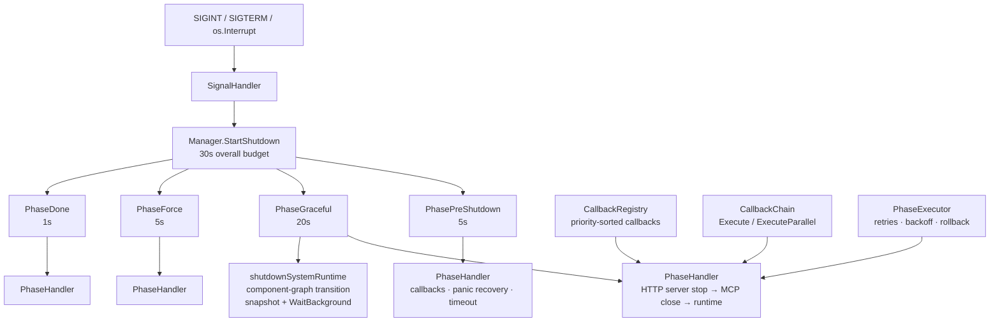

The `internal/ares_shutdown` package (package `ares_shutdown`) provides the
**graceful shutdown** machinery for ARES. It coordinates teardown across
multiple components through a phased pipeline
(`PhasePreShutdown` → `PhaseGraceful` → `PhaseForce` → `PhaseDone`), each with
its own timeout, panic recovery, and callback set. In `ares serve` the real
teardown hooks (HTTP server → MCP → system runtime) are registered as phase
callbacks, so a single Ctrl+C runs the whole sequence under one bounded
budget (30s overall).

Design pillars:

- **Phases over callbacks-on-a-stack**: each phase has its own timeout and
  callbacks; callbacks run concurrently with panic recovery so one failing or
  panicking component does not stall the rest.
- **Priority-sorted registration**: `CallbackRegistry` orders callbacks by
  `Priority` (higher first), so critical teardown runs before best-effort
  cleanup.
- **Composable execution**: `CallbackChain` runs callbacks sequentially or in
  parallel; `PhaseExecutor` adds retries with exponential backoff and an
  optional rollback function.
- **Signal-driven**: `SignalHandler` listens for `SIGINT` / `SIGTERM` /
  `os.Interrupt` and triggers the manager.

## Responsibility

- Coordinate the shutdown sequence with `Manager`: register phases with
  per-phase timeouts, add callbacks, and start the process with
  `StartShutdown` (executes `PhasePreShutdown`, `PhaseGraceful`,
  `PhaseForce`, `PhaseDone` in order; each phase runs its callbacks
  concurrently with panic recovery and timeout enforcement).
- Manage shutdown state: `CurrentPhase`, `Wait` (blocks until in-flight
  callbacks finish), and `IsShutdown` (true past `PhasePreShutdown`);
  `StartShutdown` refuses to re-enter when shutdown is already in progress.
- Handle OS signals with `SignalHandler` — `Start` begins listening,
  `Stop` unregisters, `AddSignal` extends the set (live-registered when
  already started), and `WaitForSignal` / `WaitForContextOrSignal` provide
  blocking helpers.
- Track callbacks with `CallbackRegistry` (`Register` with id + priority +
  per-callback timeout + `OnError`, `Unregister`, `GetCallbacks`, `Clear`,
  `Count`, `SetOnError`), keeping per-phase lists priority-sorted.
- Compose execution with `CallbackChain` (`Add` / `Execute` /
  `ExecuteParallel`) and `PhaseExecutor` (`Execute` with `maxRetries`,
  exponential backoff, `SetRollbackFn`, `SetOnComplete`, `SetOnFailure`,
  plus `State` / `Duration` / `Error` / `Retries` observability).
- Wire the real service teardown in `cmd/ares/serve.go`:
  `NewManager(30s)` with `PhasePreShutdown` 5s, `PhaseGraceful` 20s,
  `PhaseForce` 5s, `PhaseDone` 1s; HTTP, MCP, and runtime hooks are added as
  phase callbacks, and `shutdownSystemRuntime` drives the System Runtime
  orchestration kernel (component graph transition) plus records a
  pre-shutdown component snapshot and `WaitBackground()`.

## Architecture



## External interfaces

```go
package ares_shutdown

// --- Phases ---

type Phase int
const (
    PhasePreShutdown Phase = iota
    PhaseGraceful
    PhaseForce
    PhaseDone
)
func (p Phase) String() string
func (p Phase) IsValid() bool

type Callback func(ctx context.Context) error

// --- Manager ---

type Manager struct {
    // phases map[Phase]*PhaseHandler
    // currentPhase Phase · mu sync.RWMutex · timeout time.Duration · wg sync.WaitGroup
}
func NewManager(timeout time.Duration) *Manager
func (m *Manager) RegisterPhase(phase Phase, timeout time.Duration)
func (m *Manager) AddCallback(phase Phase, callback Callback) error
func (m *Manager) SetOnTimeout(phase Phase, fn func())
func (m *Manager) SetOnPanic(phase Phase, fn func(interface{}))
func (m *Manager) StartShutdown(ctx context.Context) error
func (m *Manager) CurrentPhase() Phase
func (m *Manager) Wait()
func (m *Manager) IsShutdown() bool

// --- SignalHandler ---

type SignalHandler struct {
    // signals []os.Signal · manager *Manager · sigChan chan os.Signal
}
func NewSignalHandler(manager *Manager) *SignalHandler
func (h *SignalHandler) Start(ctx context.Context) error
func (h *SignalHandler) Stop() error
func (h *SignalHandler) AddSignal(sig os.Signal)
func (h *SignalHandler) SetContext(ctx context.Context)
func WaitForSignal(signals ...os.Signal) os.Signal
func WaitForContextOrSignal(ctx context.Context, signals ...os.Signal) (os.Signal, error)

// --- CallbackRegistry ---

type RegisteredCallback struct {
    ID       string
    Priority int
    Fn       Callback
    Timeout  time.Duration
    OnError  func(error)
}
func NewCallbackRegistry() *CallbackRegistry
func (r *CallbackRegistry) Register(phase Phase, id string, priority int, fn Callback, timeout time.Duration) error
func (r *CallbackRegistry) Unregister(phase Phase, id string) error
func (r *CallbackRegistry) GetCallbacks(phase Phase) []Callback
func (r *CallbackRegistry) Clear(phase Phase)
func (r *CallbackRegistry) Count(phase Phase) int
func (r *CallbackRegistry) SetOnError(phase Phase, id string, onError func(error)) error

// --- CallbackChain ---

func NewCallbackChain() *CallbackChain
func (c *CallbackChain) Add(fn Callback) *CallbackChain
func (c *CallbackChain) Execute(ctx context.Context) error
func (c *CallbackChain) ExecuteParallel(ctx context.Context) error

// --- PhaseExecutor ---

type PhaseState int
const (
    PhaseStatePending PhaseState = iota
    PhaseStateRunning
    PhaseStateCompleted
    PhaseStateFailed
    PhaseStateSkipped
)
func (s PhaseState) String() string

func NewPhaseExecutor(phase Phase, maxRetries int) *PhaseExecutor
func (e *PhaseExecutor) Execute(ctx context.Context, fn func(ctx context.Context) error) error
func (e *PhaseExecutor) Rollback() error
func (e *PhaseExecutor) State() PhaseState
func (e *PhaseExecutor) Phase() Phase
func (e *PhaseExecutor) Duration() time.Duration
func (e *PhaseExecutor) Error() error
func (e *PhaseExecutor) Retries() int
func (e *PhaseExecutor) SetRollbackFn(fn func() error)
func (e *PhaseExecutor) SetOnComplete(fn func() error)
func (e *PhaseExecutor) SetOnFailure(fn func(error) error)

// --- Sentinel errors ---

var (
    ErrPhaseAlreadyRunning     = &PhaseError{"phase already running"}
    ErrCallbackNotFound        = &CallbackError{"callback not found"}
    ErrSignalHandlerAlreadyStarted = &SignalError{"signal handler already started"}
)
```

## Key types and methods

| Type / Method | Purpose |
| --- | --- |
| `Manager` | Coordinates teardown across components. Registers phases, runs callbacks concurrently per phase with panic recovery and timeouts, and refuses re-entry. |
| `NewManager(timeout)` | Creates a manager with an overall shutdown budget (the `serve` wiring uses 30s). |
| `RegisterPhase` | Registers a phase handler with its own timeout (serve: 5s / 20s / 5s / 1s). |
| `AddCallback` | Appends a callback to a registered phase; returns an error for unregistered phases. |
| `SetOnTimeout` / `SetOnPanic` | Hooks invoked when a phase times out or a callback panics. |
| `StartShutdown` | Executes `PreShutdown → Graceful → Force → Done`, returning a wrapped error when any phase fails. |
| `CurrentPhase` / `Wait` / `IsShutdown` | State access: current phase, block until in-flight callbacks finish, shutdown-started predicate. |
| `SignalHandler` | Listens for `SIGINT` / `SIGTERM` / `os.Interrupt`; on a signal it starts the manager under the manager's timeout. |
| `WaitForSignal` / `WaitForContextOrSignal` | Blocking helpers for signal-driven main loops. |
| `CallbackRegistry` | Per-phase callback store with priority sorting (higher first); supports id-based `Unregister` / `SetOnError`. |
| `CallbackChain` | Composes callbacks to run sequentially (`Execute`) or concurrently (`ExecuteParallel`) with context cancellation. |
| `PhaseExecutor` | Executes one phase with `maxRetries` and exponential backoff, optional rollback / on-complete / on-failure hooks, and state + duration observability. |
| `PhaseState` | Lifecycle of a `PhaseExecutor`: pending / running / completed / failed / skipped. |

## Module collaboration

- `ares_shutdown` -> `cmd/ares` (`serve.go`): the real service wiring —
  `NewManager(30s)`, four registered phases, and teardown hooks added as
  phase callbacks. The signal goroutine runs `StartShutdown`, then
  `shutdownSystemRuntime` (component-graph transition) and `WaitBackground`.
- `ares_shutdown` -> `internal/ares_bootstrap`: `shutdownSystemRuntime`
  drives the System Runtime orchestration kernel through graceful shutdown so
  the managed component graph transitions cleanly; it also records a
  pre-shutdown component snapshot for shutdown diagnostics.
- `ares_shutdown` -> `internal/errors`: phase failures are wrapped with
  `errors.Wrapf` for contextual propagation.
- `ares_shutdown` -> `internal/logger`: structured logging for phase
  execution, recovered panics, and timeouts.

## Extension points

1. **Register your own phases + callbacks** by calling `RegisterPhase` and
   `AddCallback` before serving; each callback runs concurrently with its
   phase's timeout and panic recovery.
2. **Order critical teardown first** by registering callbacks through
   `CallbackRegistry.Register` with priorities (higher values execute first),
   or use the manager's `AddCallback` for registration-order semantics.
3. **Listen for extra signals** via `SignalHandler.AddSignal` (live-registered
   when already started), or drive a main loop with `WaitForSignal` /
   `WaitForContextOrSignal`.
4. **Add retries and rollback** by wrapping a teardown step in a
   `PhaseExecutor` (`maxRetries`, exponential backoff, `SetRollbackFn`,
   `SetOnFailure`).
5. **Compose multi-step cleanup** with `CallbackChain` — sequential
   `Execute` for ordered steps, `ExecuteParallel` for independent ones.

## Bilingual status

This page is the English reference. A Chinese translation with identical structure and technical content is published as `ares_shutdown.zh.md`. All code identifiers, type names, and signatures are kept in English in both files; only the prose differs.

## Maturity

Production. The package is covered by `shutdown_test.go` and the comprehensive
`shutdown_comprehensive_test.go` (complete shutdown flow, callback timeout and
panic recovery, concurrent execution and context cancellation, phase retry and
rollback, signal handling). It is wired into the `ares serve` graceful-shutdown
path and exposes no experimental markers.


