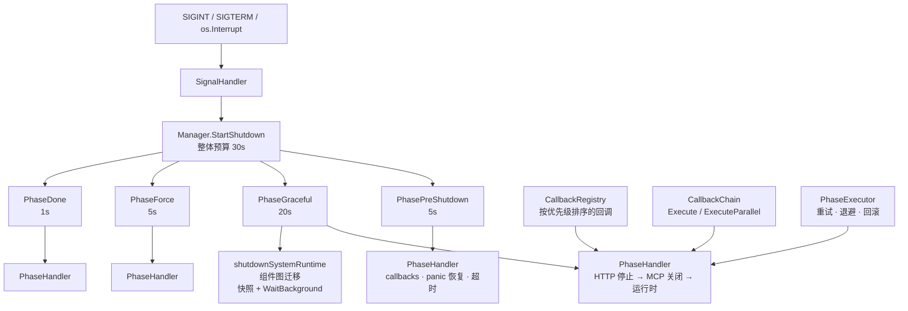

`internal/ares_shutdown` 包（package `ares_shutdown`）提供 ARES 的**优雅关闭**
机制。它通过分阶段流水线（`PhasePreShutdown` → `PhaseGraceful` →
`PhaseForce` → `PhaseDone`）协调多个组件的拆解，每个阶段拥有独立的超时、
panic 恢复和回调集合。在 `ares serve` 中，真实拆解钩子（HTTP 服务器 → MCP →
系统运行时）被注册为阶段回调，因此一次 Ctrl+C 即可在统一预算（整体 30s）内
执行完整序列。

设计支柱：

- **阶段优先于回调栈**：每个阶段拥有自己的超时和回调；回调并发执行并带
  panic 恢复，因此单个组件失败或 panic 不会拖垮其余组件。
- **按优先级排序注册**：`CallbackRegistry` 按 `Priority` 排序回调（高者在前），
  确保关键拆解先于尽力而为的清理执行。
- **可组合执行**：`CallbackChain` 可顺序或并行执行回调；`PhaseExecutor`
  额外支持带指数退避的重试和可选的回滚函数。
- **信号驱动**：`SignalHandler` 监听 `SIGINT` / `SIGTERM` / `os.Interrupt`，
  并触发管理器。

## 职责

- 用 `Manager` 协调关闭序列：注册带各自超时的阶段、添加回调，并通过
  `StartShutdown` 启动流程（按序执行 `PhasePreShutdown`、`PhaseGraceful`、
  `PhaseForce`、`PhaseDone`；每个阶段并发执行回调，带 panic 恢复和超时执行）。
- 管理关闭状态：`CurrentPhase`、`Wait`（阻塞直到在途回调完成）、`IsShutdown`
  （越过 `PhasePreShutdown` 即为 true）；关闭进行中时 `StartShutdown` 拒绝
  重入。
- 用 `SignalHandler` 处理系统信号 — `Start` 开始监听、`Stop` 注销、
  `AddSignal` 扩展信号集（已启动时实时注册），`WaitForSignal` /
  `WaitForContextOrSignal` 提供阻塞辅助函数。
- 用 `CallbackRegistry` 跟踪回调（`Register` 带 id + 优先级 + 每回调超时 +
  `OnError`，以及 `Unregister`、`GetCallbacks`、`Clear`、`Count`、
  `SetOnError`），保持每阶段列表按优先级排序。
- 用 `CallbackChain`（`Add` / `Execute` / `ExecuteParallel`）和 `PhaseExecutor`
  （`Execute` 带 `maxRetries`、指数退避、`SetRollbackFn`、`SetOnComplete`、
  `SetOnFailure`，以及 `State` / `Duration` / `Error` / `Retries` 可观测性）
  组合执行。
- 在 `cmd/ares/serve.go` 中接线真实服务拆解：`NewManager(30s)`，其中
  `PhasePreShutdown` 5s、`PhaseGraceful` 20s、`PhaseForce` 5s、`PhaseDone` 1s；
  HTTP、MCP 和运行时钩子作为阶段回调添加，`shutdownSystemRuntime` 驱动
  System Runtime 编排内核（组件图迁移），并记录关闭前的组件快照与
  `WaitBackground()`。

## 架构



## 外部接口

```go
package ares_shutdown

// --- Phases ---

type Phase int
const (
    PhasePreShutdown Phase = iota
    PhaseGraceful
    PhaseForce
    PhaseDone
)
func (p Phase) String() string
func (p Phase) IsValid() bool

type Callback func(ctx context.Context) error

// --- Manager ---

type Manager struct {
    // phases map[Phase]*PhaseHandler
    // currentPhase Phase · mu sync.RWMutex · timeout time.Duration · wg sync.WaitGroup
}
func NewManager(timeout time.Duration) *Manager
func (m *Manager) RegisterPhase(phase Phase, timeout time.Duration)
func (m *Manager) AddCallback(phase Phase, callback Callback) error
func (m *Manager) SetOnTimeout(phase Phase, fn func())
func (m *Manager) SetOnPanic(phase Phase, fn func(interface{}))
func (m *Manager) StartShutdown(ctx context.Context) error
func (m *Manager) CurrentPhase() Phase
func (m *Manager) Wait()
func (m *Manager) IsShutdown() bool

// --- SignalHandler ---

type SignalHandler struct {
    // signals []os.Signal · manager *Manager · sigChan chan os.Signal
}
func NewSignalHandler(manager *Manager) *SignalHandler
func (h *SignalHandler) Start(ctx context.Context) error
func (h *SignalHandler) Stop() error
func (h *SignalHandler) AddSignal(sig os.Signal)
func (h *SignalHandler) SetContext(ctx context.Context)
func WaitForSignal(signals ...os.Signal) os.Signal
func WaitForContextOrSignal(ctx context.Context, signals ...os.Signal) (os.Signal, error)

// --- CallbackRegistry ---

type RegisteredCallback struct {
    ID       string
    Priority int
    Fn       Callback
    Timeout  time.Duration
    OnError  func(error)
}
func NewCallbackRegistry() *CallbackRegistry
func (r *CallbackRegistry) Register(phase Phase, id string, priority int, fn Callback, timeout time.Duration) error
func (r *CallbackRegistry) Unregister(phase Phase, id string) error
func (r *CallbackRegistry) GetCallbacks(phase Phase) []Callback
func (r *CallbackRegistry) Clear(phase Phase)
func (r *CallbackRegistry) Count(phase Phase) int
func (r *CallbackRegistry) SetOnError(phase Phase, id string, onError func(error)) error

// --- CallbackChain ---

func NewCallbackChain() *CallbackChain
func (c *CallbackChain) Add(fn Callback) *CallbackChain
func (c *CallbackChain) Execute(ctx context.Context) error
func (c *CallbackChain) ExecuteParallel(ctx context.Context) error

// --- PhaseExecutor ---

type PhaseState int
const (
    PhaseStatePending PhaseState = iota
    PhaseStateRunning
    PhaseStateCompleted
    PhaseStateFailed
    PhaseStateSkipped
)
func (s PhaseState) String() string

func NewPhaseExecutor(phase Phase, maxRetries int) *PhaseExecutor
func (e *PhaseExecutor) Execute(ctx context.Context, fn func(ctx context.Context) error) error
func (e *PhaseExecutor) Rollback() error
func (e *PhaseExecutor) State() PhaseState
func (e *PhaseExecutor) Phase() Phase
func (e *PhaseExecutor) Duration() time.Duration
func (e *PhaseExecutor) Error() error
func (e *PhaseExecutor) Retries() int
func (e *PhaseExecutor) SetRollbackFn(fn func() error)
func (e *PhaseExecutor) SetOnComplete(fn func() error)
func (e *PhaseExecutor) SetOnFailure(fn func(error) error)

// --- Sentinel errors ---

var (
    ErrPhaseAlreadyRunning     = &PhaseError{"phase already running"}
    ErrCallbackNotFound        = &CallbackError{"callback not found"}
    ErrSignalHandlerAlreadyStarted = &SignalError{"signal handler already started"}
)
```

## 关键类型与方法

| 类型 / 方法 | 用途 |
| --- | --- |
| `Manager` | 协调跨组件的拆解。注册阶段、按阶段并发执行回调（带 panic 恢复和超时），并拒绝重入。 |
| `NewManager(timeout)` | 创建带整体关闭预算的管理器（`serve` 接线使用 30s）。 |
| `RegisterPhase` | 注册带各自超时的阶段处理器（serve：5s / 20s / 5s / 1s）。 |
| `AddCallback` | 向已注册阶段追加回调；对未注册阶段返回错误。 |
| `SetOnTimeout` / `SetOnPanic` | 阶段超时或回调 panic 时调用的钩子。 |
| `StartShutdown` | 执行 `PreShutdown → Graceful → Force → Done`，任一段失败时返回包装错误。 |
| `CurrentPhase` / `Wait` / `IsShutdown` | 状态访问：当前阶段、阻塞至在途回调完成、关闭是否已开始。 |
| `SignalHandler` | 监听 `SIGINT` / `SIGTERM` / `os.Interrupt`；收到信号后在管理器超时内启动关闭。 |
| `WaitForSignal` / `WaitForContextOrSignal` | 用于信号驱动主循环的阻塞辅助函数。 |
| `CallbackRegistry` | 按阶段存储回调并按优先级排序（高者在前）；支持按 id 的 `Unregister` / `SetOnError`。 |
| `CallbackChain` | 组合回调，顺序（`Execute`）或并发（`ExecuteParallel`）执行，支持上下文取消。 |
| `PhaseExecutor` | 带 `maxRetries` 和指数退避执行单个阶段，可选的回滚 / 完成 / 失败钩子，以及状态和耗时可观测性。 |
| `PhaseState` | `PhaseExecutor` 的生命周期：pending / running / completed / failed / skipped。 |

## 模块协作

- `ares_shutdown` -> `cmd/ares`（`serve.go`）：真实服务接线 — `NewManager(30s)`、
  四个已注册阶段，以及作为阶段回调添加的拆解钩子。信号 goroutine 运行
  `StartShutdown`，随后执行 `shutdownSystemRuntime`（组件图迁移）与
  `WaitBackground`。
- `ares_shutdown` -> `internal/ares_bootstrap`：`shutdownSystemRuntime` 驱动
  System Runtime 编排内核完成优雅关闭，使受管组件图干净迁移；同时记录关闭前
  组件快照用于关闭诊断。
- `ares_shutdown` -> `internal/errors`：阶段失败通过 `errors.Wrapf` 包装，
  便于带上下文传播。
- `ares_shutdown` -> `internal/logger`：为阶段执行、恢复的 panic 和超时提供
  结构化日志。

## 扩展点

1. **注册自定义阶段 + 回调**：在提供服务前调用 `RegisterPhase` 和
   `AddCallback`；每个回调在阶段超时和 panic 恢复下并发执行。
2. **让关键拆解先执行**：通过 `CallbackRegistry.Register` 以优先级注册回调
   （高值先执行），或使用管理器的 `AddCallback` 获得注册序语义。
3. **监听额外信号**：通过 `SignalHandler.AddSignal`（已启动时实时注册），
   或使用 `WaitForSignal` / `WaitForContextOrSignal` 驱动主循环。
4. **添加重试与回滚**：将拆解步骤包装进 `PhaseExecutor`（`maxRetries`、
   指数退避、`SetRollbackFn`、`SetOnFailure`）。
5. **组合多步清理**：用 `CallbackChain` — 有序步骤用顺序 `Execute`，独立步骤
   用 `ExecuteParallel`。

## 双语状态

本页为中文翻译。英文参考以相同结构和内容发布为 `ares_shutdown.en.md`。所有代码标识符、类型名和签名在两种语言中都保持英文；仅散文部分不同。

## 成熟度

Production。该包由 `shutdown_test.go` 和综合性的 `shutdown_comprehensive_test.go`
覆盖（完整关闭流程、回调超时与 panic 恢复、并发执行与上下文取消、阶段重试与
回滚、信号处理与错误恢复）。它已接入 `ares serve` 的优雅关闭路径，且无实验性
标记。


