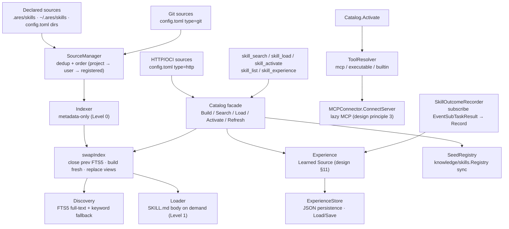

The `internal/ares_skills` package (package `ares_skills`) implements the
**ARES Capability Fabric** (0.3.0): a small abstraction that treats a Skill
as a **Capability Package** (`SKILL.md` + references + tool declarations)
rather than a Tool. The implementation layer is deliberately limited to
`SkillCatalog` / `SkillLoader` / `ToolResolver` — there is no
`SkillManager` / `Orchestrator` / `Marketplace`.

Design pillars (`ares-capability-fabric-design.md`):

1. Only declared sources are scanned — never a full-disk find.
2. A Skill is a capability package; a Tool is its execution carrier.
3. MCP servers are lazy-loaded at skill activation, not pre-connected.
4. Content is progressively disclosed: metadata → `SKILL.md` → resources.
5. Discovery, loading, execution and trust are four separate concerns.

## Responsibility

- Provide the `SkillCatalog` facade (`Catalog`) that composes
  `SourceManager`, `Indexer`, `Discovery`, `Loader`, `ToolResolver` and
  `Experience` behind one entry point.
- Index metadata only (Level 0 of progressive disclosure): 100 skills cost
  ~100 × 100 tokens instead of 100 full instruction bodies.
- Lazy-connect MCP servers at skill activation (`MCPConnector` interface;
  `ares_mcp.MCPManager` satisfies it) — no MCP server is started until a
  skill that declares it is activated.
- Persist learned relevance priors (`Experience` + `ExperienceStore`):
  `{skill, task_pattern, success_rate}` records that bias future discovery
  ranking. A learned skill is indexable but NEVER auto-executed
  (Discovery ≠ Permission).
- Provide the agent-facing skill tools (`skill_search` / `skill_load` /
  `skill_activate` / `skill_list` / `skill_experience`) that close the
  Discover → Load → Execute loop in the LLM main loop.
- Seed the existing `knowledge/skills.Registry` so the memory manager's
  resident skill block stays in sync with the index.

## Architecture



## Progressive disclosure

| Level | Content | When loaded |
| --- | --- | --- |
| 0 | Metadata: `id`, `name`, `description`, `keywords`, `capabilities` | Always resident in the catalog |
| 1 | `SKILL.md` body (instructions) | On `Load(id)` — on demand |
| 2 | Resolved tools (mcp / executable / builtin) | On `Activate(id)` — lazy |

## External interfaces

```go
package ares_skills

// --- Catalog facade ---

type CatalogConfig struct {
    ProjectSkillsDir      string   // ".ares/skills"
    UserSkillsDir         string   // "~/.ares/skills"
    RegisteredDirs        []string // extra directory sources from config.toml
    AllowLocalExecutables bool     // permit executables declared by trusted sources
    Builtins              []string // known framework builtin tool names
    ExperiencePath        string   // when non-empty, persist priors as JSON here
}
type Catalog struct {
    // mu sync.RWMutex
    // sm *SourceManager, indexer *Indexer, discovery *Discovery
    // loader *Loader, resolver *Resolver, exp *Experience
    // mcp MCPConnector, httpSrcs []HTTPSource, registry *skills.Registry
}
func NewCatalog(cfg CatalogConfig) *Catalog
func (c *Catalog) SetGitSources(gits []GitSource)
func (c *Catalog) SyncGitSources(ctx context.Context) error          // clone or refresh
func (c *Catalog) SetHTTPSources(srcs []HTTPSource)
func (c *Catalog) Build() error                                      // index metadata only
func (c *Catalog) Refresh(ctx context.Context) error                 // re-sync git, re-fetch http, rebuild
func (c *Catalog) Close() error                                      // release FTS5 backing store

func (c *Catalog) Search(query string, limit int) []SkillIndexEntry  // Level 0 ranked matches
func (c *Catalog) All() []SkillIndexEntry                             // full index snapshot
func (c *Catalog) Count() int                                         // index size
func (c *Catalog) Load(id string) (string, error)                     // Level 1: SKILL.md body
func (c *Catalog) Activate(ctx context.Context, id string) (*Activation, error)  // Level 2: resolve tools, lazy-connect MCP
func (c *Catalog) Get(id string) (SkillIndexEntry, bool)              // metadata lookup

func (c *Catalog) SetMCPConnector(mcp MCPConnector)                   // wire lazy MCP activation
func (c *Catalog) SeedRegistry(reg *skills.Registry) error            // sync memory manager's resident block
func (c *Catalog) Experience() *Experience                            // learned relevance priors

// --- MCP lazy activation ---

type MCPConnector interface {
    ConnectServer(ctx context.Context, name string) error  // ares_mcp.MCPManager satisfies this
}

// --- Experience (Learned Source, design §11) ---

type ExperienceStore interface {
    Load(ctx context.Context) ([]ExperienceRecord, error)
    Save(ctx context.Context, records []ExperienceRecord) error
}
type ExperienceRecord struct {
    Skill       string  `json:"skill"`
    TaskPattern string  `json:"task_pattern"`
    SuccessRate float64 `json:"success_rate"`  // 0-1
}
type Experience struct {
    // mu sync.RWMutex, records []ExperienceRecord, maxRecords int, store ExperienceStore
}
func NewExperience() *Experience
func NewExperienceWithStore(ctx context.Context, store ExperienceStore) *Experience
func (e *Experience) Record(skill, taskPattern string, successRate float64) error
func (e *Experience) BestMatch(taskPattern string) (ExperienceRecord, bool)  // keyword-overlap matching
func (e *Experience) List() []ExperienceRecord
func (e *Experience) Count() int

// --- Types ---

type SourceKind string
const (
    SourceProject    SourceKind = "project"
    SourceUser       SourceKind = "user"
    SourceRegistered SourceKind = "registered"
    SourceExperience SourceKind = "experience"
)
type SkillIndexEntry struct {
    ID           string     `json:"id"`
    Name         string     `json:"name"`
    Description  string     `json:"description"`
    Keywords     []string   `json:"keywords"`
    Source       SourceKind `json:"source"`
    Path         string     `json:"path"`
    Version      string     `json:"version"`
    Capabilities []string   `json:"capabilities"`
    ToolTypes    []string   `json:"tool_types"`
    Hash         string     `json:"hash"`
}
type ToolKind string
const (
    ToolMCP        ToolKind = "mcp"
    ToolExecutable ToolKind = "executable"
    ToolBuiltin    ToolKind = "builtin"
)
type ResolvedTool struct {
    ID     string
    Kind   ToolKind
    Target string
    Args   []string
}
type ToolDecl struct {
    ID      string   `yaml:"id"`
    Type    string   `yaml:"type"`     // "mcp" | "executable" | "builtin"
    Command string   `yaml:"command,omitempty"`
    Args    []string `yaml:"args,omitempty"`
    Server  string   `yaml:"server,omitempty"`
    Name    string   `yaml:"name,omitempty"`
}
type Manifest struct {
    ID          string     `yaml:"id"`
    Name        string     `yaml:"name"`
    Description string     `yaml:"description"`
    Keywords    []string   `yaml:"keywords"`
    Version     string     `yaml:"version"`
    Tools       []ToolDecl `yaml:"tools"`
}

// --- Sentinel errors ---

var (
    ErrSkillNotFound
)
```

## Key types and methods

| Type / Method | Purpose |
| --- | --- |
| `Catalog` | SkillCatalog facade composing SourceManager, Indexer, Discovery, Loader, ToolResolver, Experience. |
| `NewCatalog` / `Build` / `Refresh` | Construct over declared sources; `Build` indexes metadata only; `Refresh` re-syncs git, re-fetches http, rebuilds. |
| `Search` / `All` / `Count` / `Get` | Level-0 metadata queries (FTS5 full-text + keyword fallback). |
| `Load` | Level-1 on-demand `SKILL.md` body retrieval. |
| `Activate` | Level-2 tool resolution + lazy MCP connection. |
| `MCPConnector` | Lazy MCP activation interface (`ares_mcp.MCPManager` satisfies it). |
| `Experience` / `ExperienceStore` | Learned Source: `{skill, task_pattern, success_rate}` priors with JSON persistence; `BestMatch` uses keyword-overlap matching. |
| `SkillIndexEntry` | Metadata-only index record (Level 0). |
| `ResolvedTool` / `ToolKind` | Skill-declared tool bound to a runnable provider (mcp / executable / builtin). |
| `Manifest` / `ToolDecl` | Parsed `skill.yaml` tool declaration file. |
| `SeedRegistry` | Sync the memory manager's resident skill block with the index. |

## Module collaboration

- `ares_skills` -> `internal/ares_mcp` (via `MCPConnector`): lazy MCP server
  connection at skill activation (design principle 3).
- `ares_skills` -> `internal/knowledge/skills`: `SeedRegistry` keeps the
  memory manager's resident skill block in sync with the catalog index.
- `ares_skills` -> `internal/ares_events` (via `SkillOutcomeRecorder`):
  subscribes to `EventSubTaskResult` and records experience priors
  (`Record(skill, taskPattern, successRate)`).
- `ares_skills` -> `internal/taskfabric` (via `ConfidenceSource` adapter):
  the Experience `BestMatch` `SuccessRate` feeds the taskfabric scheduler's
  `confidence` term.
- `ares_skills` -> `internal/tools` (via `ToolResolver`): resolves builtin
  and executable tool carriers declared by skill manifests.

## Extension points

1. **Add a skill source** by declaring a directory in `config.toml`
   `[[skill_sources]]` (type `directory` / `git` / `http`); the
   `SourceManager` deduplicates and orders sources
   (project → user → registered).
2. **Wire lazy MCP activation** by implementing `MCPConnector` and calling
   `Catalog.SetMCPConnector(mcp)`; `Activate` then connects declared MCP
   servers only when a skill is activated.
3. **Persist learned priors** by setting `CatalogConfig.ExperiencePath` to
   a JSON file path; `ExperienceStore.Save` writes the record set
   atomically across restarts.
4. **Register the agent-facing skill tools** (`skill_search` /
   `skill_load` / `skill_activate` / `skill_list` / `skill_experience`)
   into the serve tool registry to close the Discover → Load → Execute
   loop.
5. **Feed the scheduler confidence** by adapting `Experience.BestMatch`
   through the `taskfabric.ConfidenceSource` interface.
6. **Rebuild after source changes** by calling `Refresh(ctx)`; the catalog
   re-syncs git sources (bounded by a 2-minute timeout so an unreachable
   host degrades to local-checkout indexing), re-fetches http manifests,
   and atomically swaps the index.

## Bilingual status

This page is the English reference. A Chinese translation with identical
structure and technical content is published as `ares_skills.zh.md`. All
code identifiers, type names, and signatures are kept in English in both
files; only the prose differs.

## Maturity

Production. The package is covered by `ares_skills_test.go`,
`catalog_test.go`, `config_test.go`, `discovery.go` tests,
`e2e_mcp_test.go`, `experience_cap_test.go`,
`experience_confidence_test.go`, `outcome_recorder_test.go`,
`references_test.go`, `sources_test.go`, `tools_test.go`, and
`benchmark_test.go`. It implements the Capability Fabric (0.3.0),
integrates with the ARES Kernel via lazy MCP and the experience prior,
and exposes no experimental markers.


